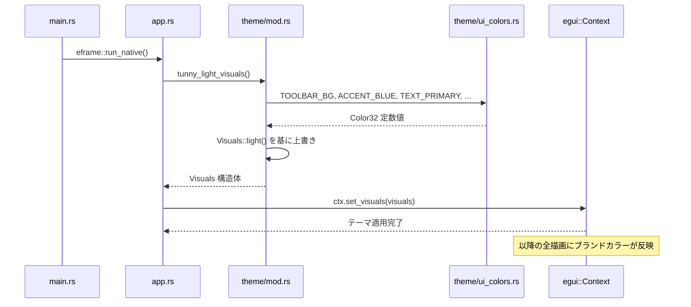
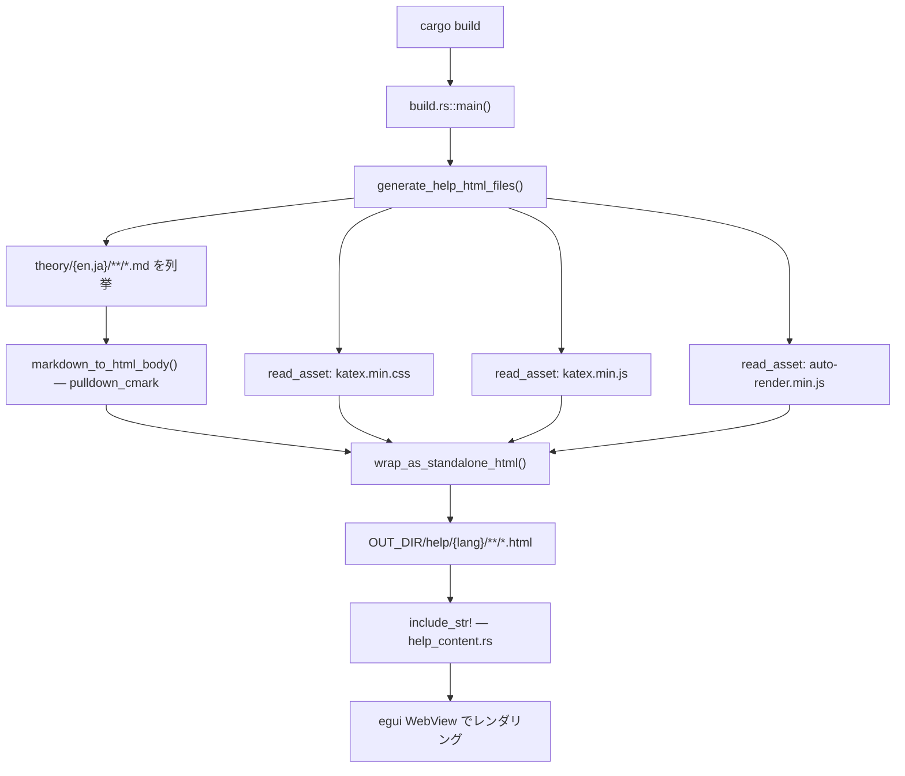
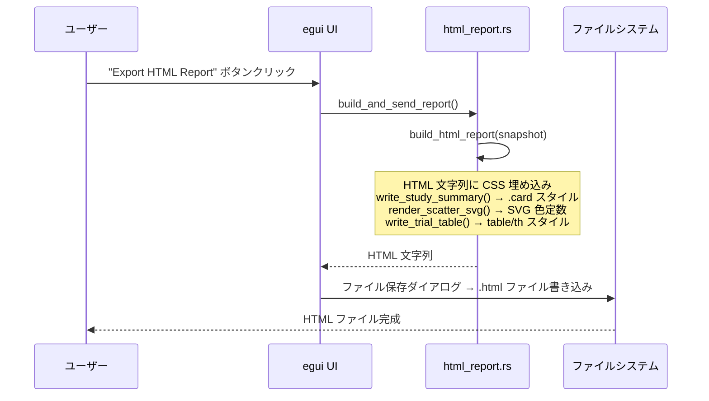
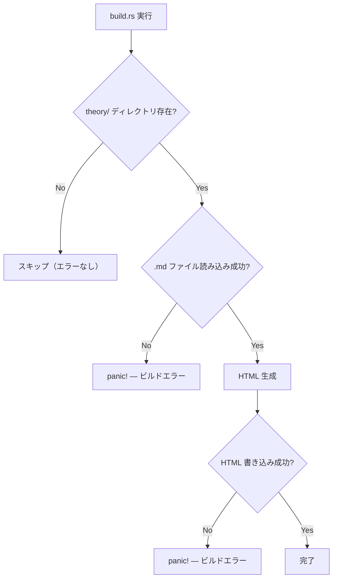

# ブランドトンマナ統一 データフロー図

**作成日**: 2026-05-25
**関連アーキテクチャ**: [architecture.md](architecture.md)
**関連要件定義**: [requirements.md](../../spec/brand-tone-manner/requirements.md)

**【信頼性レベル凡例】**:
- 🔵 **青信号**: 要件定義書・TONMANUAL・既存コードベースを参考にした確実なフロー
- 🟡 **黄信号**: 要件定義書・既存実装から妥当な推測によるフロー
- 🔴 **赤信号**: 要件定義書・既存実装にない推測によるフロー

---

## システム全体のカラー伝播フロー 🔵

**信頼性**: 🔵 *既存コードベース・要件定義より*

```
TONMANUAL.md (ブランドガイド)
      │ HEX 値を Rust Color32 に変換
      ▼
ui_colors.rs (カラー定数定義)
      │
      ├──────────────────────────────────────────┐
      │                                          │
      ▼                                          ▼
mod.rs                               【HTML 出力面は独立】
tunny_light_visuals()
      │
      ▼
egui::Context::set_visuals()
      │
      ▼
egui 全 UI 要素のレンダリング
```

```
TONMANUAL.md (ブランドガイド)
      │ CSS 値を直接記述
      │
      ├─── build.rs::wrap_as_standalone_html()
      │         │ コンパイル時
      │         ▼
      │    OUT_DIR/help/**/*.html
      │         │ include_str!
      │         ▼
      │    help_content.rs → egui WebView 表示
      │
      └─── html_report.rs::build_html_report()
                │ ユーザー操作時
                ▼
           スタンドアロン HTML ファイル
```

---

## フロー1: egui テーマ適用（ランタイム）🔵

**信頼性**: 🔵 *app.rs・mod.rs・ui_colors.rs 既存コードより*

**関連要件**: REQ-001〜REQ-018



**詳細ステップ**:
1. `main.rs` が `eframe::run_native()` を呼び出してウィンドウを起動する
2. `app.rs` の `setup()` コールバックで `tunny_light_visuals()` を呼ぶ
3. `mod.rs` の `tunny_light_visuals()` が `ui_colors.rs` の定数を読み込んで `egui::Visuals` を構築する
4. `ctx.set_visuals()` で egui のグローバルテーマとして設定する
5. 以降の全フレームでブランドカラーが自動適用される

---

## フロー2: ヘルプ HTML 生成（コンパイル時）🔵

**信頼性**: 🔵 *build.rs 既存実装より*

**関連要件**: REQ-101〜REQ-107



**CSS 注入の詳細** 🔵:

`wrap_as_standalone_html()` 内の `<style>` タグ構造:

```
<style>
  /* 1. body・見出し・リンク・テーブル等の基本スタイル (ブランドカラー) */
  body { color: #4B5563; background: #ffffff; ... }
  h1, h2, h3 { color: #111827; font-weight: 800; ... }
  a { color: #2563EB; }
  th { background: #F3F4F6; }
  /* 2. KaTeX CSS (後置して優先度を確保) */
  {katex_css}
</style>
```

KaTeX CSS は末尾に置き、数式スタイルがブランド CSS を上書きしないようにする。

---

## フロー3: HTML エクスポートレポート生成（ユーザー操作時）🔵

**信頼性**: 🔵 *html_report.rs 既存実装より*

**関連要件**: REQ-201〜REQ-207



**SVG 散布図の色変更** 🔵:

```rust
// 変更前
let color = if row.pareto_rank == 0 { "#e74c3c" } else { "#3498db" };

// 変更後（TONMANUAL §2 blue-500）
let color = if row.pareto_rank == 0 { "#e74c3c" } else { "#3B82F6" };
```

Pareto 最前沿点（`#e74c3c` 赤）はセマンティック色のため変更なし。

---

## カラー定数の依存関係グラフ 🔵

**信頼性**: 🔵 *既存コードベース分析より*

```
ui_colors.rs
├── TOOLBAR_BG        → mod.rs (panel_fill)
│                       ui/toolbar.rs (Frame::default().fill())
├── TOOLBAR_TEXT      → ui/toolbar.rs (TextStyle)
├── TOOLBAR_BTN_ACTIVE → mod.rs (widgets.active.bg_fill)
├── TOOLBAR_BTN_HOVER  → mod.rs (widgets.hovered.bg_fill)
├── TOOLBAR_INPUT_BG   → ui/toolbar.rs (TextEdit 背景)
├── TOOLBAR_INPUT_STROKE → ui/toolbar.rs (TextEdit 枠線)
├── PANEL_BG          → mod.rs (panel_fill)
├── CENTRAL_BG        → mod.rs (window_fill, extreme_bg_color)
├── ACCENT_BLUE       → mod.rs (widgets.active.bg_fill)
│                       ui/ 各所でボタン色
├── ACCENT_BLUE_HOVER  → mod.rs (widgets.hovered.bg_stroke)
├── ACCENT_BLUE_MUTED  → mod.rs (selection.bg_fill)
├── TEXT_PRIMARY      → mod.rs (override_text_color)
├── TEXT_SECONDARY    → ui/ 各所でラベル色
└── BORDER_COLOR      → mod.rs (window_stroke, widgets.*.bg_stroke)
```

**新規定数の用途**（現時点で未使用、将来の機能実装向け）:
- `HEADER_BG`, `ANNOUNCE_BG`: 将来のヘッダーバー実装時に使用
- `ACTION_GREEN`, `ACTION_GREEN_HOVER`: 将来の購入・ライセンスリンク実装時に使用
- `TEXT_SUB`: 将来のサブテキスト要素実装時に使用

---

## エラーハンドリング 🟡

**信頼性**: 🟡 *既存実装パターンから妥当な推測*



---

## 関連文書

- **アーキテクチャ**: [architecture.md](architecture.md)
- **実装ガイド**: [implementation-guide.md](implementation-guide.md)
- **要件定義**: [requirements.md](../../spec/brand-tone-manner/requirements.md)

## 信頼性レベルサマリー

- 🔵 青信号: 5件 (83%)
- 🟡 黄信号: 1件 (17%)
- 🔴 赤信号: 0件 (0%)

**品質評価**: 高品質
