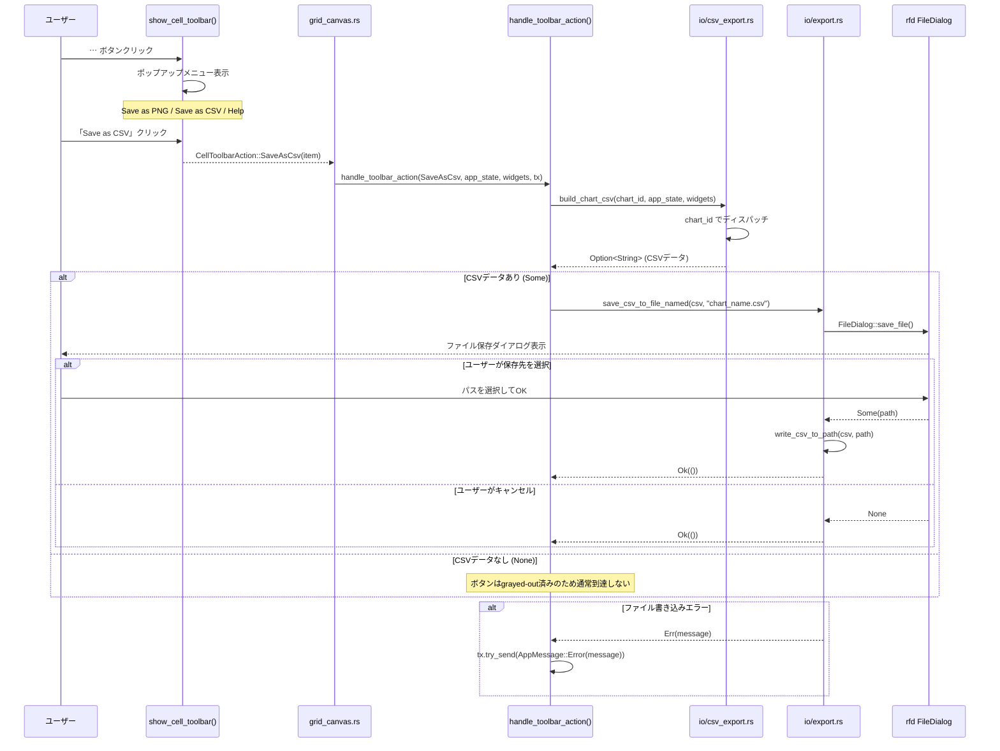
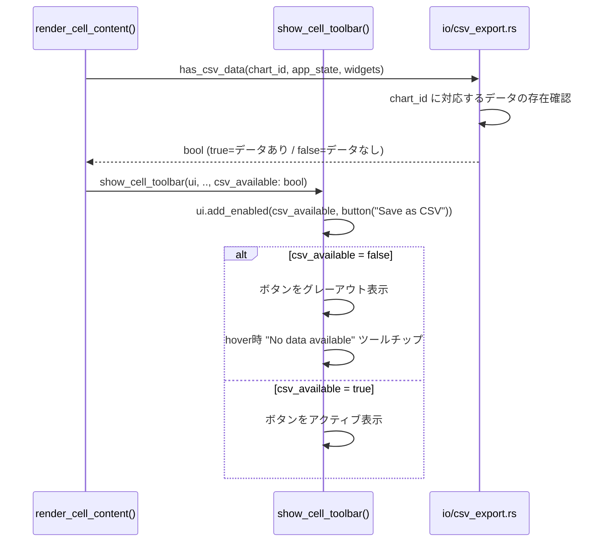
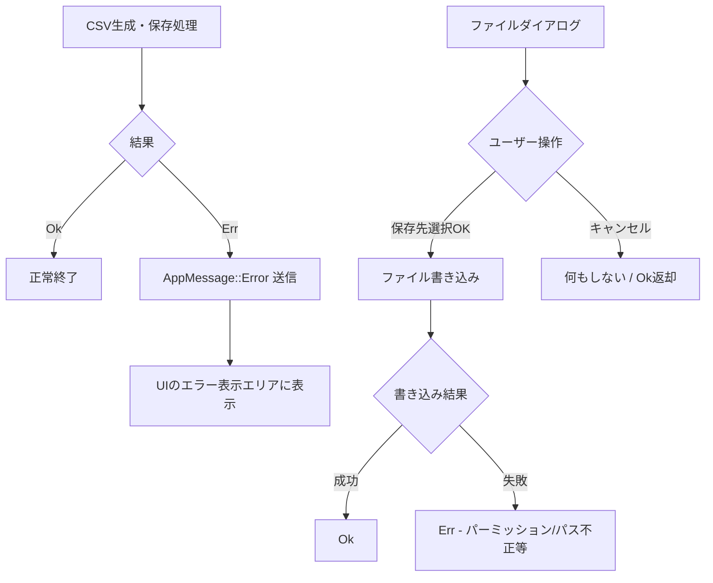

# chart-csv-export データフロー図

**作成日**: 2026-05-28
**関連アーキテクチャ**: [architecture.md](architecture.md)
**関連要件定義**: [requirements.md](../../spec/chart-csv-export/requirements.md)

**【信頼性レベル凡例】**:
- 🔵 **青信号**: EARS要件定義書・設計文書・ユーザヒアリングを参考にした確実なフロー
- 🟡 **黄信号**: EARS要件定義書・設計文書・ユーザヒアリングから妥当な推測によるフロー
- 🔴 **赤信号**: EARS要件定義書・設計文書・ユーザヒアリングにない推測によるフロー

---

## 主要フロー: Save as CSV クリックからファイル保存まで 🔵

**信頼性**: 🔵 *ユーザヒアリング Q1・Q2・既存 `CellToolbarAction` パターンより*

**関連要件**: REQ-001, REQ-010, REQ-011



---

## フロー: データ可用性チェック（ボタングレーアウト） 🔵

**信頼性**: 🔵 *ユーザヒアリング Q4・REQ-201より*

**関連要件**: REQ-201, REQ-202



---

## フロー: チャート別 CSV 生成（io/csv_export.rs 内部） 🔵

**信頼性**: 🔵 *コードベース調査・データ構造定義より*

**関連要件**: REQ-020〜036

```mermaid
flowchart TD
    A[build_chart_csv\nchart_id, app_state, widgets] --> B{chart_id}

    B -->|OptimizationHistory| C[build_optimization_history_csv\nwidgets.opt_history + app_state.current_study]
    B -->|HvHistory| D[build_hv_history_csv\napp_state.hv_history]
    B -->|ImportanceChart| E[build_importance_csv\napp_state.importance_cache + widgets.importance]
    B -->|PdpChart| F[build_pdp_csv\nwidgets.pdp_chart.cache]
    B -->|PdpChart2D| G[build_pdp_2d_csv\nwidgets.pdp_2d]
    B -->|ParallelCoordinates| H[build_trial_based_csv\napp_state.current_study.trial_rows]
    B -->|ScatterMatrix| H
    B -->|ClusterScatter| I[build_cluster_csv\ntrial_rows + cluster_result]
    B -->|SensitivityHeatmap| J[build_sensitivity_csv\nwidgets.sensitivity_heatmap.result]
    B -->|ParetoScatter2D| K[build_pareto_csv\ntrial_rows filtered by pareto_indices]
    B -->|ParetoScatter3D| K
    B -->|McdmRankChart| L[build_mcdm_rank_csv\napp_state.mcdm_result]
    B -->|McdmScatterChart| M[build_mcdm_scatter_csv\napp_state.mcdm_result]
    B -->|McdmTable| N[build_mcdm_table_csv\napp_state.mcdm_result]
    B -->|AhpRankChart| O[build_ahp_rank_csv\napp_state.ahp_result]
    B -->|AhpTable| P[build_ahp_table_csv\napp_state.ahp_result]
    B -->|SliceChart| Q[build_slice_csv\ntrial_rows + widgets.slice_chart]
    B -->|SurfacePlot| R[None - スキップ]

    C --> S[Some<String>]
    D --> S
    E --> S
    F --> S
    G --> S
    H --> S
    I --> S
    J --> S
    K --> S
    L --> S
    M --> S
    N --> S
    O --> S
    P --> S
    Q --> S
    R --> T[None]
```



---

## チャート別データソースと CSV 列定義 🔵

**信頼性**: 🔵 *コードベース調査・各ウィジェット・データ型より*

### OptimizationHistory

**データソース**: `app_state.current_study.trial_rows` + `widgets.opt_history`

```
trial_index, objective_value, best_value
```

- `trial_index`: 0-based インデックス
- `objective_value`: `trial_rows[i].objectives[obj_idx]`
- `best_value`: 累積最小/最大値（`compute_best_values()` を再利用）

### HvHistory

**データソース**: `app_state.hv_history: Option<HvHistory>`

```
trial_index, hypervolume
```

- `trial_index`: `i * sample_step`（ダウンサンプリングを考慮）
- `hypervolume`: `hv_values[i]`

### ImportanceChart

**データソース**: `app_state.importance_cache / sobol_cache` + `widgets.importance`

```
variable, importance_score, method
```

- `method`: `widgets.importance.metric.label()` の値（例: "Spearman", "MDI"）
- 計算中 (`widgets.importance.computing = true`) の場合は None

### PdpChart

**データソース**: `widgets.pdp_chart.cache: HashMap<String, PdpResult>`

```
variable, variable_value, predicted_objective, lower_ci, upper_ci
```

- 選択中の変数・目的関数の PDP ライン点列を出力
- キャッシュが空の場合は None

### PdpChart2D

**データソース**: `widgets.pdp_2d` の計算結果

```
param1_name, param1_value, param2_name, param2_value, predicted_objective
```

### ParallelCoordinates / ScatterMatrix

**データソース**: `app_state.current_study.trial_rows`

```
trial_id, trial_number, {param_names...}, {objective_names...}
```

（既存の `build_csv_string()` を参考に実装。ただし pareto_rank/cluster_id 列は不要）

### ClusterScatter

**データソース**: `app_state.current_study.trial_rows` + `app_state.cluster_result`

```
trial_id, trial_number, {param_names...}, {objective_names...}, cluster_id
```

- `cluster_result` が None の場合は cluster_id 列を `-` で埋める、または None を返す

### SensitivityHeatmap

**データソース**: `widgets.sensitivity_heatmap.result: Option<SensitivityResult>`

```
variable, {objective_names...}
```

各行が変数、各列（objective名）が感度指数値（Spearman相関係数）

### ParetoScatter2D / 3D

**データソース**: `app_state.current_study.trial_rows` + `pareto_indices`

```
trial_id, trial_number, {objective_names...}, pareto_rank
```

- `pareto_indices` でフィルタリングした行のみ出力

### McdmRankChart

**データソース**: `app_state.mcdm_result: Option<McdmResult>`

```
trial_id, rank, score, method
```

- `primary_scores()` と `ranked_indices()` から生成
- `method`: `mcdm_result.method_label()`

### McdmScatterChart

**データソース**: `app_state.mcdm_result`

```
trial_id, rank, primary_score
```

（McdmScatterChart は scatter なので primary score のみ）

### McdmTable

**データソース**: `app_state.mcdm_result` + `app_state.current_study.trial_rows`

McdmResult のバリアントにより列が変わる:

- TOPSIS: `trial_id, rank, topsis_score`
- VIKOR: `trial_id, rank, s_value, r_value, q_value`
- PROMETHEE I: `trial_id, rank, phi_plus, phi_minus`
- PROMETHEE II: `trial_id, rank, phi_net`

### AhpRankChart

**データソース**: `app_state.ahp_result: Option<AhpResult>`

```
trial_id, rank, ahp_score
```

### AhpTable

**データソース**: `app_state.ahp_result`

```
trial_id, rank, ahp_score, priority_weight_contribution
```

（`priority_vector` × 各 objective の正規化スコア）

### SliceChart

**データソース**: `app_state.current_study.trial_rows` + `widgets.slice_chart`

```
trial_id, {param_name}, {objective_name}, is_pareto
```

- 選択中の `selected_param_idx`, `selected_obj_idx` の組み合わせのみ出力

---

## エラーハンドリングフロー 🔵

**信頼性**: 🔵 *REQ-203・REQ-204・既存 AppMessage::Error パターンより*



---

## 状態管理フロー 🔵

**信頼性**: 🔵 *既存 WidgetStates・AppState 構造より*

CSV エクスポートは一時的な処理であり、永続状態の変更は不要。

| 状態 | 変更有無 | 備考 |
|-----|---------|------|
| `AppState` | なし | 読み取り専用 |
| `WidgetStates` | なし | 読み取り専用 |
| `ChartCaptureState` | なし | PNG用、CSV用は不要 |
| ファイルシステム | あり（書き込み）| ユーザー選択パスへの書き込みのみ |

---

## 関連文書

- **アーキテクチャ**: [architecture.md](architecture.md)
- **Rust型定義**: [types.rs](types.rs)
- **要件定義**: [requirements.md](../../spec/chart-csv-export/requirements.md)

## 信頼性レベルサマリー

- 🔵 青信号: 14件 (87%)
- 🟡 黄信号: 2件 (13%)
- 🔴 赤信号: 0件 (0%)

**品質評価**: 高品質
