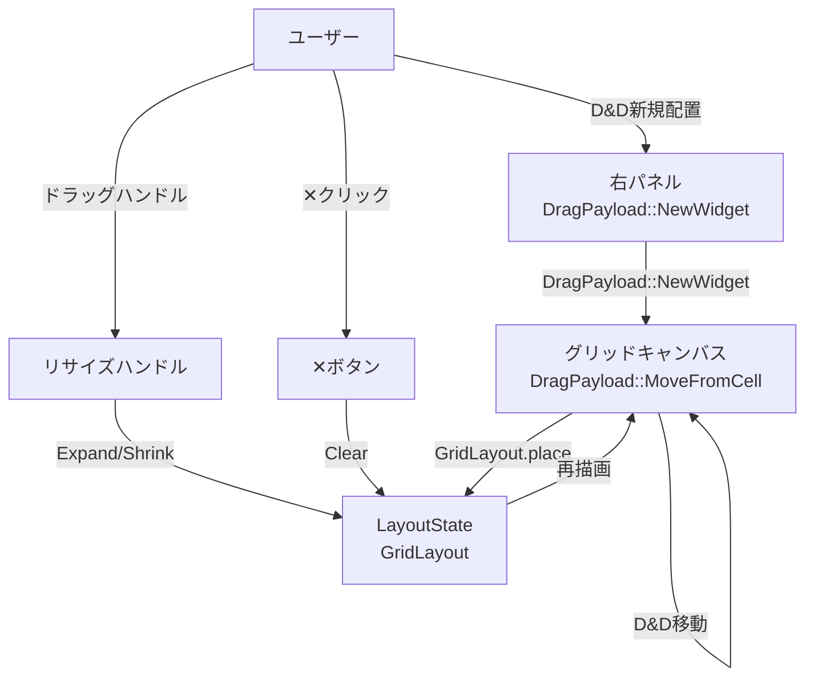
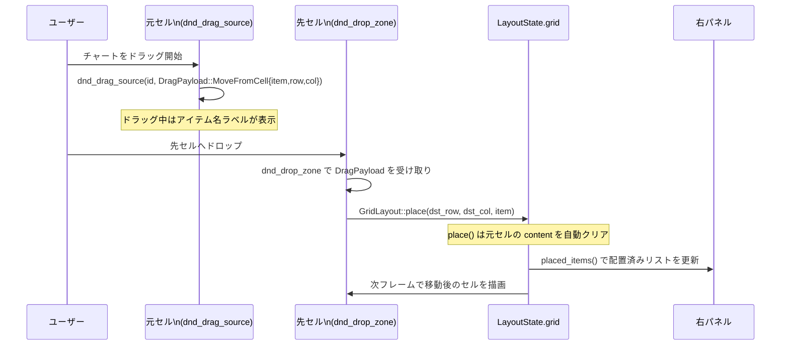
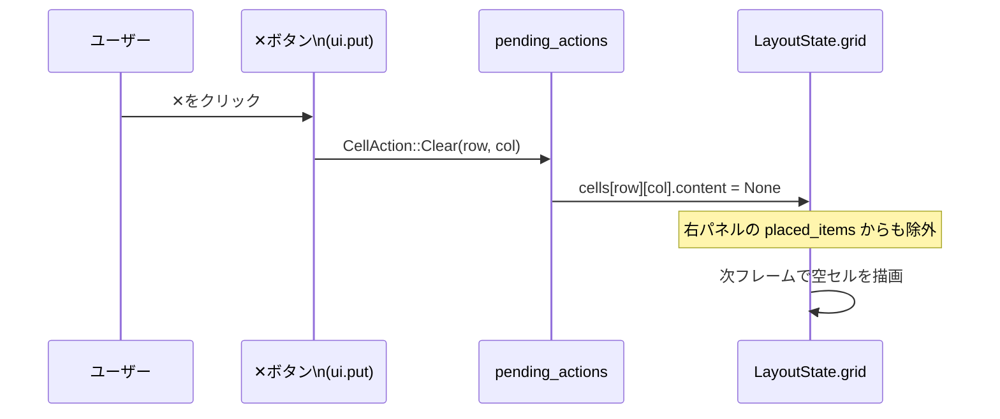
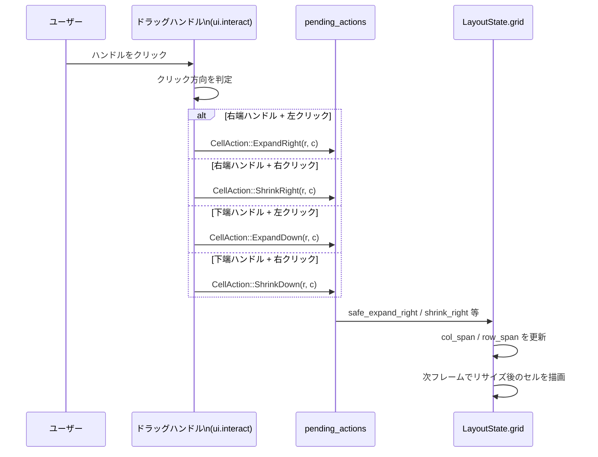
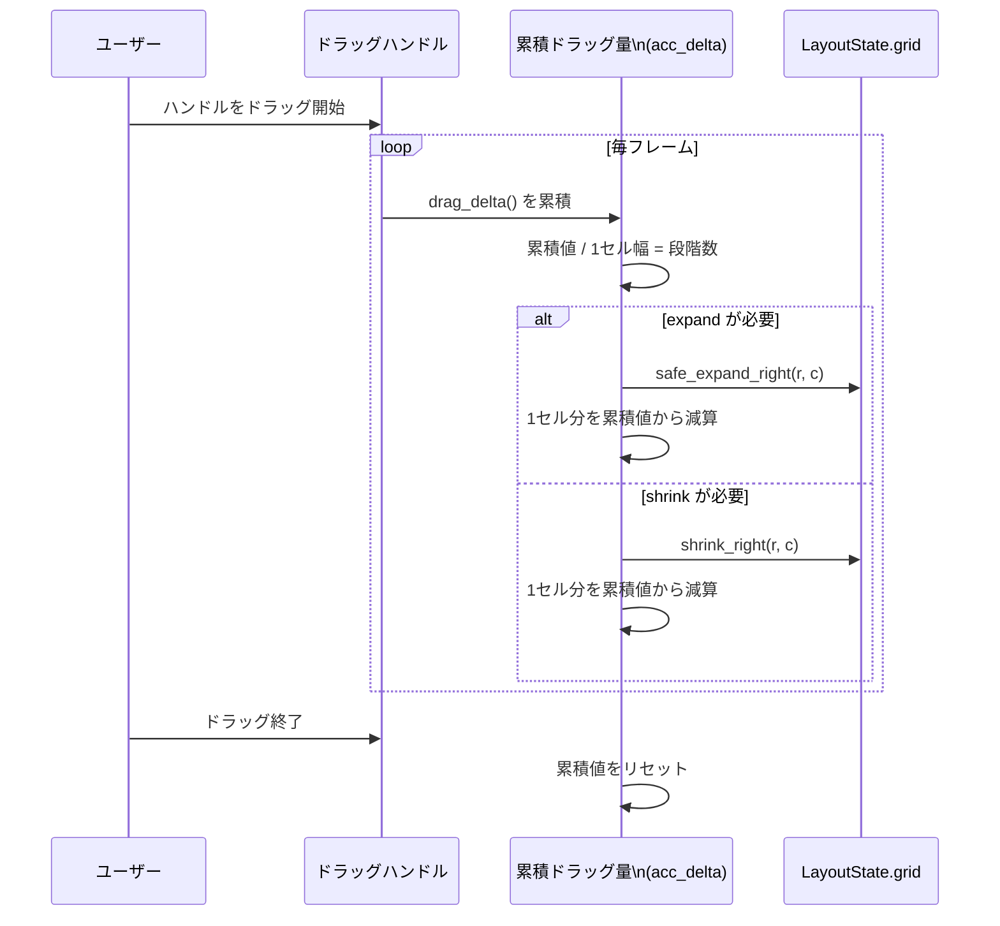
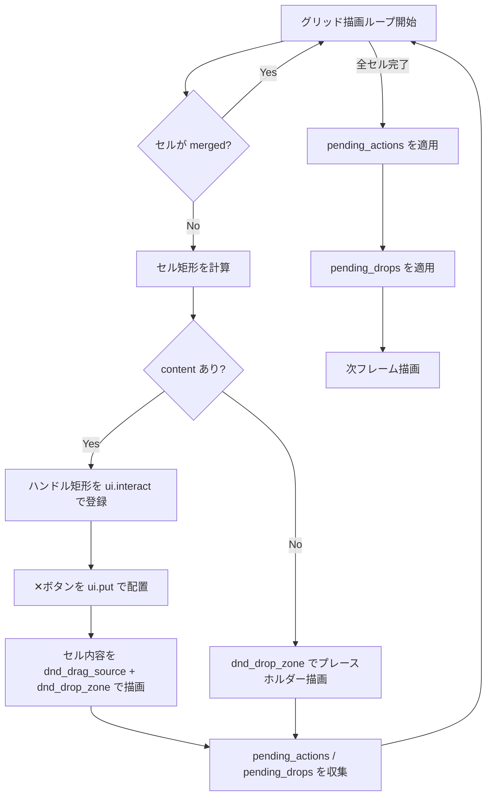
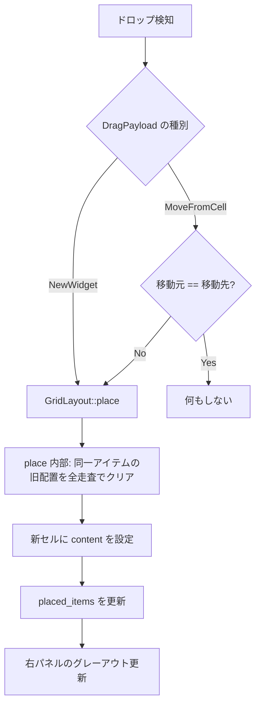
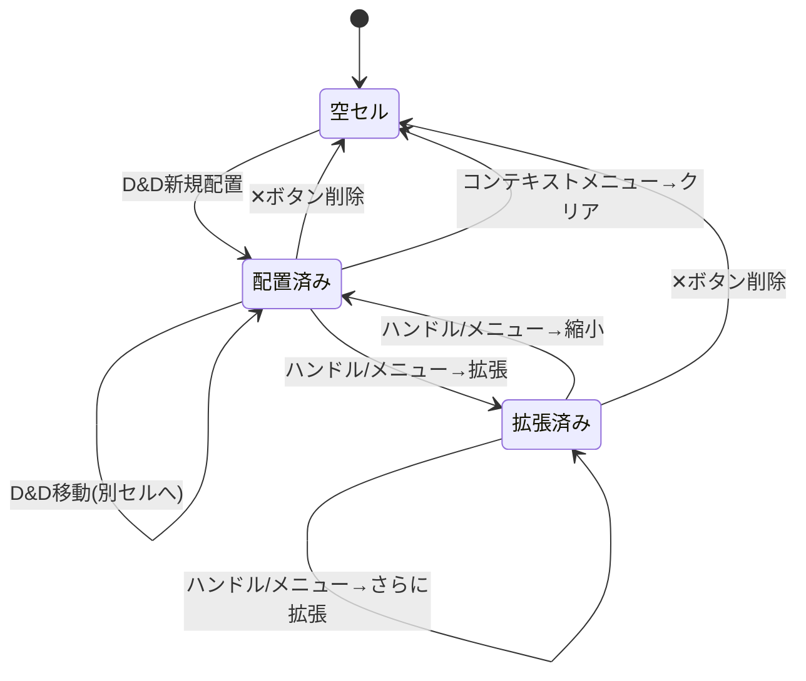

# Chart Widget Canvas Control データフロー図

**作成日**: 2026-04-17
**関連アーキテクチャ**: [architecture.md](architecture.md)
**関連要件**: キャンバス配置チャートの移動・サイズ変更・削除

**【信頼性レベル凡例】**:
- 🔵 **青信号**: 既存コード分析・ユーザヒアリングを参考にした確実なフロー
- 🟡 **黄信号**: 既存コード分析・ユーザヒアリングから妥当な推測によるフロー
- 🔴 **赤信号**: 既存コード分析・ユーザヒアリングにない推測によるフロー

---

## システム全体のデータフロー 🔵

**信頼性**: 🔵 *既存コード分析 + 新規機能追加より*

## 主要機能のデータフロー

### 機能1: セル間 D&D 移動 🔵

**信頼性**: 🔵 *ユーザーヒアリング・egui 0.30 D&D API より*

**関連**: 新規 DragPayload 型

**詳細ステップ**:
1. 元セルの `render_cell_content` 内で `dnd_drag_source` をラップ
2. ペイロードとして `DragPayload::MoveFromCell { item, row, col }` を設定
3. 先セルの `dnd_drop_zone` で `DragPayload` を受け取る
4. `DragPayload::MoveFromCell` の場合: `GridLayout::place(dst_row, dst_col, item)` を呼ぶ
5. `place()` は内部で全セルを走査し、同じアイテムを含む元セルをクリア → 移動完了
6. `DragPayload::NewWidget` の場合: 従来通り新規配置

### 機能2: ✕ボタンによる削除 🔵

**信頼性**: 🔵 *ユーザーヒアリング（✕ボタン常時表示・確認なし）より*

**配置フロー**:
1. グリッド描画ループ内で `cell.content.is_some()` の場合
2. `ui.put(close_rect, Button::new("✕"))` で✕ボタンを配置
3. `close_rect` はセル右上に固定（16x16px）
4. クリック検知 → `pending_actions.push(CellAction::Clear(r, c))`
5. ループ後に `cells[r][c].content = None` を適用

### 機能3: ハンドルクリックによるサイズ変更 🔵

**信頼性**: 🔵 *ユーザーヒアリング（端のみハンドル）・egui ui.interact() より*

**ハンドル検知フロー**:
1. 各セルの右端と下端に 6px 幅の矩形を計算
2. `ui.interact(handle_rect, id, Sense::click())` でクリック検知
3. ホバー時はハンドルを青色でハイライト、カーソルを変更
4. クリック時は `pending_actions` に Expand/Shrink を追加
5. ループ後に GridLayout の対応メソッドを実行

### 機能3b: ハンドルドラッグによる連続サイズ変更（Phase 2）🟡

**信頼性**: 🟡 *Phase 2 機能として妥当な推測*

## セル描画の統合フロー 🔵

**信頼性**: 🔵 *既存 grid_canvas.rs + 新規UI要素の統合より*

## D&D 移動と新規配置の統合フロー 🔵

**信頼性**: 🔵 *DragPayload 型による統合設計より*

## 状態管理フロー 🔵

**信頼性**: 🔵 *既存 egui-app の状態管理パターンより*

## エラーハンドリングフロー 🟡

**信頼性**: 🟡 *既存パターン + 新規操作の組み合わせより*

| エラーケース | 処理 |
|---|---|
| 自分自身のセルにドロップ | ドロップを無視（place 内で同一セルは何もしない） |
| 結合先セルにドロップ | ドロップ無効（merged_into != None のセルはスキップ） |
| コンテンツあるセルに拡張 | safe_expand が false を返す → 操作キャンセル |
| グリッド境界を超えるハンドル操作 | expand が false を返す → 操作キャンセル |
| ハンドルとD&Dの同時操作 | egui の排他処理でハンドルが優先（先に interact した方） |

## 関連文書

- **アーキテクチャ**: [architecture.md](architecture.md)
- **型定義**: [interfaces.rs](interfaces.rs)
- **ヒアリング記録**: [design-interview.md](design-interview.md)
- **既存フリーレイアウト設計**: [../free-layout-dashboard/dataflow.md](../free-layout-dashboard/dataflow.md)

## 信頼性レベルサマリー

- 🔵 青信号: 9件 (82%)
- 🟡 黄信号: 2件 (18%)
- 🔴 赤信号: 0件 (0%)

**品質評価**: ✅ 高品質
