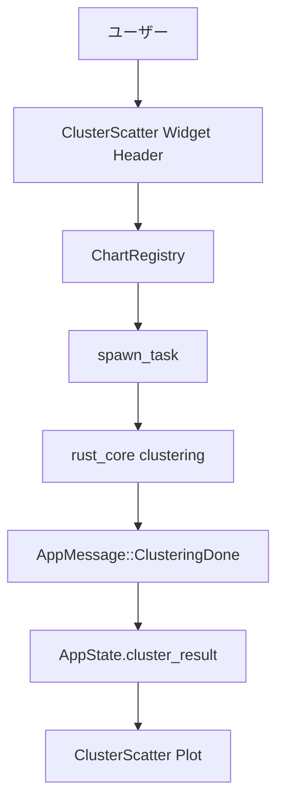

# cluster-widget-chart-not-displayed アーキテクチャ設計

**作成日**: 2026-05-05
**関連要件定義**: [requirements.md](../../spec/cluster-widget-chart-not-displayed/requirements.md)
**ヒアリング記録**: [design-interview.md](design-interview.md)

**【信頼性レベル凡例】**:
- 🔵 **青信号**: EARS要件定義書・設計文書・ユーザヒアリングを参考にした確実な設計
- 🟡 **黄信号**: EARS要件定義書・設計文書・ユーザヒアリングから妥当な推測による設計
- 🔴 **赤信号**: EARS要件定義書・設計文書・ユーザヒアリングにない推測による設計

---

## システム概要 🔵

**信頼性**: 🔵 *requirements.md REQ-001/002/101/201 とヒアリング結果より*

クラスタリング図ウィジェットの表示不具合を、既存の egui デスクトップ構成（AppMessage + spawn_task + chart_registry）を維持して解消する。表示は「未実行」「実行中」「失敗」「完了」の状態遷移を明示し、手動実行はチャート内ヘッダーで行う。

## アーキテクチャパターン 🔵

**信頼性**: 🔵 *既存実装調査（message_handler/chart_registry）とヒアリング「現行維持」より*

- **パターン**: メッセージ駆動 + 非同期タスク実行（Immediate Mode UI）
- **選択理由**: 既存の `ImportanceChart` / `McdmChart` / `AhpChart` が同一の pending_compute + spawn_task パターンを利用しており、最小変更で整合性と保守性を確保できる

## コンポーネント構成

### UIレイヤー（egui） 🔵

**信頼性**: 🔵 *要件 REQ-001/101 + 既存 `cluster_scatter.rs` より*

- `ClusterScatter` ヘッダーに手動実行UIを配置（k値、対象空間、初期化方式）
- 状態表示:
  - 未実行: 実行案内メッセージ
  - 実行中: 実行中表示 + 再実行無効
  - 失敗: インラインエラー表示（環境別詳細切替）
  - 完了: 散布図描画

### 状態管理レイヤー 🔵

**信頼性**: 🔵 *要件 REQ-002/201/202 + 既存 `AppState` / `MessageHandler` より*

- `AppState.cluster_result: Option<ClusterResult>` を表示の単一データソースとして継続利用
- `ClusterScatter` に `pending_compute` 相当の実行要求スロットを追加
- `StudySelected` 受信時に `app_state.clear()` で `cluster_result` をクリアし、未実行状態へ戻す

### 計算レイヤー（rust_core） 🔵

**信頼性**: 🔵 *docs/implements/TASK-901/clustering-memo.md + 実装調査より*

- 既存関数を再利用:
  - PCA
  - k-means
  - elbow 推定
  - cluster stats
- 新規アルゴリズム導入は行わず、実行トリガー導線のみ追加

### エラーハンドリング方針 🔵

**信頼性**: 🔵 *ヒアリング「環境で切替」より*

- 開発環境: 詳細エラー表示（原因調査を優先）
- 本番相当: ユーザー向け簡易文言を表示（内部情報漏えい抑止）
- いずれもログには詳細情報を記録

## システム構成図 🔵

**信頼性**: 🔵 *既存実装 + 要件定義より*



## ディレクトリ構造 🔵

**信頼性**: 🔵 *既存構造 + 本設計スコープより*

```
egui-app/src/
├── state/
│   ├── app_state.rs
│   ├── message_handler.rs
│   └── messages.rs
└── ui/
    ├── chart_registry.rs
    └── widgets/
        └── cluster_scatter.rs

rust_core/src/
└── clustering/
    ├── kmeans.rs
    └── stats.rs

docs/design/cluster-widget-chart-not-displayed/
├── architecture.md
├── dataflow.md
├── design-interview.md
└── interfaces.rs
```

## 非機能要件の実現方法

### パフォーマンス 🔵

**信頼性**: 🔵 *ヒアリング性能目標「1秒以内」 + NFR-001より*

- 目標: 手動実行後 1 秒以内の描画更新
- 実現策:
  - UIスレッドで重計算を実行しない（spawn_task固定）
  - 実行中は再実行ボタンを無効化し重複負荷を回避
  - 必要最小限の再描画領域更新

### セキュリティ 🔵

**信頼性**: 🔵 *ヒアリング結果より*

- エラー情報は環境別開示
- 不正パラメータ（k<2、k>trial数）をUI側で事前検証
- 失敗時のメッセージはユーザー操作を誘導し、内部実装情報の露出を制御

### スケーラビリティ 🟡

**信頼性**: 🟡 *既存計算方式から妥当推測*

- 当面は単一プロセス内計算で対応
- 大規模データ向け最適化（ダウンサンプリング事前適用等）は Phase 2 候補

### 可用性 🔵

**信頼性**: 🔵 *EDGE-001/102 と既存エラー方針より*

- 計算失敗時もアプリ全体は継続稼働
- ウィジェット単位で失敗状態を閉じ込め、再実行可能に維持

## 技術的制約

### パフォーマンス制約 🔵

**信頼性**: 🔵 *requirements.md NFR-001, acceptance-criteria.md より*

- 1秒以内更新目標を満たす必要がある
- 重複実行は禁止

### セキュリティ制約 🔵

**信頼性**: 🔵 *ヒアリング結果より*

- 本番表示で内部例外詳細を直接表示しない
- ログ記録は維持

### 互換性制約 🔵

**信頼性**: 🔵 *既存実装整合方針より*

- 既存チャート配置/移動/削除挙動を壊さない
- 既存 `AppMessage` フローと整合させる

## 非該当項目（今回スコープ） 🔵

**信頼性**: 🔵 *デスクトップ内製計算機能である点より*

- `database-schema.sql`: 非該当（永続DBスキーマ追加なし）
- `api-endpoints.md`: 非該当（外部API追加なし）

## 関連文書

- **データフロー**: [dataflow.md](dataflow.md)
- **型定義（Rust）**: [interfaces.rs](interfaces.rs)
- **要件定義**: [requirements.md](../../spec/cluster-widget-chart-not-displayed/requirements.md)

## 信頼性レベルサマリー

- 🔵 青信号: 14件 (93.3%)
- 🟡 黄信号: 1件 (6.7%)
- 🔴 赤信号: 0件 (0%)

**品質評価**: 高品質
