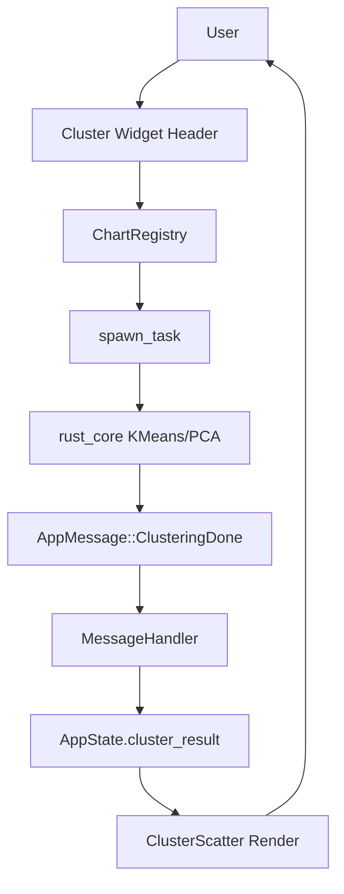
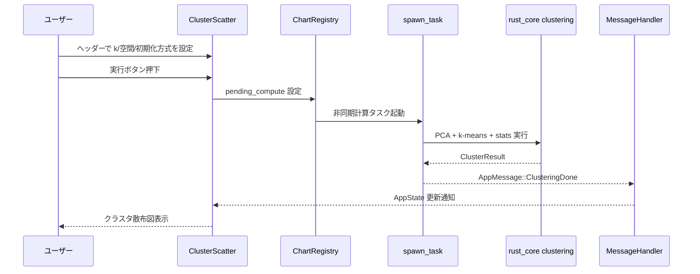
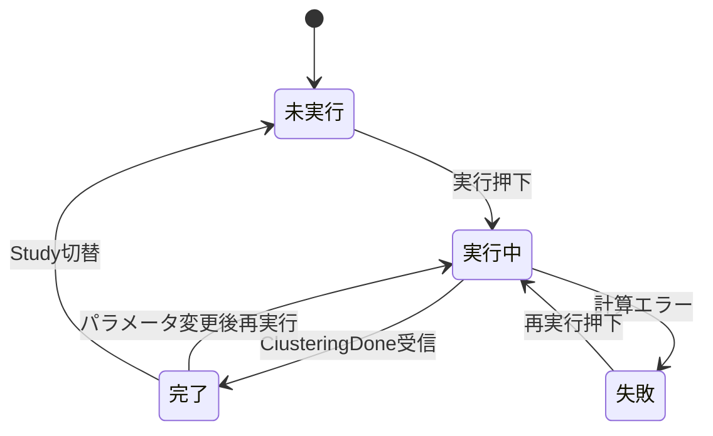
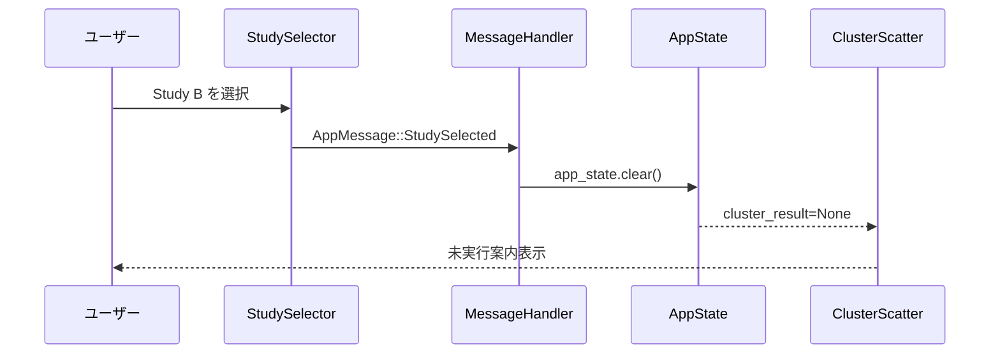
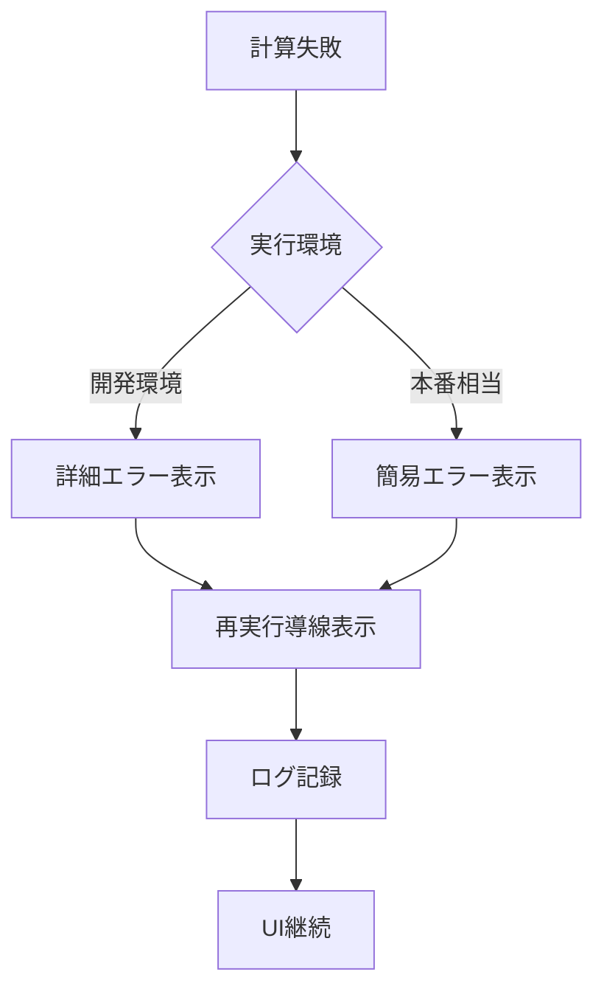
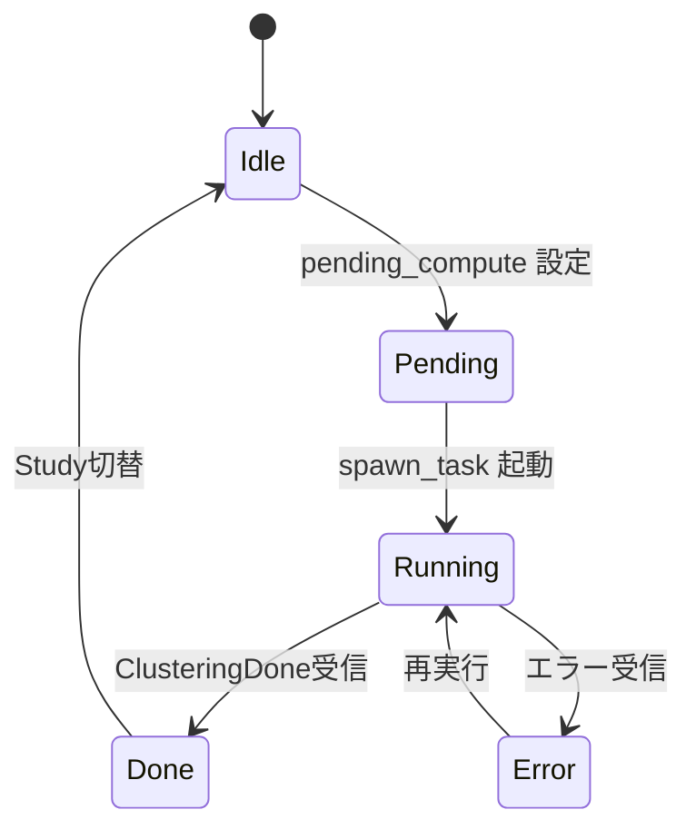

# cluster-widget-chart-not-displayed データフロー図

**作成日**: 2026-05-05
**関連アーキテクチャ**: [architecture.md](architecture.md)
**関連要件定義**: [requirements.md](../../spec/cluster-widget-chart-not-displayed/requirements.md)

**【信頼性レベル凡例】**:
- 🔵 **青信号**: EARS要件定義書・設計文書・ユーザヒアリングを参考にした確実なフロー
- 🟡 **黄信号**: EARS要件定義書・設計文書・ユーザヒアリングから妥当な推測によるフロー
- 🔴 **赤信号**: EARS要件定義書・設計文書・ユーザヒアリングにない推測によるフロー

---

## システム全体のデータフロー 🔵

**信頼性**: 🔵 *要件・既存実装より*

## 主要機能のデータフロー

### 機能1: 手動実行からチャート表示 🔵

**信頼性**: 🔵 *REQ-001/002/003, TC-001-01/02 より*

**関連要件**: REQ-001, REQ-002, REQ-003

**詳細ステップ**:
1. ヘッダー操作で入力検証（k範囲、対象空間）を実行する。 🔵
2. `pending_compute` をトリガーとして `spawn_task` で非同期実行する。 🔵
3. 完了メッセージ受信後に `cluster_result` を更新し再描画する。 🔵

### 機能2: 未実行/実行中/失敗状態表示 🔵

**信頼性**: 🔵 *REQ-004/101, NFR-201, ヒアリング結果より*

**関連要件**: REQ-004, REQ-101, NFR-201

**表示方針**:
- 未実行: 操作誘導メッセージを表示。 🔵
- 実行中: ローディング表示 + 実行ボタン無効化。 🔵
- 失敗: インラインエラーを表示（詳細度は環境切替）。 🔵

### 機能3: Study切替時リセット 🔵

**信頼性**: 🔵 *REQ-201/202, TC-201-01/02 より*

**関連要件**: REQ-201, REQ-202

**詳細ステップ**:
1. `StudySelected` 受信で `clear()` を呼び出す。 🔵
2. `cluster_result` を空にし stale 表示を防止する。 🔵
3. ウィジェット表示を未実行状態へ戻す。 🔵

## データ処理パターン

### 同期処理 🔵

**信頼性**: 🔵 *既存UIパターンより*

- ヘッダー入力検証（kの妥当性、空間選択）
- UI状態遷移（未実行/実行中/失敗/完了）

### 非同期処理 🔵

**信頼性**: 🔵 *既存 `spawn_task` パターンより*

- PCA + k-means + stats の実計算
- 完了時の `ClusteringDone` メッセージ発行

### バッチ処理 🟡

**信頼性**: 🟡 *現時点要件外だが将来拡張を見据えた推測*

- 現スコープではバッチ処理なし
- 大規模データ向けのバックグラウンド再クラスタリングは将来候補

## エラーハンドリングフロー 🔵

**信頼性**: 🔵 *ヒアリング「環境で切替」より*

## 状態管理フロー

### フロントエンド状態管理（egui state） 🔵

**信頼性**: 🔵 *既存 AppState/message_handler 実装より*

### 計算結果整合性 🟡

**信頼性**: 🟡 *EDGE-002要件からの推測*

- ラベル件数と trial 件数の不整合時は結果を破棄し再実行を促す
- 不整合検知は `ChartRegistry` または `ClusterScatter` 入力境界で実施

## 関連文書

- **アーキテクチャ**: [architecture.md](architecture.md)
- **型定義（Rust）**: [interfaces.rs](interfaces.rs)
- **要件定義**: [requirements.md](../../spec/cluster-widget-chart-not-displayed/requirements.md)

## 信頼性レベルサマリー

- 🔵 青信号: 13件 (92.9%)
- 🟡 黄信号: 1件 (7.1%)
- 🔴 赤信号: 0件 (0%)

**品質評価**: 高品質
