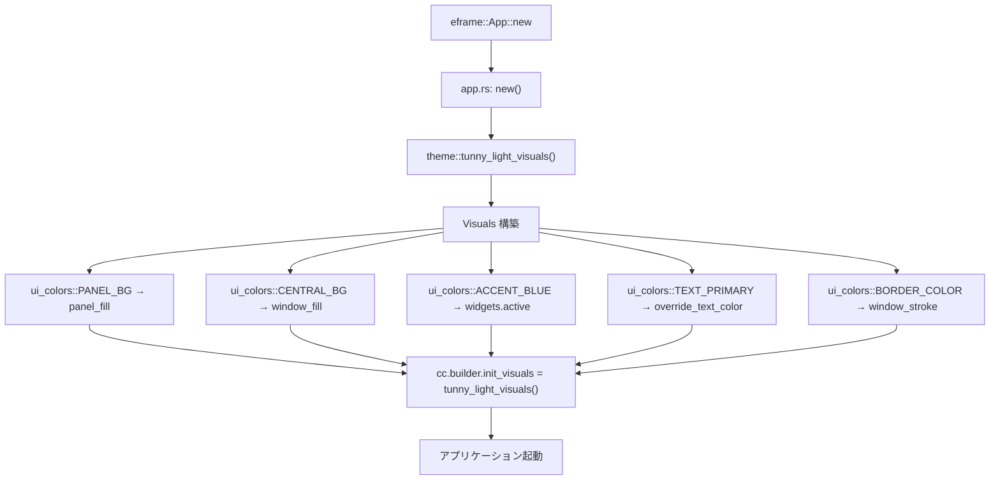
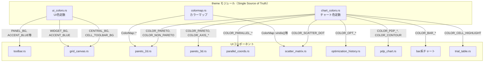
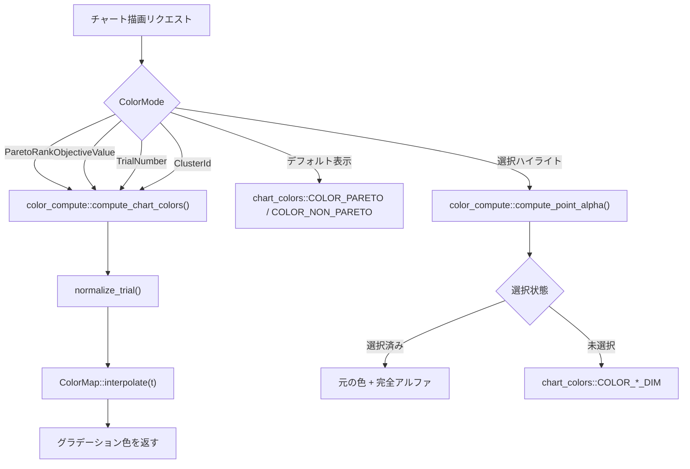
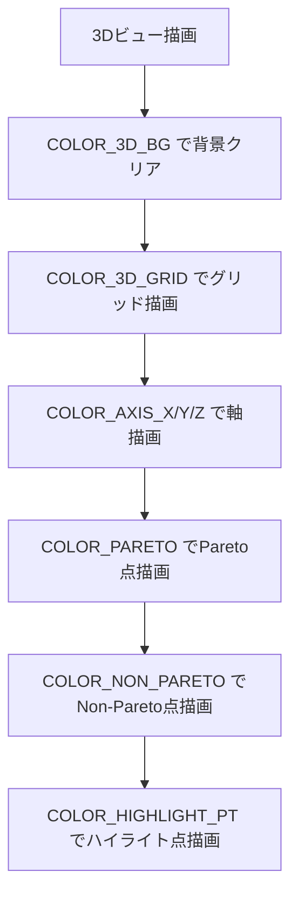
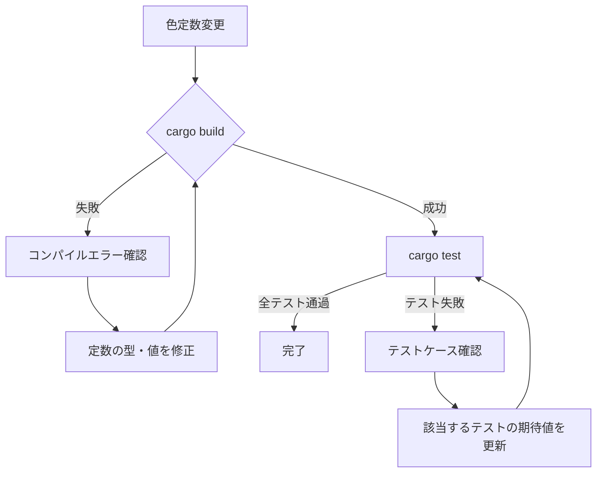
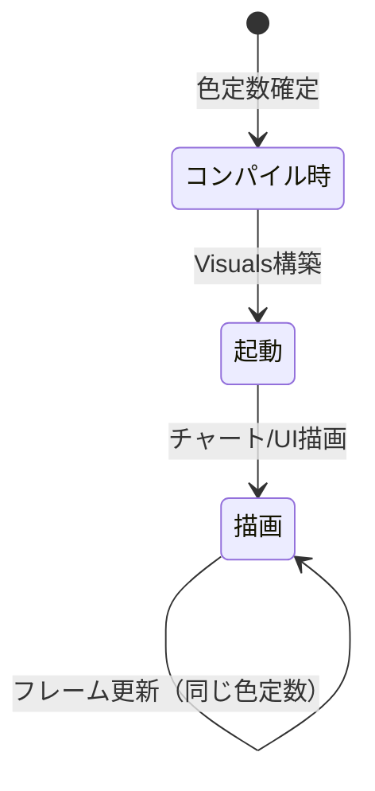

# カラーテーマ洗練 データフロー図

**作成日**: 2026-05-12
**関連アーキテクチャ**: [architecture.md](architecture.md)
**関連要件定義**: [requirements.md](../../spec/color-theme-refinement/requirements.md)

**【信頼性レベル凡例】**:
- 🔵 **青信号**: 要件定義書・既存実装を参考にした確実なフロー
- 🟡 **黄信号**: 要件定義書・既存実装から妥当な推測によるフロー

---

## テーマ適用フロー（起動時） 🔵

**信頼性**: 🔵 *既存実装 app.rs・theme/mod.rs より*

**詳細**:
1. `app.rs` の `new()` で `tunny_light_visuals()` を呼び出す
2. `tunny_light_visuals()` は `ui_colors.rs` の定数を参照して `Visuals` を構築
3. **今回の変更**: 定数のRGB値が変わるだけで、フロー自体は一切変更なし

---

## UI描画時の色参照フロー 🔵

**信頼性**: 🔵 *既存実装の各UIコンポーネントより*

**変更の影響**: 全UIコンポーネントは `crate::theme::*` 経由で定数を参照しているため、
`ui_colors.rs` と `chart_colors.rs` の値を変更するだけで全画面に反映される。

---

## チャート描画の色計算フロー 🔵

**信頼性**: 🔵 *既存実装 color_compute.rs より*

**今回の変更点**:
- `COLOR_PARETO`, `COLOR_NON_PARETO`, `COLOR_*_DIM` のRGB値が変更される
- `color_compute.rs` の計算ロジック自体は変更なし
- `colormap.rs` のグラデーション定義は変更なし

---

## 3Dビューの色フロー（ライト化） 🔵

**信頼性**: 🔵 *既存実装 pareto_3d.rs より*

**新旧比較**:

| ステップ | 旧動作 | 新動作 |
|---------|--------|--------|
| 背景クリア | ダーク（20,20,30） | ライトグレー（240,242,245） |
| グリッド描画 | 半透明ダークグレー | 半透明グレー（33,33,36,α=70） |
| 軸描画 | 高彩度RGB（220/220/220） | パステルRGB（210/170/200） |
| 点描画 | 赤青（220,50,50/50,150,250） | Google色（234,67,53/66,133,244） |
| ハイライト | YELLOW | Deep Purple（124,77,255） |

---

## エラーハンドリングフロー 🟡

**信頼性**: 🟡 *既存実装パターンから推測*

今回の変更は色定数の値変更のみであり、エラーハンドリングフローに影響はない。
ただし、ビルド時の潜在的な問題として:

**注意**: `colormap.rs` のテスト（`interpolate_at_half_returns_midpoint`等）は
RGB値を直接アサートしているため、colormapを変更しない限り影響なし。

---

## 状態遷移フロー 🔵

**信頼性**: 🔵 *既存実装より*

色テーマの状態はコンパイル時定数のみ。ランタイムでの状態変化なし。

---

## 関連文書

- **アーキテクチャ**: [architecture.md](architecture.md)
- **設計ヒアリング**: [design-interview.md](design-interview.md)
- **要件定義**: [requirements.md](../../spec/color-theme-refinement/requirements.md)

## 信頼性レベルサマリー

- 🔵 青信号: 5件 (83%)
- 🟡 黄信号: 1件 (17%)
- 🔴 赤信号: 0件 (0%)

**品質評価**: ✅ 高品質
