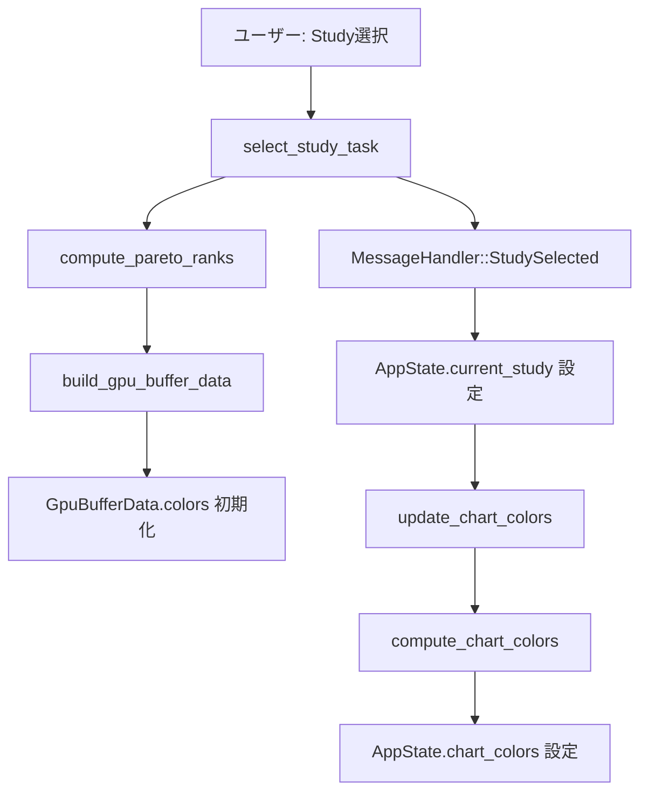
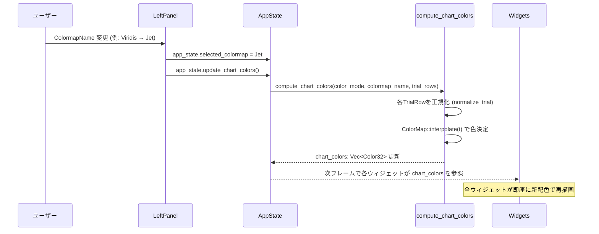
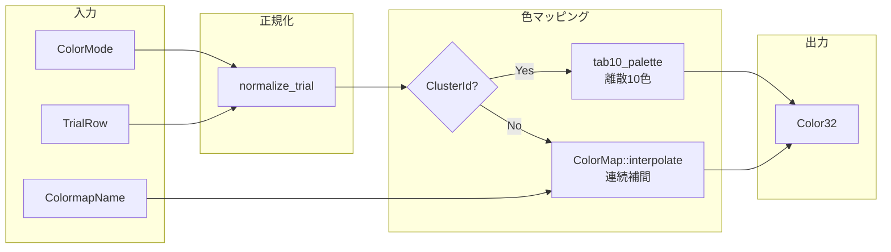
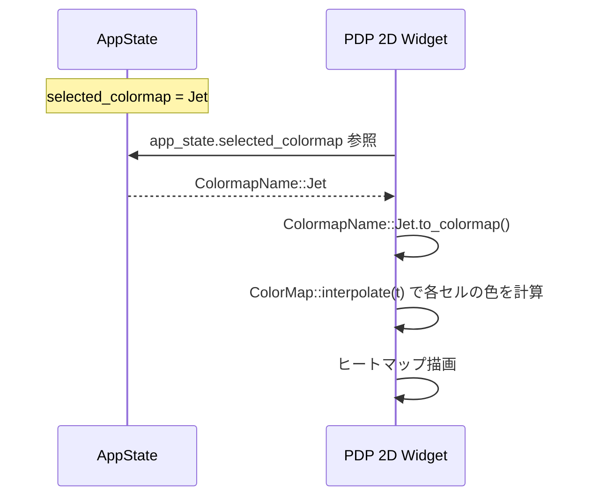
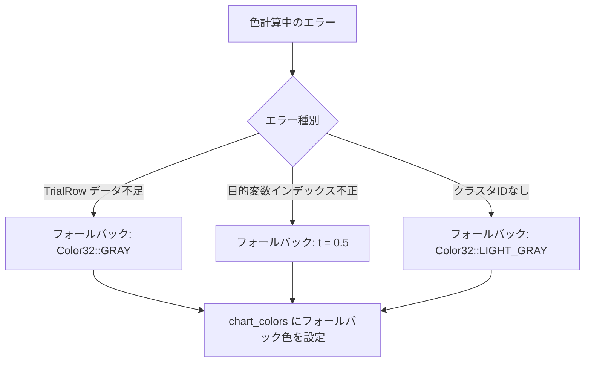

# カラーマップ色反映と拡張 データフロー図

**作成日**: 2026-04-16
**関連アーキテクチャ**: [architecture.md](architecture.md)

**【信頼性レベル凡例】**:
- 🔵 **青信号**: コード調査・ユーザヒアリングを参考にした確実なフロー
- 🟡 **黄信号**: コード調査・ユーザヒアリングから妥当な推測によるフロー
- 🔴 **赤信号**: コード調査・ユーザヒアリングにない推測によるフロー

---

## 1. 初期色計算フロー（Study選択時）🔵

**信頼性**: 🔵 *既存コード `select_study_task()` のフローと新規設計より*



**詳細ステップ**:
1. Study選択 → `select_study_task()` でパース・Paretoランク計算
2. `build_gpu_buffer_data()` は初期色を生成（既存動作を維持）
3. `MessageHandler::StudySelected` で `AppState.current_study` を設定
4. 設定直後に `update_chart_colors()` を呼び出し `chart_colors` を初期化
5. `compute_chart_colors()` は ColorMode + ColormapName + TrialRows から Vec<Color32> を生成

## 2. カラーマップ/カラーモード変更フロー 🔵

**信頼性**: 🔵 *ユーザヒアリング（即時同期）・既存UI構造より*



## 3. 色計算パイプライン詳細 🔵

**信頼性**: 🔵 *アーキテクチャ設計・既存コードより*



### 正規化ロジック詳細 🔵

**信頼性**: 🔵 *既存コード・note.md 正規化表より*

| ColorMode | 入力 | 正規化式 | 出力範囲 |
|---|---|---|---|
| ParetoRank | `pareto_rank: u32` | `1.0 - rank / max(1, max_rank + 1)` | [0.0, 1.0] |
| ObjectiveValue(name) | `objectives[idx]: f64` | `(val - min) / max(eps, max - min)` | [0.0, 1.0] |
| TrialNumber | `trial_id: u32` | `id / max(1, total - 1)` | [0.0, 1.0] |
| ClusterId | `cluster_id: Option<i32>` | `palette[abs(id) % 10]` | Color32 直接 |

## 4. ウィジェット別の色消費フロー 🔵

**信頼性**: 🔵 *コード調査（各ウィジェットの現在の色使用箇所）より*

### pareto_2d.rs 🔵

```mermaid
flowchart TD
    A[chart_colors: Vec<Color32>] --> B{trial が selected?}
    B -->|Yes| C[color = chart_colors[i]<br/>alpha = 255]
    B -->|No| D[color = chart_colors[i]<br/>alpha = 50]
    C --> E[egui_plot::Points<br/>per-point color]
    D --> E
    E --> F[ハイライト判定]
    F -->|一致| G[別レイヤーで大きく描画<br/>color = Color32::RED]
    F -->|不一致| H[通常描画]
```

**変更点**:
- 現在: selected/unselected/highlighted の3つの `Points`（固定色）
- 変更後: per-point で `chart_colors[i]` を適用、alpha は選択状態で制御

### scatter_matrix.rs 🔵

```mermaid
flowchart TD
    A[chart_colors: Vec<Color32>] --> B[draw_scatter_cell に point_colors として渡す]
    B --> C[painter.circle_filled で各点の色を chart_colors[i] に設定]
```

**変更点**:
- 現在: `vec![Color32::from_rgb(70, 130, 220); n]`（全点同色）
- 変更後: `chart_colors.clone()` を渡す

### cluster_scatter.rs 🔵

```mermaid
flowchart TD
    A[ColorMode == ClusterId] --> B{判定}
    B -->|Yes| C[chart_colors[i] から色を取得<br/>（tab10_palette ベース）]
    B -->|No| D[他のColorModeの場合と同じ<br/>chart_colors[i] を使用]
    C --> E[クラスタごとに Points グループ化]
    D --> E
```

**変更点**:
- 現在: 5色ハードコード `cluster_colors = [Color32; 5]`
- 変更後: `chart_colors` から色を取得（`compute_chart_colors` 内で ClusterId → tab10_palette 適用済み）

### pdp_2d.rs 🔵

```mermaid
flowchart TD
    A[AppState.selected_colormap] --> B[ColormapName::to_colormap]
    B --> C[ColorMap::interpolate(t) で各セルの色を計算]
    C --> D[ヒートマップ描画]
```

**変更点**:
- 現在: `ColorMap::viridis()` / `plasma()` を直接呼び出し
- 変更後: `app_state.selected_colormap.to_colormap()` を使用

## 5. PDP 2D ヒートマップ連動フロー 🔵

**信頼性**: 🔵 *ユーザヒアリング（連動させる）・既存 pdp_2d.rs より*



## 6. エラーハンドリング 🟡

**信頼性**: 🟡 *一般的なエラーパターンから妥当な推測*



## 状態管理フロー

### AppState 色状態 🔵

**信頼性**: 🔵 *アーキテクチャ設計より*

```mermaid
stateDiagram-v2
    [*] --> 初期状態: AppState::new()
    初期状態 --> 色設定済み: StudySelected + update_chart_colors
    色設定済み --> 色再計算中: ColorMode/ColormapName変更
    色再計算中 --> 色設定済み: compute_chart_colors完了
    色設定済み --> 初期状態: Study切り替え (clear)
```

**遷移トリガー**:
- `StudySelected` → 初期色計算
- `ColorMode` 変更 → 色再計算
- `ColormapName` 変更 → 色再計算
- `clear()` → 色クリア

## データ整合性の保証 🔵

**信頼性**: 🔵 *アーキテクチャ設計（即時同期）より*

- **同期更新**: `chart_colors` は `update_chart_colors()` 呼び出し内で即時更新
- **整合性**: `chart_colors.len() == trial_rows.len()` を常に保証
- **クリア**: Study切り替え時に `chart_colors.clear()` を実行
- **順序**: `chart_colors[i]` は `trial_rows[i]` に対応

## 関連文書

- **アーキテクチャ**: [architecture.md](architecture.md)
- **型定義**: [interfaces.rs](interfaces.rs)
- **ヒアリング記録**: [design-interview.md](design-interview.md)

## 信頼性レベルサマリー

- 🔵 青信号: 13件 (93%)
- 🟡 黄信号: 1件 (7%)
- 🔴 赤信号: 0件 (0%)

**品質評価**: ✅ 高品質
