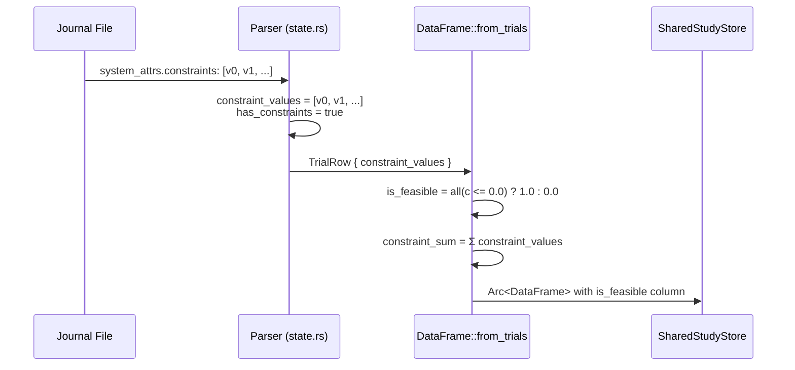
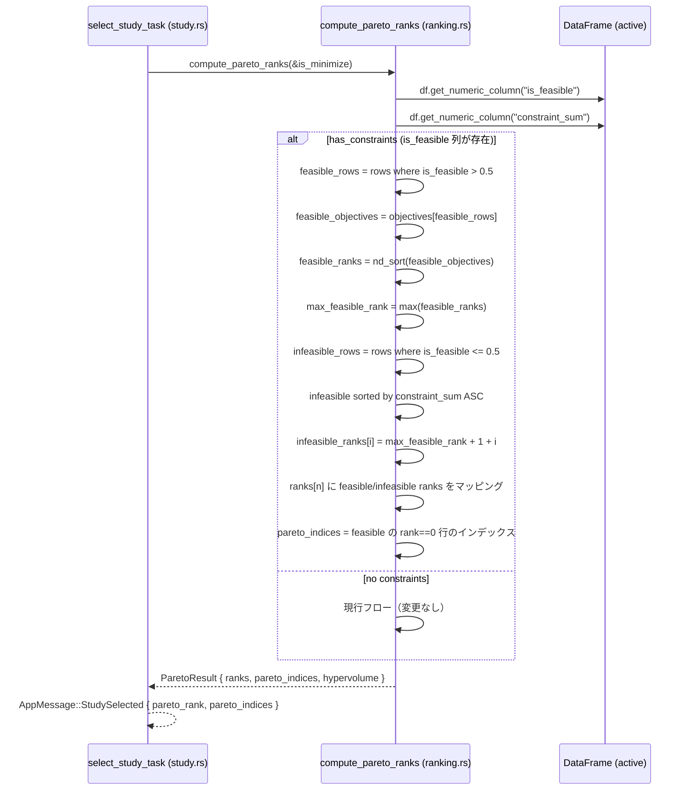
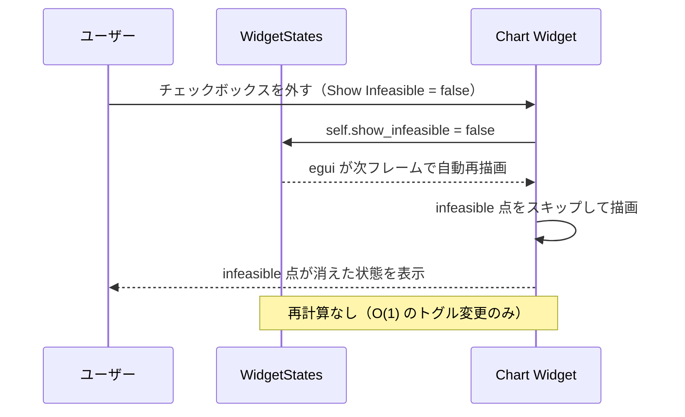
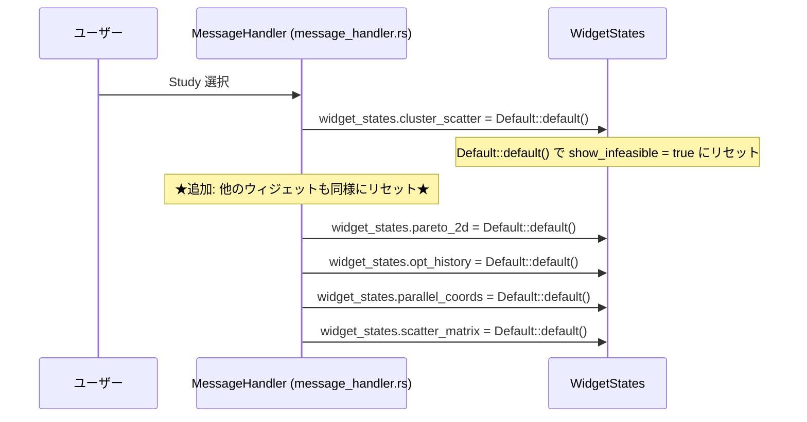
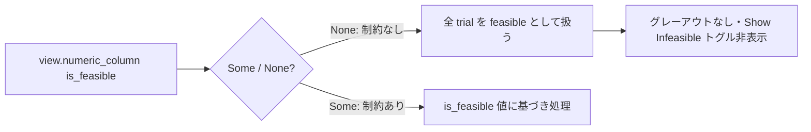
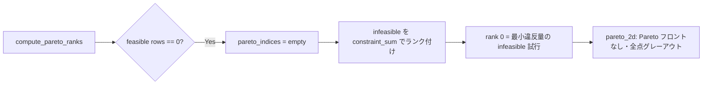

# 制約条件を考慮した可視化 データフロー図

**作成日**: 2026-06-03
**関連アーキテクチャ**: [architecture.md](architecture.md)
**関連要件定義**: [requirements.md](../../spec/constraint-aware-visualization/requirements.md)

**【信頼性レベル凡例】**:
- 🔵 **青信号**: EARS要件定義書・設計文書・ユーザヒアリングを参考にした確実なフロー
- 🟡 **黄信号**: EARS要件定義書・設計文書・ユーザヒアリングから妥当な推測によるフロー
- 🔴 **赤信号**: EARS要件定義書・設計文書・ユーザヒアリングにない推測によるフロー

---

## システム全体のデータフロー 🔵

**信頼性**: 🔵 *既存実装の全体構造 + 要件定義より*

```
[Journal File]
     │
     ▼
[parse_journal()] ─────────────────────────────────────────────────
  rust_core/io/journal/parser/                                     │
  ・op_code=9 で system_attrs.constraints をパース                 │
  ・constraint_values: Vec<f64> を TrialBuilder に格納             │
     │                                                             │
     ▼                                                             │
[DataFrame::from_trials()]                                         │
  rust_core/data/dataframe/model.rs                                │
  ・is_feasible 列: all(c <= 0.0) → 1.0 / else → 0.0   (既実装)  │
  ・constraint_sum 列: Σ constraint_values              (既実装)  │
     │                                                             │
     ▼                                                             │
[SharedStudyStore]                              AppMessage::JournalParsed
  ・study_id → Arc<DataFrame> で格納                               │
     │                                                             ▼
     │                                                    [egui-app UI]
     ▼                                                    ユーザーが Study 選択
[compute_pareto_ranks()]  ← ★変更箇所★
  rust_core/multi_objective/pareto/ranking.rs
  ・is_feasible 列を読み取り
  ・feasible 行のみで nd_sort() 実行
  ・infeasible 行を constraint_sum 昇順でランク付け
  ・全 n 行の ranks[] を返す
     │
     ▼
AppMessage::StudySelected {
  pareto_rank: Vec<u32>,  ← feasible/infeasible 混在ランク
  pareto_indices: Vec<u32>, ← feasible の rank==0 のみ
}
     │
     ▼
[StudyView::new(df, pareto_rank)]
  ・Arc<DataFrame> + pareto_rank 並行配列
  ・view.numeric_column("is_feasible") でアクセス可能
     │
     ▼
[各チャートウィジェットの show()]  ← ★変更箇所★
  ・view.numeric_column("is_feasible") を参照
  ・is_feasible==0.0 → COLOR_INFEASIBLE でグレーアウト
  ・show_infeasible==false → スキップ
```

---

## 主要フロー詳細

### フロー1: Journal パース → `is_feasible` 列生成（既実装） 🔵

**信頼性**: 🔵 *既存実装 `state.rs` L169–180, `model.rs` L128–158 より*

**関連要件**: REQ-CAV-001



**既実装済み** - 変更不要

---

### フロー2: Pareto ランク計算（★変更★） 🔵

**信頼性**: 🔵 *ユーザヒアリング + 既存 `ranking.rs` 実装より*

**関連要件**: REQ-CAV-030〜033



**変更箇所**: `rust_core/src/multi_objective/pareto/ranking.rs:compute_pareto_ranks()`

---

### フロー3: チャート描画での feasibility チェック（★変更★） 🔵

**信頼性**: 🔵 *ユーザヒアリング + 既存 `pareto_2d.rs` 描画パターンより*

**関連要件**: REQ-CAV-010〜013, REQ-CAV-040〜093

以下は `ParetoScatter2D` を例にした変更後の描画フロー：

```mermaid
flowchart TD
    A[show() 呼び出し] --> B{has_constraints?}
    B -->|false| C[従来の色分けロジック]
    B -->|true| D[is_feasible 列を取得]
    D --> E[show_infeasible チェックボックス表示]
    E --> F[描画ループ開始]
    F --> G{is_feasible == 1.0?}
    G -->|true: 実行可能解| H[従来の Pareto ランクで色分け]
    G -->|false: 実行不可能解| I{show_infeasible?}
    I -->|false| J[スキップ]
    I -->|true| K[COLOR_INFEASIBLE でグレーアウト描画]
    H --> L[先に infeasible 点を描画]
    K --> L
    L --> M[続いて feasible 点を描画]
    M --> N[highlight 点を最前面に描画]
```

**描画順序の実装（pareto_2d.rs）**:

```rust
// Step 1: infeasible 点を先に描画（背面）
if show_infeasible {
    plot_ui.points(infeasible_pts → COLOR_INFEASIBLE, radius=2.0);
}
// Step 2: non-pareto 点
plot_ui.points(non_pareto_pts_dim → COLOR_NON_PARETO_DIM, ...);
plot_ui.points(non_pareto_pts → COLOR_NON_PARETO, ...);
// Step 3: pareto 点（前面）
plot_ui.points(pareto_pts_dim → COLOR_PARETO_DIM, ...);
plot_ui.points(pareto_pts → COLOR_PARETO, ...);
// Step 4: highlight 点（最前面）
if let Some(pt) = highlight_pt { plot_ui.points(pt → COLOR_HIGHLIGHT_PT, ...); }
```

---

### フロー4: Show Infeasible トグル操作 🔵

**信頼性**: 🔵 *ユーザヒアリング + egui 即時モードの特性より*

**関連要件**: REQ-CAV-020〜023



---

### フロー5: Study 切替時のリセット 🔵

**信頼性**: 🔵 *ユーザヒアリング「Study 切替時リセット」+ 既存 message_handler.rs L50–53 より*

**関連要件**: 設計決定事項



**既存コード**: `message_handler.rs:50–53` に既に `cluster_scatter` のリセットあり  
**追加変更**: 他のウィジェットも `Default::default()` でリセット（または `show_infeasible = true` を明示的に設定）

---

## 状態管理フロー

### show_infeasible の状態ライフサイクル 🔵

**信頼性**: 🔵 *egui 即時モードアーキテクチャ + ユーザヒアリングより*

```mermaid
stateDiagram-v2
    [*] --> デフォルト(true): Widget 初期化 / Study 切替
    デフォルト(true) --> 非表示(false): チェックボックスを外す
    非表示(false) --> デフォルト(true): チェックボックスを入れる
    非表示(false) --> デフォルト(true): Study 切替（Default::default()）
    デフォルト(true) --> デフォルト(true): Study 切替（Default::default()）
```

---

## エラーハンドリングフロー 🟡

**信頼性**: 🟡 *既存の EDGE ケース実装パターンから妥当な推測*

### is_feasible 列が存在しない場合（制約なし Study）



### 全 trial が infeasible の場合



---

## 関連文書

- **アーキテクチャ**: [architecture.md](architecture.md)
- **実装ガイド**: [implementation-guide.md](implementation-guide.md)
- **設計ヒアリング**: [design-interview.md](design-interview.md)
- **要件定義**: [requirements.md](../../spec/constraint-aware-visualization/requirements.md)

## 信頼性レベルサマリー

- 🔵 青信号: 7件（88%）
- 🟡 黄信号: 1件（12%）
- 🔴 赤信号: 0件（0%）

**品質評価**: ✅ 高品質
