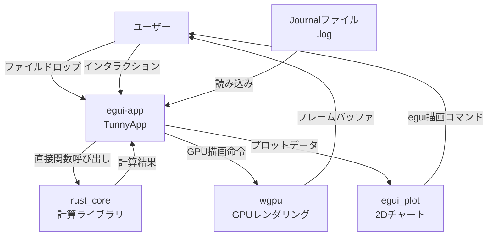

# egui Migration アーキテクチャ設計

**作成日**: 2026-04-11
**ブランチ**: featura/egui
**関連要件定義**: [tunny-dashboard-requirements.md](../../spec/tunny-dashboard-requirements.md)
**ヒアリング記録**: [design-interview.md](design-interview.md)

**【信頼性レベル凡例】**:
- 🔵 **青信号**: EARS要件定義書・設計文書・ユーザヒアリングを参考にした確実な設計
- 🟡 **黄信号**: EARS要件定義書・設計文書・ユーザヒアリングから妥当な推測による設計
- 🔴 **赤信号**: EARS要件定義書・設計文書・ユーザヒアリングにない推測による設計

---

## システム概要 🔵

**信頼性**: 🔵 *ユーザーヒアリング・既存要件定義より*

TypeScript/React UIを廃止し、Rust/eguiによるネイティブデスクトップアプリに完全移行する。
`rust_core` クレートの計算ロジック（Journalパーサー・DataFrame・分析アルゴリズム）は全て再利用する。
`frontend/` ディレクトリ（TypeScript・Node.js依存物）は全削除する。
WASMビルドは廃止し、neativeバイナリのみを提供する。

## アーキテクチャパターン 🔵

**信頼性**: 🔵 *ユーザーヒアリングより*

- **パターン**: 2クレート Cargo Workspace + egui MVUパターン
- **選択理由**: TypeScript UIのパフォーマンス限界を克服するため。egui + native Rustで速度最大化。
  WASM経由のJS↔Rustブリッジオーバーヘッドを完全排除。

## コンポーネント構成

### クレート構成 🔵

**信頼性**: 🔵 *ユーザーヒアリング（新規クレート作成）より*

```
tunny-dashboard/           # Cargo Workspace ルート
├── Cargo.toml             # [workspace] members = ["rust_core", "egui-app"]
├── rust_core/             # 既存計算ライブラリ（変更最小）
│   ├── Cargo.toml         # default features = [] (WASM廃止)
│   └── src/               # 全計算ロジック再利用
└── egui-app/              # 新規デスクトップアプリ
    ├── Cargo.toml         # egui, eframe, wgpu, egui_plot 依存
    └── src/
```

### egui-app クレートの構成 🔵

**信頼性**: 🔵 *ユーザーヒアリング・既存コード分析より*

```
egui-app/src/
├── main.rs                # eframe::run_native() エントリポイント
├── app.rs                 # TunnyApp: eframe::App 実装
├── state/
│   ├── mod.rs
│   ├── app_state.rs       # データ状態（Study・選択・分析結果）
│   ├── layout_state.rs    # UI状態（パネルサイズ・表示チャート）
│   └── messages.rs        # 非同期タスクの結果メッセージ型
├── ui/
│   ├── mod.rs
│   ├── toolbar.rs         # 上部ツールバー（ファイル読み込み・モード切り替え）
│   ├── left_panel.rs      # 左パネル（Study選択・フィルタースライダー）
│   ├── main_canvas.rs     # メインキャンバス（チャート配置）
│   └── bottom_panel.rs    # 下部パネル（Trial一覧テーブル）
├── widgets/
│   ├── mod.rs
│   ├── pareto_3d.rs       # 3D Pareto Front (wgpu)
│   ├── pareto_2d.rs       # 2D Pareto Scatter (wgpu)
│   ├── parallel_coords.rs # 平行座標図 (egui Painter)
│   ├── scatter_matrix.rs  # Scatter Matrix グリッド (egui Painter)
│   ├── importance_chart.rs # 感度分析バーチャート (egui_plot)
│   ├── pdp_chart.rs       # PDP折れ線/ヒートマップ (egui_plot)
│   ├── optimization_history.rs # 最適化履歴 (egui_plot)
│   ├── hv_history.rs      # Hypervolume推移 (egui_plot)
│   └── colormap_selector.rs    # カラーマップ選択UI
└── render/
    ├── mod.rs
    ├── gpu_buffer.rs      # wgpu バッファ管理
    ├── scatter_renderer.rs # wgpu 散布図レンダラー
    └── colormap.rs        # カラーマップ補間
```

### rust_core クレートの変更 🔵

**信頼性**: 🔵 *ユーザーヒアリング（WASM廃止）より*

- `Cargo.toml` の `default = ["wasm"]` を `default = []` に変更
- `#[wasm_bindgen]` 属性付き関数は `#[cfg(feature = "wasm")]` で条件コンパイル（廃止ではなくオプション化）
- 実際の計算関数（`parse_journal`, `filter_by_ranges`, etc.）は `pub fn` として直接公開
- `egui-app` からは `use tunny_core::io::journal::parse` のように直接呼び出し

## システム構成図 🔵

**信頼性**: 🔵 *ユーザーヒアリング・既存アーキテクチャより*



## 新旧アーキテクチャ対応表 🔵

**信頼性**: 🔵 *既存アーキテクチャ設計・コード分析より*

| 旧（React/TS） | 新（egui Rust） | 備考 |
|---|---|---|
| TypeScript UI Layer | egui widgets/ui | 完全置き換え |
| Zustand stores | `AppState` struct フィールド | Rust owned state |
| WASM JS Bridge | 直接Rust関数呼び出し | オーバーヘッド排除 |
| WASM Core (rust_core) | rust_core ライブラリ | そのまま再利用 |
| deck.gl (WebGL) | wgpu 直接 | GPU散布図・3D |
| ECharts | egui_plot | 線形・バー・ヒートマップ |
| OffscreenCanvas | egui Painter API | Scatter Matrix |
| React hooks | `TunnyApp` フィールド | Rust所有権モデル |
| Web Worker (async) | `std::thread::spawn` + channel | 非同期重計算 |
| Vite ビルド | `cargo build` | ネイティブバイナリ |

## ディレクトリ構造 🔵

**信頼性**: 🔵 *ユーザーヒアリング・既存プロジェクト構造より*

```
tunny-dashboard/
├── Cargo.toml             # Workspace
├── rust_core/             # 計算ライブラリ（変更最小）
│   ├── Cargo.toml
│   ├── src/
│   │   ├── lib.rs         # pub fn として直接公開（WASM廃止）
│   │   ├── data/          # DataFrame, filter
│   │   ├── io/            # Journal parser, export
│   │   ├── clustering/    # k-means, PCA
│   │   ├── sensitivity/   # Spearman, Ridge, ANOVA
│   │   ├── multi_objective/ # Pareto, hypervolume
│   │   ├── pdp/           # PDP, Kriging
│   │   ├── mcdm/          # TOPSIS
│   │   └── sampling/      # ダウンサンプリング
│   └── benches/
├── egui-app/              # 新規デスクトップアプリ
│   ├── Cargo.toml
│   └── src/               # (上記参照)
└── docs/
    └── design/
        └── egui-migration/
```

## 非機能要件の実現方法

### パフォーマンス 🔵

**信頼性**: 🔵 *NFR-001〜006・既存設計より（egui版での実現方法）*

| 要件 | 実現手段 |
|---|---|
| filter 5ms以内 | WASM橋渡し不要。直接 `rust_core::data::filter::filter_by_ranges()` 呼び出し |
| GPU更新 1ms以内 | wgpu バッファのalpha更新（`wgpu::Queue::write_buffer`） |
| 5万点 60fps | wgpu PointCloudRenderer（GPU instancing） |
| 感度分析 500ms以内 | `std::thread::spawn` + 非同期channel（UIブロックなし） |
| k-means 400ms以内 | `rust_core::clustering` 直接呼び出し（WASM橋渡し不要で若干高速化） |

### セキュリティ 🔵

**信頼性**: 🔵 *NFR-020・NFR-021より*

- **データローカル処理**: ネットワーク通信なし（デスクトップアプリ）
- **ファイルアクセス**: OS標準ファイルダイアログ + ドラッグ&ドロップのみ

### スケーラビリティ 🟡

**信頼性**: 🟡 *要件から妥当な推測*

- **マルチスレッド**: 重計算は `std::thread::spawn` + `std::sync::mpsc::channel`
- **メモリ**: DataFrame をメインスレッドの `AppState` に所有（WASMヒープ管理不要）

### 可用性 🔵

**信頼性**: 🔵 *デスクトップアプリの性質から*

- ネットワーク不要・サーバー不要
- クラッシュ時は再起動のみ（セッション保存機能で分析状態復元）

## 技術的制約

### WASMビルド廃止の影響 🔵

**信頼性**: 🔵 *ユーザーヒアリングより*

- `rust_core/Cargo.toml` の `default = ["wasm"]` を `default = []` に変更
- `lib.rs` の `#[wasm_bindgen]` 関数は `#[cfg(feature = "wasm")]` でラップ（削除しない）
- `wasm-pack build` ターゲットは削除可能

### 3Dレンダリングの制約 🟡

**信頼性**: 🟡 *ユーザーヒアリング（wgpu選択）から妥当な推測*

- wgpu は Metal/Vulkan/DX12バックエンドを自動選択（macOS/Windows/Linux対応）
- egui-wgpu 統合により、egui フレーム内に wgpu レンダーパスを埋め込み
- カスタム WGSL シェーダーが必要（散布図点群・Pareto3D）

### 平行座標図の制約 🟡

**信頼性**: 🟡 *egui既存機能調査から妥当な推測*

- egui_plot には平行座標図の組み込みサポートなし
- `egui::Painter` API を使った完全カスタム実装が必要
- ブラッシング（軸フィルター）はマウスイベントで実装

## 削除対象ファイル・ディレクトリ 🔵

**信頼性**: 🔵 *ユーザーヒアリング（TypeScript削除）より*

```
frontend/                  # 全削除
├── src/                   # React/TypeScript UIコード全体
├── package.json           # npm設定
├── vite.config.ts         # Viteビルド設定
├── tsconfig.json          # TypeScript設定
└── node_modules/          # npm依存（gitignore済みのため実害なし）

rust_core/src/lib.rs       # WASM バインディング関数を #[cfg(feature = "wasm")] 化
```

## 依存関係 (egui-app/Cargo.toml) 🟡

**信頼性**: 🟡 *egui/wgpuエコシステムの一般的構成より*

```toml
[dependencies]
tunny-core = { path = "../rust_core", default-features = false }
eframe = "0.30"
egui = "0.30"
egui_plot = "0.30"
egui-wgpu = "0.30"
wgpu = "24"
bytemuck = { version = "1", features = ["derive"] }
tokio = { version = "1", features = ["rt-multi-thread"] }
rfd = "0.15"           # ネイティブファイルダイアログ
serde = { version = "1", features = ["derive"] }
serde_json = "1"
```

## 関連文書

- **データフロー**: [dataflow.md](dataflow.md)
- **型定義**: [interfaces.rs](interfaces.rs)
- **ヒアリング記録**: [design-interview.md](design-interview.md)
- **要件定義**: [tunny-dashboard-requirements.md](../../spec/tunny-dashboard-requirements.md)
- **旧アーキテクチャ**: [../tunny-dashboard/architecture.md](../tunny-dashboard/architecture.md)

## 信頼性レベルサマリー

- 🔵 青信号: 15件 (75%)
- 🟡 黄信号: 5件 (25%)
- 🔴 赤信号: 0件 (0%)

**品質評価**: ✅ 高品質
