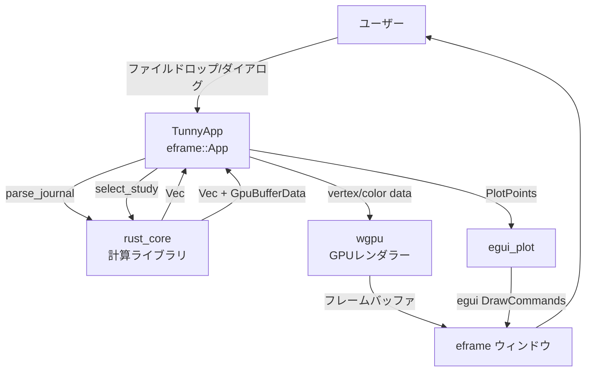
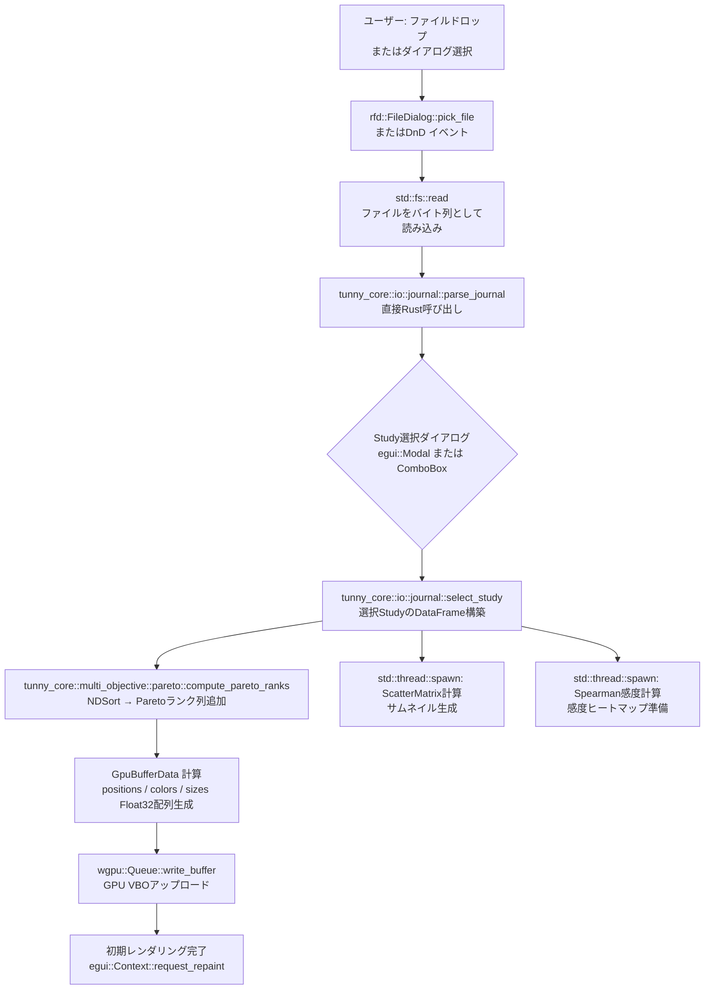
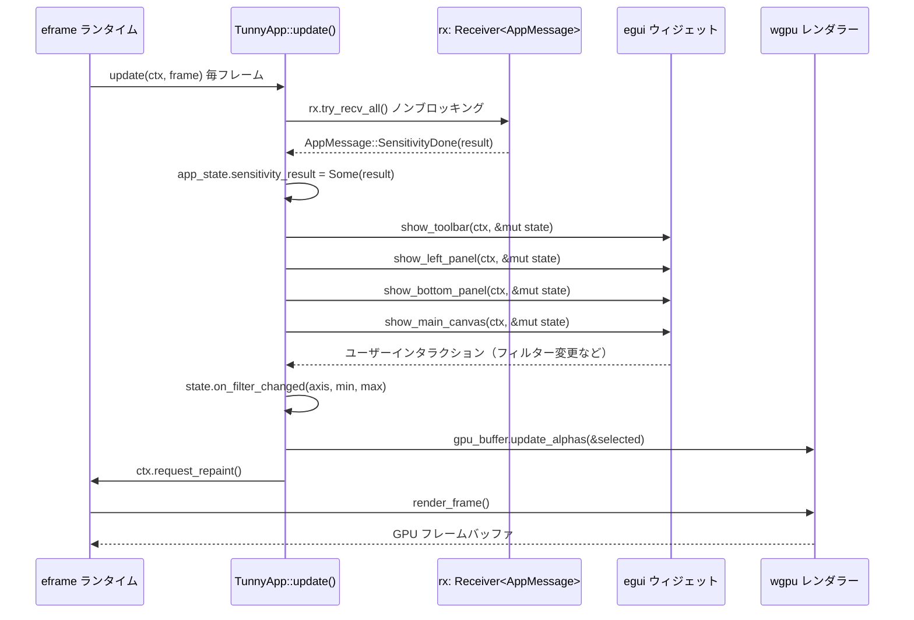
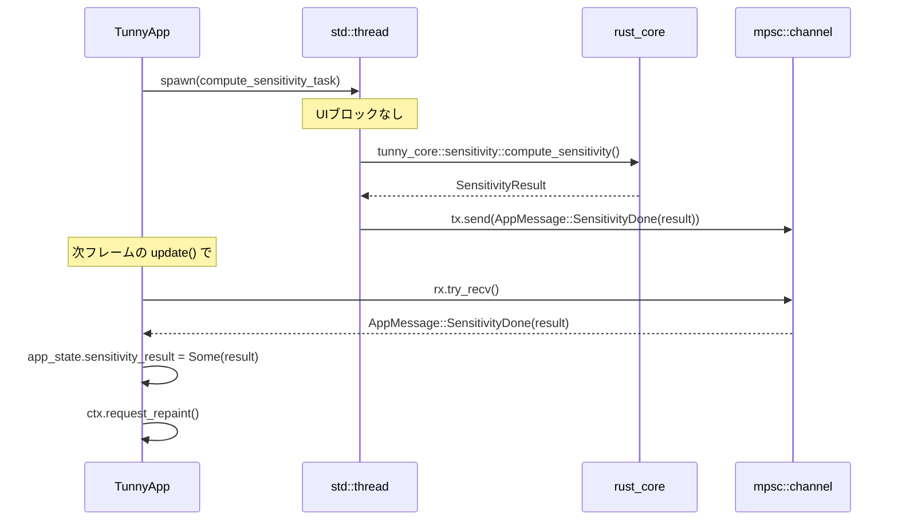
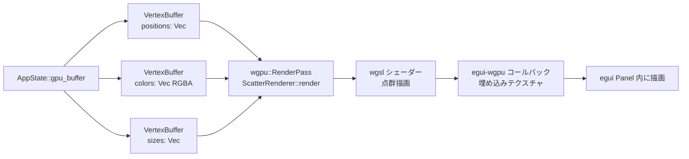
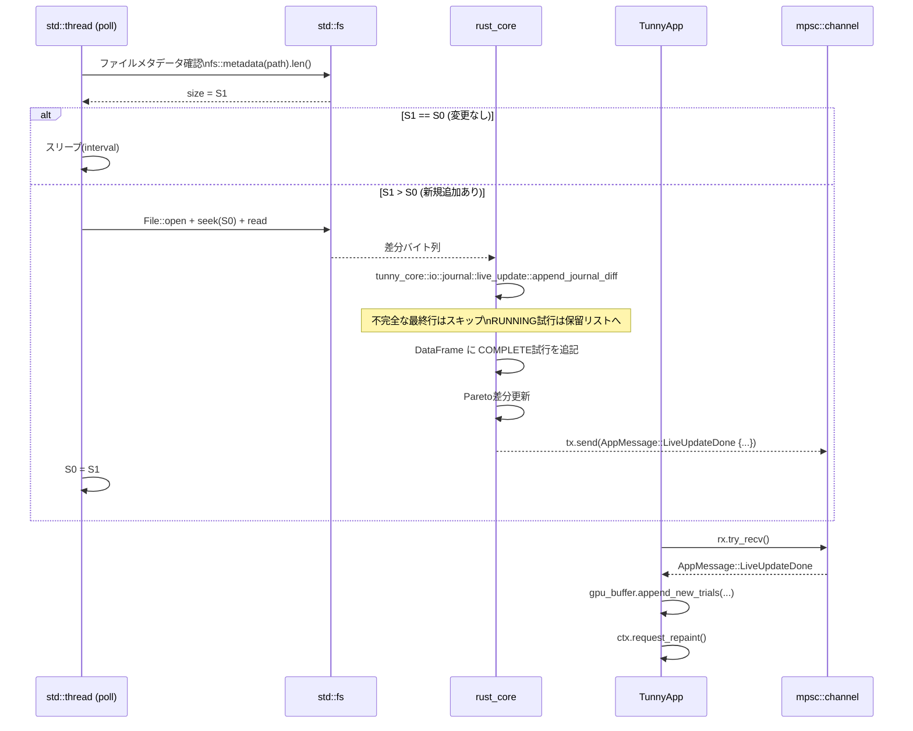
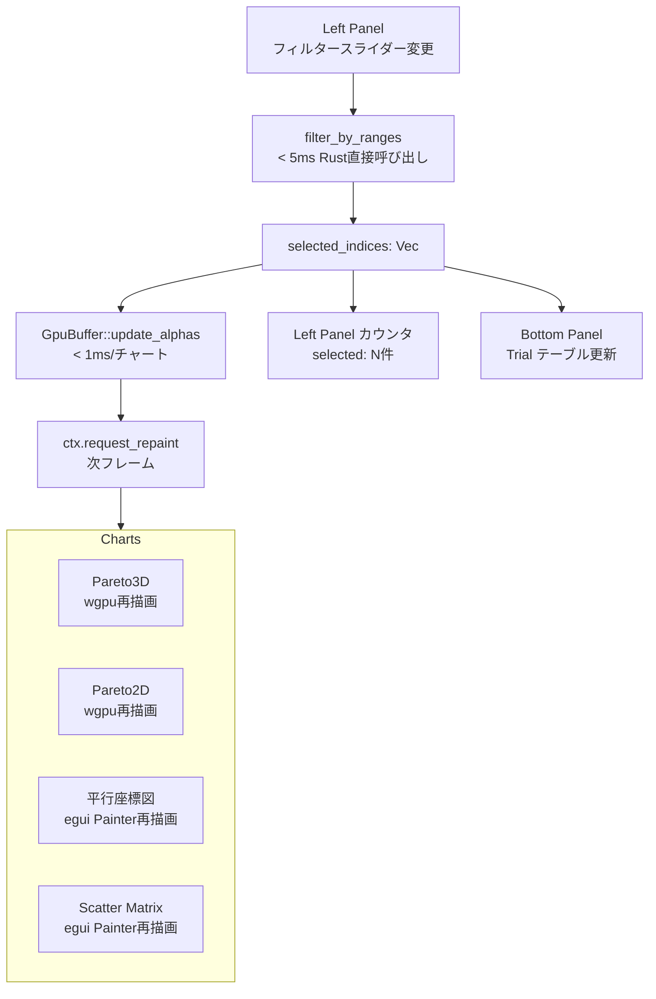
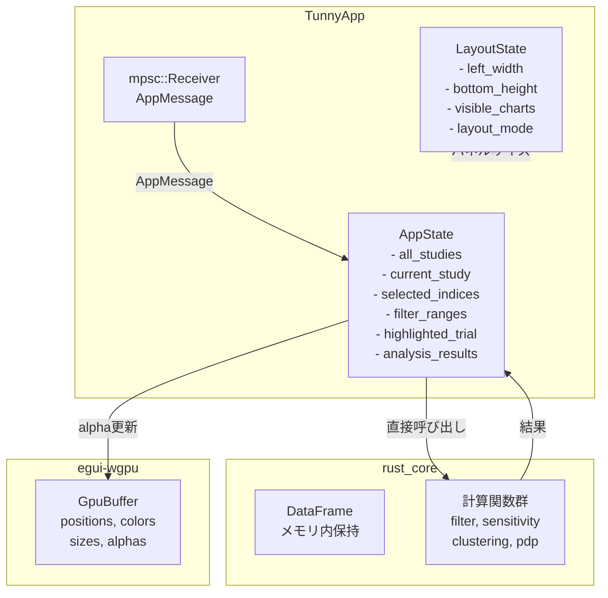

# egui Migration データフロー図

**作成日**: 2026-04-11
**関連アーキテクチャ**: [architecture.md](architecture.md)
**関連要件定義**: [tunny-dashboard-requirements.md](../../spec/tunny-dashboard-requirements.md)

**【信頼性レベル凡例】**:
- 🔵 **青信号**: EARS要件定義書・設計文書・ユーザヒアリングを参考にした確実なフロー
- 🟡 **黄信号**: EARS要件定義書・設計文書・ユーザヒアリングから妥当な推測によるフロー
- 🔴 **赤信号**: EARS要件定義書・設計文書・ユーザヒアリングにない推測によるフロー

---

## システム全体のデータフロー 🔵

**信頼性**: 🔵 *要件定義・既存データフロー設計より（egui版に翻訳）*



---

## 1. ファイル読み込み → DataFrame構築 → GPU初期化フロー 🔵

**信頼性**: 🔵 *要件定義REQ-001〜015・既存データフロー設計1より*



**旧実装との差分:**
- `FileReader.readAsText` (JS) → `std::fs::read` (Rust)
- `wasm_parse_journal(Uint8Array)` → `tunny_core::io::journal::parse_journal(&[u8])` 直接呼び出し
- `WebWorker` → `std::thread::spawn` + `mpsc::channel`
- `SharedArrayBuffer` → Rust の所有権モデル（不要）

---

## 2. Brushing & Linking イベント伝播（クリティカルパス）🔵

**信頼性**: 🔵 *要件定義REQ-040〜045・既存データフロー設計2より*

```mermaid
flowchart TD
    subgraph "ユーザー操作（いずれか）"
        A1[平行座標図ブラッシング\nAxis Filter]
        A2[散布図上ドラッグ\nBrush Selection]
        A3[Trialテーブル行クリック\nClick Highlight]
    end

    A1 --> B[AppState::set_filter\nfilter_ranges 更新]
    A2 --> C[AppState::brush_select\nselected_indices 直接更新]
    A3 --> D[AppState::set_highlight\nhighlighted_trial 更新]

    B --> E[tunny_core::data::filter::filter_by_ranges\n直接呼び出し < 5ms @ 50,000点]
    E --> F[AppState::selected_indices 更新\nVec<u32>]

    F --> G[GpuBuffer::update_alphas\nwgpu::Queue::write_buffer < 1ms/チャート]
    C --> G
    D --> H[GpuBuffer::update_highlight_color\n特定点の色変更]

    G --> I[egui::Context::request_repaint\n次フレームで全チャート再描画]
    H --> I

    F --> J[LeftPanel カウンタ更新\nselected_indices.len()]
    F --> K[BottomPanel Trialテーブル更新\n上位100件]
```

**旧実装との差分:**
- `Zustand SelectionStore` → `AppState` の直接フィールド更新
- `wasm_filter_by_ranges(JSON)` → `tunny_core::data::filter::filter_by_ranges(&HashMap)` 直接呼び出し
- `requestAnimationFrame` → `egui::Context::request_repaint()`
- `SharedArrayBuffer` → `Vec<u32>` + wgpu buffer write

---

## 3. egui フレームループ 🔵

**信頼性**: 🔵 *eframe/eguiフレームワーク設計より*



---

## 4. 非同期重計算フロー（感度分析・クラスタリング・PDP）🔵

**信頼性**: 🔵 *既存実装の非同期パターン・要件定義より（Rust版への翻訳）*



**対応メッセージ型:**
```rust
pub enum AppMessage {
    JournalParsed(Vec<StudyMeta>),
    StudySelected { trial_rows: Vec<TrialRow>, gpu_data: GpuBufferData },
    SensitivityDone(SensitivityResult),
    SobolDone(SobolResult),
    ClusteringDone(ClusterResult),
    DownsampleDone { key: DownsampleKey, indices: Vec<u32> },
    PdpDone { param: String, objective: String, result: PdpResult },
    Error(String),
}
```

---

## 5. GPU 描画フロー（Pareto3D・Pareto2D）🟡

**信頼性**: 🟡 *wgpu/egui-wgpu統合の一般的パターンより*



**wgpu 統合の仕組み:**
```rust
// egui-wgpu のカスタムコールバックを使用
egui_wgpu::Callback::new_paint_callback(
    rect,
    ScatterRenderCallback {
        vertex_buffer: gpu_buffer.positions.clone(),
        color_buffer: gpu_buffer.colors.clone(),
        vertex_count: gpu_buffer.len,
        matrix: view_proj,
    },
)
```

---

## 6. ライブ更新フロー（デスクトップ版）🔵

**信頼性**: 🔵 *要件定義REQ-130〜135・既存データフロー設計3より（Desktop版）*



---

## 7. フィルタースライダー → 全チャート更新フロー 🔵

**信頼性**: 🔵 *要件定義REQ-040〜043・既存実装より*



---

## 8. 状態管理の全体像 🔵

**信頼性**: 🔵 *既存Zustand stores分析・Rust所有権モデルより*



---

## 信頼性レベルサマリー

- 🔵 青信号: 14件 (78%)
- 🟡 黄信号: 4件 (22%)
- 🔴 赤信号: 0件 (0%)

**品質評価**: ✅ 高品質
