# egui UI リファクタリング データフロー図

**作成日**: 2026-05-08
**関連アーキテクチャ**: [architecture.md](architecture.md)
**関連要件定義**: [requirements.md](../../spec/egui-ui-refactor/requirements.md)

**【信頼性レベル凡例】**:
- 🔵 **青信号**: EARS要件定義書・設計文書・ユーザヒアリングを参考にした確実なフロー
- 🟡 **黄信号**: EARS要件定義書・設計文書・ユーザヒアリングから妥当な推測によるフロー
- 🔴 **赤信号**: EARS要件定義書・設計文書・ユーザヒアリングにない推測によるフロー

---

## REQ-001: chart_registry.rs 分割後のデータフロー 🔵

**信頼性**: 🔵 *REQ-001・既存コード chart_registry.rs 分析より*

### 変更前のフロー

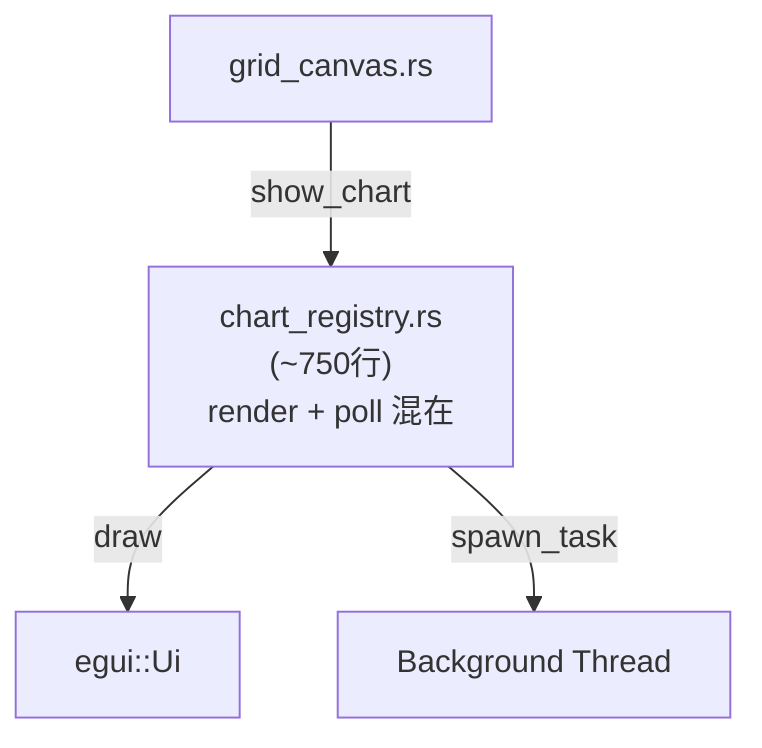

### 変更後のフロー

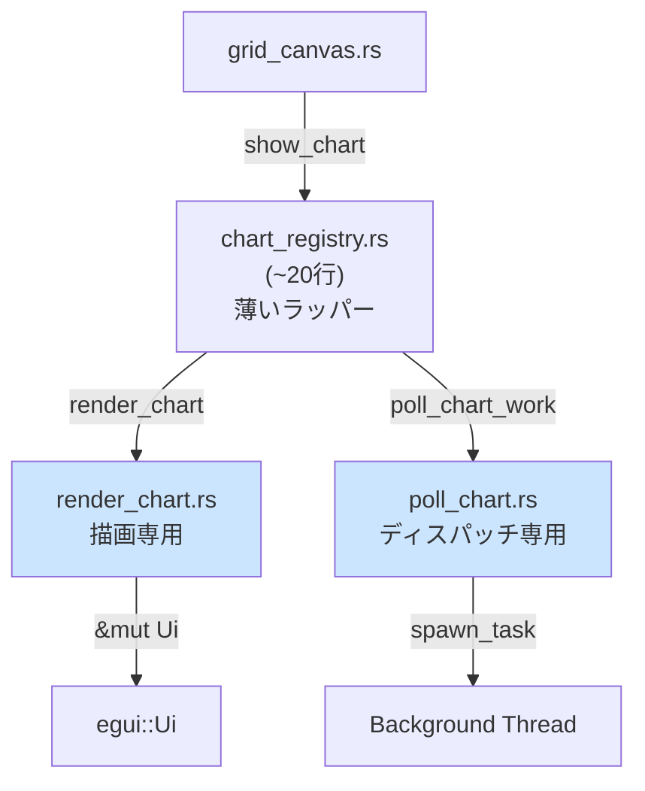

### 呼び出しシーケンス

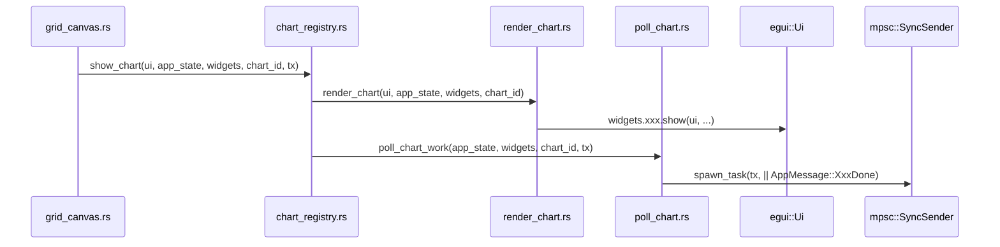

**関連要件**: REQ-001

---

## REQ-002: 計算ロジック移動後のデータフロー 🔵

**信頼性**: 🔵 *REQ-002・ユーザヒアリング Q3・left_panel.rs 分析より*

### normalize_weights のフロー

**変更前** (`left_panel.rs` 内で完結):
```
show_tradeoff_navigator → normalize_weights() [左パネル内定義]
```

**変更後** (rust_core 経由):
```mermaid
flowchart LR
    LP[left_panel.rs\nor tradeoff_navigator.rs] -->|呼び出し| NW["tunny_core::multi_objective\n::weights::normalize_weights"]
    NW --> |&mut [f64]| Result[正規化済みウェイト]
```

### build_best_trial_history のフロー

**変更前** (`left_panel.rs` の TrialRow を直接受け取る):
```
build_best_trial_history(&[state::TrialRow], ...) → Vec<(u32, f64)>
```

**変更後** (プリミティブ型 slice で型依存を排除):
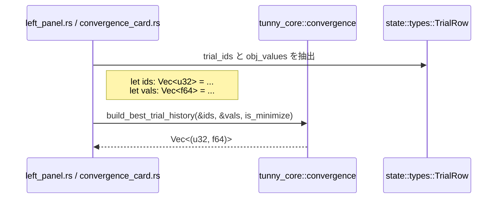

**型変換の詳細**:
```rust
// egui-app 側での抽出（convergence_card.rs 内）
let trial_ids: Vec<u32> = trials.iter().map(|t| t.trial_id).collect();
let obj_values: Vec<f64> = trials
    .iter()
    .filter_map(|t| t.objectives.get(objective_idx).copied())
    .collect();
let history = tunny_core::convergence::build_best_trial_history(
    &trial_ids, &obj_values, is_minimize
);
```

**関連要件**: REQ-002

---

## REQ-003: HTML レポート構築フロー 🔵

**信頼性**: 🔵 *REQ-003・app.rs:77-108 分析・html_report.rs 分析より*

### 変更前のフロー

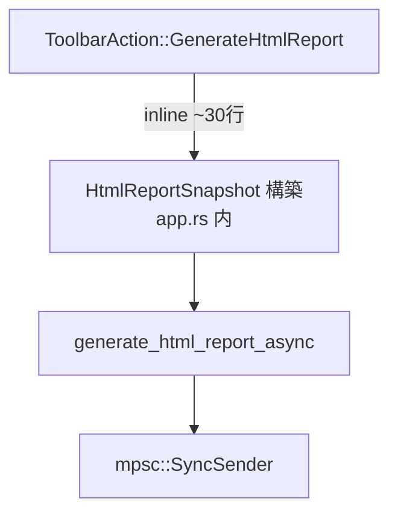

### 変更後のフロー

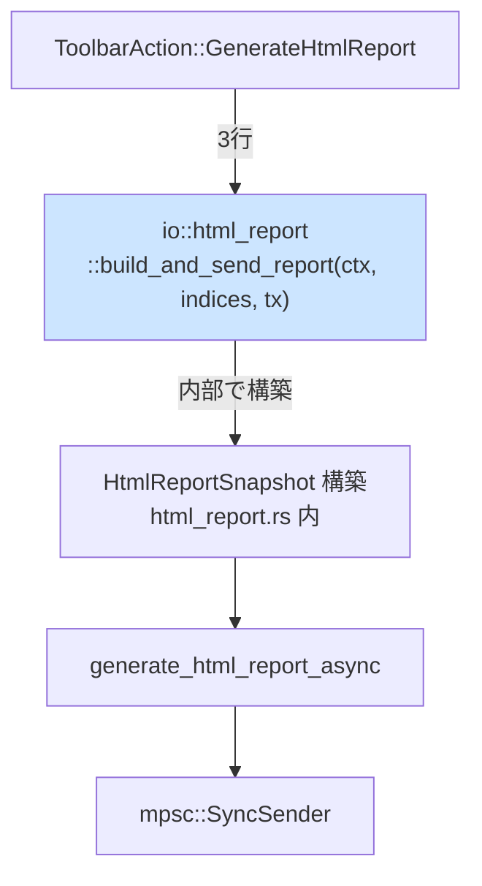

### build_and_send_report の内部フロー

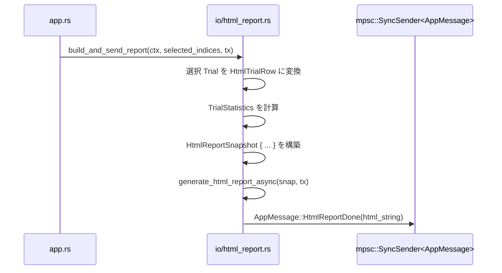

**関連要件**: REQ-003

---

## REQ-004: 左パネル分割後のデータフロー 🔵

**信頼性**: 🔵 *REQ-004・left_panel.rs:221-344 分析より*

### 変更前

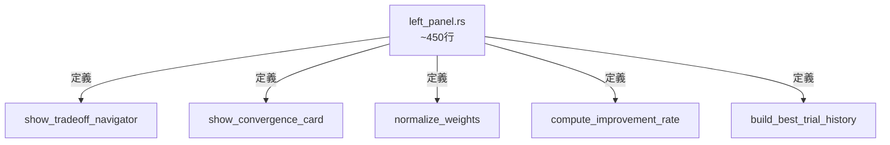

### 変更後

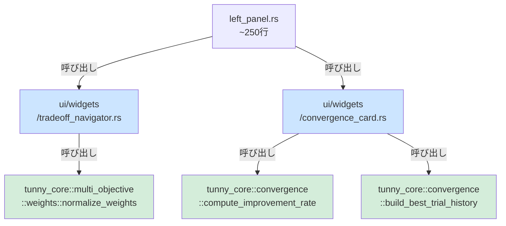

### Widget 呼び出しシーケンス（左パネル）

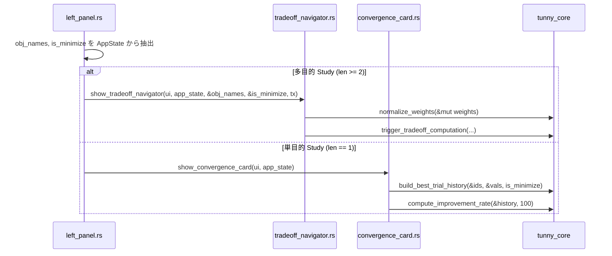

**関連要件**: REQ-004

---

## 全体の層境界データフロー（変更後） 🔵

**信頼性**: 🔵 *layer-contract.md・全 REQ 設計より*

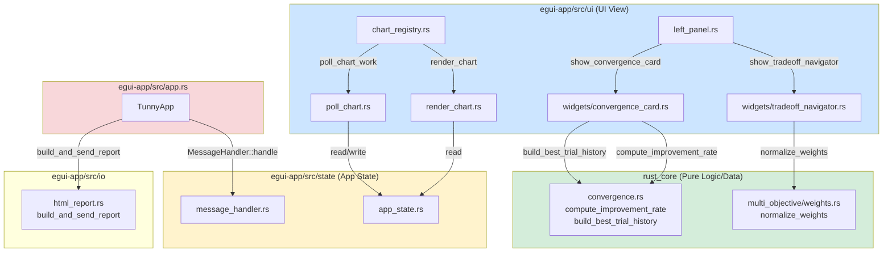

---

## 関連文書

- **アーキテクチャ**: [architecture.md](architecture.md)
- **型定義**: [interfaces.rs](interfaces.rs)
- **ヒアリング記録**: [design-interview.md](design-interview.md)

## 信頼性レベルサマリー

- 🔵 青信号: 6件 (100%)
- 🟡 黄信号: 0件 (0%)
- 🔴 赤信号: 0件 (0%)

**品質評価**: ✅ 高品質
