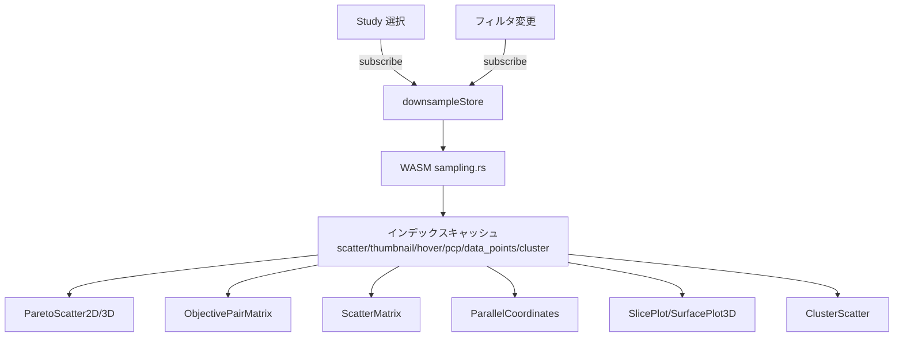

# 高速描画ダウンサンプリング アーキテクチャ設計

**作成日**: 2026-04-07
**関連要件定義**: [tunny-dashboard-requirements.md](../../spec/tunny-dashboard-requirements.md)
**ヒアリング記録**: [design-interview.md](design-interview.md)

**【信頼性レベル凡例】**:
- 🔵 **青信号**: EARS要件定義書・設計文書・ユーザヒアリングを参考にした確実な設計
- 🟡 **黄信号**: EARS要件定義書・設計文書・ユーザヒアリングから妥当な推測による設計
- 🔴 **赤信号**: EARS要件定義書・設計文書・ユーザヒアリングにない推測による設計

---

## システム概要 🔵

**信頼性**: 🔵 *ユーザヒアリング・REQ-063・REQ-093・wasm-api.md より*

1万点を超える試行点数が存在する場合、すべての描画チャートで視認性が低下しWebGL/Canvas の描画負荷が増大する問題を解決する。Rust/WASM の `sampling.rs` モジュールに汎用ダウンサンプリング関数を実装し、Pareto Rank1 点を必ず保持しながら各チャート用途に応じた点数上限でインデックスを削減する。Zustand の `downsampleStore` で計算済みインデックスをキャッシュし、全チャートが共有利用する。

## アーキテクチャパターン 🔵

**信頼性**: 🔵 *既存 tunny-dashboard アーキテクチャ / visualization-enablement 設計より*

- **パターン**: 4層クライアントサイドアーキテクチャ（既存と同一）
  - Layer 1: WASM Core（`rust_core/src/sampling.rs`）
  - Layer 2: JS Bridge（`wasmLoader.ts` にバインディング追加）
  - Layer 3: State Management（`downsampleStore.ts` 新設）
  - Layer 4: UI / Rendering（各チャートコンポーネントが Store から取得）
- **選択理由**: 既存アーキテクチャと完全に整合。`computeSensitivity`・`runPca` と同じ実装パターンを踏む

## コンポーネント構成

### Layer 1: WASM Core（`rust_core/src/sampling.rs`） 🔵

**信頼性**: 🔵 *wasm-api.md `downsample_for_thumbnail` 定義 / REQ-063 / ユーザヒアリングより*

既存の `pub struct Sampler;` プレースホルダーを実装に置き換える。

| 関数名 | 処理内容 | 用途 |
|---|---|---|
| `downsample_smart(max_points, include_pareto)` | Pareto保持 + ランダムサンプリング | ParetoScatter・ObjectivePairMatrix |
| `downsample_for_thumbnail(max_points)` | Pareto保持 + グリッド空間均等 | ScatterMatrix サムネイル（REQ-063準拠） |
| `downsample_stratified_by_rank(max_points, n_strata)` | Pareto ランク別層化サンプリング | ParallelCoordinates |
| `downsample_by_cluster(max_points)` | クラスタ別均等サンプリング | ClusterScatter（クラスタラベルがある場合） |

**`downsample_smart` アルゴリズム**:
```
1. 全 COMPLETE 試行インデックスを取得
2. N ≤ max_points なら全インデックスを返す（ノーオペ）
3. include_pareto = true なら Pareto Rank1 インデックスを先行確保
4. 残り予算 = max_points - pareto_count
5. 非 Pareto 点から残り予算分をランダムサンプリング（シード固定）
6. Pareto + 非 Pareto サンプルを結合して返す
```

**`downsample_for_thumbnail` アルゴリズム（REQ-063 準拠）**:
```
1. Pareto Rank1 点を先行確保（上限: max_points の 50%）
2. 残り予算 = max_points - pareto_count
3. 非 Pareto 点の目的変数空間を sqrt(残り予算) × sqrt(残り予算) グリッドに分割
4. 各セルから 1 点（セル内 random pick）を選択
5. 結合して返す
```

### Layer 2: JS Bridge（`frontend/src/wasm/wasmLoader.ts`） 🔵

**信頼性**: 🔵 *既存 WasmLoader パターン / wasm-api.md より*

既存 `WasmLoader` クラスに以下の 4 プロパティとバインド処理を追加する。

```typescript
downsampleSmart: (maxPoints: number, includePareto: boolean) => DownsampleResult;
downsampleForThumbnail: (maxPoints: number) => DownsampleResult;
downsampleStratifiedByRank: (maxPoints: number, nStrata: number) => DownsampleResult;
downsampleByCluster: (maxPoints: number) => DownsampleResult;
```

### Layer 3: `downsampleStore`（新設） 🔵

**信頼性**: 🔵 *ユーザヒアリング / analysisStore・clusterStore パターンより*

- ファイル: `frontend/src/stores/downsampleStore.ts`
- `useStudyStore.subscribe` で Study 変更を検知し、全インデックスを再計算
- 計算済みインデックスをチャート種別キーでキャッシュ
- フィルタ変更（`selectionStore` の `filterRanges` 変化）時に再計算

**Storeが管理するインデックスセット**:

| キー | 上限点数 | 戦略 | 用途チャート |
|---|---|---|---|
| `scatter` | 10,000 | `downsample_smart(pareto=true)` | ParetoScatter2D/3D・ObjectivePairMatrix |
| `thumbnail` | 500 | `downsample_for_thumbnail` | ScatterMatrix サムネイル（REQ-063） |
| `hover` | 3,000 | `downsample_for_thumbnail` | ScatterMatrix ホバー拡大 |
| `pcp` | 5,000 | `downsample_stratified_by_rank` | ParallelCoordinates |
| `data_points` | 5,000 | `downsample_smart(pareto=false)` | SlicePlot・SurfacePlot3D の実測点 |
| `cluster` | 10,000 | `downsample_by_cluster`（fallback: smart） | ClusterScatter・DimReductionScatter |

### Layer 4: UI / Rendering コンポーネント 🔵

**信頼性**: 🔵 *ユーザヒアリング / 既存チャートパターンより*

各チャートコンポーネントは `useDownsampleStore` フックで必要なインデックスを取得し、deck.gl データフィルタリングまたは Canvas 描画に使用する。

```typescript
// 例: ParetoScatter2D.tsx
const { getIndices } = useDownsampleStore();
const renderIndices = getIndices('scatter'); // Uint32Array
// deck.gl ScatterplotLayer の data に renderIndices 経由でフィルタ
```

---

## システム構成図



**信頼性**: 🔵 *既存アーキテクチャ・ユーザヒアリングより*

---

## ディレクトリ構造 🔵

**信頼性**: 🔵 *既存プロジェクト構造より*

```
rust_core/src/
└── sampling.rs               ← 実装（現在プレースホルダー）

frontend/src/
├── wasm/
│   ├── pkg/
│   │   └── tunny_core.d.ts   ← 4 関数シグネチャ + DownsampleResult 追加
│   └── wasmLoader.ts         ← 4 プロパティ + バインド追加
└── stores/
    └── downsampleStore.ts    ← 新規作成
```

**変更が必要なチャートコンポーネント**（`useDownsampleStore` 呼び出し追加）:
- `ParetoScatter2D.tsx`
- `ParetoScatter3D.tsx`
- `ObjectivePairMatrix.tsx`
- `ScatterMatrix.tsx`
- `ParallelCoordinates.tsx`
- `SlicePlot.tsx`
- `SurfacePlot3D.tsx`
- `ClusterScatter.tsx`
- `DimReductionScatter.tsx`

---

## 非機能要件の実現方法

### パフォーマンス 🔵

**信頼性**: 🔵 *NFR-001・NFR-002・ユーザヒアリングより*

- **WASM ダウンサンプリング計算**: 50,000 点で < 5ms（`filter_by_ranges` と同等目標）
- **Study 切り替え時**: downsampleStore が 6 種のインデックスを一括計算・キャッシュ
- **フィルタ変更時**: 絞り込み後のインデックス集合にのみ再ダウンサンプリングを適用
- **チャート描画**: deck.gl はインデックスフィルタ適用後も GPU バッファを使い回すため描画コストは変わらない

### スケーラビリティ 🟡

**信頼性**: 🟡 *NFR-001（5万点目標）から妥当な推測*

- 5万点のデータでも `downsample_smart` は O(N) で動作
- グリッドサンプリング（`downsample_for_thumbnail`）は O(N) + グリッド分割オーバーヘッド

### 整合性 🔵

**信頼性**: 🔵 *REQ-040〜044 / ユーザヒアリングより*

- Brushing 選択（`selectedIndices`）は**ダウンサンプリングに影響しない**。選択状態は既存の alpha 値更新（REQ-015）で管理する
- ダウンサンプリングはあくまで「何を描画するか」の選択。フィルタとは独立したレイヤー

---

## 技術的制約

### Pareto 計算依存 🔵

**信頼性**: 🔵 *REQ-072・wasm-api.md より*

- `downsample_smart(include_pareto=true)` は `compute_pareto_ranks()` 実行後に呼び出す必要がある
- Study 選択直後の Pareto 計算完了コールバックで downsampleStore を更新する順序を守ること

### フィルタとの分離 🔵

**信頼性**: 🔵 *REQ-015・REQ-044 より*

- GPU バッファの alpha 値更新（フィルタリング）とダウンサンプリングは独立レイヤー
- ダウンサンプリング済みインデックスのうち alpha=0 の点も存在しうる（表示はされないが無視してよい）

---

## 関連文書

- **データフロー**: [dataflow.md](dataflow.md)
- **型定義**: [interfaces.ts](interfaces.ts)
- **既存 WASM API**: [wasm-api.md](../tunny-dashboard/wasm-api.md)
- **既存アーキテクチャ**: [architecture.md](../tunny-dashboard/architecture.md)
- **要件定義**: [requirements.md](../../spec/tunny-dashboard-requirements.md)

---

## 信頼性レベルサマリー

- 🔵 青信号: 10件 (91%)
- 🟡 黄信号: 1件 (9%)
- 🔴 赤信号: 0件 (0%)

**品質評価**: 高品質
