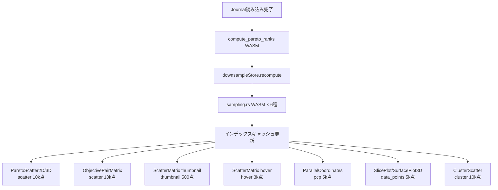
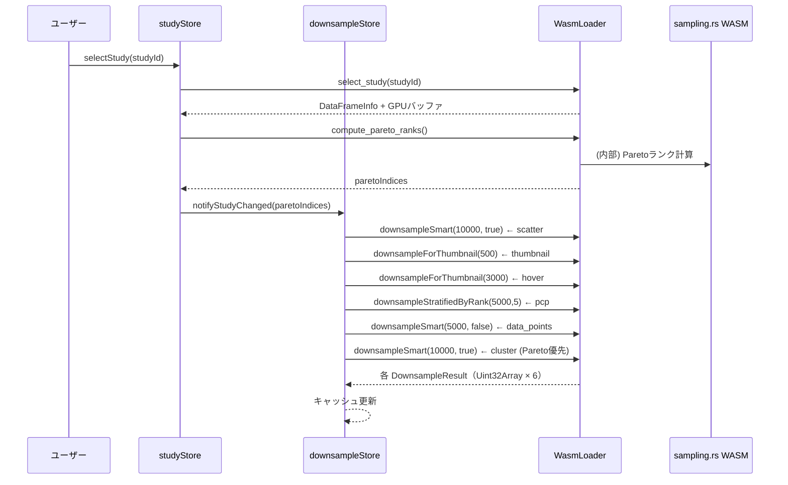
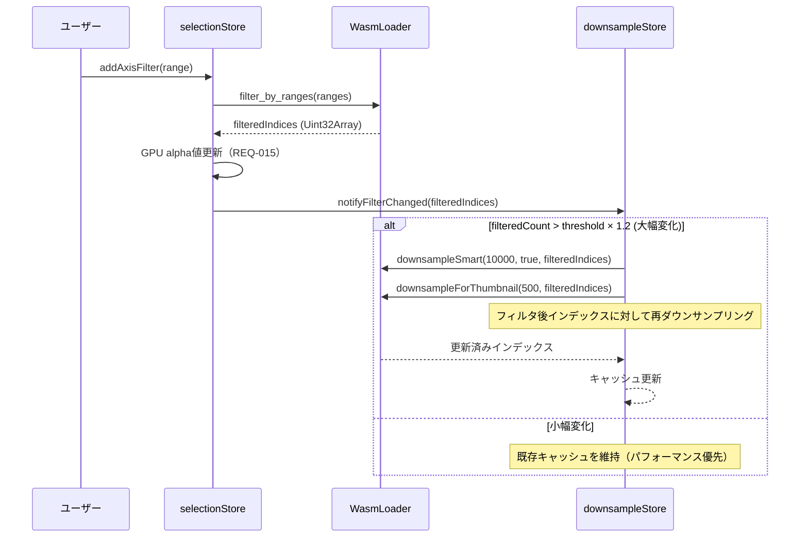
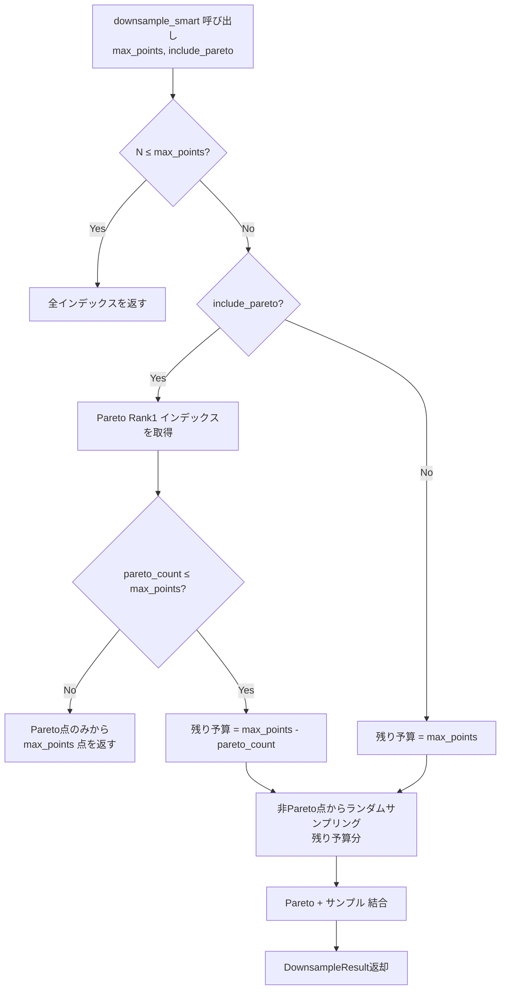
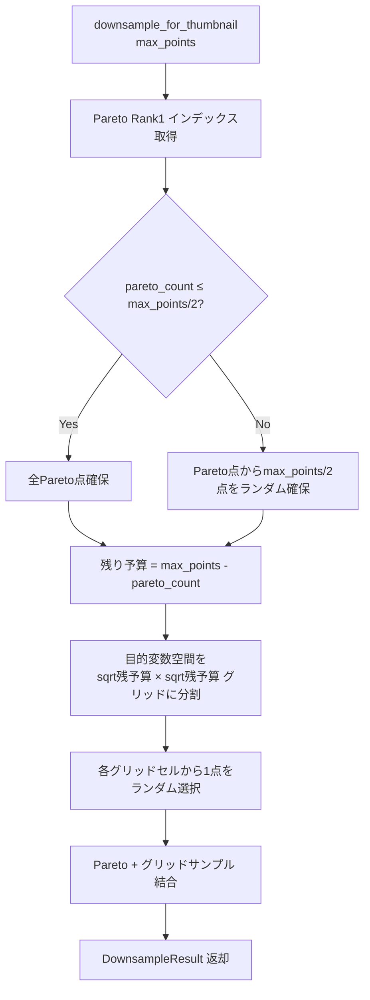
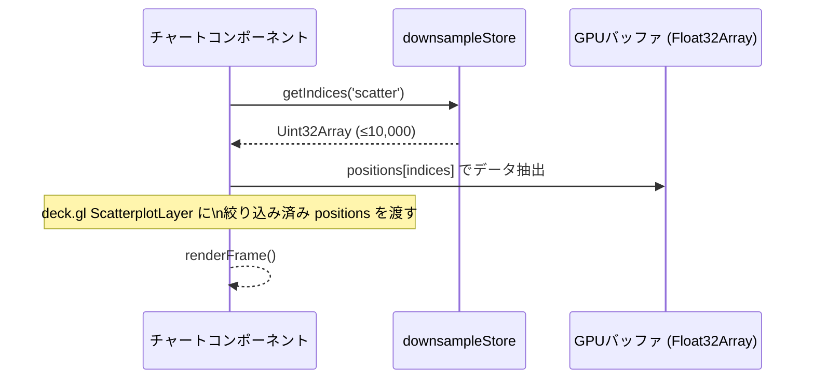
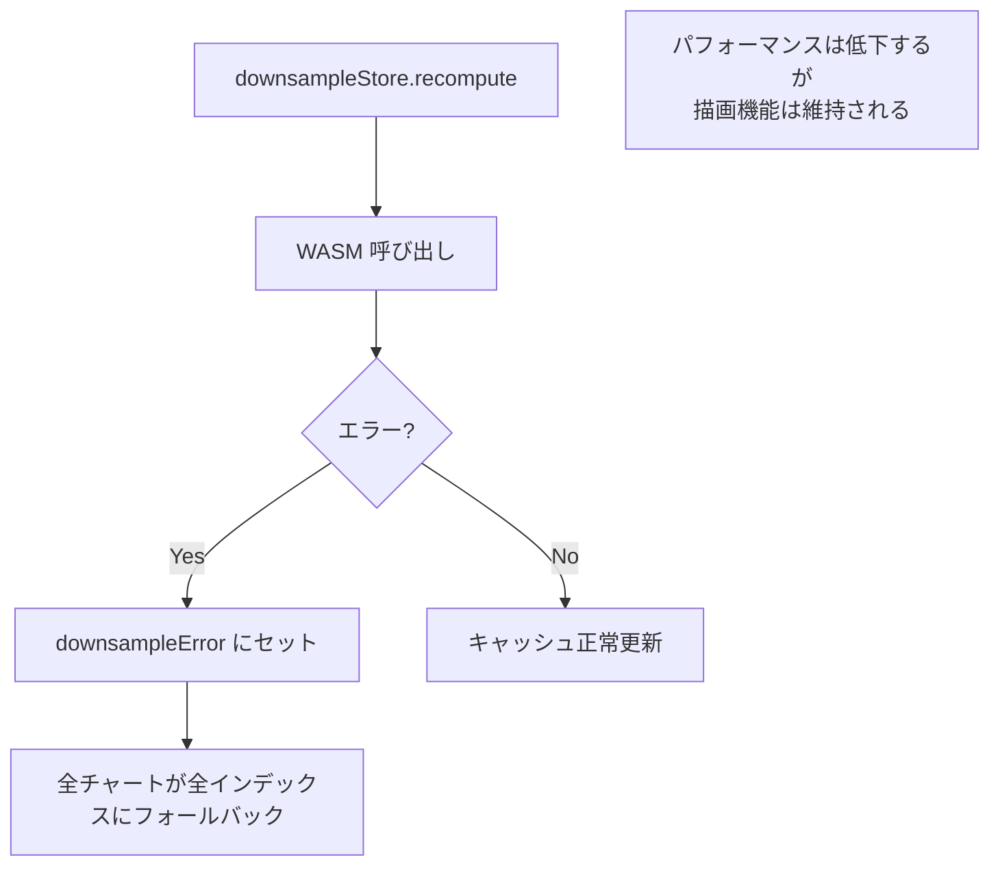

# 高速描画ダウンサンプリング データフロー図

**作成日**: 2026-04-07
**関連アーキテクチャ**: [architecture.md](architecture.md)
**関連要件定義**: [requirements.md](../../spec/tunny-dashboard-requirements.md)

**【信頼性レベル凡例】**:
- 🔵 **青信号**: EARS要件定義書・設計文書・ユーザヒアリングを参考にした確実なフロー
- 🟡 **黄信号**: EARS要件定義書・設計文書・ユーザヒアリングから妥当な推測によるフロー
- 🔴 **赤信号**: EARS要件定義書・設計文書・ユーザヒアリングにない推測によるフロー

---

## システム全体のデータフロー 🔵

**信頼性**: 🔵 *既存 tunny-dashboard アーキテクチャ / ユーザヒアリングより*



---

## 主要フロー

### フロー1: Study選択時のダウンサンプリング初期化 🔵

**信頼性**: 🔵 *既存 studyStore.selectStudy / compute_pareto_ranks フローより*

**関連要件**: REQ-060, REQ-063, REQ-072



**詳細ステップ**:
1. `selectStudy` → Pareto 計算 → `paretoIndices` を downsampleStore に通知
2. downsampleStore が 6 種のダウンサンプリングを WASM に並列発行（または順次）
3. 各 Uint32Array を種別キーで内部マップに保存
4. チャートコンポーネントが `getIndices(key)` で取得して描画

---

### フロー2: フィルタ変更時の再ダウンサンプリング 🔵

**信頼性**: 🔵 *REQ-042〜043 / selectionStore パターンより*

**関連要件**: REQ-040, REQ-042, REQ-043



**備考**: フィルタ変化量が閾値（±20%）以内の場合は再計算せず既存キャッシュを使用する。これはフィルタのスライダー操作中のリアルタイム応答性を維持するため。

---

### フロー3: ダウンサンプリング処理内部フロー（WASM） 🔵

**信頼性**: 🔵 *REQ-063 / wasm-api.md `downsample_for_thumbnail` 定義より*

**`downsample_smart` 処理フロー（Rust）**:



**`downsample_for_thumbnail` 処理フロー（Rust・REQ-063準拠）**:



---

### フロー4: チャートコンポーネントのインデックス取得 🔵

**信頼性**: 🔵 *既存チャートパターン / ユーザヒアリングより*



---

## データ変換パターン

### ダウンサンプリング前後のデータ型 🔵

**信頼性**: 🔵 *wasm-api.md / 既存 GPUバッファ設計より*

```
WASM DataFrame（全 N 点）
    ↓ downsample_smart / downsample_for_thumbnail
DownsampleResult.indices: Uint32Array（サイズ ≤ max_points）
    ↓ JS Bridge（wasmLoader）
downsampleStore.cache[key]: Uint32Array
    ↓ getIndices(key)
チャートコンポーネント
    ↓ GPU positions/colors バッファのインデックス参照
WebGL 描画（deck.gl / Canvas）
```

### フィルタとダウンサンプリングの合成 🔵

**信頼性**: 🔵 *REQ-015 / 既存 alpha 値更新パターンより*

```
全試行インデックス N
├── ダウンサンプリング → renderIndices (≤ max_points)
│       ↓ 描画する点の集合
└── フィルタリング → filteredAlpha (N 長 Uint8Array)
        ↓ alpha=0 で非表示

最終表示 = renderIndices ∩ filteredAlpha（alpha > 0）
（alpha 値の更新は既存 REQ-015 のまま。描画自体は renderIndices に絞る）
```

---

## エラーハンドリングフロー 🟡

**信頼性**: 🟡 *既存 analysisStore・clusterStore エラーパターンから妥当な推測*



---

## 性能目標サマリー 🔵

**信頼性**: 🔵 *NFR-001・NFR-002 / wasm-api.md 性能目標より*

| 処理 | 目標時間 | 備考 |
|---|---|---|
| `downsample_smart` (50,000 点) | < 5ms | filter_by_ranges と同等 |
| `downsample_for_thumbnail` (50,000 点) | < 5ms | グリッド計算込み |
| Study 選択時 6 種一括計算 | < 20ms | compute_pareto_ranks 後 |
| フィルタ変更時の再計算 | < 5ms | フィルタ後 N 点に対して |
| チャートコンポーネント取得 | < 1ms | キャッシュ参照のみ |

---

## 関連文書

- **アーキテクチャ**: [architecture.md](architecture.md)
- **型定義**: [interfaces.ts](interfaces.ts)
- **既存 WASM API**: [wasm-api.md](../tunny-dashboard/wasm-api.md)
- **ヒアリング記録**: [design-interview.md](design-interview.md)

---

## 信頼性レベルサマリー

- 🔵 青信号: 7件 (88%)
- 🟡 黄信号: 1件 (12%)
- 🔴 赤信号: 0件 (0%)

**品質評価**: 高品質
