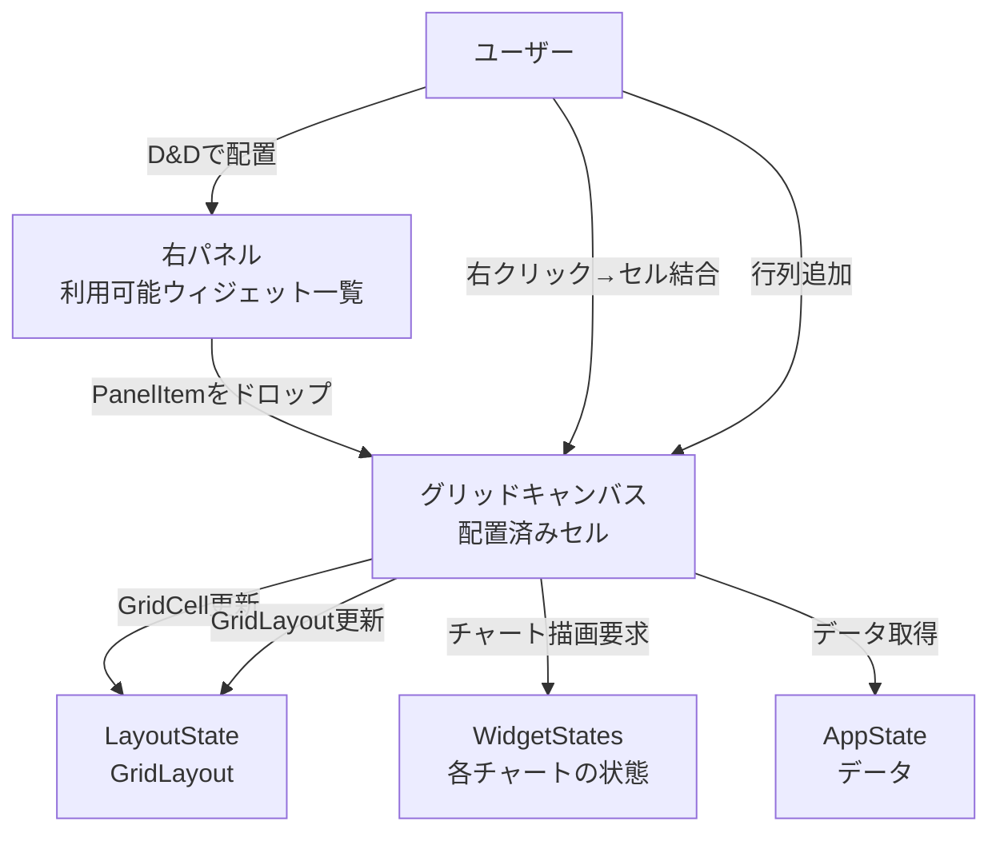
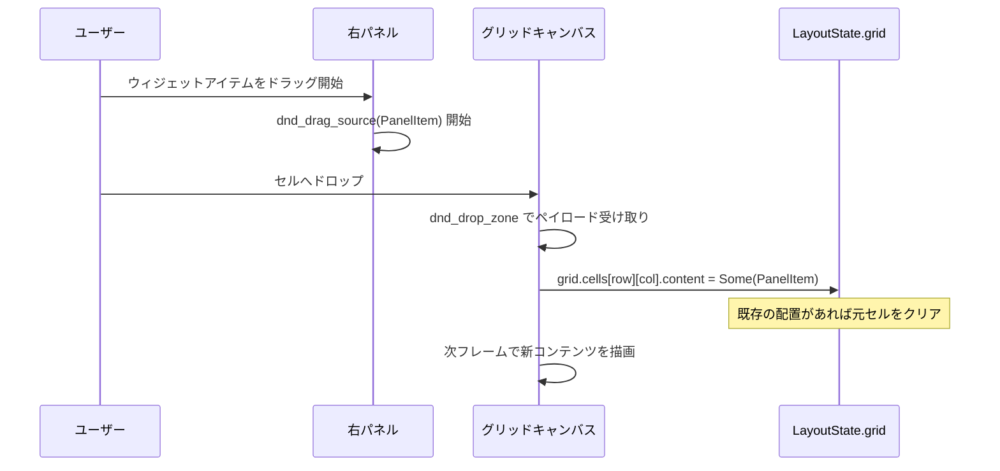
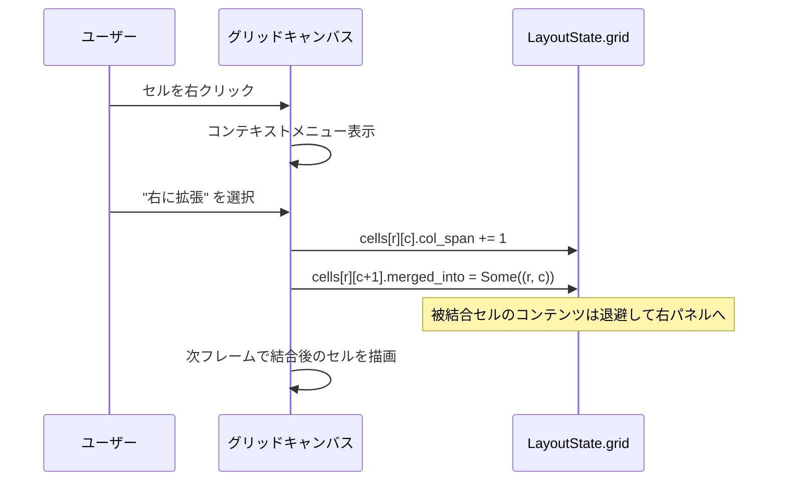
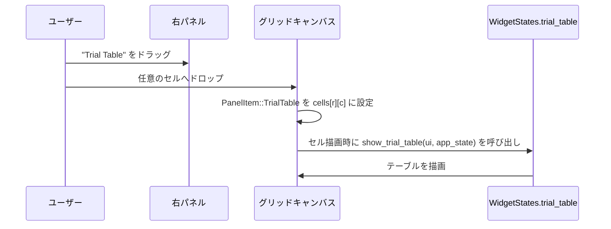
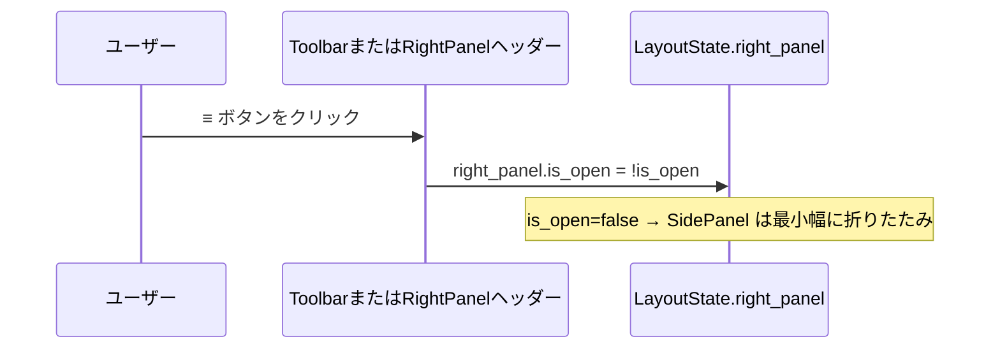
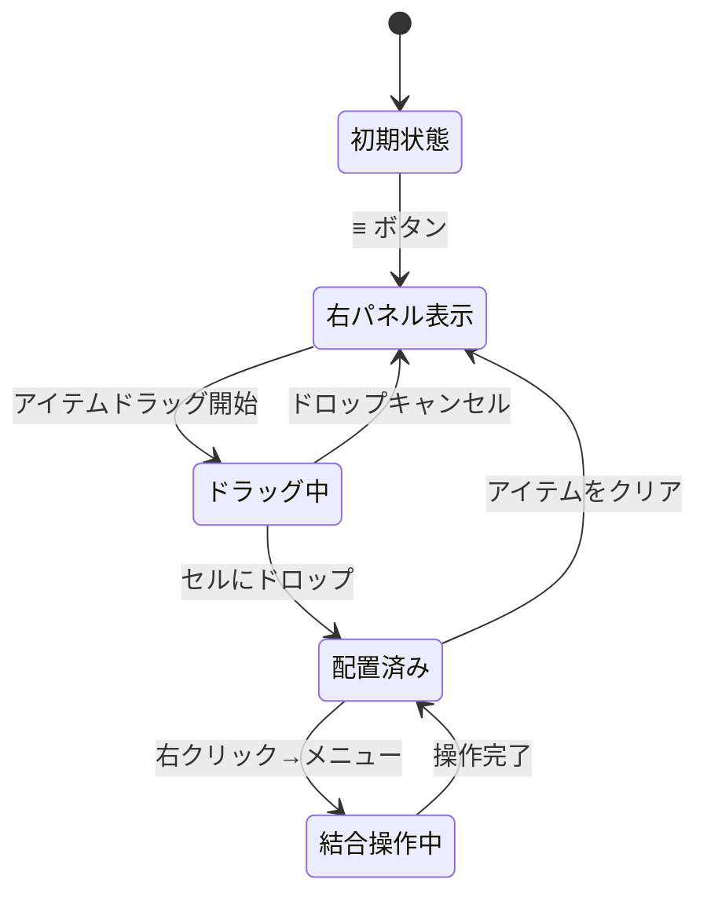

# Free Layout Dashboard データフロー図

**作成日**: 2026-04-12
**関連アーキテクチャ**: [architecture.md](architecture.md)

**【信頼性レベル凡例】**:
- 🔵 **青信号**: ユーザーヒアリング・既存実装を参考にした確実なフロー
- 🟡 **黄信号**: ヒアリングから妥当な推測によるフロー
- 🔴 **赤信号**: ヒアリングにない推測によるフロー

---

## システム全体のデータフロー 🔵

**信頼性**: 🔵 *ユーザーヒアリングより*



## 主要機能のデータフロー

### 機能1: ウィジェットをキャンバスに配置 (D&D) 🔵

**信頼性**: 🔵 *ユーザーヒアリング + egui DnD API より*



**詳細ステップ**:
1. 右パネルのアイテムを `ui.dnd_drag_source(id, PanelItem)` でラップ
2. グリッドの各セルを `ui.dnd_drop_zone(...)` でラップ
3. ドロップ時に `egui::DragAndDrop::payload::<PanelItem>(ctx)` でペイロード取得
4. `GridLayout::place(row, col, item)` でセルを更新（既存配置の移動も処理）
5. 右パネルは `GridLayout::placed_items()` を参照してグレーアウト表示を更新

### 機能2: セル結合（右クリックメニュー）🔵

**信頼性**: 🔵 *ユーザーヒアリングより（右クリックメニュー）*



**コンテキストメニュー項目一覧**:

| 項目 | 条件 | 処理 |
|---|---|---|
| 右に拡張 | col + col_span < cols | col_span += 1、右セルを merged_into に設定 |
| 下に拡張 | row + row_span < rows | row_span += 1、下セルを merged_into に設定 |
| 縮小（右） | col_span > 1 | col_span -= 1、被結合セルを解放 |
| 縮小（下） | row_span > 1 | row_span -= 1、被結合セルを解放 |
| クリア | content.is_some() | content = None、右パネルへ返す |

### 機能3: 行・列の追加 🔵

**信頼性**: 🔵 *ユーザーヒアリング（自由に行列追加）より*

```mermaid
sequenceDiagram
    participant U as ユーザー
    participant GC as グリッドキャンバス
    participant LS as LayoutState.grid

    U->>GC: "+ 行追加" ボタンをクリック
    GC->>LS: grid.rows += 1
    GC->>LS: grid.cells.push(vec![GridCell::default(); cols])
    GC->>GC: 次フレームで新しい空行を描画
```

**行削除の条件**:
- 削除対象行の全セルが空（`content.is_none()` かつ `merged_into.is_none()`）な場合のみ許可
- 最低 1 行は維持する

### 機能4: TrialTable の配置 🔵

**信頼性**: 🔵 *ユーザーヒアリング（BottomPanel を廃止しD&D対象化）より*



### 機能5: ハンバーガーメニューの開閉 🔵

**信頼性**: 🔵 *ユーザーヒアリングより*



## 状態管理フロー 🔵

**信頼性**: 🔵 *既存 egui-app アーキテクチャより*



## GridLayout のデータ構造フロー 🔵

**信頼性**: 🔵 *設計より*

```
初期状態:
  rows=2, cols=2
  cells = [
    [GridCell{None,1,1,None}, GridCell{None,1,1,None}],
    [GridCell{None,1,1,None}, GridCell{None,1,1,None}],
  ]

D&D で [0][0] に ParetoScatter2D を配置後:
  cells = [
    [GridCell{Some(Chart(ParetoScatter2D)),1,1,None}, GridCell{None,1,1,None}],
    [GridCell{None,1,1,None}, GridCell{None,1,1,None}],
  ]

[0][0] を右に拡張（col_span=2）後:
  cells = [
    [GridCell{Some(Chart(ParetoScatter2D)),2,1,None}, GridCell{None,1,1,Some((0,0))}],
    [GridCell{None,1,1,None}, GridCell{None,1,1,None}],
  ]
```

## エラーハンドリングフロー 🟡

**信頼性**: 🟡 *既存パターンから妥当な推測*

| エラーケース | 処理 |
|---|---|
| 結合後セルへのドロップ | ドロップを無効化（ドロップ不可ゾーンとして描画） |
| 削除対象行にコンテンツあり | 削除ボタンをグレーアウト、ツールチップで理由表示 |
| セッション復元時に不整合 | GridLayout をデフォルト値にリセット |

## 関連文書

- **アーキテクチャ**: [architecture.md](architecture.md)
- **型定義**: [interfaces.rs](interfaces.rs)
- **ヒアリング記録**: [design-interview.md](design-interview.md)

## 信頼性レベルサマリー

- 🔵 青信号: 10件 (77%)
- 🟡 黄信号: 2件 (15%)
- 🔴 赤信号: 1件 (8%)

**品質評価**: ✅ 高品質
