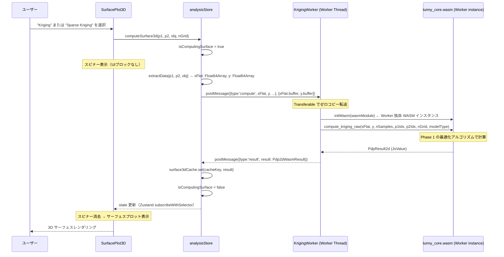
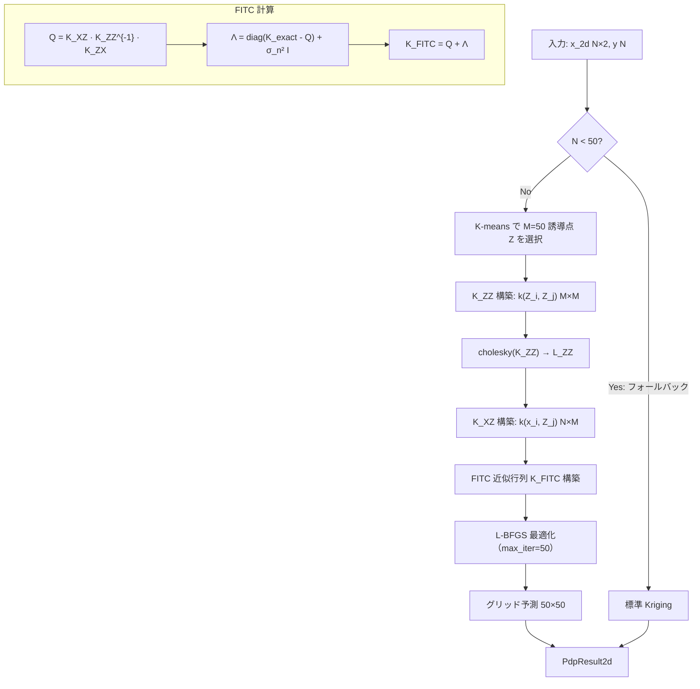
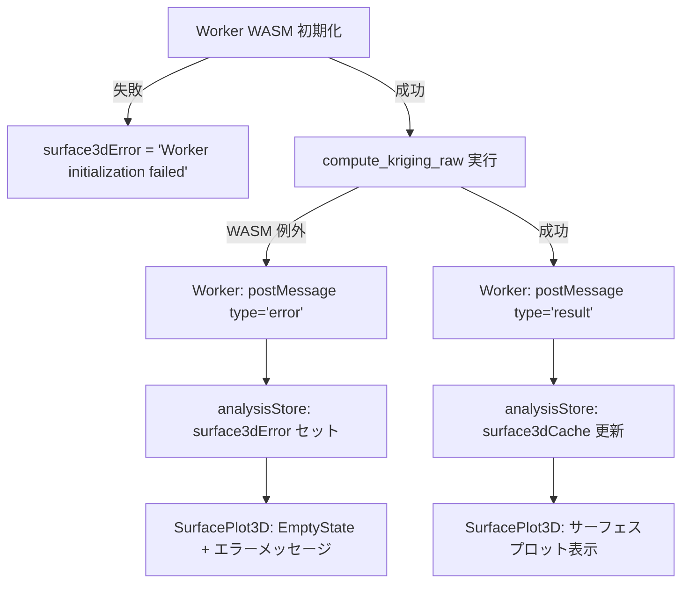
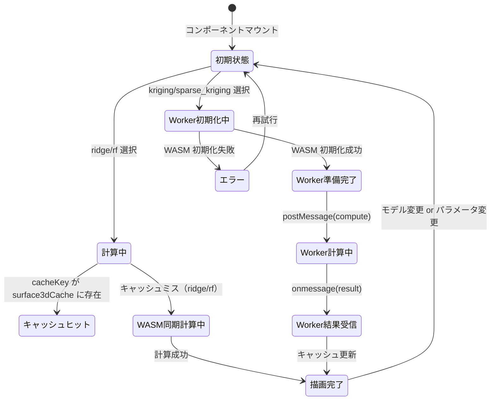

# Kriging 高速化 データフロー図

**作成日**: 2026-04-05
**関連アーキテクチャ**: [architecture.md](architecture.md)
**関連要件定義**: [requirements.md](../../spec/kriging-performance-optimization/requirements.md)

**【信頼性レベル凡例】**:
- 🔵 **青信号**: EARS要件定義書・設計文書・ユーザヒアリングを参考にした確実なフロー
- 🟡 **黄信号**: EARS要件定義書・設計文書・ユーザヒアリングから妥当な推測によるフロー
- 🔴 **赤信号**: EARS要件定義書・設計文書・ユーザヒアリングにない推測によるフロー

---

## Phase 1 後の全体フロー（アルゴリズム最適化のみ） 🔵

**信頼性**: 🔵 *既存フロー + REQ-002〜004 変更より*

```
SurfacePlot3D.tsx
  │ モデル選択 (ridge|rf|kriging|sparse_kriging)
  ↓
analysisStore.computeSurface3d()
  │ await new Promise(resolve => setTimeout(resolve, 0))  ← 既存の UI 解放
  │ wasm.computePdp2d(p1, p2, obj, nGrid, modelType)
  ↓
tunny_core.wasm (compute_pdp_2d → dispatch)
  │ "kriging" → compute_pdp_2d_kriging
  │              └─ train_gp(x_2d, y, subsample_n=500, seed)  ← REQ-004: 1000→500
  │                  └─ optimize_hyperparams(n_iter=50, 早期停止)  ← REQ-003
  │                      └─ log_ml_with_gradient()（統合計算）  ← REQ-002
  │              └─ グリッド予測 50×50
  │              └─ PdpResult2d
  ↓
analysisStore: surface3dCache.set(cacheKey, result)
  ↓
SurfacePlot3D.tsx → echarts-gl
```

---

## Phase 2 後のフロー（Web Worker オフロード） 🔵

**信頼性**: 🔵 *ユーザヒアリング（Blob URL 方式、compute_kriging_raw）より*



---

## LML/勾配統合計算フロー（REQ-002） 🔵

**信頼性**: 🔵 *kriging.rs ボトルネック分析より*

```
optimize_hyperparams (L-BFGS メインループ)
  │
  │ Before: 別々に呼び出し (3回の Cholesky)
  │   neg_lml(&params) → build_kernel_matrix → cholesky → compute_alpha
  │   log_ml_gradient(&params) → build_kernel_matrix → cholesky → K^{-1} (N回)
  │   neg_lml(&x_new) → 線探索での評価
  │
  │ After: 統合計算 (1回の Cholesky + K^{-1})
  │   log_ml_with_gradient(&params)
  │     └─ build_kernel_matrix (1回)
  │     └─ cholesky (1回)
  │     └─ compute_alpha (1回)
  │     └─ K^{-1} 計算 (N回の forward/backward sub)
  │     └─ 勾配計算 (4次元: log_ls0, log_ls1, log_sf, log_sn)
  │     └─ returns (lml_value, gradient_vec)
  │   neg_lml(&x_new) → 線探索: build_kernel_matrix → cholesky → compute_alpha のみ
  │                                                        (K^{-1} 不要)
  │
  ↓ 1 イテレーション: ~2×O(N³) → max_iter=50 で合計 ~100×O(N³)
  ↓ Before: ~400×O(N³) → After: ~100×O(N³) → 4× 高速化
```

---

## Sparse Kriging (FITC) 計算フロー（REQ-005） 🟡

**信頼性**: 🟡 *FITC 近似理論 + ユーザヒアリング（K-means誘導点）より*



**計算量**: O(N×M²) = O(5000 × 2500) = 12.5M ops (vs O(N³) = O(1000³) = 10⁹ ops)

---

## Worker 初期化フロー（REQ-001-06, viteSingleFile 対応） 🟡

**信頼性**: 🟡 *Blob URL + viteSingleFile 分析より妥当な推測*

```
analysisStore 初期化時 (最初の kriging 計算前)
  │
  ↓
createKrigingWorker(wasmBase64: string): Worker
  │
  ├─ 1. Worker ソースコードを文字列として保持
  │       (vite build 時にバンドルされた文字列リテラル)
  │
  ├─ 2. new Blob([workerSrc], {type: 'application/javascript'})
  │
  ├─ 3. URL.createObjectURL(blob) → 'blob:...' URL
  │
  └─ 4. new Worker(blobUrl) → Worker インスタンス
         │
         └─ Worker 内部:
              self.onmessage = async (e) => {
                if (e.data.type === 'init') {
                  const wasmBytes = Uint8Array from base64(e.data.wasmBase64)
                  await initWasm({ module: await WebAssembly.compile(wasmBytes) })
                }
                if (e.data.type === 'compute') {
                  const result = computeKrigingRaw(e.data.xFlat, ...)
                  self.postMessage({ type: 'result', result })
                }
              }
```

---

## データ転送詳細（REQ-001-02） 🔵

**信頼性**: 🔵 *REQ-001-02 + Transferable API より*

```typescript
// analysisStore: computeSurface3d 内でのデータ抽出
function extractData(
  param1: string,
  param2: string,
  objective: string,
  df: DataFrameInfo
): { xFlat: Float64Array; y: Float64Array; nSamples: number; p1Idx: number; p2Idx: number }

// 転送メッセージ
worker.postMessage(
  {
    type: 'compute',
    xFlat,     // param1 列 + param2 列を 2列分 flatten
    y,         // 目的関数値
    nSamples,
    param1Idx, // x[0..nSamples] = param1, x[nSamples..2*nSamples] = param2
    param2Idx, // → Worker 側で decode
    nGrid: 50,
    modelType: 'kriging' | 'sparse_kriging',
  },
  [xFlat.buffer, y.buffer]  // Transferable: ゼロコピー
)
```

**データサイズ概算（N=5000）:**
- xFlat (2列): 5000 × 2 × 8 bytes = 80KB
- y: 5000 × 8 bytes = 40KB
- 合計: ~120KB → Transferable で高速転送

---

## キャッシュ戦略（変更なし） 🔵

**信頼性**: 🔵 *既存 analysisStore.ts より*

```typescript
// 既存の cacheKey 方式を維持
const cacheKey = `${surrogateModelType}_${param1}_${param2}_${objective}_50`
// sparse_kriging の例: "sparse_kriging_x1_x2_f1_50"
```

Worker 経由の計算結果も同一の `surface3dCache` に格納。

---

## L-BFGS 早期停止フロー（REQ-003-02） 🟡

**信頼性**: 🟡 *一般的な早期停止基準より妥当な推測*

```rust
let mut lml_history: VecDeque<f64> = VecDeque::with_capacity(5);
let mut prev_lml = f64::NEG_INFINITY;

for iter in 0..n_iter {
    let (f_x, grad_neg) = log_ml_with_gradient(x, y, &params);

    // 早期停止チェック
    let lml = -f_x;
    lml_history.push_back(lml);
    if lml_history.len() > 5 { lml_history.pop_front(); }

    if lml_history.len() == 5 {
        let span = lml_history.back().unwrap() - lml_history.front().unwrap();
        if span.abs() < 1e-3 { break; }  // 5イテレーションで変化が小さければ停止
    }
    prev_lml = lml;

    // 勾配ノルム収束
    let grad_norm: f64 = grad_neg.iter().map(|g| g*g).sum::<f64>().sqrt();
    if grad_norm < 1e-5 { break; }

    // L-BFGS 更新 + 線探索
    ...
}
```

---

## エラーハンドリングフロー 🔵

**信頼性**: 🔵 *既存 analysisStore エラーハンドリング + REQ-001 より*



---

## 状態遷移（Phase 2 完了後） 🔵

**信頼性**: 🔵 *既存 stateDiagram + Worker 非同期追加より*



---

## 関連文書

- **アーキテクチャ**: [architecture.md](architecture.md)
- **型定義**: [interfaces.ts](interfaces.ts)
- **設計ヒアリング**: [design-interview.md](design-interview.md)
- **前フェーズ データフロー**: [../surface-plot-surrogate-models/dataflow.md](../surface-plot-surrogate-models/dataflow.md)

## 信頼性レベルサマリー

- 🔵 青信号: 8件 (62%)
- 🟡 黄信号: 5件 (38%)
- 🔴 赤信号: 0件 (0%)

**品質評価**: 高品質
