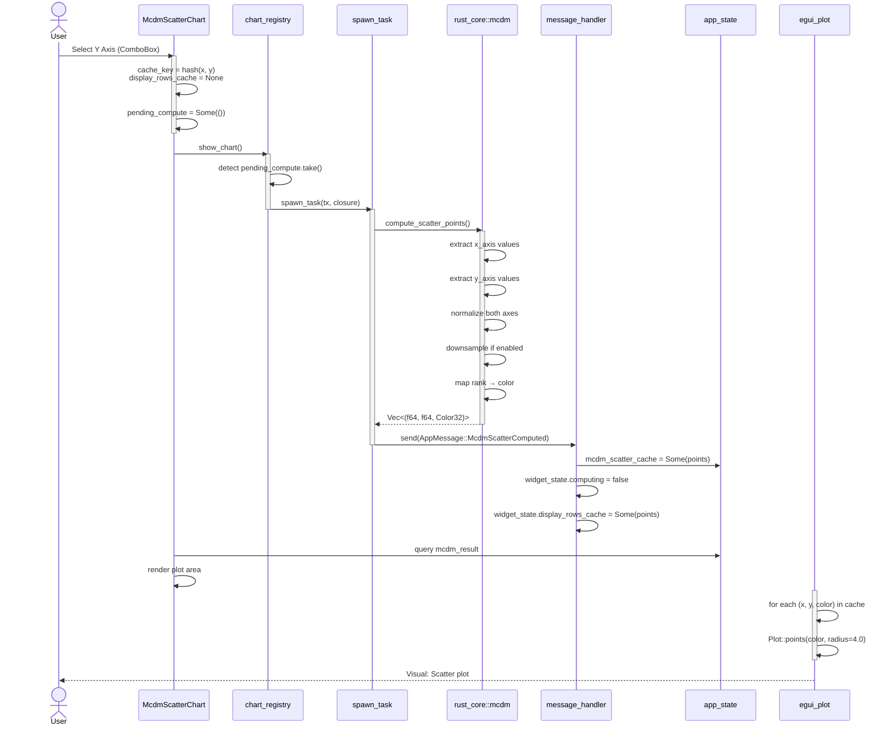

# MCDM Scatter Chart - データフロー設計

**ドキュメント作成日**: 2026-05-06  
**表記法**: シーケンス図 (Mermaid), テキスト説明

---

## 1. 全体シーケンス図

### 1.1 初期化 → 計算 → キャッシュ → 描画フロー



---

## 2. コンポーネント別データフロー

### 2.1 McdmScatterChart → State Update フロー

```
┌─────────────────────────────────────────────────────────────┐
│ McdmScatterChart Widget (UI Layer)                          │
├─────────────────────────────────────────────────────────────┤
│                                                              │
│ Input:  user interaction                                    │
│         - ComboBox axis selection                            │
│         - Top N threshold changed                           │
│         - Downsample checkbox toggled                       │
│                                                              │
│ Logic: 1. Detect cache invalidation condition               │
│        2. Set pending_compute = Some(())                    │
│        3. Set computing = true                              │
│        4. Pass to chart_registry.show_chart()               │
│                                                              │
│ Output: AppMessage dispatch (via spawn_task)                │
│         → message_handler receives McdmScatterComputed      │
│                                                              │
└─────────────────────────────────────────────────────────────┘
```

### 2.2 Compute Layer フロー

```
Input: (mcdm_result: McdmResult, x_axis: String, y_axis: String)

Step 1: Axis Extraction
  McdmResult::{Vikor|Topsis|...}
    ├─ Extract x_axis values from indexed result
    │  Example: x_axis="VIKOR_Q" → result.q_values[trial_idx]
    │
    └─ Extract y_axis values from indexed result
       Example: y_axis="Objective1" → trial_objectives[1]

Step 2: Normalization (Min-Max)
  For each axis:
    values_normalized = [(v - min) / (max - min) for v in values]
    
  Edge case handling:
    - All values equal → 0.5
    - NaN/Inf → filter out

Step 3: Downsampling (if enabled)
  Total points: trials.len()
  Downsample step = trials.len() / MAX_POINTS (300)
  
  Output: points_downsampled = trials[::step]

Step 4: Color Mapping
  For each point_idx in points:
    rank = ranked_indices.iter().position(|&idx| idx == point_idx)
    color = match rank {
        0..=4 => Red,
        5..=9 => Orange,
        10..=19 => Yellow,
        _ => Gray,
    }

Output: Vec<(x_normalized, y_normalized, color)>
        Example: [(0.2, 0.8, Red), (0.5, 0.3, Gray), ...]
```

### 2.3 Caching フロー

```
─── Cache State ───
display_rows_cache: Option<Vec<(f64, f64, Color32)>>
cache_key: (trial_count, hash(x_axis + y_axis))

─── Cache Invalidation Trigger ───
Event: User changes X axis from "Objective1" to "VIKOR_Q"
  1. New cache_key = (trial_count, hash("VIKOR_Q", y_axis))
  2. Old cache_key ≠ new cache_key
  3. display_rows_cache = None
  4. pending_compute = Some(())
  5. Next frame: Dispatch new computation

─── Cache Hit (Reuse) ───
Event: User changes Top5 → Top10 (color threshold only)
  1. cache_key unchanged (only axes matter)
  2. display_rows_cache.is_some() → reuse
  3. Recompute color mapping only (~1ms)
  4. NO compute dispatch needed

─── Cache Invalidation by Data ───
Event: New trial added to app_state.trials
  1. trial_count increased
  2. cache_key = (new_trial_count, ...) ≠ old cache_key
  3. Automatic cache invalidation
```

---

## 3. 軸選択メカニズム

### 3.1 ComboBox 軸オプション生成

```
get_axis_options(mcdm_result: &McdmResult) → Vec<(String, String)>

Step 1: Extract objective function names
  From trial metadata:
    Objective Names: ["Height", "Weight", "Cost"]
    ↓
    Options: [
      ("Objective0", "Height"),
      ("Objective1", "Weight"),
      ("Objective2", "Cost"),
    ]

Step 2: Add MCDM method-specific scores
  Match mcdm_result:
    Vikor(r) →
      [("VIKOR_Q", "VIKOR Q Score"),
       ("VIKOR_S", "VIKOR S Value"),
       ("VIKOR_R", "VIKOR R Value")]
    
    Topsis(t) →
      [("TOPSIS_Score", "TOPSIS Score")]
    
    PrometheeI(p) →
      [("Phi+", "Phi+ (Positive Flow)"),
       ("Phi-", "Phi- (Negative Flow)")]

Step 3: Combine all options
  Combined: [
    ("Objective0", "Height"),
    ("Objective1", "Weight"),
    ("Objective2", "Cost"),
    ("VIKOR_Q", "VIKOR Q Score"),
    ("VIKOR_S", "VIKOR S Value"),
    ("VIKOR_R", "VIKOR R Value"),
  ]
```

### 3.2 Axis Selection UI

```
┌─────────────────────────────────────────────────────────────┐
│ ComboBox: X Axis                                             │
│ Current: "Objective0 (Height)" ▼                            │
│                                                              │
│ [Dropdown]                                                  │
│ ├─ Height                     ← Objective0                  │
│ ├─ Weight                     ← Objective1                  │
│ ├─ Cost                       ← Objective2                  │
│ ├─ VIKOR Q Score              ← method-specific             │
│ ├─ VIKOR S Value                                            │
│ └─ VIKOR R Value                                            │
│                                                              │
│ [Selected: Height]                                          │
└─────────────────────────────────────────────────────────────┘

On Selection Change:
  old_x_axis = "Objective0"
  new_x_axis = "VIKOR_Q"
  
  cache_key changes:
    old: (trial_count, hash("Objective0", y_axis))
    new: (trial_count, hash("VIKOR_Q", y_axis))
  
  → display_rows_cache = None
  → pending_compute = Some(())
  → Next frame: Dispatch computation
```

---

## 4. 色分けロジック

### 4.1 ランキング → 色変換

```
Input: McdmResult with ranked_indices

Example:
  ranked_indices = [5, 2, 8, 1, 3]
  (Trial 5 が 1位, Trial 2 が 2位, ...)
  
  Reverse mapping:
    Trial 0 → not in top5
    Trial 1 → rank 3 → Yellow (10..=19)
    Trial 2 → rank 1 → Orange (5..=9)
    Trial 3 → rank 4 → Yellow (10..=19)
    Trial 4 → not in top5
    Trial 5 → rank 0 → Red (0..=4)
    Trial 8 → rank 2 → Orange (5..=9)

Output: Color mapping
  [Gray, Yellow, Orange, Yellow, Gray, Red, Gray, Gray, Orange, ...]
```

### 4.2 Top N Threshold Color Scheme

```
Color Threshold Enum:
  Top5   → Render points in rank 0-4
  Top10  → Render points in rank 0-9
  Top20  → Render points in rank 0-19

Color Values:
  Rank 0-4:   RED (255, 0, 0)        // Top 5%
  Rank 5-9:   ORANGE (255, 165, 0)   // Top 10%
  Rank 10-19: YELLOW (255, 255, 0)   // Top 20%
  Rank 20+:   GRAY (200, 200, 200)   // Others
```

---

## 5. 正規化フロー

### 5.1 Min-Max正規化プロセス

```
Input: Axis values (mixed units)

Example (VIKOR with 3 objectives):
  Objective1 values: [100, 150, 200]  (Unit: m)
  Objective2 values: [0.5, 0.7, 0.9]  (Unit: kg)
  VIKOR_Q score:     [0.1, 0.3, 0.5]  (Unit: none, 0-1)

Normalization (each axis):
  1. Find min, max
  2. Compute range = max - min
  3. normalized = (value - min) / range

Example:
  Objective1: min=100, max=200, range=100
    100 → (100-100)/100 = 0.0
    150 → (150-100)/100 = 0.5
    200 → (200-100)/100 = 1.0

  Objective2: min=0.5, max=0.9, range=0.4
    0.5 → (0.5-0.5)/0.4 = 0.0
    0.7 → (0.7-0.5)/0.4 = 0.5
    0.9 → (0.9-0.5)/0.4 = 1.0

  VIKOR_Q: min=0.1, max=0.5, range=0.4
    0.1 → (0.1-0.1)/0.4 = 0.0
    0.3 → (0.3-0.1)/0.4 = 0.5
    0.5 → (0.5-0.1)/0.4 = 1.0

Output: All values in [0.0, 1.0] range
  Points (normalized):
    [(0.0, 0.0), (0.5, 0.5), (1.0, 1.0)]
```

### 5.2 Edge Cases

```
Case 1: All values equal
  Input:  [5.0, 5.0, 5.0]
  min=5, max=5, range=0
  Output: [0.5, 0.5, 0.5]  (mid-point)

Case 2: Single value
  Input:  [7.0]
  min=7, max=7, range=0
  Output: [0.5]

Case 3: NaN/Inf in values
  Input:  [1.0, NaN, 3.0]
  Action: Filter out NaN/Inf before normalization
  Output: [0.0, _, 1.0]  (_ = skipped)
```

---

## 6. ダウンサンプリングフロー

### 6.1 Adaptive Downsampling

```
Input: Total trial count (N)
Target: MAX_POINTS = 300

Decision:
  if N <= 300:
    return full dataset (no downsample)
  else:
    step = N / 300
    return trials[::step]

Examples:
  N=100   → all 100 points used
  N=300   → all 300 points used
  N=500   → step=1, downsample to ~167 points (500/3)
  N=1000  → step=3, downsample to ~333 points (1000/3)
  N=10000 → step=33, downsample to ~303 points (10000/33)

Status Message:
  "Rendering 150 points (downsampled from 500 trials)"
```

---

## 7. エラー処理フロー

### 7.1 軸検証エラー

```
Scenario: User selects Y axis = "NonExistent_Metric"

Flow:
  1. get_axis_values("NonExistent_Metric", mcdm_result)
  2. Error: Axis not found in result
  3. Handler: Skip computation, set error_message
  4. UI: Display warning toast "Axis not available"
  5. Fallback: Revert to previous axis

Code Pattern:
  match get_axis_values(axis_name, &result) {
      Ok(values) => { /* continue */ },
      Err(e) => {
          eprintln!("Axis error: {}", e);
          self.error_message = Some(e.to_string());
      }
  }
```

### 7.2 計算失敗エラー

```
Scenario: spawn_task computation panics

Flow:
  1. Background thread catches panic
  2. Send AppMessage::ComputeError(message)
  3. message_handler logs error
  4. UI: Display error notification
  5. State: computing = false, cache remains unchanged

Code Pattern:
  match std::panic::catch_unwind(|| compute_scatter()) {
      Ok(result) => {
          tx.send(AppMessage::McdmScatterComputed(result))
      },
      Err(_) => {
          tx.send(AppMessage::ComputeError(
              "Scatter plot computation failed".into()
          ))
      }
  }
```

---

## 8. パフォーマンス指標

### 8.1 Latency Timeline

```
Timeline: Axis change from "Objective1" to "VIKOR_Q"

T+0ms     : User selects new axis in ComboBox
T+1ms     : UI updates state, sets pending_compute
T+2ms     : chart_registry detects, spawns background task
T+3ms     : Background thread starts execution
T+5ms     : Values extracted and normalized (for 1000 trials)
T+10ms    : Color mapping applied, caching complete
T+12ms    : AppMessage::McdmScatterComputed sent to main thread
T+13ms    : message_handler receives, updates widget state
T+14ms    : UI next frame renders new plot

Total time: ~14ms (user perceives as instant)
```

### 8.2 Memory Profile

```
Scatter Point Cache:
  Per point: (f64, f64, Color32) = 16 + 8 + 8 = 32 bytes
  
  1000 trials, no downsample:
    1000 × 32 = 32 KB (negligible)
  
  10000 trials, downsampled to 300:
    300 × 32 = 9.6 KB (negligible)
```

---

## 9. 参考：既存パターン (ParetoScatter2D)

```rust
// Location: egui-app/src/ui/widgets/pareto_2d.rs

pub struct ParetoScatter2D {
    pub x_axis: String,
    pub y_axis: String,
    pub use_downsample: bool,
    pub display_rows_cache: Option<Vec<TrialRow>>,
    pub cache_key: (usize, u64),
}

impl ParetoScatter2D {
    pub fn show(&mut self, ui: &mut egui::Ui, app_state: &mut AppState) {
        // ComboBox axis selection
        // Plot rendering with egui_plot
        // Cache invalidation on axis change
    }
}
```

**Differences for McdmScatterChart:**
- Input: `McdmResult` instead of Pareto trials
- Color mapping: Rank-based instead of Pareto/Non-Pareto
- Axes: MCDM scores instead of objectives only
