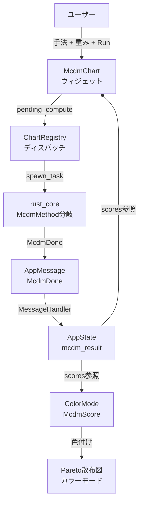

# MCDM UI アーキテクチャ設計

**作成日**: 2026-04-23
**更新日**: 2026-04-23 (McdmChart統一化)
**ブランチ**: featura/egui
**関連要件定義**: [tunny-dashboard-requirements.md](../../spec/tunny-dashboard-requirements.md)
**理論文書**: [theory/topsis.md](../../../theory/topsis.md)
**ヒアリング記録**: [design-interview.md](design-interview.md)

**【信頼性レベル凡例】**:
- 🔵 **青信号**: EARS要件定義書・設計文書・ユーザヒアリングを参考にした確実な設計
- 🟡 **黄信号**: EARS要件定義書・設計文書・ユーザヒアリングから妥当な推測による設計
- 🔴 **赤信号**: EARS要件定義書・設計文書・ユーザヒアリングにない推測による設計

---

## システム概要 🔵

**信頼性**: 🔵 *既存コード分析・theory/topsis.md・ユーザヒアリングより*

Optuna多目的最適化結果に対してMCDM（Multi-Criteria Decision Making）による多基準意思決定分析をegui UIから利用可能にする。

ImportanceChartが `ImportanceMetric` enum（7種）を1ウィジェットで切替えるパターンを踏襲し、`McdmChart` ウィジェットで `McdmMethod` enum により手法を切替える統一UIとする。

第1フェーズではTOPSISを実装。将来的にVIKOR・PROMETHEE IIを `McdmMethod` バリアント追加のみで対応可能にする。

`rust_core/src/mcdm/topsis.rs` にTOPSIS計算実装済み（625行、テスト14件）。
本設計はegui-appへのUI配線・可視化・インタラクションに焦点を当てる。

### 既存インフラ 🔵

**信頼性**: 🔵 *コード分析より*

| コンポーネント | 状態 | 場所 |
|---|---|---|
| TOPSIS計算 | 完全実装済み | `rust_core/src/mcdm/topsis.rs` |
| TopsisResult型 | rust_core側: 5フィールド | `rust_core/src/mcdm/topsis.rs` |
| TopsisResult型 | egui-app側: 2フィールド（不一致） | `egui-app/src/state/results.rs` |
| AppState.topsis_result | フィールド存在 | `egui-app/src/state/app_state.rs:25` |
| AppMessage::TopsisDone | メッセージ存在 | `egui-app/src/state/messages.rs:75` |
| MessageHandler | ハンドラ存在 | `egui-app/src/state/message_handler.rs` |
| ChartId::McdmChart | **未追加** | `egui-app/src/state/layout_state.rs` |
| WidgetStates.mcdm | **未追加** | `egui-app/src/ui/widget_states.rs` |
| MCDMウィジェット | **未作成** | `egui-app/src/ui/widgets/mcdm_chart.rs` |
| 右パネルMCDMグループ | **未追加** | `egui-app/src/ui/right_panel.rs` |
| ColorMode::McdmScore | **未追加** | `egui-app/src/state/app_state.rs` |

## アーキテクチャパターン 🔵

**信頼性**: 🔵 *egui-migration設計・既存ウィジェットパターン（ImportanceChart）より*

- **パターン**: ImportanceChartパターンを踏襲。`McdmMethod` enumで手法切替え。
- **選択理由**: MCDM手法は入出力が共通（重み + 目的関数 → スコア + ランキング）のため、単一ウィジェットで統一可能。将来のVIKOR/PROMETHEE II追加をバリアント追加のみで対応。

### ImportanceChart との構造対応 🔵

**信頼性**: 🔵 *コード分析・ユーザヒアリングより*

```
ImportanceChart          McdmChart（本設計）
───────────────────────  ─────────────────────────
ImportanceMetric enum    McdmMethod enum { Topsis, Vikor, Promethee2 }
  Spearman, Ridge, ...     ※将来拡張。Phase 1は Topsis のみ
pending_compute          pending_compute (同じパターン)
computing                computing (同じ)
metric selector UI       method selector UI (ComboBox)
objective selector       weight sliders (0.0-1.0 × 目的関数数)
Run button               Run button (同じ)
bar chart (egui_plot)    bar chart + table (egui_plot + TableBuilder)
```

## コンポーネント構成

### 変更対象ファイル一覧 🔵

**信頼性**: 🔵 *コード分析・既存パターンより*

#### 新規作成

| ファイル | 説明 |
|---|---|
| `egui-app/src/ui/widgets/mcdm_chart.rs` | MCDMウィジェット本体（手法セレクタ + 重みスライダー + バーチャート + テーブル） |

#### 既存ファイル変更

| ファイル | 変更内容 |
|---|---|
| `egui-app/src/state/results.rs` | TopsisResultをrust_core定義に統一（5フィールド化） |
| `egui-app/src/state/layout_state.rs` | ChartId::McdmChart追加、label()追加 |
| `egui-app/src/ui/widget_states.rs` | WidgetStatesにmcdmフィールド追加 |
| `egui-app/src/ui/chart_registry.rs` | ChartId::McdmChartのディスパッチロジック追加 |
| `egui-app/src/ui/right_panel.rs` | "MCDM"グループ追加 |
| `egui-app/src/state/app_state.rs` | ColorMode::McdmScore追加、update_chart_colors対応 |
| `egui-app/src/state/messages.rs` | TopsisDoneメッセージの型修正（rust_core統一後） |

### McdmChart ウィジェット構成 🔵

**信頼性**: 🔵 *ユーザヒアリング・ImportanceChartパターンより*

```
McdmChart (ウィジェット)
├── ヘッダー: "MCDM Analysis" + 計算状態表示
├── 手法セレクタ (ComboBox)
│   └── McdmMethod::Topsis  ※将来: Vikor, Promethee2
├── 重み設定セクション
│   ├── 目的関数ごとのスライダー (0.0 - 1.0)
│   └── 重み正規化表示 (合計 → 1.0)
├── Run ボタン
│   └── spawn_task → McdmMethod に応じた rust_core 関数
├── 表示設定
│   └── 上位N件トグル (5 / 10 / 20)
├── ランキングバーチャート
│   ├── egui_plot::BarChart で横棒グラフ
│   └── バークリック → ハイライト連携
└── ランキングテーブル
    ├── 列: Rank, Trial ID, Score, 各目的関数値
    └── ヘッダクリックでソート
```

### 手法追加時の変更箇所 🟡

**信頼性**: 🟡 *将来拡張の妥当な推測*

VIKOR/PROMETHEE II追加時に必要な変更:

```
変更あり:
  McdmMethod enum     → バリアント追加
  McdmResult enum     → バリアント追加（または共通Result型拡張）
  mcdm_chart.rs       → 手法固有パラメータUI（条件分岐）
  chart_registry.rs   → dispatch分岐追加
  messages.rs         → 新規メッセージバリアント追加（または共通化）
  rust_core/src/mcdm/ → 計算モジュール追加

変更なし:
  重みスライダー      → 全MCDM手法で共通
  バーチャート        → 全MCDM手法で共通
  テーブル           → 全MCDM手法で共通
  上位N件トグル       → 全MCDM手法で共通
  右パネル           → "MCDM"グループは1つのまま
  ColorMode          → McdmScoreは手法に依存せずスコアで色付け
```

### 散布図カラーモード 🔵

**信頼性**: 🔵 *ユーザヒアリング（3点すべて選択）より*

`ColorMode` 列挙型に `McdmScore` を追加:

```rust
pub enum ColorMode {
    ParetoRank,           // 既存
    ObjectiveValue(String), // 既存
    TrialNumber,          // 既存
    ClusterId,            // 既存
    McdmScore,            // 新規追加（手法に依存しない）
}
```

- MCDM計算済みのときのみ有効（未計算時はグレーアウト）
- スコア 0.0〜1.0 をカラーマップで色付け（手法問わず共通）
- `update_chart_colors()` で `mcdm_result.primary_scores()` を正規化して色生成

## システム構成図 🔵

**信頼性**: 🔵 *egui-migration設計・コード分析より*



## 非機能要件の実現方法

### パフォーマンス 🔵

**信頼性**: 🔵 *rust_coreベンチマーク（50K×4 < 100ms）・egui-migration設計より*

| 要件 | 実現手段 |
|---|---|
| MCDM計算 100ms以内 | `spawn_task` でバックグラウンド実行。UIブロックなし |
| 重み変更時の再計算 | Runボタンで明示的にトリガー（オンデマンド） |
| バーチャート描画 | `egui_plot::BarChart` で20本以内の横棒（軽量） |
| テーブル描画 | `egui::TableBuilder` で20行以内（軽量） |

### セキュリティ 🔵

**信頼性**: 🔵 *egui-migration設計より*

- ネットワーク通信なし（デスクトップアプリ）
- 計算はすべてローカル

## 技術的制約

### egui_plot BarChartの制約 🟡

**信頼性**: 🟡 *egui_plot API調査から妥当な推測*

- 横棒グラフは `BarChart` の `horizontal` 設定で対応
- バークリックイベントは `PlotResponse` の `hovered_bar_item` から取得可能
- 最大20本のバーなのでパフォーマンス懸念なし

### 重み正規化 🔵

**信頼性**: 🔵 *theory/topsis.md「合計が1になるよう内部で正規化」より*

- UIでは各スライダー 0.0〜1.0 の独立値
- rust_core関数に渡す前に `w_i / sum(w)` で正規化
- rust_core側も比率のみ影響するためスケール不変（TOPSIS・VIKOR共通）

### 型不一致の解決 🔵

**信頼性**: 🔵 *ユーザヒアリング（rust_coreに統一）より*

```rust
// 変更前 (egui-app/src/state/results.rs)
pub struct TopsisResult {
    pub scores: Vec<f64>,
    pub ranking: Vec<usize>,      // ← フィールド名も型も異なる
}

// 変更後 (rust_core定義に統一)
pub struct TopsisResult {
    pub scores: Vec<f64>,           // 各TrialのTOPSISスコア
    pub ranked_indices: Vec<u32>,   // スコア降順のTrialインデックス
    pub positive_ideal: Vec<f64>,   // 正理想解
    pub negative_ideal: Vec<f64>,   // 負理想解
    pub duration_ms: f64,           // 計算時間
}
```

## 関連文書

- **データフロー**: [dataflow.md](dataflow.md)
- **型定義**: [interfaces.rs](interfaces.rs)
- **ヒアリング記録**: [design-interview.md](design-interview.md)
- **理論文書**: [theory/topsis.md](../../../theory/topsis.md)
- **egui移行設計**: [../egui-migration/architecture.md](../egui-migration/architecture.md)
- **要件定義**: [tunny-dashboard-requirements.md](../../spec/tunny-dashboard-requirements.md)

## 信頼性レベルサマリー

- 🔵 青信号: 16件 (89%)
- 🟡 黄信号: 2件 (11%)
- 🔴 赤信号: 0件 (0%)

**品質評価**: ✅ 高品質
