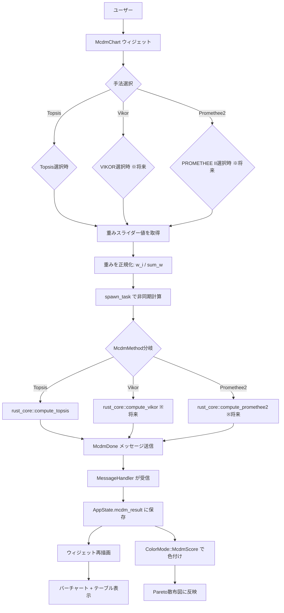
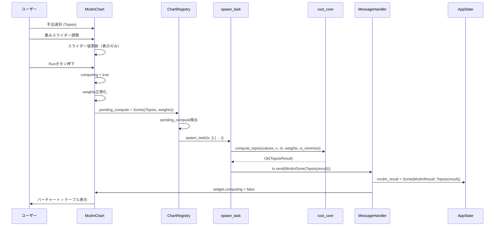
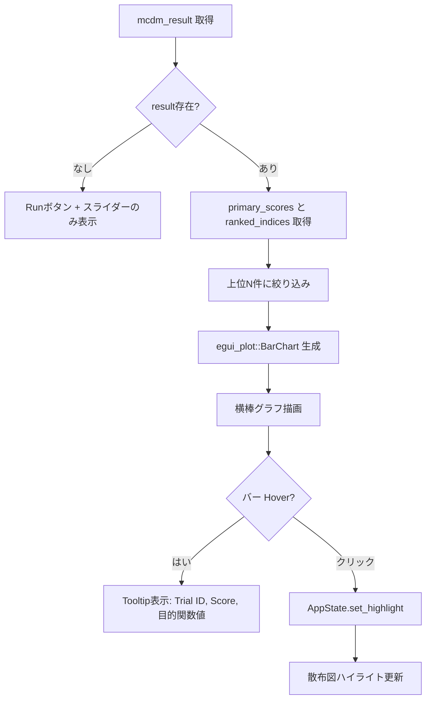
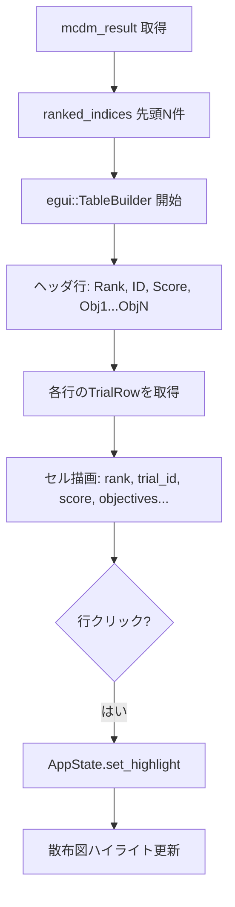
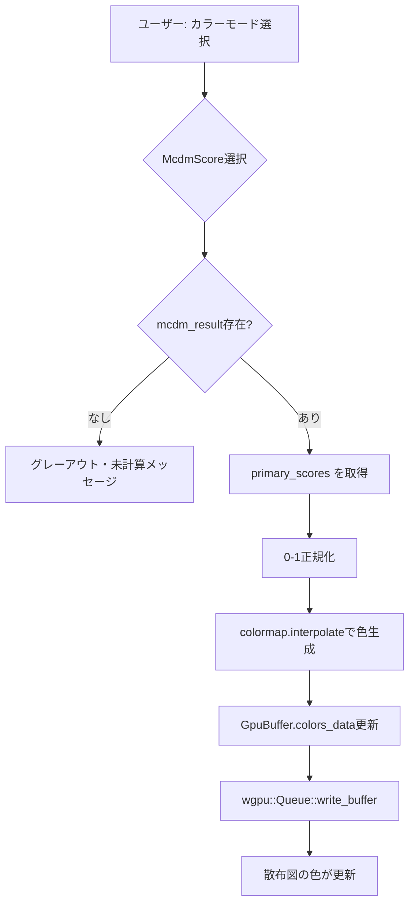
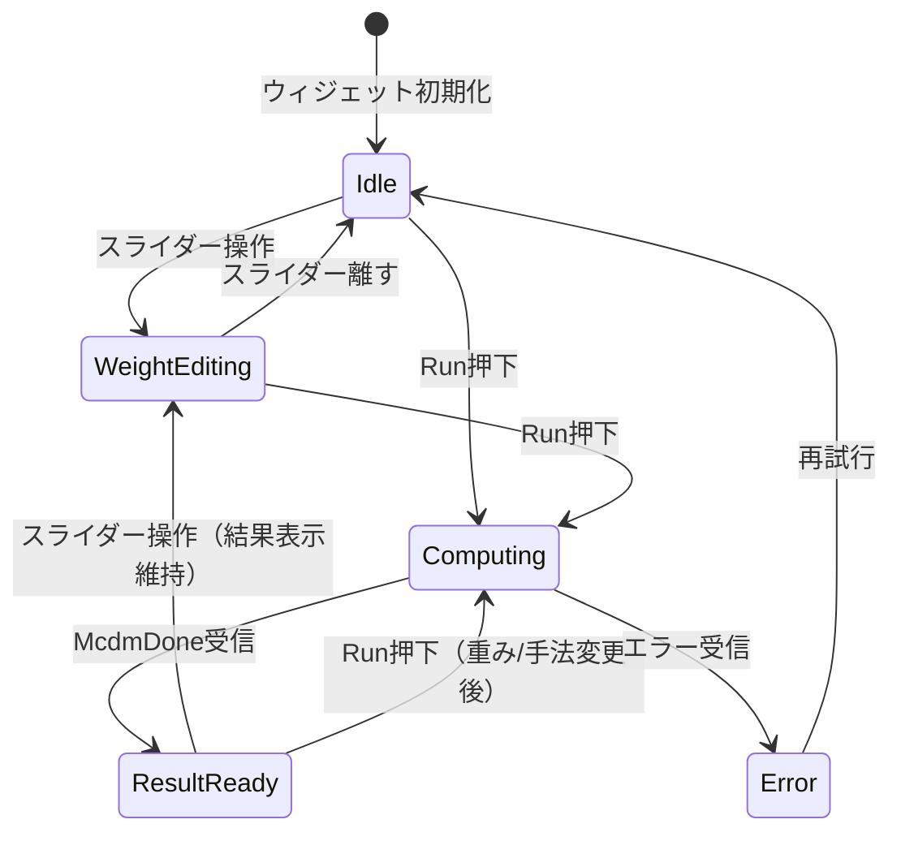
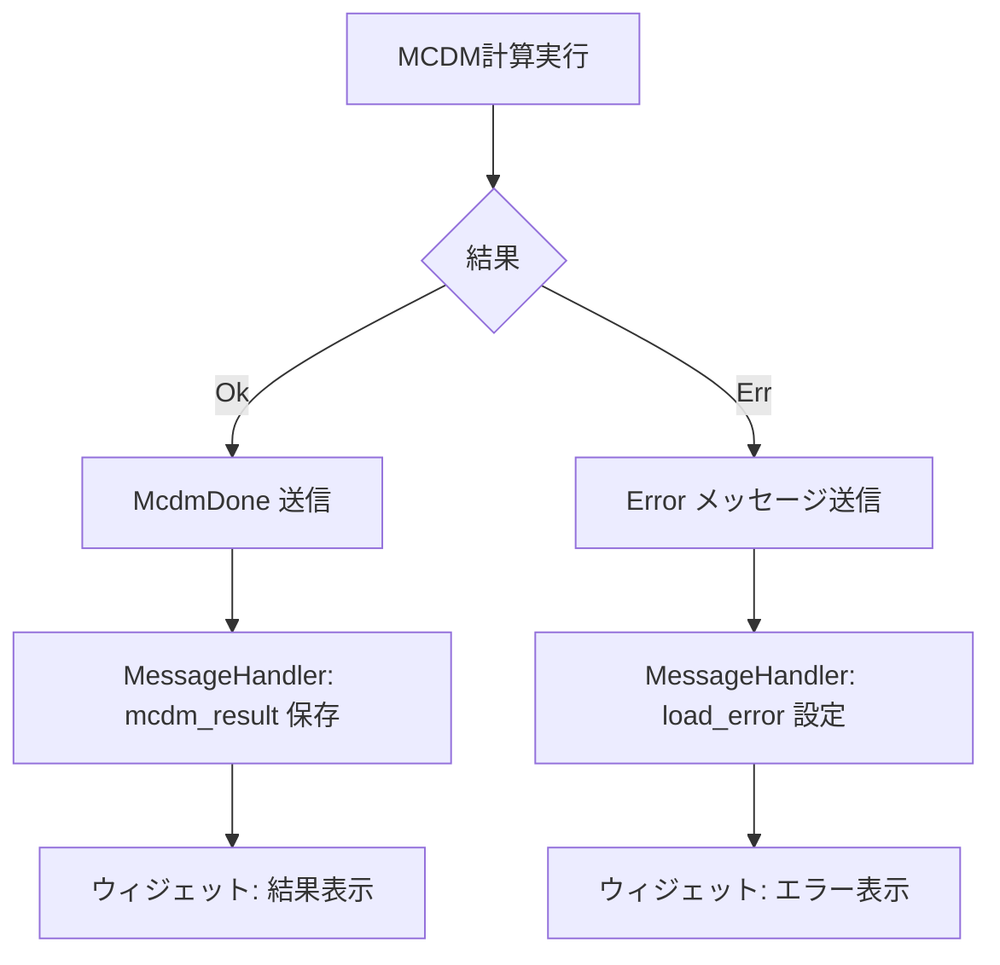

# MCDM UI データフロー図

**作成日**: 2026-04-23
**更新日**: 2026-04-23 (McdmChart統一化)
**関連アーキテクチャ**: [architecture.md](architecture.md)
**理論文書**: [theory/topsis.md](../../../theory/topsis.md)

**【信頼性レベル凡例】**:
- 🔵 **青信号**: EARS要件定義書・設計文書・ユーザヒアリングを参考にした確実なフロー
- 🟡 **黄信号**: EARS要件定義書・設計文書・ユーザヒアリングから妥当な推測によるフロー
- 🔴 **赤信号**: EARS要件定義書・設計文書・ユーザヒアリングにない推測によるフロー

---

## システム全体のデータフロー 🔵

**信頼性**: 🔵 *egui-migration設計・既存メッセージパターンより*



## 主要機能のデータフロー

### 機能1: MCDM計算の実行（TOPSIS） 🔵

**信頼性**: 🔵 *ImportanceChartのspawn_taskパターン・theory/topsis.mdより*

**関連要件**: 計算トリガー（オンデマンド・Runボタン）



**詳細ステップ**:
1. ユーザーが手法ComboBoxでMCDM手法を選択（Phase 1: Topsisのみ）
2. 各目的関数の重みスライダー（0.0-1.0）を調整
3. Runボタン押下で `pending_compute` に `(McdmMethod, weights)` をセット
4. `chart_registry.rs` で `pending_compute` を検出、`spawn_task` でバックグラウンド実行
5. `McdmMethod` に応じて `rust_core` の対応関数を呼び出し
6. `McdmDone` メッセージで結果をメインスレッドに返却
7. `MessageHandler` が `AppState.mcdm_result` に保存
8. ウィジェットが再描画、バーチャート＋テーブルを表示

### 機能2: ランキングバーチャートの表示 🔵

**信頼性**: 🔵 *ユーザヒアリング・egui_plot BarChart APIより*

**関連要件**: 上位N件表示（5/10/20トグル）、バークリックでハイライト



**バーチャートデータ構築**:
1. `McdmResult` から `primary_scores()` と `ranked_indices` を取得
2. 先頭N件を取得
3. 各Trialのスコアを棒の長さにマッピング
4. `BarChart::new()` で横棒グラフを生成
5. `PlotResponse` から `hovered_bar_item` でクリック検出

### 機能3: ランキングテーブルの表示 🟡

**信頼性**: 🟡 *egui::TableBuilder APIから妥当な推測*

**関連要件**: Trial ID・スコア・各目的関数値のテーブル表示



### 機能4: 散布図カラーモード 🔵

**信頼性**: 🔵 *ユーザヒアリング・既存ColorModeパターンより*

**関連要件**: ColorMode::McdmScore追加



**update_chart_colors 拡張**:
```rust
// app_state.rs の match color_mode に追加
ColorMode::McdmScore => {
    if let Some(ref mcdm) = self.mcdm_result {
        let scores = mcdm.primary_scores();
        for (i, &score) in scores.iter().enumerate() {
            colors[i * 4 + 3] = 1.0; // alpha
            let color = colormap.interpolate(score as f32);
            // RGB設定
        }
    }
}
```

## 状態管理フロー

### McdmChart ウィジェット状態 🔵

**信頼性**: 🔵 *ImportanceChartパターン・ユーザヒアリングより*



### 非同期タスクフロー 🔵

**信頼性**: 🔵 *egui-migration設計・spawn_taskパターンより*

```
[メインスレッド]                      [ワーカースレッド]
McdmChart.show()
  ├── 手法ComboBox (McdmMethod)
  ├── スライダー表示
  ├── Run ボタン
  │    └── pending_compute = Some((method, weights))
  │
chart_registry.show_chart()
  ├── pending_compute.take()
  └── spawn_task(tx, || {
  │      match method {
  │          Topsis => compute_topsis(...),
  │          // 将来: Vikor => compute_vikor(...),
  │          // 将来: Promethee2 => compute_promethee2(...),
  │      }
  │      tx.send(McdmDone(result))
  │  })
  │
poll_messages()
  └── McdmDone(result)
       ├── mcdm_result = Some(result)
       └── computing = false
```

## エラーハンドリングフロー 🔵

**信頼性**: 🔵 *既存MessageHandlerパターンより*



**エラーケース**（rust_core側で既にハンドリング済み）:
- トライアル数0: `Err("n_trials must be > 0")`
- 値長不一致: `Err("values length mismatch")`
- 重み長不一致: `Err("weights length mismatch")`
- 全NaNトライアル: 縮退ケースとして全スコア0.5（エラーではない）

## 関連文書

- **アーキテクチャ**: [architecture.md](architecture.md)
- **型定義**: [interfaces.rs](interfaces.rs)
- **ヒアリング記録**: [design-interview.md](design-interview.md)
- **理論文書**: [theory/topsis.md](../../../theory/topsis.md)
- **egui移行設計**: [../egui-migration/dataflow.md](../egui-migration/dataflow.md)

## 信頼性レベルサマリー

- 🔵 青信号: 10件 (83%)
- 🟡 黄信号: 2件 (17%)
- 🔴 赤信号: 0件 (0%)

**品質評価**: ✅ 高品質
