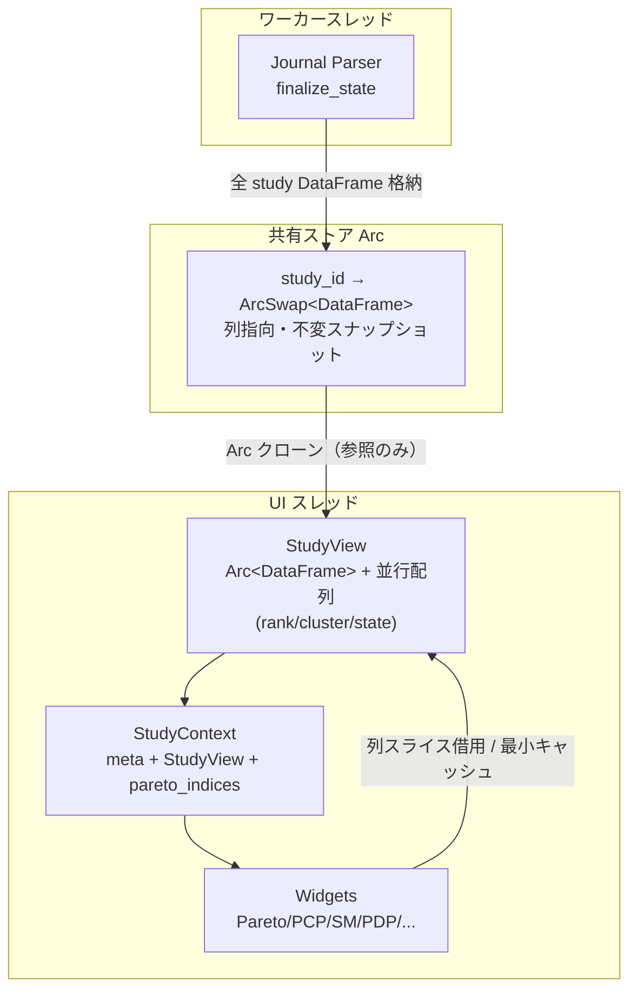

# memory-efficiency アーキテクチャ設計

**作成日**: 2026-05-29
**関連要件定義**: [requirements.md](../../spec/memory-efficiency/requirements.md)
**ヒアリング記録**: [design-interview.md](design-interview.md)

**【信頼性レベル凡例】**:
- 🔵 **青信号**: EARS要件定義書・設計文書・コード調査・ユーザヒアリングを参考にした確実な設計
- 🟡 **黄信号**: それらから妥当に推測した設計
- 🔴 **赤信号**: 根拠資料にない推測による設計

---

## システム概要 🔵

**信頼性**: 🔵 *requirements.md 概要・PRD より*

Tunny Dashboard のメモリ消費を、現行の UI 挙動・分析結果を維持したまま削減する内部リファクタリング。中核は、同一 study データを列指向 `DataFrame`（rust_core）と行指向 `Vec<TrialRow>`＋per-row `HashMap`（egui-app）で多重保持している構造の解消である。

## アーキテクチャパターン 🔵

**信頼性**: 🔵 *コード調査・ユーザヒアリング2026-05-29 より*

- **パターン**: 共有列指向ストア（Single Source of Truth）＋ UI 側軽量ビュー（View over columnar store）
- **選択理由**:
  - 現行は rust_core の **thread_local `GLOBAL_STATE`**（`rust_core/src/data/dataframe/state.rs:12-21`）に `DataFrame` を保持し、UI スレッドからは借用できないため `extract_trial_rows()`（`egui-app/src/io/study.rs:46-94`）で行指向データを複製して UI へ送っている。これが MEM-001 の重複の根本原因。
  - thread_local を廃止し、`DataFrame` を `Arc` ベースの共有ストアに移すことで、UI/ワーカー両スレッドから同一の列データを参照でき、行指向の永続複製を根絶する（REQ-002, REQ-003）。

## 主要設計決定（ヒアリング由来）

### 決定1: 共有ストアは全 study を初回パースで常駐化 🔵

**信頼性**: 🔵 *ヒアリングQ2 2026-05-29*

- 初回ジャーナルパース時に、全 study の `DataFrame` を **`study_id` キーの共有ストア**に格納する。
- main study・比較 study とも `study_id` 参照で同一ストアを共有し、現行の比較ロード時のジャーナル全体再パース（`egui-app/src/io/study_worker.rs:74-129`）と per-study の `trial_rows` 抽出を排除する（MEM-005, MEM-001）。
- トレードオフ: 初回常駐メモリは全 study 分になるが、列指向のため行指向複製より小さく、比較追加時の増分はほぼゼロになる（REQ-103）。

### 決定2: ライブ更新は ArcSwap スナップショット差替え 🔵

**信頼性**: 🔵 *ヒアリングQ1 2026-05-29・`message_handler.rs:209-268`*

- 各 study のスロットを `ArcSwap<DataFrame>` で保持する。
- ライブ更新（試行追加）時はワーカースレッドで新 batch を取り込んだ `DataFrame` を再構築し、`ArcSwap` を原子的に差し替える。
- 読み取り側（UI/描画）は `load()` で得た `Arc<DataFrame>` スナップショットを保持し、描画中に旧スナップショットが安全に生き残る（ロックフリー読み取り）。
- 現行の `handle_live_update_done`（行追記＋Pareto 再計算＋gpu_data 再構築）は、新スナップショット生成＋派生属性（pareto_rank 等）再計算に置き換える。

### 決定3: アプリ算出の行属性は UI 側 `StudyView` の並行配列に保持 🔵

**信頼性**: 🔵 *ヒアリングQ3 2026-05-29・`state/types.rs:37-47`*

- `DataFrame` にない UI 算出値（`pareto_rank`, `cluster_id`, `state`, `trial_number`）は、`Arc<DataFrame>` をラップする UI 側軽量構造 `StudyView` の**並行配列**（`Vec<u32>` / `Vec<Option<i32>>` / `Vec<TrialState>`）として保持する。
- rust_core の `DataFrame` は純粋な入力列（パラメータ・目的・user attr・制約・派生列）のみに保ち、関心の分離を維持する（REQ-403）。
- `StudyView` は行指向 `Vec<TrialRow>` を持たず、列＋並行配列＋インデックスでウィジェットへデータを供給する。

## コンポーネント構成

### データ層（rust_core） 🔵

**信頼性**: 🔵 *CLAUDE.md・`rust_core/src/data/dataframe/` より*

- **DataFrame**: 列指向（`numeric_cols: Vec<(String, Vec<f64>)>`, `string_cols: Vec<(String, Vec<String>)>` 等。`model.rs:7`）。**不変**。
- **共有ストア（新規）**: thread_local を廃し、`study_id → ArcSwap<DataFrame>` のマップを `OnceLock`/`Arc` で全スレッド共有。`store_dataframes` / `select_study` / `with_active_df` の各 API を共有ストア版へ置換。
- **公開アクセサ**: `get_numeric_column`, `get_string_column`, `param_col_names`, `objective_col_names`, `row_count`, `get_trial_id`（既存・`model.rs:175-235`）をそのまま流用。

### 状態層（egui-app/state） 🔵

**信頼性**: 🔵 *`state/app_state.rs`・`state/types.rs` より*

- **StudyContext の再設計**: 現行 `{ meta, trial_rows: Vec<TrialRow>, gpu_data, pareto_indices }`（`types.rs:59`）を、`{ meta, view: StudyView, pareto_indices }` へ変更。`trial_rows` と `gpu_data` を撤廃（MEM-001, MEM-007）。
- **StudyView（新規）**: `Arc<DataFrame>`（スナップショット）＋ 並行配列（pareto_rank/cluster_id/state）＋ row→trial_id 索引。
- **comparison_studies**: 現行 `Vec<StudyContext>`（フル保持・`app_state.rs:43`）を、`study_id` 参照＋軽量メタ＋遅延 `StudyView` に変更（MEM-005）。
- **gpu_data の撤廃**: `StudyContext.gpu_data`（`types.rs:62`）は描画側で未読（`render/gpu_buffer.rs` はレイアウト定数のみ、`.gpu_data` 読み出しなし）。削除する（MEM-007, REQ-013）。

### UI 層（egui-app/ui/widgets） 🔵

**信頼性**: 🔵 *`ui/widgets/*` コード調査より*

- **Pareto 2D/3D**: `display_rows_cache: Option<Vec<TrialRow>>`（`pareto_2d.rs:38`, `pareto_3d.rs:99`）を撤廃し、フィルタ済みインデックス・点座標・ランクスライスのみキャッシュ（MEM-002, REQ-004/005）。
- **Parallel Coordinates / Scatter Matrix**: 各々の `col_data_cache: Option<Vec<Vec<f64>>>`（`parallel_coords.rs:71`, `scatter_matrix.rs:31`）を、`StudyView` 由来の共有列参照（借用スライス）または一元化キャッシュに置換（MEM-003, REQ-006/007）。
- **PDP/Surface/Sensitivity 入力**: `poll_chart.rs:16-22` の `r.params` HashMap 参照からの `Vec<Vec<f64>>` 再構築を、`StudyView`/`DataFrame` の列スライス参照・フラットバッファに置換（MEM-004, REQ-008/009）。

## システム構成図



**信頼性**: 🔵 *コード調査・ヒアリングより*

## ディレクトリ構造 🔵

**信頼性**: 🔵 *既存プロジェクト構造より*

```
rust_core/src/data/dataframe/
├── model.rs        # DataFrame（不変・列指向） — 変更小
├── state.rs        # ★ thread_local → Arc 共有ストアへ刷新
├── types.rs        # SelectStudyResult 等
└── buffers.rs      # GPU バッファ構築（gpu_buffers）

egui-app/src/
├── state/
│   ├── types.rs        # ★ StudyContext 再設計 / StudyView 新規 / gpu_data 撤廃
│   ├── app_state.rs    # ★ comparison_studies 軽量化
│   └── message_handler.rs  # ★ StudySelected/LiveUpdate/Comparison ハンドラ刷新
├── io/
│   ├── study.rs        # ★ extract_trial_rows 撤廃 → StudyView 構築
│   └── study_worker.rs # ★ 比較ロードの再パース廃止 → 共有ストア参照
└── ui/widgets/
    ├── pareto_2d.rs / pareto_3d.rs       # ★ display_rows_cache 撤廃
    ├── parallel_coords.rs / scatter_matrix.rs  # ★ col_data_cache 共有化
    └── poll_chart.rs                     # ★ 一時行列の列参照化
```

## 非機能要件の実現方法

### パフォーマンス（メモリ） 🔵

**信頼性**: 🔵 *NFR-001〜004・PRD 想定効果より*

- 定常メモリ: 行指向複製・per-row HashMap の撤廃で単一 study -50% 以上（NFR-001）。
- ピークメモリ（分析）: 列スライス参照で一時 `Vec<Vec<f64>>` 再構築を排除（NFR-002）。
- ピークメモリ（ロード）: `finalize_state` の `per_study_rows` と DataFrame の同時保持を、列ビルダへの直接書き込み／コンパクションで最小化（NFR-003, REQ-012）。
- 計測: 100k×22 代表データセットで改修前後の定常・ピークを定量比較（NFR-004 / [prep.md](../../spec/memory-efficiency/prep.md)）。

### スレッド安全性 🔵

**信頼性**: 🔵 *ヒアリングQ1・Arc/ArcSwap 方針より*

- 読み取り: `ArcSwap::load()` によるロックフリーなスナップショット取得。描画中の旧スナップショットは `Arc` 参照カウントで安全に保持。
- 書き込み（ライブ更新）: ワーカースレッドで新 DataFrame を構築し `ArcSwap::store()` で原子的差替え。
- データ競合・パニックがないことをテスト（受け入れ基準 TC-002-E01）。

### 応答性の非悪化 🟡

**信頼性**: 🟡 *NFR-005「現行 UI 挙動維持」から妥当な推測*

- study 選択時の `extract_trial_rows` 撤廃でむしろ選択は高速化見込み。
- 既存の `[timing]` ログ（`io/study.rs:108-133`）で改修前後を比較。

## 技術的制約

### 互換性制約 🔵

**信頼性**: 🔵 *CLAUDE.md・プロジェクト方針より*

- WASM 互換・後方互換シムは不要。ネイティブ専用で破壊的変更可（REQ-405）。
- 等価性は `cargo test --workspace` グリーンで担保（REQ-404）。

### データ整合性制約 🔵

**信頼性**: 🔵 *REQ-402, REQ-403 より*

- 共有キャッシュは所有権・無効化ルールを明示（study 切替時のスナップショット解放、ライブ更新時の差替え）。
- サイレントなデータ損失を起こさない（数値変換・カテゴリ列の現行挙動を維持。EDGE-002）。

## 移行・実装フェーズ（PRD 優先順位準拠）

1. **Phase 1**: 共有 Arc ストア基盤（state.rs 刷新）＋ StudyView 導入＋ StudySelected 経路（MEM-001）
2. **Phase 1**: Pareto 行クローン撤廃（MEM-002）、派生列キャッシュ共有（MEM-003）
3. **Phase 2**: 比較 study の共有ストア参照化（MEM-005）、ライブ更新の ArcSwap 化
4. **Phase 2**: 分析一時行列の列参照化（MEM-004）、ロードピーク削減（MEM-006）
5. **Phase 3**: gpu_data 撤廃（MEM-007）、定量ベンチマーク

## 関連文書

- **データフロー**: [dataflow.md](dataflow.md)
- **型定義**: [types.rs](types.rs)
- **要件定義**: [requirements.md](../../spec/memory-efficiency/requirements.md)
- **準備タスク**: [prep.md](../../spec/memory-efficiency/prep.md)

## 信頼性レベルサマリー

- 🔵 青信号: 22件 (92%)
- 🟡 黄信号: 2件 (8%)
- 🔴 赤信号: 0件 (0%)

**品質評価**: 高品質
