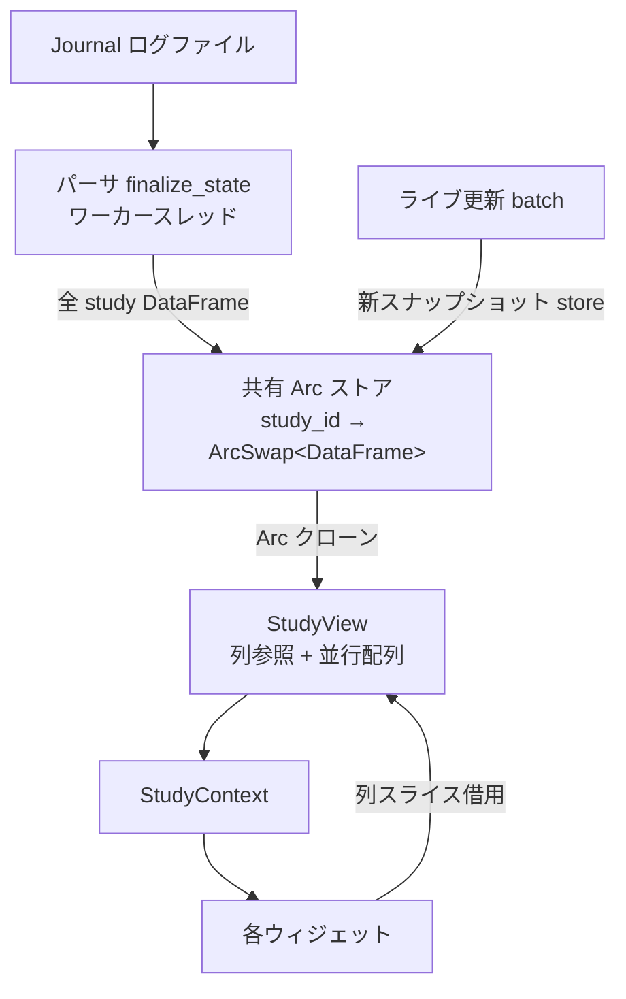
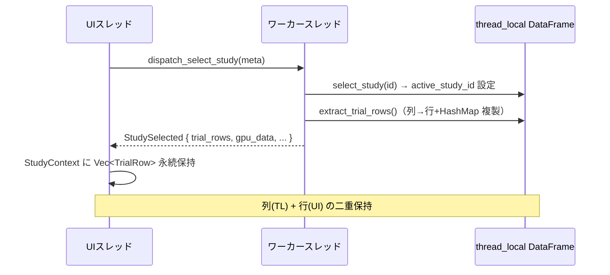
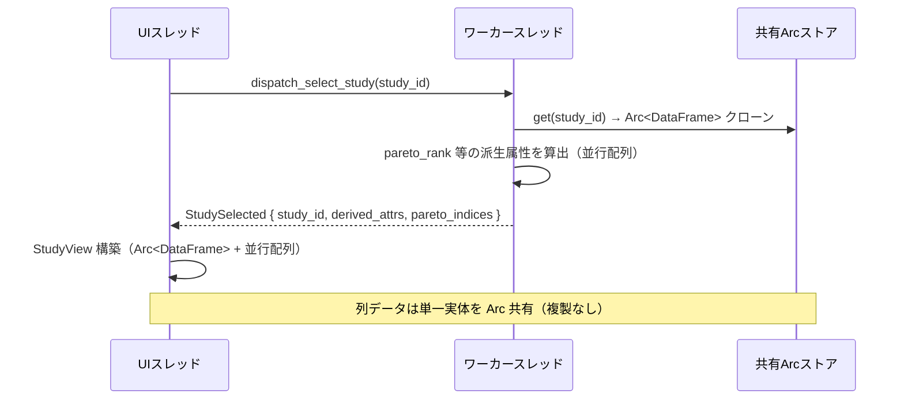
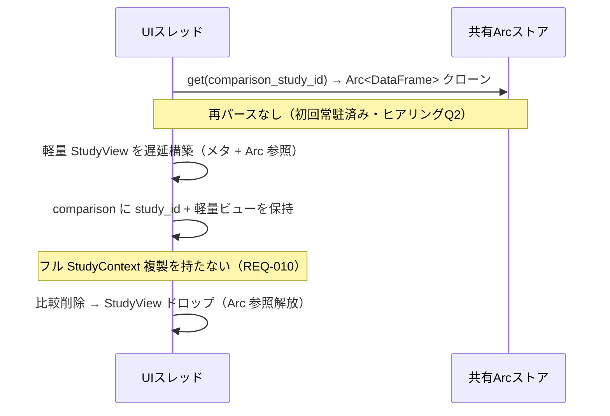
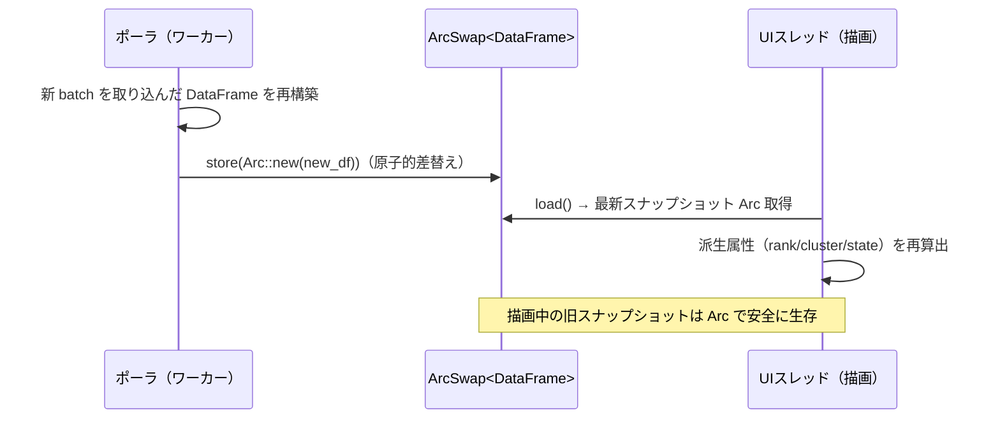
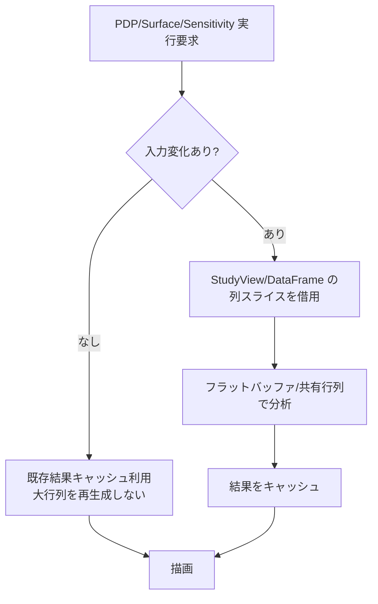
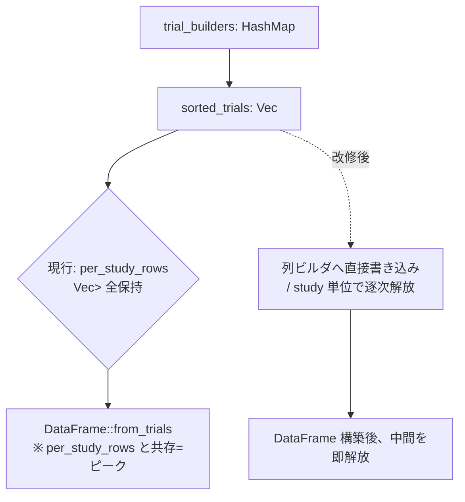
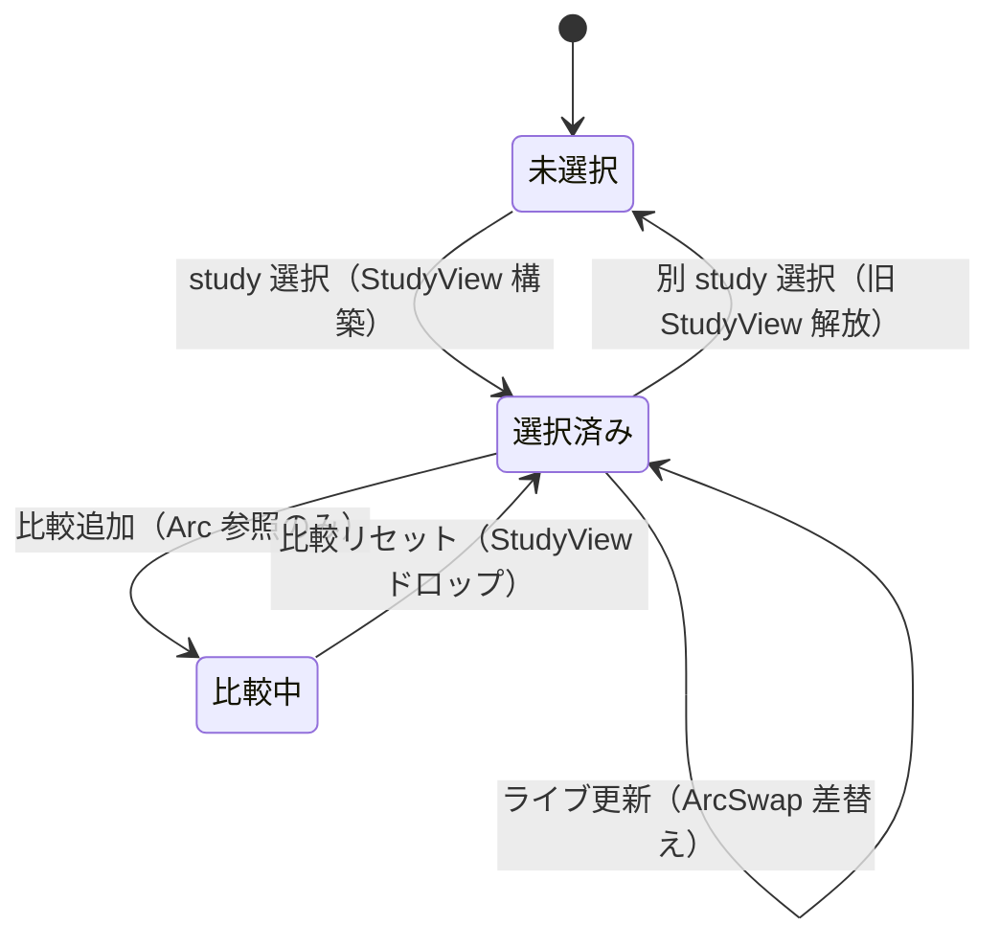

# memory-efficiency データフロー図

**作成日**: 2026-05-29
**関連アーキテクチャ**: [architecture.md](architecture.md)
**関連要件定義**: [requirements.md](../../spec/memory-efficiency/requirements.md)

**【信頼性レベル凡例】**:
- 🔵 **青信号**: EARS要件定義書・設計文書・コード調査・ユーザヒアリングを参考にした確実なフロー
- 🟡 **黄信号**: それらから妥当に推測したフロー
- 🔴 **赤信号**: 根拠資料にない推測によるフロー

---

## システム全体のデータフロー 🔵

**信頼性**: 🔵 *コード調査・ヒアリングより*

## 主要機能のデータフロー

### フロー1: study 選択（MEM-001 / 現行複製の排除） 🔵

**信頼性**: 🔵 *ユーザストーリー1.1・`io/study.rs`・`message_handler.rs:25-43` より*

**関連要件**: REQ-001, REQ-002, REQ-101

**現行（Before）**:

**改修後（After）**:

**詳細ステップ**:
1. study 選択は `study_id` のみ受け渡し（行データを運ばない）。
2. ワーカーは共有ストアから `Arc<DataFrame>` を取得し、Pareto ランク等の派生属性のみ算出。
3. UI は `Arc<DataFrame>`（参照）＋並行配列で `StudyView` を構成。永続 `Vec<TrialRow>` を作らない（REQ-101）。

### フロー2: 比較 study 追加（MEM-005） 🔵

**信頼性**: 🔵 *ユーザストーリー3.1・`study_worker.rs:74-129`・ヒアリングQ2 より*

**関連要件**: REQ-010, REQ-011, REQ-103, REQ-201

**詳細ステップ**:
1. 比較追加はジャーナル再パース（現行 `load_comparison_study_task`）を行わず、共有ストアから `study_id` で `Arc<DataFrame>` を参照。
2. 比較対象は軽量メタ＋遅延 `StudyView` のみ保持。メモリ増分はフル複製比例にならない（REQ-103）。
3. 比較削除時は `StudyView` をドロップし `Arc` 参照を解放（REQ-201）。

### フロー3: ライブ更新（ArcSwap スナップショット差替え） 🔵

**信頼性**: 🔵 *ヒアリングQ1・`message_handler.rs:209-268` より*

**関連要件**: REQ-003, EDGE-102

**詳細ステップ**:
1. ポーラは新試行を取り込んだ新 `DataFrame` を構築し、`ArcSwap::store` で差し替える。
2. UI は次フレームの `load()` で最新スナップショットを取得、`StudyView` の並行配列（pareto_rank 等）を再算出。
3. 描画中フレームが握る旧 `Arc<DataFrame>` は参照が残る限り生存（ロックフリー・安全。EDGE-102）。

### フロー4: 分析実行（MEM-004 一時行列の排除） 🔵

**信頼性**: 🔵 *ユーザストーリー3.2・`poll_chart.rs:16-22` より*

**関連要件**: REQ-008, REQ-009, REQ-102

**詳細ステップ**:
1. 現行は `r.params.get(p)` の HashMap 参照から実行ごとに `Vec<Vec<f64>>` を再構築（`poll_chart.rs:21`）。
2. 改修後は列スライス（`get_numeric_column`）を借用し、ネスト Vec 再構築を回避（REQ-009）。
3. 入力不変なら再実行で同等の大行列を再生成しない（REQ-102）。

## ロード時データフロー（MEM-006） 🔵

**信頼性**: 🔵 *`io/journal/parser/finalize.rs:9-115` より*

**関連要件**: REQ-012, NFR-003

**詳細ステップ**:
1. 現行は `per_study_rows`（全行）と確定 `DataFrame` がピーク時共存（`finalize.rs:20,104`）。
2. 改修後は study 単位で行を列ビルダへ流し込み、DataFrame 化後に中間を逐次解放してピークを下げる（REQ-012）。
3. パース結果（study/目的/user attr/制約）の等価性を維持（受け入れ基準 TC-012-02）。

## 状態管理フロー

### StudyContext 状態遷移 🔵

**信頼性**: 🔵 *`app_state.rs:128-167`（clear/reset）より*

## データ整合性の保証 🔵

**信頼性**: 🔵 *REQ-402, REQ-403・ヒアリングより*

- **スナップショット一貫性**: 1 フレームの描画は単一の `Arc<DataFrame>` スナップショットと、それに対応する並行配列を使用（混在しない）。
- **無効化ルール**: study 切替＝旧 `StudyView` ドロップ。ライブ更新＝`ArcSwap` 差替え＋並行配列再算出。比較削除＝`StudyView` ドロップ。
- **データ損失防止**: 列の数値変換・カテゴリ列分岐（`model.rs:76-99`）の現行挙動を保つ（REQ-402, EDGE-002）。

## 関連文書

- **アーキテクチャ**: [architecture.md](architecture.md)
- **型定義**: [types.rs](types.rs)
- **要件定義**: [requirements.md](../../spec/memory-efficiency/requirements.md)

## 信頼性レベルサマリー

- 🔵 青信号: 12件 (100%)
- 🟡 黄信号: 0件 (0%)
- 🔴 赤信号: 0件 (0%)

**品質評価**: 高品質
