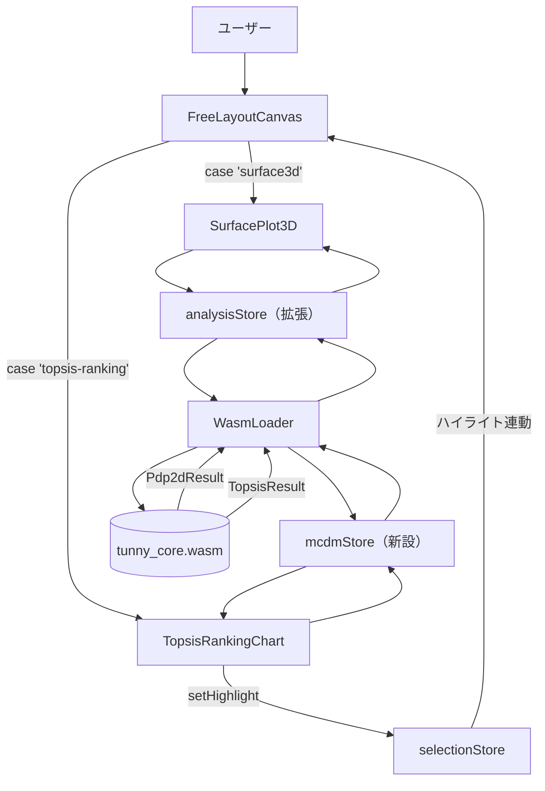
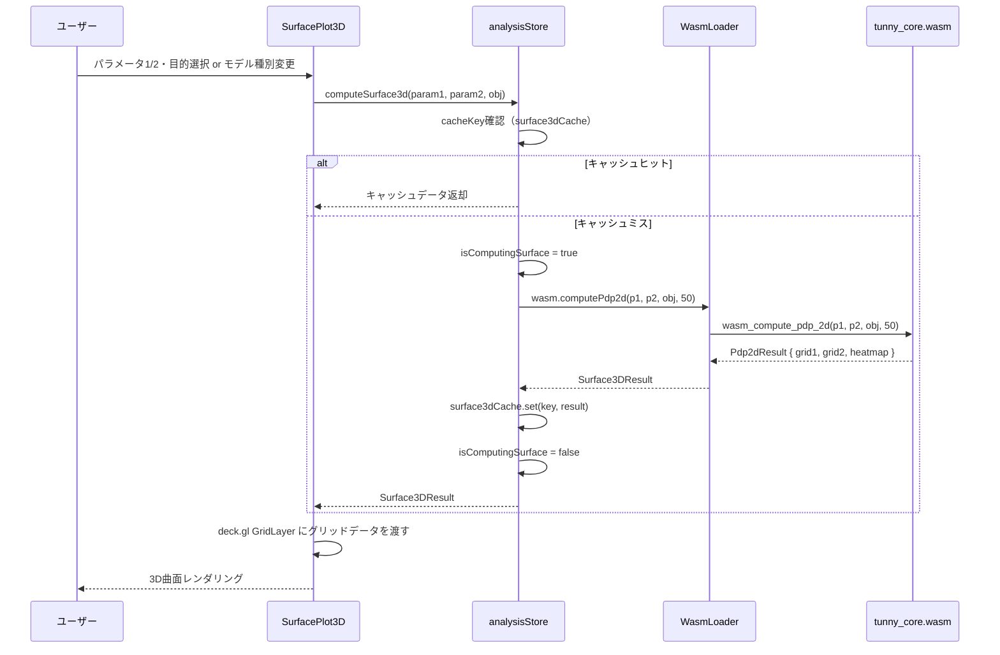
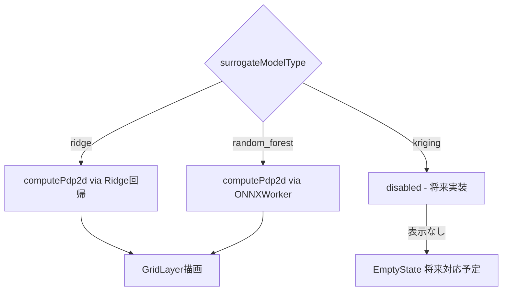
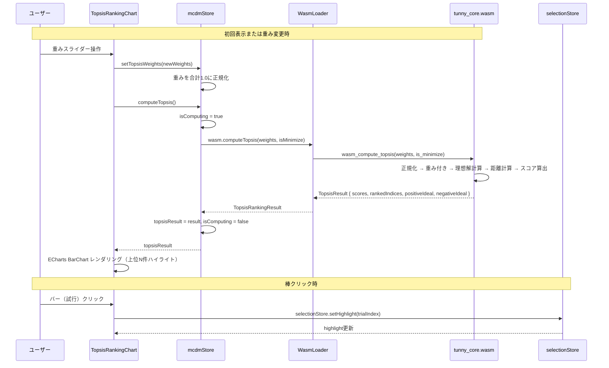
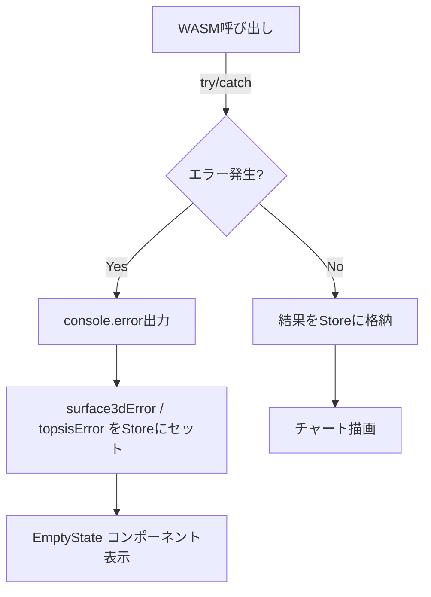
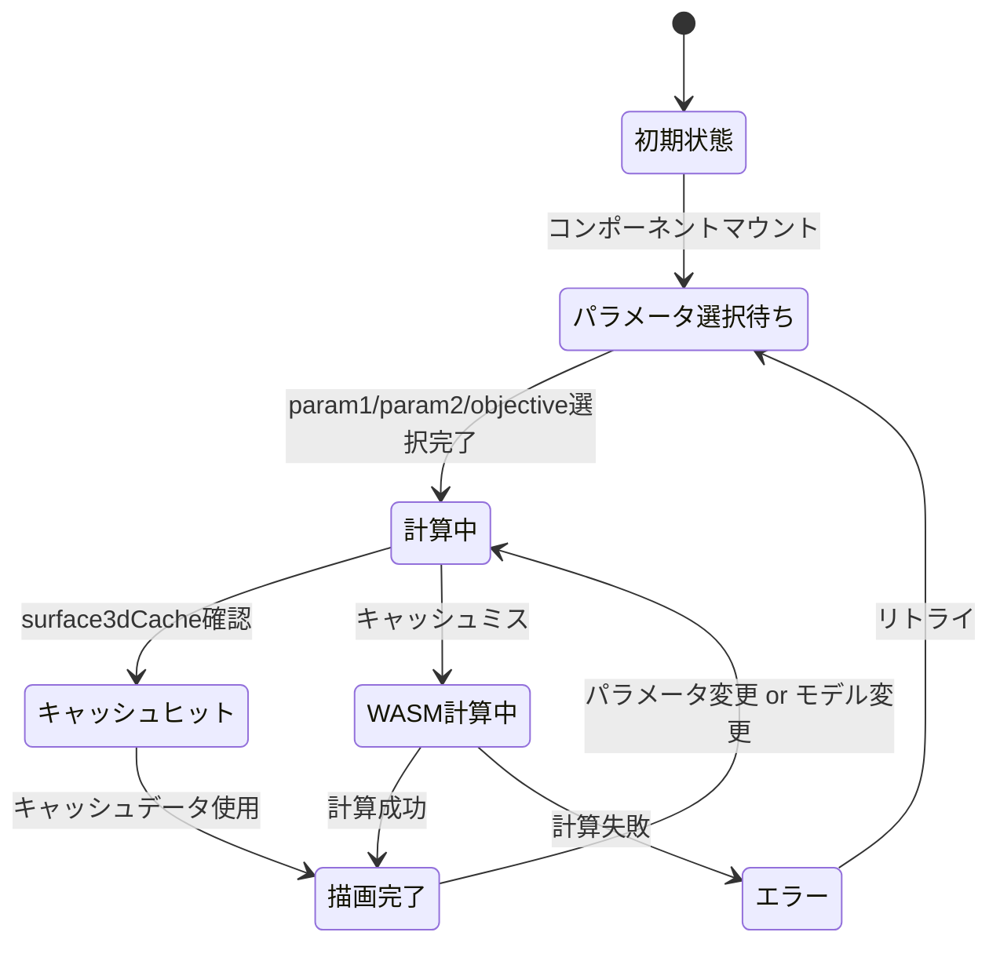
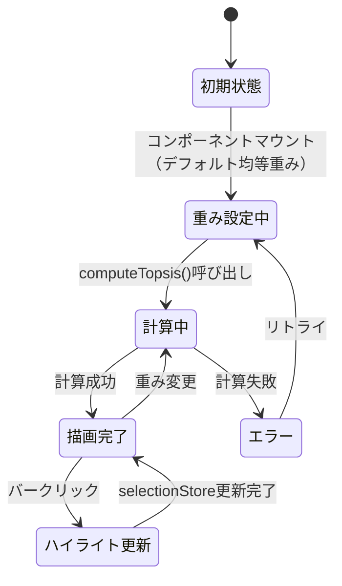

# プロプライエタリな汎用最適化ソフト機能拡充 データフロー図

**作成日**: 2026-04-04
**関連アーキテクチャ**: [architecture.md](architecture.md)
**関連要件定義**: （作成予定）

**【信頼性レベル凡例】**:
- 🔵 **青信号**: EARS要件定義書・設計文書・ユーザヒアリングを参考にした確実なフロー
- 🟡 **黄信号**: EARS要件定義書・設計文書・ユーザヒアリングから妥当な推測によるフロー
- 🔴 **赤信号**: EARS要件定義書・設計文書・ユーザヒアリングにない推測によるフロー

---

## システム全体のデータフロー 🔵

**信頼性**: 🔵 *既存アーキテクチャ・ユーザヒアリングより*



---

## 機能1: 3D応答曲面プロット (surface3d) 🔵

**信頼性**: 🔵 *ユーザヒアリング・既存pdp.rs・wasm-api.md より*

**関連要件**: （設計ヒアリングQ2-Q3より）



**詳細ステップ:**
1. `SurfacePlot3D` コンポーネントはドロップダウンからパラメータ1・パラメータ2・目的関数を選択させる
2. 選択変更時に `analysisStore.computeSurface3d()` を呼び出す
3. `analysisStore` は `surface3dCache` でキャッシュ確認し、ミス時のみWASM計算
4. `wasmLoader.computePdp2d()` → `wasm_compute_pdp_2d()` でRidgeモデルの50×50グリッドを計算
5. 結果の `heatmap` フラット配列をdeck.gl `GridLayer` の高さ属性として渡す
6. X/Y軸に `grid1`・`grid2` のスケールを適用し、Z値で色分けとバー高さを表現

**モデル種別切り替えフロー:**


---

## 機能2: TOPSISランキング (topsis-ranking) 🔵

**信頼性**: 🔵 *ユーザヒアリング・TOPSIS理論より*

**関連要件**: （設計ヒアリングQ4より）



**TOPSIS計算ステップ（Rust実装詳細）:**
```mermaid
flowchart TD
    A[目的関数値行列 N×M] --> B[ベクトル正規化]
    B --> C[重み付き正規化行列]
    C --> D{方向確認 is_minimize}
    D -->|minimize| E[正理想解=列最小値, 負理想解=列最大値]
    D -->|maximize| F[正理想解=列最大値, 負理想解=列最小値]
    E --> G[各試行の正理想解へのユークリッド距離 D+]
    F --> G
    E --> H[各試行の負理想解へのユークリッド距離 D-]
    F --> H
    G --> I[スコア = D- / (D+ + D-)]
    H --> I
    I --> J[スコア降順ソート]
    J --> K[TopsisResult]
```

---

## データ処理パターン

### キャッシュ戦略 (surface3d) 🔵

**信頼性**: 🔵 *既存pdpCache実装パターンより*

```typescript
// cacheKey = `${surrogateModelType}_${param1}_${param2}_${objective}_${nGrid}`
surface3dCache: Map<string, Surface3DResult>
```

- Studyが変更された際はキャッシュをクリア（`studyStore.subscribe` で検知）
- 同一パラメータ組み合わせの再計算を防ぐ
- メモリ上限: 最大20エントリ（LRU方式）🟡

### Study変更時のリセット 🔵

**信頼性**: 🔵 *既存analysisStore・clusterStoreパターンより*

```mermaid
flowchart LR
    SS[studyStore] -->|subscribe| AS[analysisStore]
    SS -->|subscribe| MS[mcdmStore]
    AS -->|clearSurface3dCache()| A2[surface3dCache = new Map()]
    MS -->|reset()| M2[topsisResult = null]
```

---

## エラーハンドリングフロー 🔵

**信頼性**: 🔵 *既存clusterStore・analysisStoreエラーパターンより*



**エラーケース:**
- `EmptyState` message="曲面計算エラー" — computePdp2d失敗時
- `EmptyState` message="ランキング計算エラー" — computeTopsis失敗時
- `EmptyState` message="目的関数が2つ以上必要です" — 単目的Studyでtopsis-ranking表示時
- `EmptyState` message="パラメータが2つ以上必要です" — surface3dでパラメータが1個以下の時

---

## 状態管理フロー

### SurfacePlot3D の状態管理 🔵

**信頼性**: 🔵 *ユーザヒアリング・既存コンポーネントパターンより*



### TopsisRankingChart の状態管理 🔵

**信頼性**: 🔵 *ユーザヒアリング・既存コンポーネントパターンより*



---

## 関連文書

- **アーキテクチャ**: [architecture.md](architecture.md)
- **型定義**: [interfaces.ts](interfaces.ts)
- **ヒアリング記録**: [design-interview.md](design-interview.md)
- **WASM API仕様**: [../tunny-dashboard/wasm-api.md](../tunny-dashboard/wasm-api.md)

## 信頼性レベルサマリー

- 🔵 青信号: 10件 (91%)
- 🟡 黄信号: 1件 (9%)
- 🔴 赤信号: 0件 (0%)

**品質評価**: 高品質
