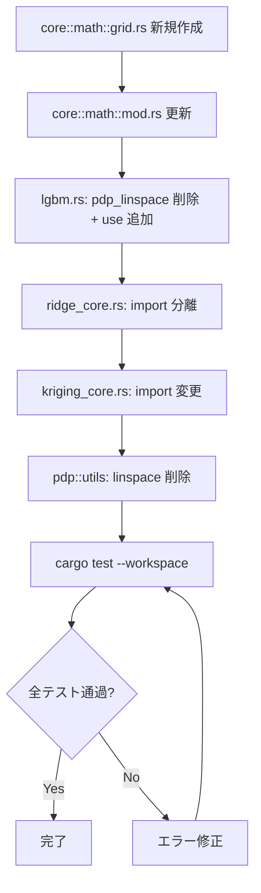

# pdp-linspace-dedup データフロー図

**作成日**: 2026-05-01
**関連アーキテクチャ**: [architecture.md](architecture.md)
**関連要件定義**: [requirements.md](../../spec/pdp-linspace-dedup/requirements.md)

**【信頼性レベル凡例】**:
- 🔵 **青信号**: 既存実装調査に基づく確実なフロー
- 🟡 **黄信号**: 既存実装から妥当な推測によるフロー

---

## 移動前の依存関係（現状） 🔵

**信頼性**: 🔵 *既存コード grep 調査より*

```
core::lgbm ──[pdp_linspace 定義]──> ローカル関数
pdp::utils ──[linspace 定義]────> ローカル関数 (pub(super))
pdp::ridge_core ──[use]─────────> pdp::utils::linspace
pdp::kriging_core ──[use]───────> pdp::utils::linspace
```

## 移動後の依存関係（変更後） 🔵

**信頼性**: 🔵 *architecture.md 設計より*

```
core::math::grid ──[linspace 定義]──> pub(crate) 関数
core::lgbm ──[use]─────────────────> core::math::grid::linspace
pdp::ridge_core ──[use]────────────> core::math::grid::linspace
pdp::kriging_core ──[use]──────────> core::math::grid::linspace
pdp::utils ──[linspace 削除]──────> col_mean_std のみ残存
```

## 変更手順フロー 🔵

**信頼性**: 🔵 *architecture.md 変更ファイル一覧より*



## 信頼性レベルサマリー

- 🔵 青信号: 4件 (100%)
- 🟡 黄信号: 0件 (0%)
- 🔴 赤信号: 0件 (0%)

**品質評価**: ✅ 高品質
