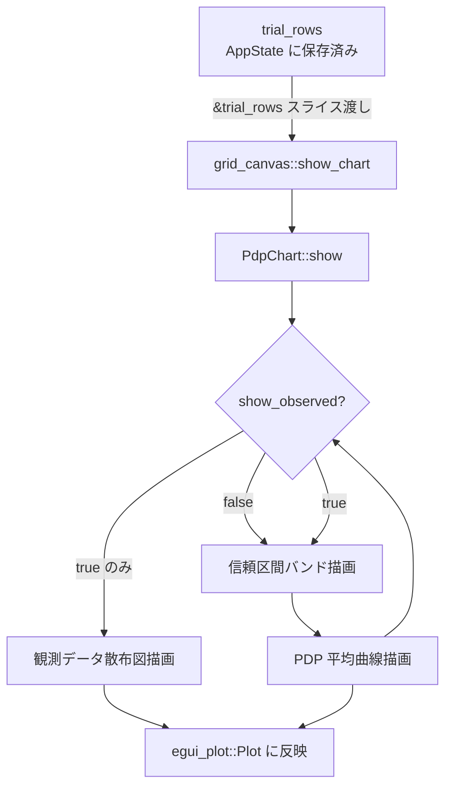
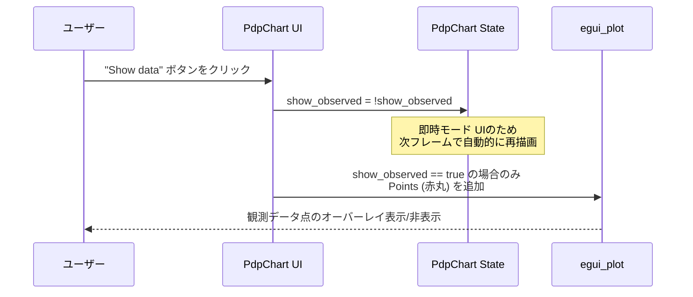

# pdp-observed-overlay データフロー図

**作成日**: 2026-04-15
**関連アーキテクチャ**: [architecture.md](architecture.md)

**【信頼性レベル凡例】**:
- 🔵 **青信号**: 既存実装・ユーザーヒアリングを参考にした確実なフロー
- 🟡 **黄信号**: 妥当な推測によるフロー

---

## 全体データフロー 🔵

**信頼性**: 🔵 *既存実装のアーキテクチャパターンより*



---

## 主要フロー: ユーザーが "Show data" をトグル 🔵

**信頼性**: 🔵 *ユーザーヒアリング・即時モード UI パターンより*



---

## 観測データ抽出フロー 🔵

**信頼性**: 🔵 *`TrialRow.params: HashMap<String, f64>` 構造より*

```mermaid
flowchart LR
    TR[trial_rows: &[TrialRow]]
    FILTER[params.get(param_name)?<br/>objectives.get(obj_idx)?]
    PTS[Vec&lt;[f64; 2]&gt;<br/>観測点リスト]

    TR -->|各 TrialRow を走査| FILTER
    FILTER -->|両方 Some の場合のみ| PTS
```

**詳細**:
1. `trial_rows` の各 `TrialRow` を走査
2. `row.params.get(param_name)` で選択中パラメータの値を取得（`None` はスキップ）
3. `row.objectives.get(obj_idx)` で選択中目的関数の値を取得（`None` はスキップ）
4. `[x, y]` の配列として収集
5. `egui_plot::Points::new(pts).color(RED).radius(4.0).name("Observed")` で描画

---

## 描画レイヤー順序 🔵

**信頼性**: 🔵 *既存 show_1d の描画順を維持・拡張*

```
egui_plot::Plot 内の描画順（奥→手前）:
┌─────────────────────────────────┐
│ 1. Polygon: 信頼区間バンド        │  ← 既存（y_upper/y_lower が Some のとき）
│    半透明青 (100, 100, 255, 40)  │
├─────────────────────────────────┤
│ 2. Line × N: ICEライン          │  ← 既存
│    薄灰色 (150, 150, 150, 60)   │
├─────────────────────────────────┤
│ 3. Line: PDP 平均曲線            │  ← 既存
│    青 (50, 100, 255) width=2.0  │
├─────────────────────────────────┤
│ 4. Points: 観測データ散布図 ★新規│  ← 追加（show_observed == true のみ）
│    赤 (255, 60, 60) radius=4.0  │
└─────────────────────────────────┘
```

---

## `grid_canvas.rs` の呼び出し側変更 🔵

**信頼性**: 🔵 *既存 grid_canvas の trial_rows 変数より*

```rust
// 変更前
ChartId::PdpChart => {
    widgets.pdp_chart.show(ui, &param_names, &obj_names);
}

// 変更後
ChartId::PdpChart => {
    widgets.pdp_chart.show(ui, &param_names, &obj_names, &trial_rows);
}
```

`trial_rows` は `show_chart` 関数内で既に `let trial_rows = ctx.trial_rows.clone()` として
確保されている（`grid_canvas.rs` L281 付近）。追加のクローンは不要。

---

## エラーハンドリング 🟡

**信頼性**: 🟡 *既存実装のパターンから推測*

- パラメータ名が `trial_rows` に存在しない場合: `filter_map` により自動スキップ
- 目的関数インデックスが範囲外の場合: `objectives.get(obj_idx)` が `None` を返してスキップ
- 空の観測データ: `pts.is_empty()` を確認し、0件なら `Points` を描画しない

---

## 信頼性レベルサマリー

- 🔵 青信号: 6件 (86%)
- 🟡 黄信号: 1件 (14%)
- 🔴 赤信号: 0件 (0%)

**品質評価**: ✅ 高品質
