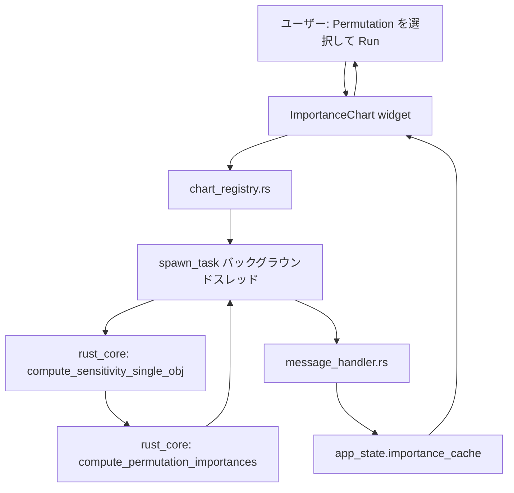
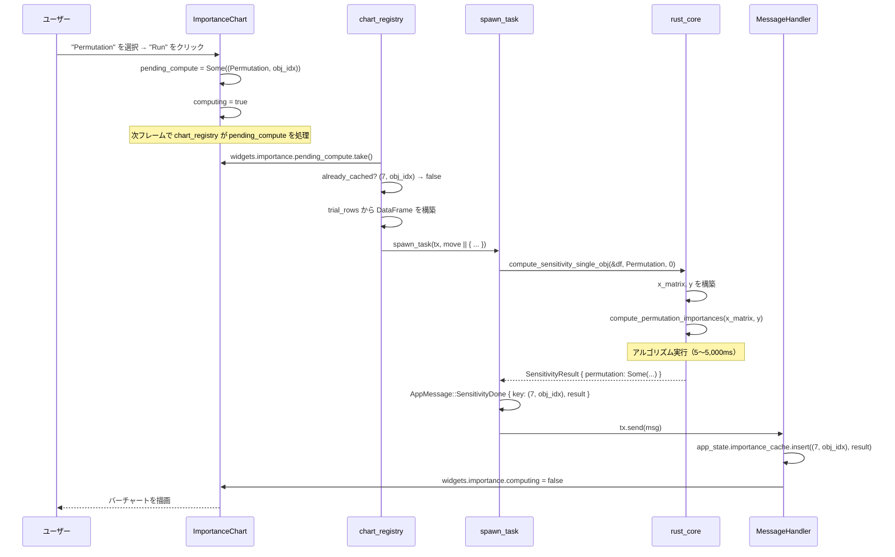
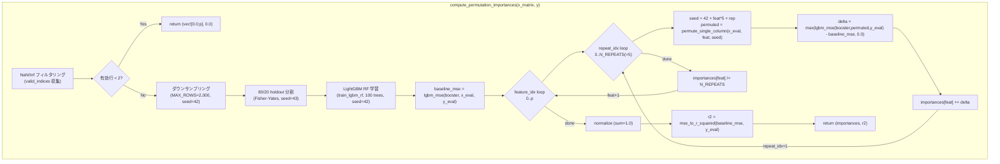
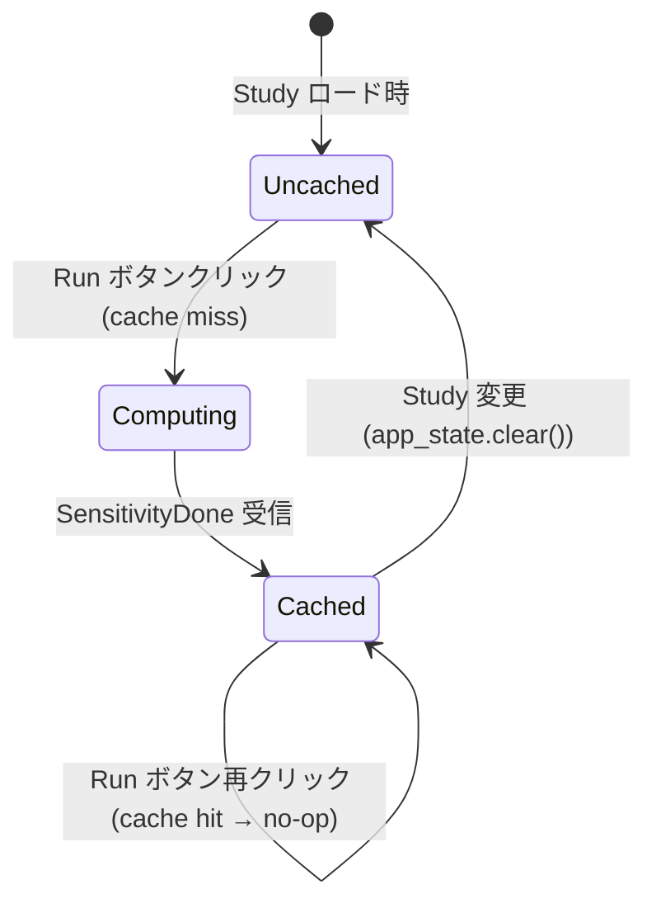
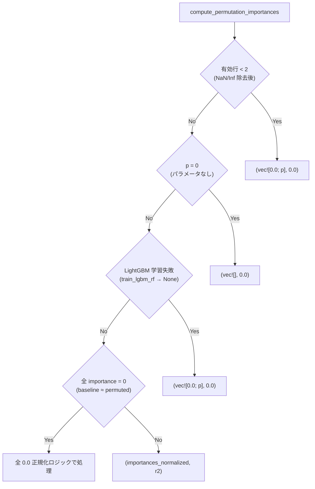
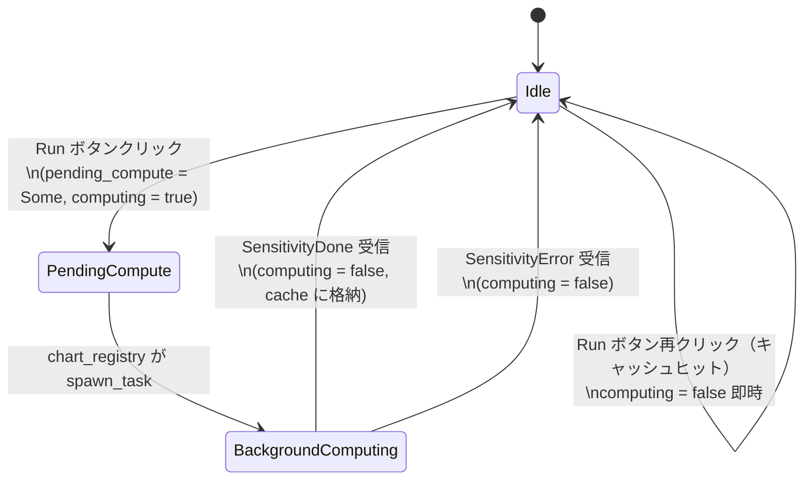

# Permutation Feature Importance データフロー図

**作成日**: 2026-05-02
**関連アーキテクチャ**: [architecture.md](architecture.md)
**関連要件定義**: [requirements.md](../../spec/permutation-feature-importance/requirements.md)

**【信頼性レベル凡例】**:
- 🔵 **青信号**: EARS要件定義書・設計文書・ユーザヒアリングを参考にした確実なフロー
- 🟡 **黄信号**: EARS要件定義書・設計文書・ユーザヒアリングから妥当な推測によるフロー
- 🔴 **赤信号**: EARS要件定義書・設計文書・ユーザヒアリングにない推測によるフロー

---

## システム全体のデータフロー 🔵

**信頼性**: 🔵 *既存 chart_registry.rs の ImportanceChart ディスパッチパターン・ユーザヒアリングより*



---

## 主要機能のデータフロー

### 機能 1: Permutation 計算トリガー 🔵

**信頼性**: 🔵 *既存 ImportanceChart の pending_compute パターン・ユーザヒアリングより*

**関連要件**: REQ-PFI-005, REQ-PFI-006



**詳細ステップ**:
1. ユーザーがドロップダウンで "Permutation" を選択し "Run" ボタンをクリック
2. `ImportanceChart` が `pending_compute = Some((Permutation, obj_idx))` をセット
3. 次フレームで `chart_registry.show_chart()` が `pending_compute.take()` を実行
4. キャッシュ `(7, obj_idx)` が未存在であれば `spawn_task` でバックグラウンド計算を開始
5. `compute_sensitivity_single_obj` が `compute_permutation_importances` を呼び出す
6. 計算完了後 `AppMessage::SensitivityDone` を送信
7. `message_handler` がキャッシュに格納し、`computing = false` にセット
8. 次フレームでバーチャートが描画される

---

### 機能 2: rust_core 内部のアルゴリズムフロー 🔵

**信頼性**: 🔵 *ユーザヒアリング（n_repeats=5, 平均MSE増加量）+ 既存 rf_anova.rs パターンより*

**関連要件**: REQ-PFI-002



**シード計算の詳細**:

```
feature_idx=0, repeat_idx=0: seed = 42
feature_idx=0, repeat_idx=1: seed = 43
feature_idx=0, repeat_idx=2: seed = 44
feature_idx=0, repeat_idx=3: seed = 45
feature_idx=0, repeat_idx=4: seed = 46
feature_idx=1, repeat_idx=0: seed = 47
feature_idx=1, repeat_idx=1: seed = 48
...
feature_idx=p-1, repeat_idx=4: seed = 42 + (p-1)*5 + 4
```

---

### 機能 3: ImportanceChart 表示フロー 🔵

**信頼性**: 🔵 *既存 ImportanceChart.show() の compute_sorted_importance パターンより*

**関連要件**: REQ-PFI-005-F, REQ-PFI-005-G

```mermaid
flowchart TD
    subgraph "importance_chart.rs show()"
        M{metric の判定}
        S1[Spearman: spearman[obj_idx]の絶対値]
        S2[Ridge: ridge[obj_idx].beta の絶対値]
        S3[RfAnova: rf_anova.importances の [param][obj_idx]]
        S4[Mdi: mdi.importances の [param][obj_idx]]
        S5[Shap: shap.importances の [param][obj_idx]]
        S6[Permutation: permutation.importances の [param][obj_idx]]
        SORT[param_names と scores を zip して降順ソート]
        CHART[水平バーチャート描画\n+ R² 表示（右端）]
    end

    M -->|Spearman| S1
    M -->|Ridge| S2
    M -->|RfAnova| S3
    M -->|Mdi| S4
    M -->|Shap| S5
    M -->|Permutation| S6
    S1 --> SORT --> CHART
    S2 --> SORT
    S3 --> SORT
    S4 --> SORT
    S5 --> SORT
    S6 --> SORT
```

**`compute_sorted_importance` の Permutation ケース追加**:

```rust
ImportanceMetric::Permutation => {
    let Some(ref perm) = result.permutation else {
        return vec![];
    };
    perm.importances
        .iter()
        .map(|param_imp| param_imp.get(obj_idx).copied().unwrap_or(0.0).abs())
        .collect()
}
```

---

## データ処理パターン

### 非同期処理（バックグラウンドスレッド） 🔵

**信頼性**: 🔵 *既存 spawn_task パターンより*

`compute_permutation_importances()` は最大 5,000ms かかる可能性があるため、必ずバックグラウンドスレッドで実行する。
`spawn_task(tx, move || { ... })` パターンを使用し、UI スレッドをブロックしない。

### キャッシング戦略 🔵

**信頼性**: 🔵 *既存 importance_cache パターンより*



- `app_state.importance_cache: HashMap<(u8, usize), SensitivityResult>`
- キー: `(cache_id=7, obj_idx)`
- Study 変更時: `app_state.clear()` で全キャッシュを一括破棄

### エラーハンドリングフロー 🟡

**信頼性**: 🟡 *既存 SensitivityError パターンから妥当な推測*



---

## 状態遷移（egui-app 側） 🔵

**信頼性**: 🔵 *既存 ImportanceChart.computing / pending_compute パターンより*



---

## 関連文書

- **アーキテクチャ**: [architecture.md](architecture.md)
- **実装ガイド**: [implementation-guide.md](implementation-guide.md)
- **設計ヒアリング記録**: [design-interview.md](design-interview.md)
- **要件定義**: [requirements.md](../../spec/permutation-feature-importance/requirements.md)

---

## 信頼性レベルサマリー

- 🔵 青信号: 8件 (89%)
- 🟡 黄信号: 1件 (11%)
- 🔴 赤信号: 0件 (0%)

**品質評価**: ✅ 高品質
