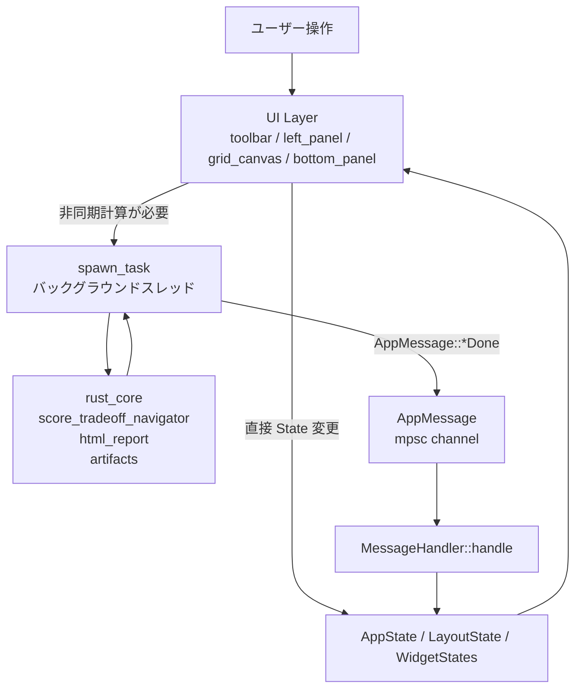
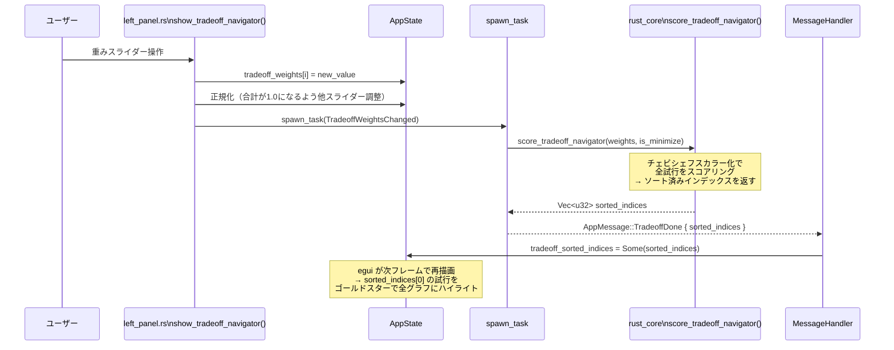
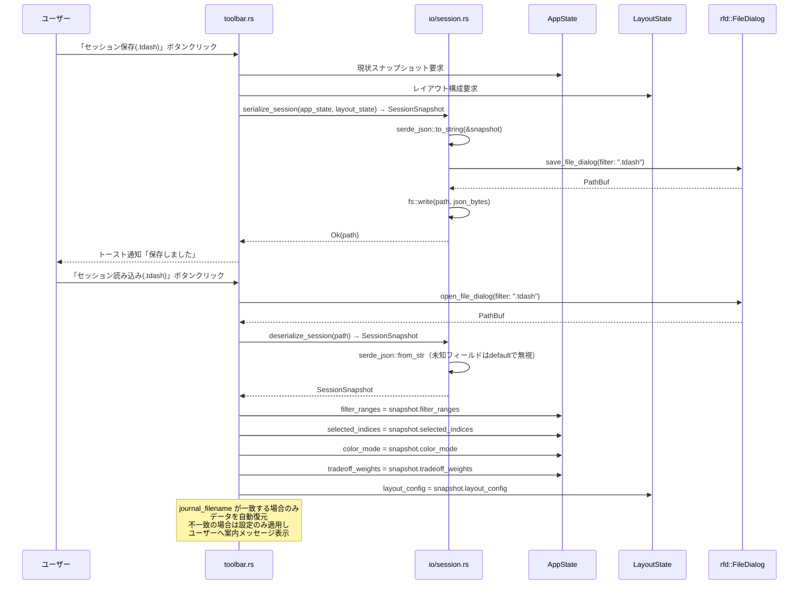
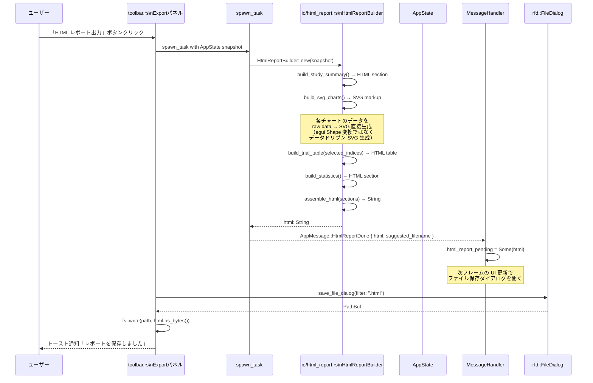
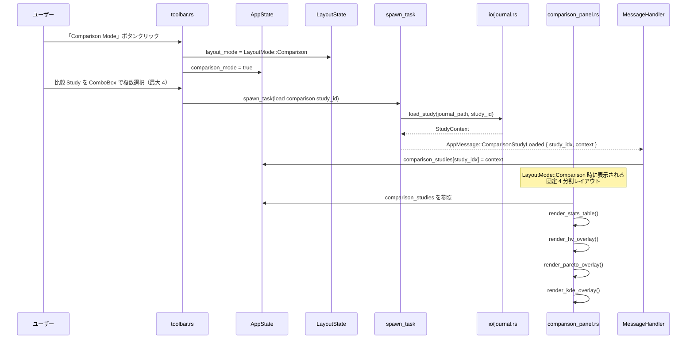
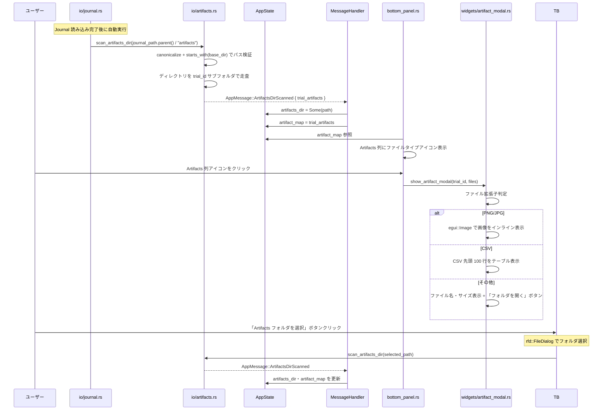
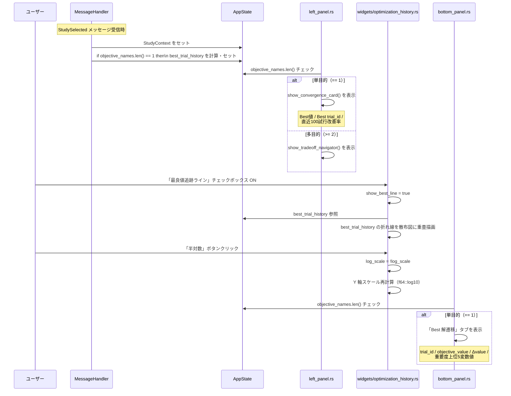
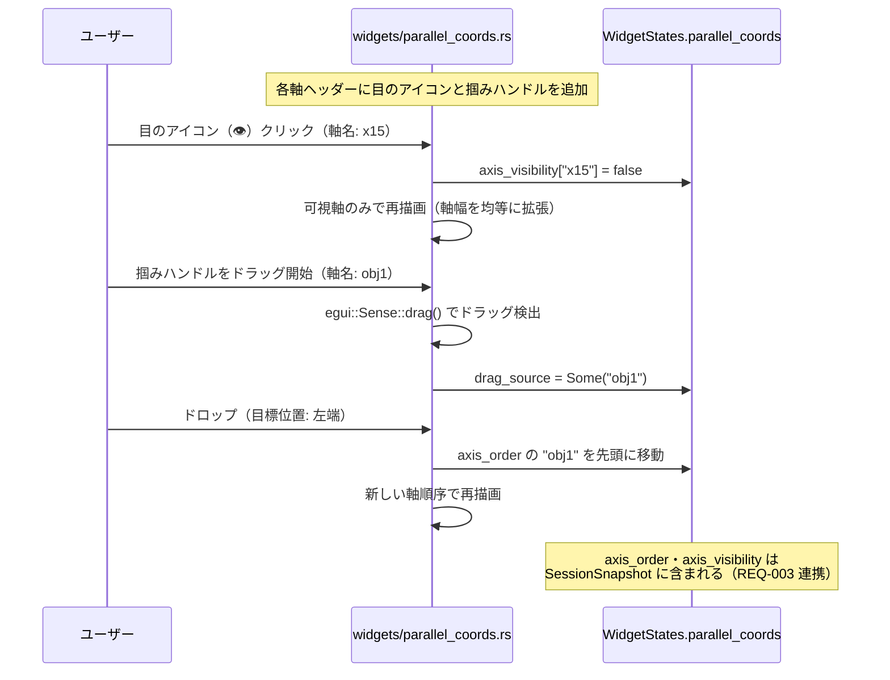
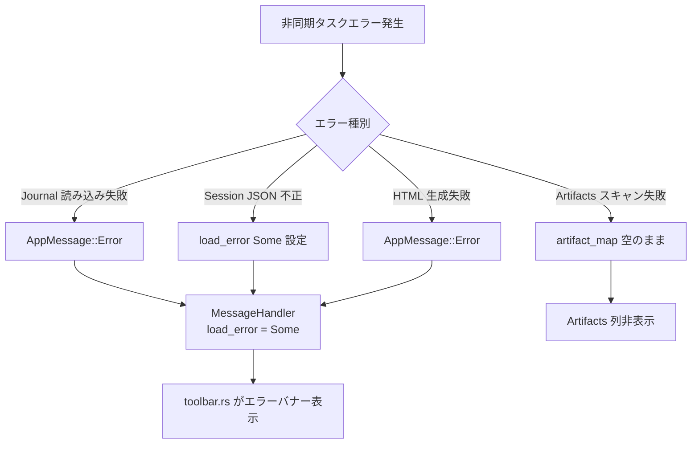

# プロプライエタリ分析ツール不足機能 データフロー図

**作成日**: 2026-04-26  
**関連アーキテクチャ**: [architecture.md](architecture.md)  
**関連要件定義**: [requirements.md](../../spec/proprietary-analysis-features/requirements.md)

**【信頼性レベル凡例】**:
- 🔵 **青信号**: EARS要件定義書・設計文書・ユーザヒアリングを参考にした確実なフロー
- 🟡 **黄信号**: EARS要件定義書・設計文書・ユーザヒアリングから妥当な推測によるフロー
- 🔴 **赤信号**: EARS要件定義書・設計文書・ユーザヒアリングにない推測によるフロー

---

## システム全体のデータフロー 🔵

**信頼性**: 🔵 *既存 `egui-app/src/app.rs` `poll_messages` パターン・要件定義より*



---

## REQ-001: Trade-off Navigator フロー 🔵

**信頼性**: 🔵 *`tradeoff.rs` 実装調査・ユーザヒアリング Q4・設計ヒアリング Q1 より*

**関連要件**: REQ-001-D, NFR-001



**詳細ステップ**:
1. `show_tradeoff_navigator()` が多目的 Study（`meta.objective_names.len() >= 2`）の場合のみ表示
2. スライダー変更時に `tradeoff_weights` を更新し自動正規化
3. `spawn_task` で非同期計算（NFR-001: 50,000 試行で 100ms 以内）
4. `TradeoffDone` 受信後、全ウィジェットは `tradeoff_sorted_indices[0]` を `highlighted_trial` として使用

---

## REQ-002/003/004: セッション保存・復元フロー 🔵

**信頼性**: 🔵 *`io/session.rs` 実装調査・ユーザヒアリング Q3・設計ヒアリング Q2 より*

**関連要件**: REQ-002, REQ-003, REQ-004



**FilterSnapshot / LayoutSnapshot 独立保存フロー**:

フィルタ単体（REQ-002）はフィルタフィールドのみ含む JSON、レイアウト単体（REQ-003）はレイアウトフィールドのみ含む JSON として保存する。.tdash（REQ-004）はその全フィールドを統合したスーパーセット。

---

## REQ-005: HTML レポート生成フロー 🔵

**信頼性**: 🔵 *ユーザヒアリング Q5・設計ヒアリング Q4・`io/export.rs` 調査より*

**関連要件**: REQ-005-A〜E, NFR-003



**SVG 生成方針 🔵**:
- `egui` の `Painter` は即時描画（Immediate Mode）のため、チャートの `Shape` 収集は実装コストが高い
- 代替として `html_report.rs` 内でチャートデータを受け取り、独立した SVG テキストを直接生成する
- 対象チャート: `StudyContext::trial_rows` のデータから Pareto 散布図・Optimization History・PCP の 3 種の簡易 SVG を生成

---

## REQ-006: 複数 Study 比較フロー 🔵

**信頼性**: 🔵 *ユーザヒアリング Q7・`LayoutMode` 調査・設計ヒアリング Q3 より*

**関連要件**: REQ-006-A〜D



---

## REQ-007: アーティファクト連携フロー 🔵

**信頼性**: 🔵 *ユーザヒアリング Q6・`first_spec.md` アーティファクト設計より*

**関連要件**: REQ-007-A〜H, NFR-201



---

## REQ-008: 単目的最適化専用 UI フロー 🔵

**信頼性**: 🔵 *ユーザヒアリング Q8・`first_spec.md` 単目的設計より*

**関連要件**: REQ-008-A〜F



---

## REQ-009: Parallel Coordinates 軸制御フロー 🔵

**信頼性**: 🔵 *ユーザヒアリング Q9・`parallel_coords.rs` 実装調査より*

**関連要件**: REQ-009-A〜C



---

## エラーハンドリングフロー 🟡

**信頼性**: 🟡 *既存 `AppMessage::Error` パターンから妥当な推測*



---

## 状態管理フロー（serde シリアライズ対象） 🔵

**信頼性**: 🔵 *REQ-002〜004・`io/session.rs` 実装調査より*

```mermaid
stateDiagram-v2
    [*] --> 初期状態: アプリ起動
    初期状態 --> Journal読み込み済み: JournalParsed
    Journal読み込み済み --> Study選択済み: StudySelected
    Study選択済み --> フィルタ適用済み: set_filter()
    Study選択済み --> Trade-offナビ: TradeoffDone
    Study選択済み --> 比較モード: LayoutMode::Comparison
    Study選択済み --> Artifacts読み込み済み: ArtifactsDirScanned

    フィルタ適用済み --> セッション保存: serialize_session()
    Trade-offナビ --> セッション保存
    比較モード --> セッション保存
    セッション保存 --> [*]: .tdash ファイル書き込み

    [*] --> セッション読み込み: deserialize_session()
    セッション読み込み --> Study選択済み: journal_filename 一致
```

---

## 信頼性レベルサマリー

- 🔵 青信号: 21件 (91%)
- 🟡 黄信号: 2件 (9%)
- 🔴 赤信号: 0件 (0%)

**品質評価**: ✅ 高品質
