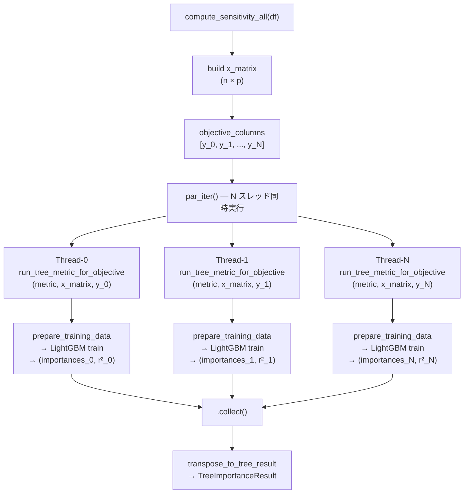
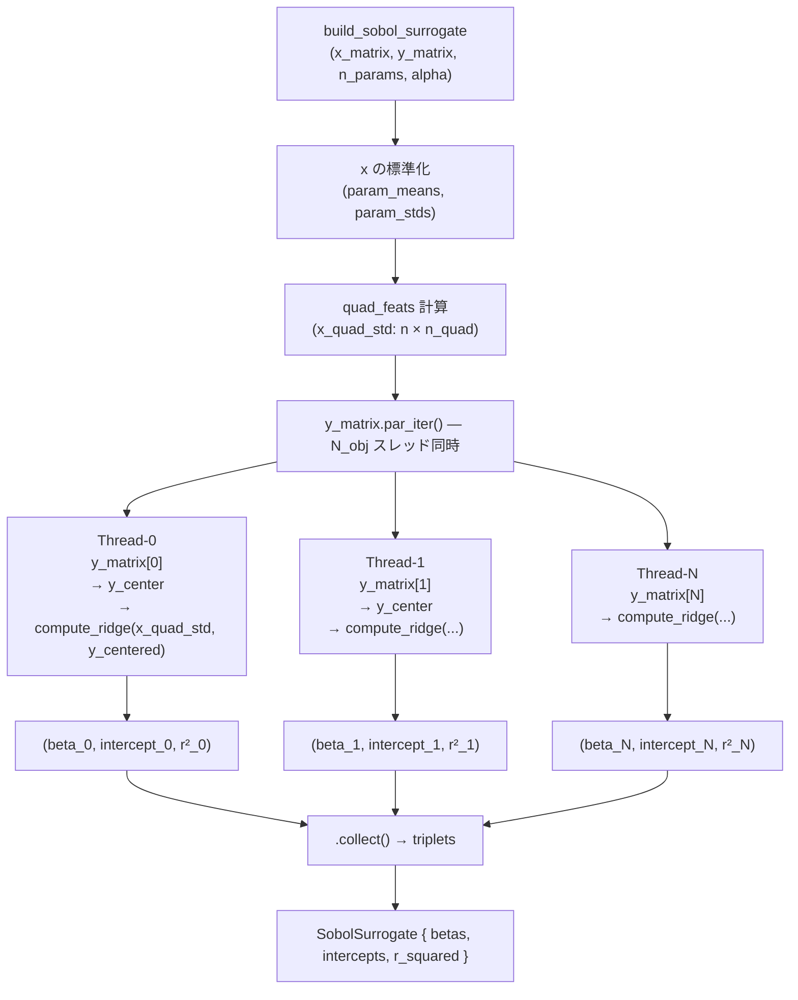
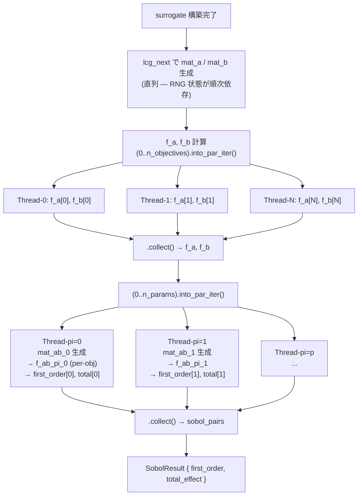
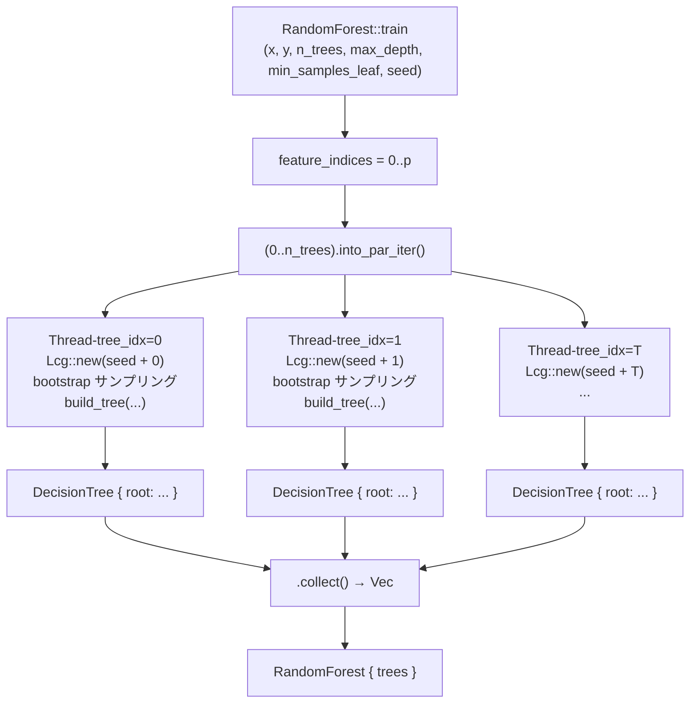
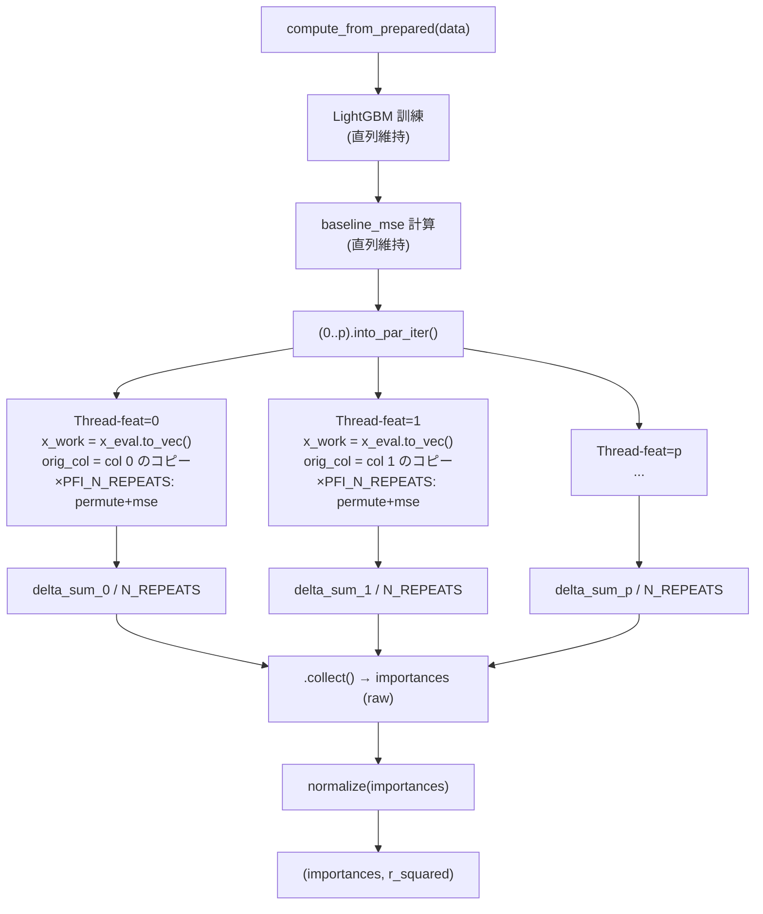
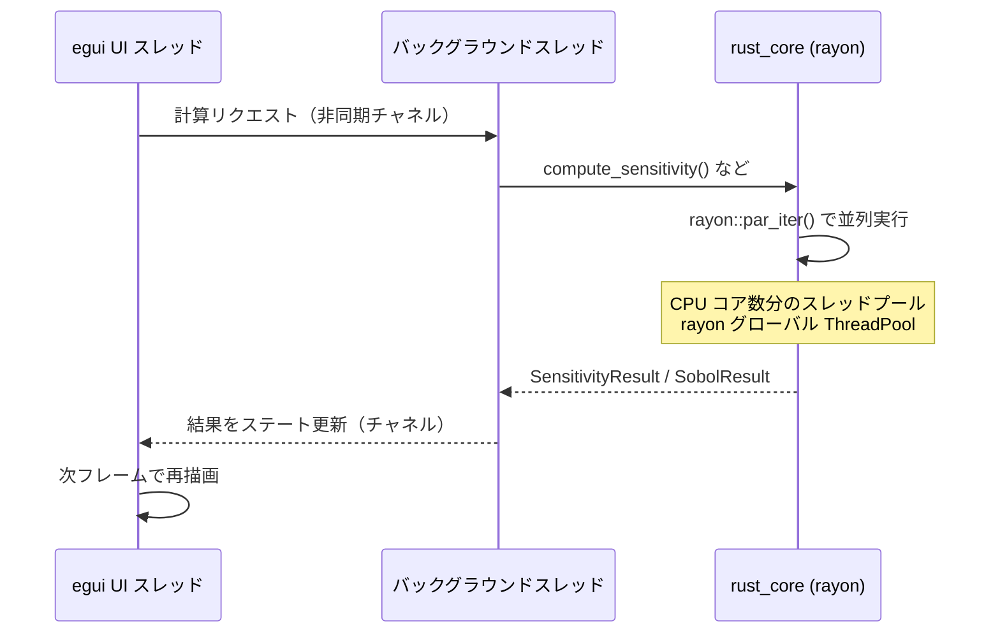

# rayon 導入による並列化高速化 データフロー図

**作成日**: 2026-05-04  
**関連要件定義**: [requirements.md](../../spec/rayon-performance-optimization/requirements.md)  
**アーキテクチャ**: [architecture.md](architecture.md)

**【信頼性レベル凡例】**:
- 🔵 **青信号**: EARS要件定義書・設計文書・ユーザヒアリングを参考にした確実な設計
- 🟡 **黄信号**: 設計文書・ユーザヒアリングから妥当な推測による設計

---

## 1. Sensitivity 目的変数ループ（REQ-001） 🔵

**信頼性**: 🔵 *コードベース調査・ユーザヒアリングより*

**共有データ（読み取り専用）**:
- `x_matrix: &[Vec<f64>]` — 全スレッドから不変参照
- `metric: &M` — `M: TreeMetric + Sync`

**スレッドローカル**:
- `PreparedData`（LightGBM 訓練・評価データ）
- LightGBM Booster インスタンス

---

## 2. Sobol 指標計算（REQ-002） 🔵

**信頼性**: 🔵 *コードベース調査・ユーザヒアリングより*

### 2-A: サロゲート構築（per-objective Ridge 並列）

### 2-B: Monte Carlo サンプリング → 指標計算（per-param 並列）

**共有データ（読み取り専用）**:
- `surrogate: SobolSurrogate`（全スレッドから `&` 参照）
- `mat_a`, `mat_b`（生成後は読み取り専用）
- `f_a`, `f_b`（per-param ループ内で読み取り専用）

**直列維持**:
- `mat_a` / `mat_b` の LCG サンプリング（`rng_state` が順次依存）

---

## 3. RandomForest 木構築（REQ-003） 🔵

**信頼性**: 🔵 *コードベース調査・ユーザヒアリングより*

**スレッドローカル**:
- `Lcg` インスタンス（`seed + tree_idx` で初期化）
- `x_boot`, `y_boot`（bootstrap サンプル）

**共有データ（読み取り専用）**:
- `x: &[Vec<f64>]`, `y: &[f64]`
- `feature_indices: &[usize]`

---

## 4. Permutation Feature Importance（REQ-004） 🔵

**信頼性**: 🔵 *コードベース調査・ユーザヒアリングより*

**スレッドローカル**:
- `x_work: Vec<Vec<f64>>`（各スレッドが `x_eval` の独立コピーを保持）
- `orig_col: Vec<f64>`

**共有データ（読み取り専用）**:
- `booster` — LightGBM prediction はスレッドセーフ
- `y_eval: &[f64]`
- `baseline_mse: f64`

---

## 全体データフロー（egui → 計算 → UI） 🔵

**信頼性**: 🔵 *egui-app コードベース調査より*

> egui UI スレッドとは独立して計算が実行されるため、UI のレスポンスは維持される。
> rayon スレッドプールのスレッド数制限は行わない（REQ-401）。
