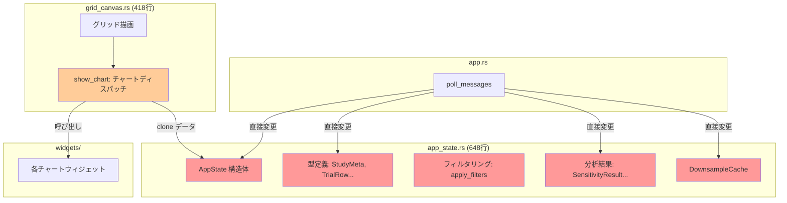
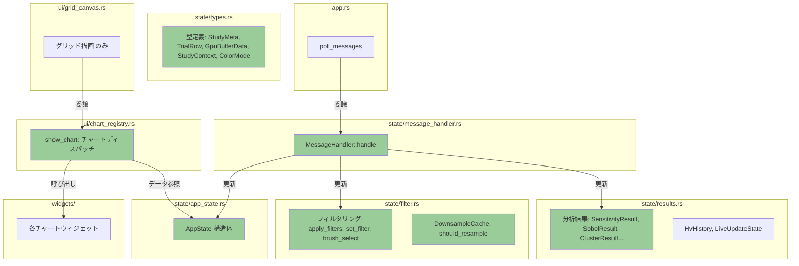
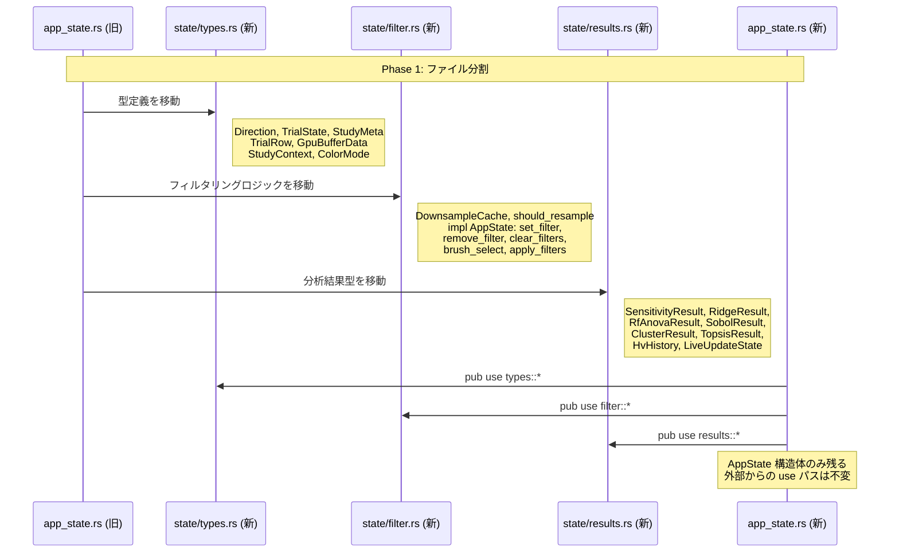
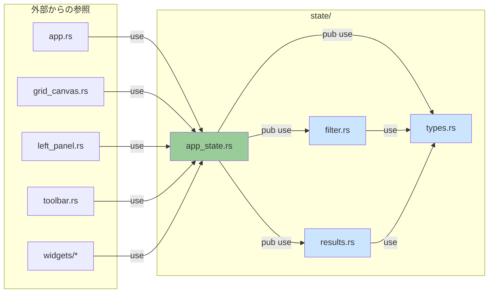
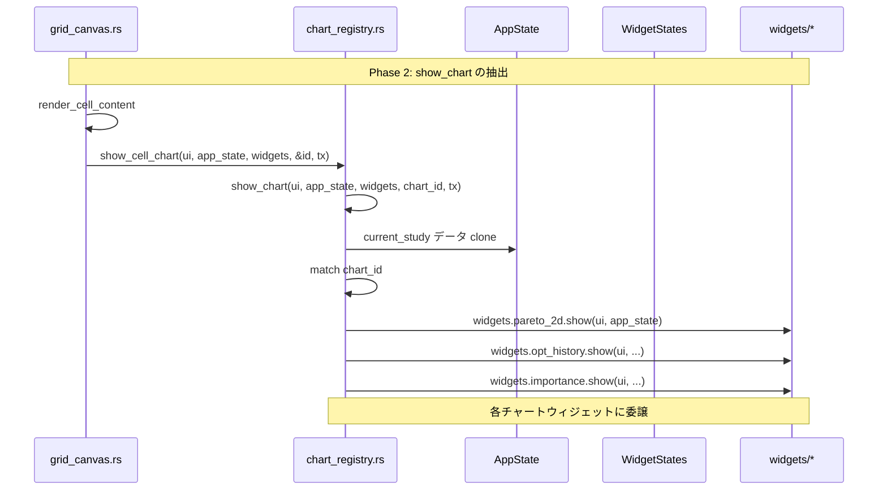
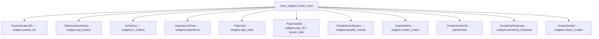
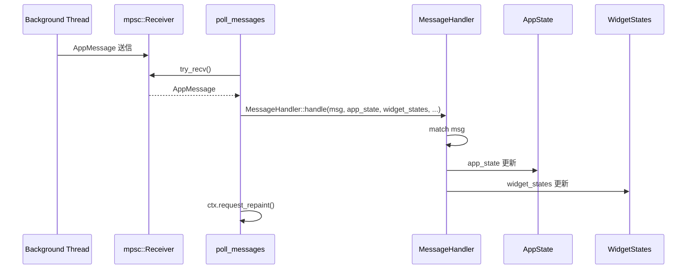
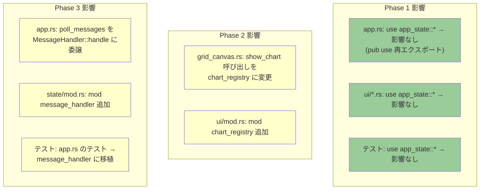

# 責務分離リファクタリング データフロー図

**作成日**: 2026-04-15
**関連アーキテクチャ**: [architecture.md](architecture.md)
**ヒアリング記録**: [design-interview.md](design-interview.md)

**【信頼性レベル凡例】**:
- 🔵 **青信号**: 既存コード分析・ユーザヒアリングを参考にした確実なフロー
- 🟡 **黄信号**: 既存コード分析・ユーザヒアリングから妥当な推測によるフロー
- 🔴 **赤信号**: 既存コード分析・ユーザヒアリングにない推測によるフロー

---

## 1. リファクタリング前のデータフロー 🔵

**信頼性**: 🔵 *既存コード分析より*

**問題**: app_state.rs が4つの関心事（型・フィルタ・結果・キャッシュ）を持つ。grid_canvas.rs が2つの関心事（グリッド描画・チャートディスパッチ）を持つ。

## 2. リファクタリング後のデータフロー 🔵

**信頼性**: 🔵 *ユーザーヒアリング・設計より*

## 3. Phase 1: 型・フィルター分離のデータフロー 🔵

**信頼性**: 🔵 *既存コード app_state.rs の分析より*

### Phase 1 の具体的な依存関係 🔵

**信頼性**: 🔵 *既存コードの use 宣言分析より*

## 4. Phase 2: チャートディスパッチ分離のデータフロー 🔵

**信頼性**: 🔵 *既存コード grid_canvas.rs:257-371 の分析より*

### chart_registry の match ブランチ 🔵

**信頼性**: 🔵 *既存コード grid_canvas.rs:293-371 より*

## 5. Phase 3: メッセージ処理分離のデータフロー 🔵

**信頼性**: 🔵 *既存コード app.rs:38-124 の分析より*

### メッセージ処理の責務マッピング 🔵

**信頼性**: 🔵 *既存コード app.rs:41-121 より*

| メッセージ | 更新先 | 更新内容 |
|---|---|---|
| `JournalParsed` | AppState | all_studies, journal_path, is_loading |
| `StudySelected` | AppState | current_study, is_loading |
| `SensitivityDone` | AppState | sensitivity_result |
| `SobolDone` | AppState | sobol_result |
| `ClusteringDone` | AppState | cluster_result |
| `TopsisDone` | AppState | topsis_result |
| `DownsampleDone` | AppState | downsample_cache |
| `HvHistoryDone` | AppState | hv_history |
| `Pdp2dDone` | WidgetStates | pdp_2d.result, pdp_2d.computing |
| `Error` | AppState | load_error, is_loading |
| `SensitivityError` | WidgetStates | importance.computing |

## 6. リファクタリングの影響範囲 🔵

**信頼性**: 🔵 *既存コードの use 宣言調査より*

### 外部モジュールへの影響

## 関連文書

- **アーキテクチャ**: [architecture.md](architecture.md)
- **型定義**: [interfaces.rs](interfaces.rs)
- **ヒアリング記録**: [design-interview.md](design-interview.md)

## 信頼性レベルサマリー

- 🔵 青信号: 10件 (91%)
- 🟡 黄信号: 1件 (9%)
- 🔴 赤信号: 0件 (0%)

**品質評価**: ✅ 高品質
