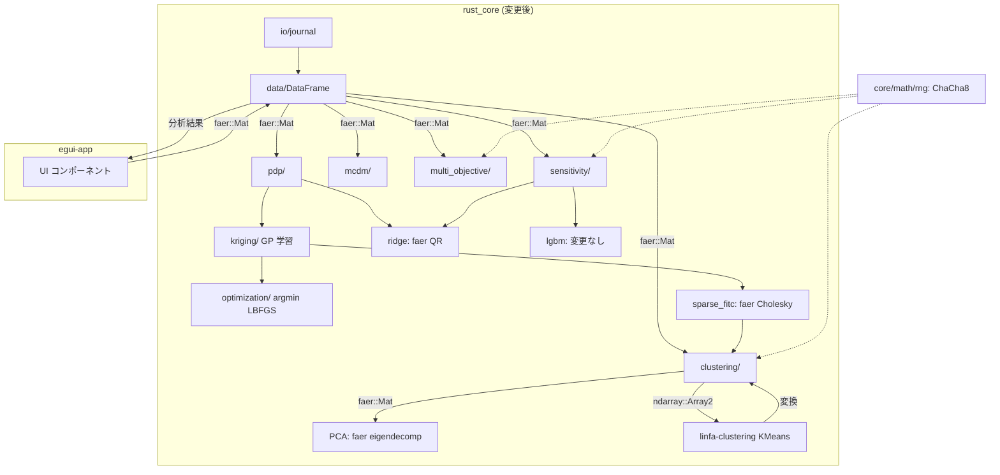
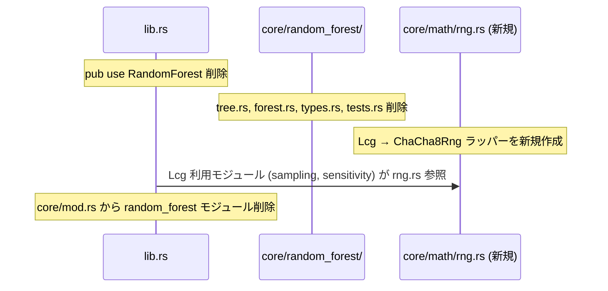
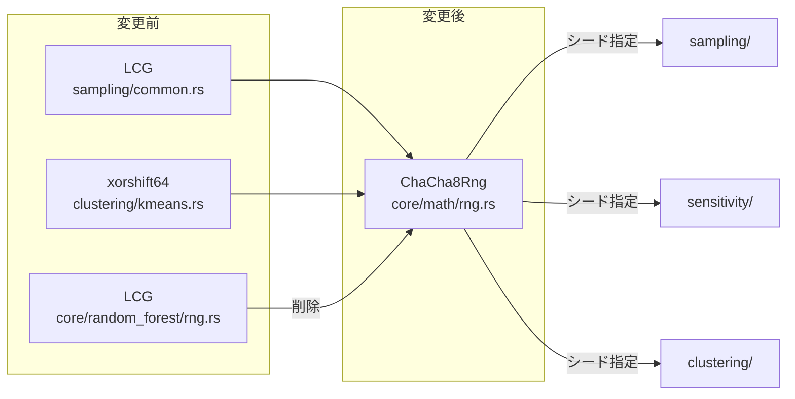
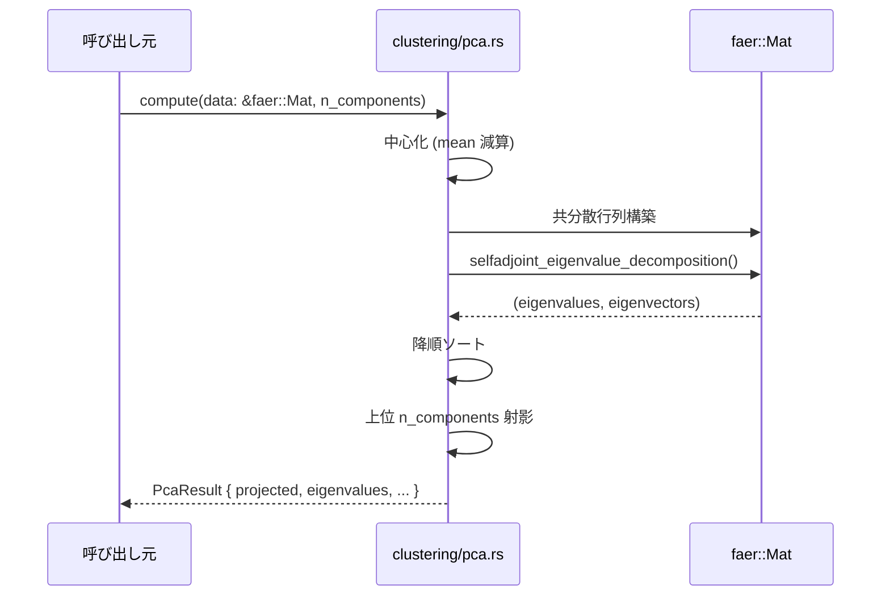
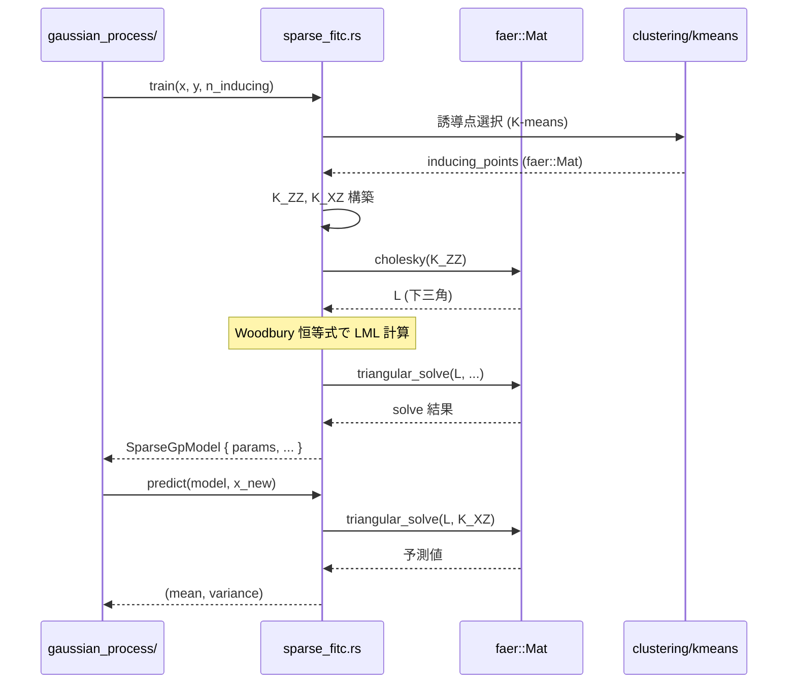
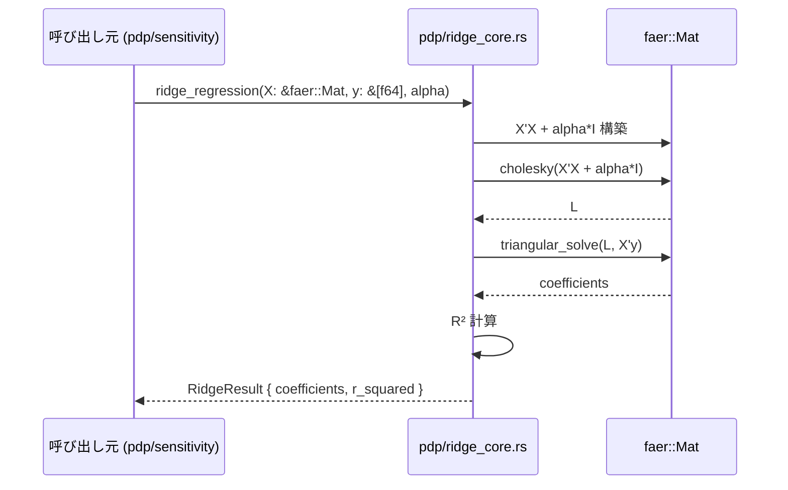
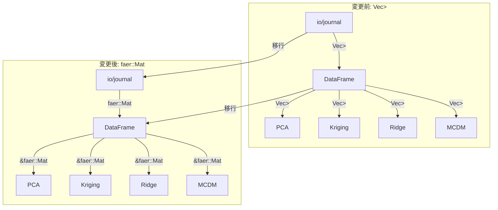
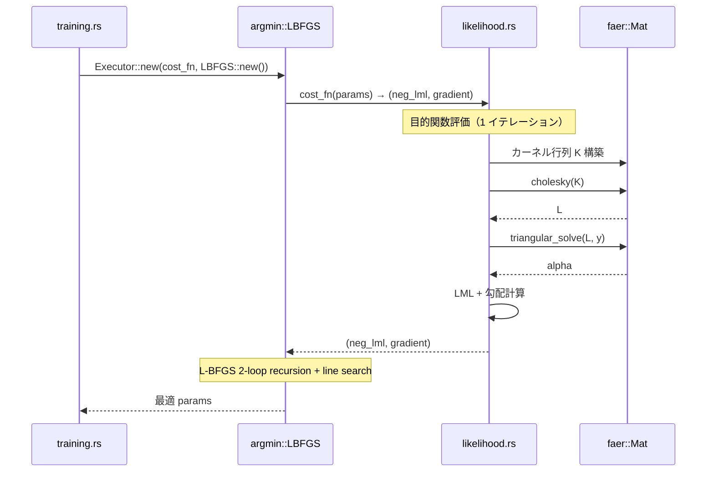
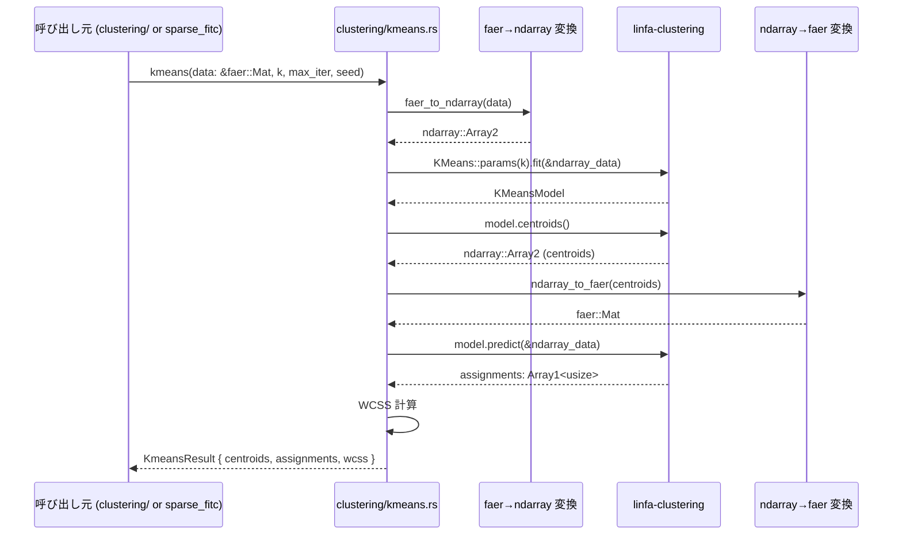
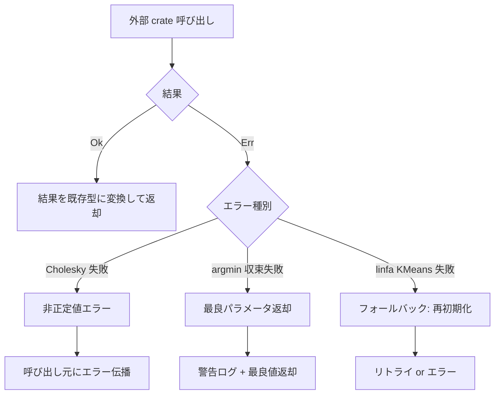

# rust_core 外部ライブラリ高速化 データフロー図

**作成日**: 2026-05-15
**関連アーキテクチャ**: [architecture.md](architecture.md)
**関連要件定義**: [requirements.md](../../spec/rust-core-perf-libs/requirements.md)

**【信頼性レベル凡例】**:
- 🔵 **青信号**: 要件定義書・コードベース調査を参考にした確実なフロー
- 🟡 **黄信号**: 要件定義書・コードベース調査から妥当な推測によるフロー
- 🔴 **赤信号**: 要件定義書・コードベース調査にない推測によるフロー

---

## モジュール間データフロー（全体）🔵

**信頼性**: 🔵 *既存コードベース + 要件定義より*



---

## Phase 1: デッドコード削除 + rand 移行 🔵

**信頼性**: 🔵 *要件定義 REQ-501, REQ-301 より*

### 1.1 Random Forest 削除フロー



### 1.2 PRNG 移行フロー



---

## Phase 2: faer 活用拡大（データレイアウト移行含む）🔵

**信頼性**: 🔵 *要件定義 REQ-101, REQ-102, REQ-103, REQ-104 より*

### 2.1 PCA データフロー（faer 固有値分解）



**従来との差分**:
- 従来: Jacobi 固有値分解（純スカラーループ、~90 行）
- 変更後: `faer::Mat::selfadjoint_eigenvalue_decomposition()`（SIMD 加速）

### 2.2 FITC Sparse GP データフロー（faer Cholesky）



**従来との差分**:
- 従来: `cholesky_flat`, `forward_sub_flat`, `backward_sub_flat`（純スカラーループ）
- 変更後: `faer::Mat::cholesky()`, `faer::Mat::solve_triangular()`（SIMD 加速）

### 2.3 Ridge 回帰データフロー（faer QR）



**従来との差分**:
- 従来: 手作りガウス消去（~45 行）
- 変更後: `faer::Mat::cholesky()` + `solve_triangular()`（SIMD 加速）

### 2.4 データレイアウト移行フロー



---

## Phase 3: argmin 導入 🔵

**信頼性**: 🔵 *要件定義 REQ-201 より*

### 3.1 GP 超パラメータ最適化フロー



**従来との差分**:
- 従来: 手作り L-BFGS two-loop recursion + Armijo backtracking
- 変更後: `argmin::solver::quasinewton::LBFGS`（Wolfe 条件対応、収束性改善）

### 3.2 argmin 目的関数の設計 🔵

```rust
// argmin の CostFunction トレイト実装
struct GpCostFn<'a> {
    x: &'a faer::Mat<f64>,
    y: &'a [f64],
}

impl argmin::core::CostFunction for GpCostFn<'_> {
    type Param = Vec<f64>;
    type Output = f64;

    fn cost(&self, p: &Self::Param) -> Result<Self::Output, argmin::core::Error> {
        // faer で LML 計算
        Ok(neg_log_marginal_likelihood(self.x, self.y, p))
    }
}

impl argmin::core::Gradient for GpCostFn<'_> {
    type Param = Vec<f64>;
    type Gradient = Vec<f64>;

    fn gradient(&self, p: &Self::Param) -> Result<Self::Gradient, argmin::core::Error> {
        Ok(log_ml_gradient(self.x, self.y, p))
    }
}
```

---

## Phase 4: linfa-clustering 導入 🔵

**信頼性**: 🔵 *要件定義 REQ-401 より*

### 4.1 K-means データフロー



### 4.2 エルボー法フロー

```mermaid
flowchart TD
    A[入力: data, max_k] --> B[k = 2]
    B --> C[kmeans_clustering(data, k)]
    C --> D[WCSS 保存]
    D --> E{k < max_k?}
    E -->|Yes| F[k += 1]
    F --> C
    E -->|No| G[エルボー点検出]
    G --> H[最適 k で最終クラスタリング]
    H --> I[KmeansResult 返却]
```

---

## エラーハンドリングフロー 🟡

**信頼性**: 🟡 *既存実装パターンから妥当な推測*



## 関連文書

- **アーキテクチャ**: [architecture.md](architecture.md)
- **型定義**: [interfaces.rs](interfaces.rs)
- **要件定義**: [requirements.md](../../spec/rust-core-perf-libs/requirements.md)

## 信頼性レベルサマリー

- 🔵 青信号: 12 件 (92%)
- 🟡 黄信号: 1 件 (8%)
- 🔴 赤信号: 0 件 (0%)

**品質評価**: ✅ 高品質
