# rust-core-refactoring データフロー図

**作成日**: 2026-05-14
**関連アーキテクチャ**: [architecture.md](architecture.md)
**関連要件定義**: [requirements.md](../../spec/rust-core-refactoring/requirements.md)

**【信頼性レベル凡例】**:
- 🔵 **青信号**: EARS要件定義書・設計文書・ユーザヒアリングを参考にした確実なフロー
- 🟡 **黄信号**: EARS要件定義書・設計文書・ユーザヒアリングから妥当な推測によるフロー
- 🔴 **赤信号**: EARS要件定義書・設計文書・ユーザヒアリングにない推測によるフロー

---

## 1. 感度分析ディスパッチ: リファクタリング前後 🔵

**信頼性**: 🔵 *REQ-A01〜A03・B01・コード分析 sensitivity/analysis/full.rs より*

### 変更前（279行、match 6アーム）

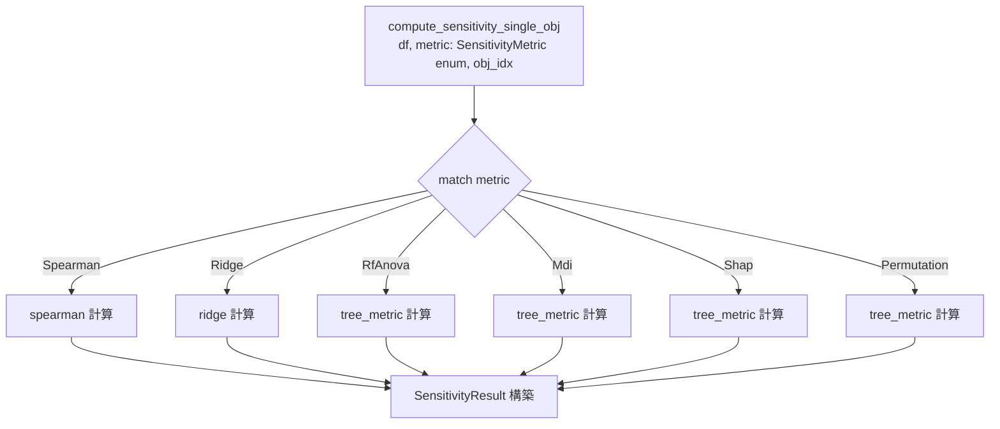

### 変更後（150行以内、trait dispatch）

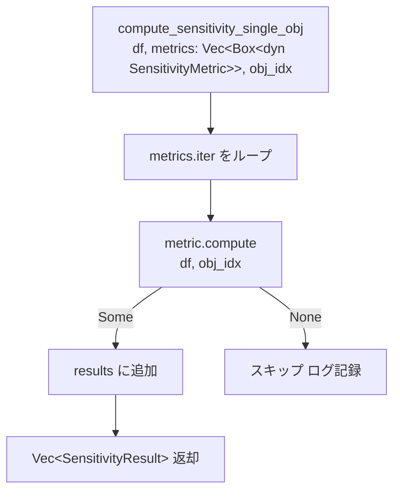

**関連要件**: REQ-A01, REQ-A02, REQ-A03, REQ-B01

---

## 2. SensitivityMetric トレイト呼び出しフロー 🔵

**信頼性**: 🔵 *REQ-A01・A02・ユーザーストーリー A-1 より*

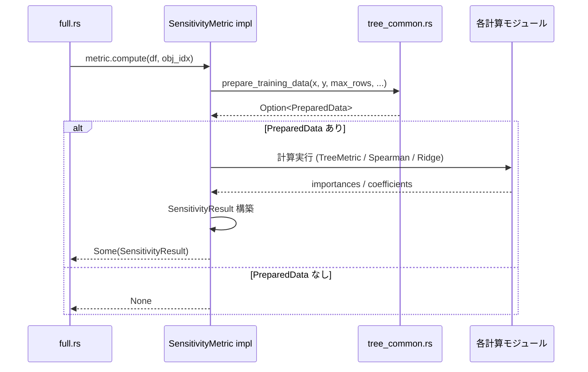

---

## 3. SamplingContext: グローバル状態廃止フロー 🔵

**信頼性**: 🔵 *REQ-C05〜C08・ユーザーヒアリング・ユーザーストーリー C-1 より*

### 変更前（thread_local グローバル状態）

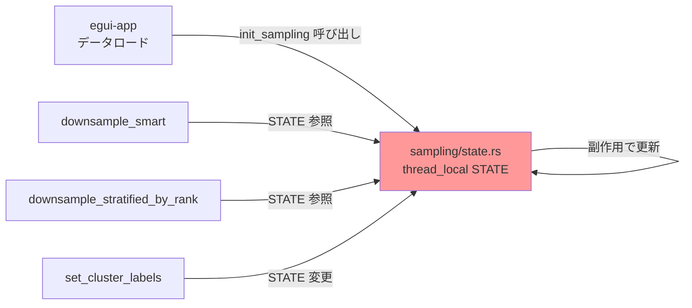

### 変更後（SamplingContext 値型）

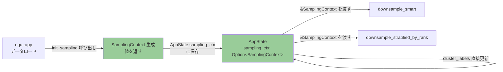

**SamplingContext ライフサイクル**:

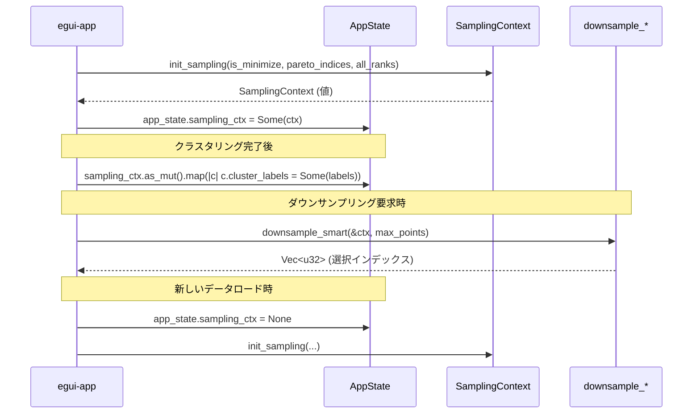

---

## 4. k-means 初期化: select_next_centroid 抽出フロー 🔵

**信頼性**: 🔵 *REQ-A06・A07・コード分析 clustering/kmeans.rs より*

### 変更前（80% コード重複）

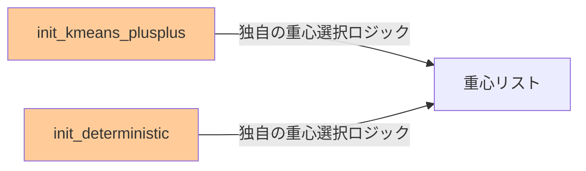

### 変更後（共通関数を共有）

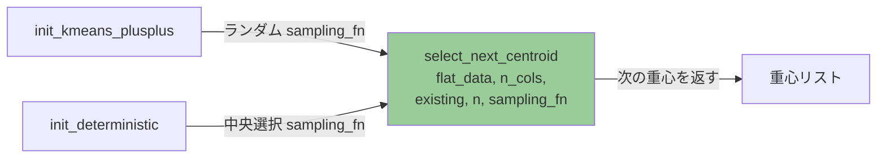

**select_next_centroid の処理**:

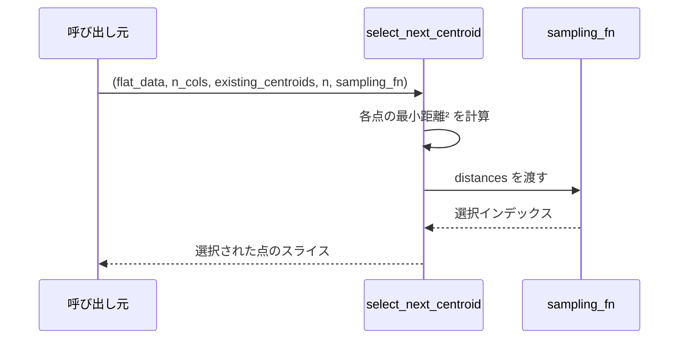

---

## 5. クラスタ統計: 3 関数分割フロー 🔵

**信頼性**: 🔵 *REQ-B03・コード分析 clustering/stats.rs より*

### 変更前（89行の単一関数）

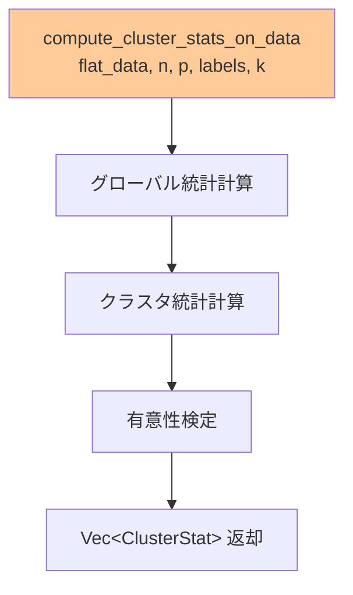

### 変更後（3 独立関数 + オーケストレーター）

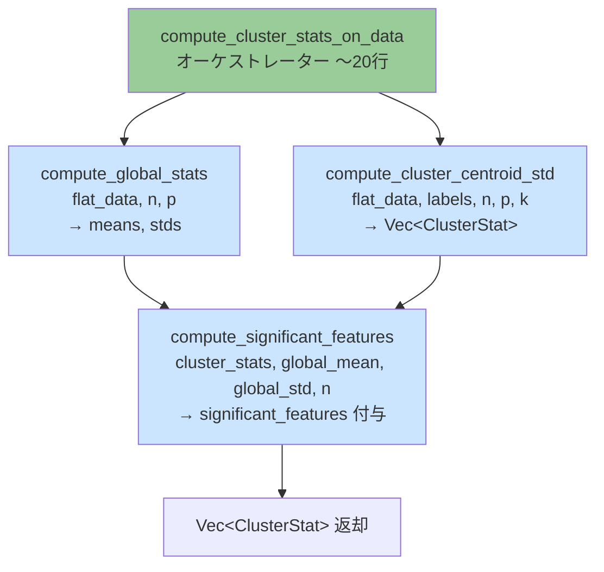

---

## 6. Ridge 回帰: 3 関数分割フロー 🔵

**信頼性**: 🔵 *REQ-B04・コード分析 sensitivity/ridge.rs より*

### 変更前（55行の複合関数）

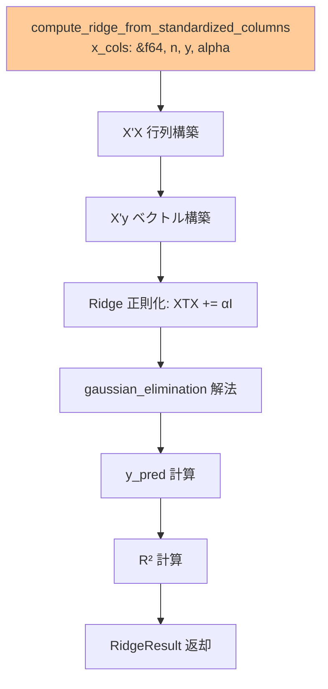

### 変更後（3 独立関数）

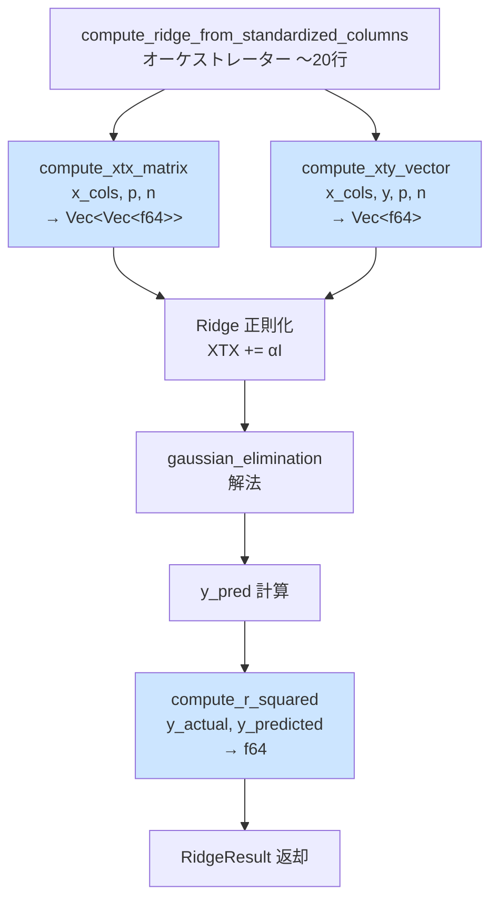

---

## 7. GpModel 分割フロー 🟡

**信頼性**: 🟡 *REQ-B05・コード分析 gaussian_process/model.rs から妥当な推測*

### 変更前（超パラメータと訓練データの混在）

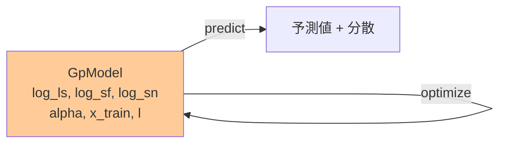

### 変更後（責務分離）

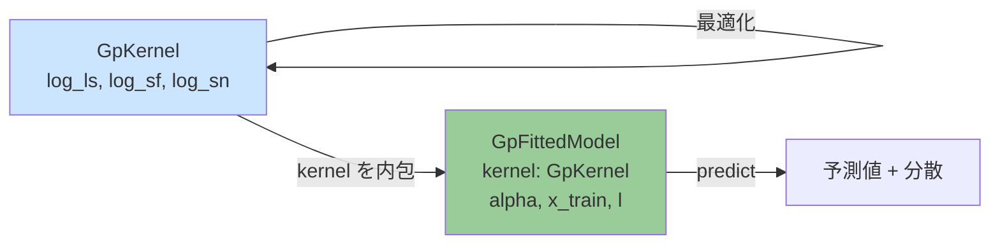

---

## 8. TOPSIS 行列構築: 効率化フロー 🔵

**信頼性**: 🔵 *REQ-C03・コード分析 mcdm/topsis.rs より*

### 変更前（行ごとの push）

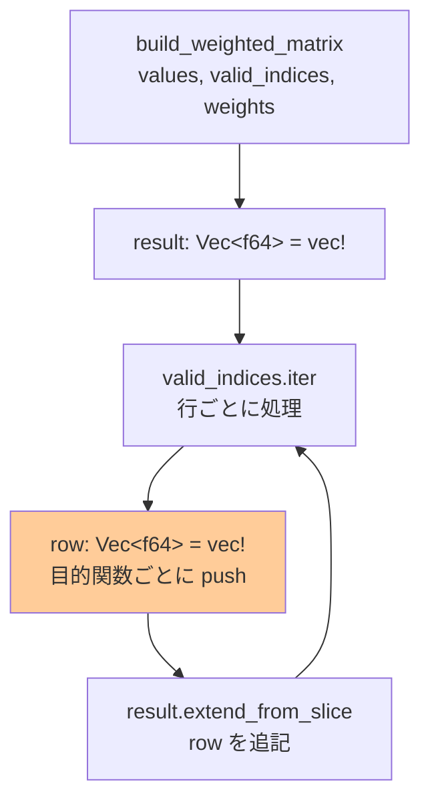

### 変更後（単一アロケーション）

```mermaid
flowchart TD
    A[build_weighted_matrix\nvalues, valid_indices, weights] --> B[result = vec!\n0.0; n_valid * n_objectives\n単一アロケーション]
    B --> C[valid_indices.iter_enumerate\nidx, original_row]
    C --> D[インデックス代入\nresult[idx*n_objectives + j] = ...]
    D --> C
    style B fill:#99cc99
```

---

## 9. Pearson 相関: 移動フロー 🔵

**信頼性**: 🔵 *REQ-A04・A05・コード分析 sensitivity/spearman.rs より*

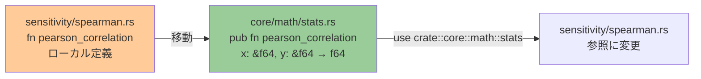

---

## 10. egui-app 側の変更フロー 🔵

**信頼性**: 🔵 *REQ-C08・ユーザーストーリー C-1 より*

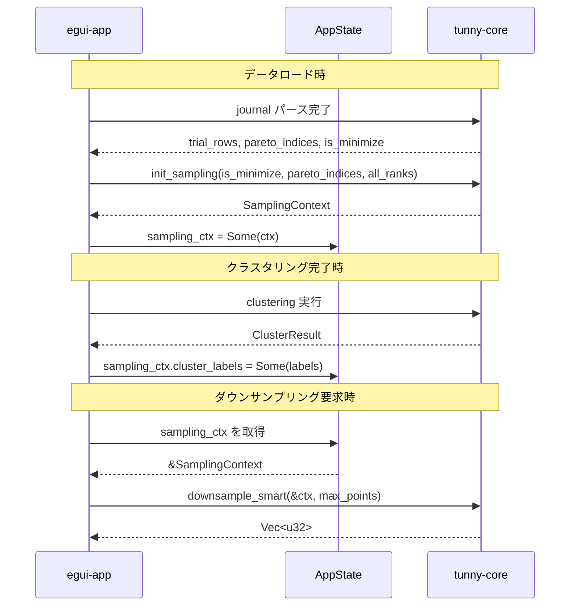

---

## 関連文書

- **アーキテクチャ**: [architecture.md](architecture.md)
- **型定義**: [interfaces.rs](interfaces.rs)
- **ヒアリング記録**: [design-interview.md](design-interview.md)

---

## 信頼性レベルサマリー

- 🔵 青信号: 9件 (90%)
- 🟡 黄信号: 1件 (10%)
- 🔴 赤信号: 0件 (0%)

**品質評価**: ✅ 高品質
