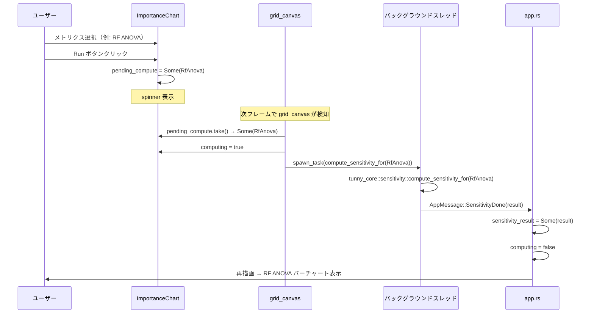
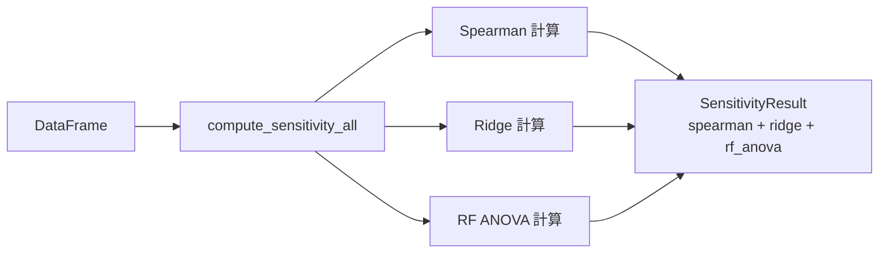
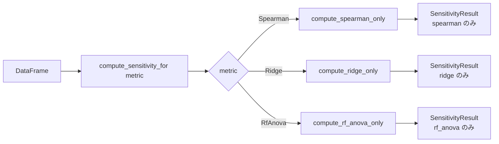
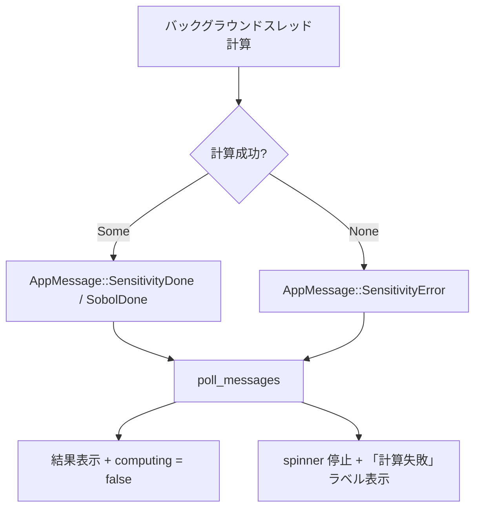

# sensitivity-all-models データフロー図

**作成日**: 2026-04-15
**関連アーキテクチャ**: [architecture.md](architecture.md)

**【信頼性レベル凡例】**:
- 🔵 **青信号**: 既存実装・ユーザヒアリングを参考にした確実なフロー
- 🟡 **黄信号**: 妥当な推測によるフロー

---

## 全体データフロー 🔵

**信頼性**: 🔵 *既存 PdpChart2D 実装パターンより*

```mermaid
flowchart TD
    U[ユーザー: メトリクス選択 + Run クリック]
    IC[ImportanceChart::show]
    PC[pending_compute = Some(metric)]
    GC[grid_canvas::show_chart]
    SPAWN{メトリクス種別}
    CF_S[compute_sensitivity_for Spearman]
    CF_R[compute_sensitivity_for Ridge]
    CF_RF[compute_sensitivity_for RfAnova]
    CF_SO[compute_sobol 1024]
    MSG_S[AppMessage::SensitivityDone]
    MSG_SO[AppMessage::SobolDone]
    APP[app.rs poll_messages]
    STATE_S[AppState::sensitivity_result]
    STATE_SO[AppState::sobol_result]
    DISP[ImportanceChart 表示更新]

    U --> IC
    IC --> PC
    PC --> GC
    GC --> SPAWN
    SPAWN -->|Spearman| CF_S
    SPAWN -->|Ridge| CF_R
    SPAWN -->|RfAnova| CF_RF
    SPAWN -->|Sobol| CF_SO
    CF_S --> MSG_S
    CF_R --> MSG_S
    CF_RF --> MSG_S
    CF_SO --> MSG_SO
    MSG_S --> APP
    MSG_SO --> APP
    APP --> STATE_S
    APP --> STATE_SO
    STATE_S --> IC
    STATE_SO --> IC
    IC --> DISP
```

---

## ユーザーが Run をクリックしたときのフロー 🔵

**信頼性**: 🔵 *ユーザーヒアリング・PdpChart2D パターンより*



---

## rust_core リファクタリング後のフロー 🔵

**信頼性**: 🔵 *full.rs 既存実装の構造より*

### 変更前（一括計算）



### 変更後（選択計算）



`compute_sensitivity_all` は変更なし（後方互換）。

---

## ImportanceChart 内部表示ロジック（全メトリクス対応後） 🔵

**信頼性**: 🔵 *既存 compute_sorted_importance 実装 + ユーザーヒアリングより*

```mermaid
flowchart TD
    M{selected_metric}
    S[sensitivity.spearman\nparam × obj]
    R[sensitivity.ridge\[obj\].beta]
    RF[sensitivity.rf_anova\n.importances\[param\]\[obj\]]
    SO[sobol.first_order\[param\]\[obj\]]
    NA_S[データなし表示\n例: Run が必要]
    SORT[絶対値降順ソート]
    BAR[バーチャート描画]

    M -->|Spearman| S
    M -->|Ridge| R
    M -->|RfAnova| RF
    M -->|Sobol| SO
    S -->|Some| SORT
    R -->|Some| SORT
    RF -->|Some| SORT
    SO -->|Some| SORT
    S -->|None| NA_S
    R -->|None| NA_S
    RF -->|None| NA_S
    SO -->|None| NA_S
    SORT --> BAR
```

---

## メトリクス別データソース対応表 🔵

**信頼性**: 🔵 *既存型定義・ユーザーヒアリングより*

| ImportanceMetric | rust_core 計算関数 | SensitivityResult フィールド | AppMessage |
|--|--|--|--|
| Spearman | `compute_sensitivity_for(Spearman)` | `spearman[param][obj]` | SensitivityDone |
| Ridge | `compute_sensitivity_for(Ridge)` | `ridge[obj].beta[param]` | SensitivityDone |
| RfAnova | `compute_sensitivity_for(RfAnova)` | `rf_anova.importances[param][obj]` | SensitivityDone |
| Sobol | `compute_sobol(1024)` | `sobol_result.first_order[param][obj]` | SobolDone |

---

## エラーハンドリングフロー 🟡

**信頼性**: 🟡 *既存パターンから妥当な推測*



---

## 信頼性レベルサマリー

- 🔵 青信号: 6件 (86%)
- 🟡 黄信号: 1件 (14%)
- 🔴 赤信号: 0件 (0%)

**品質評価**: ✅ 高品質
