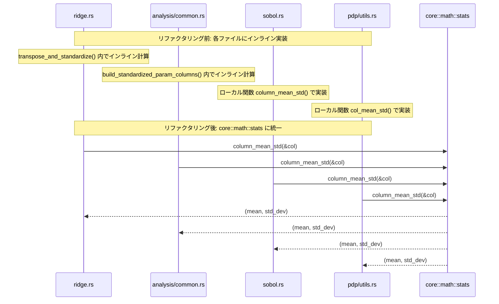
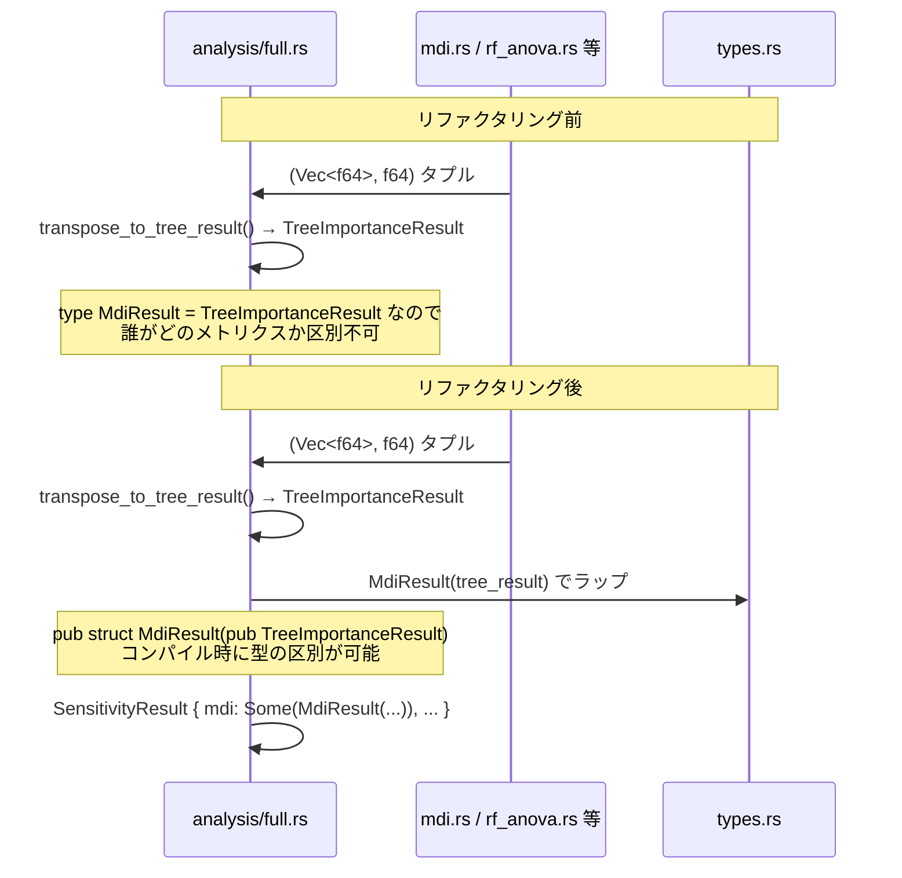
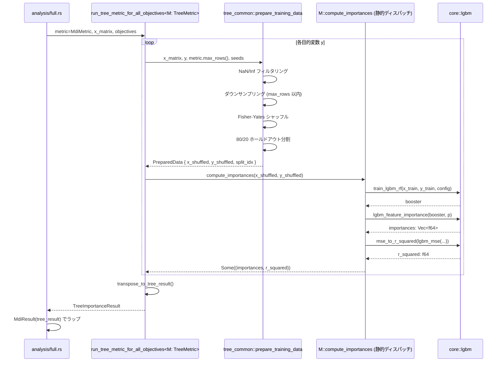
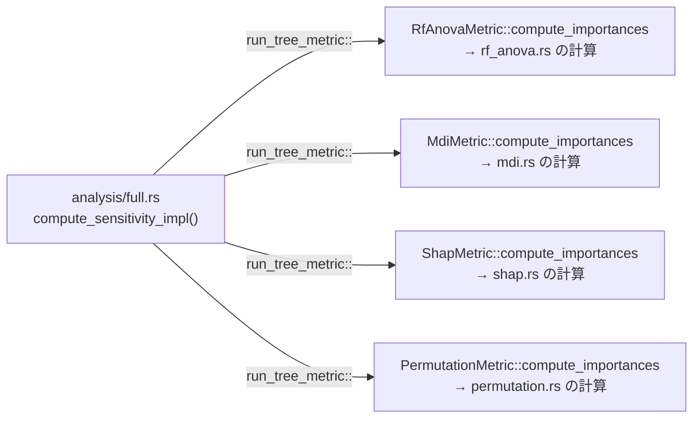
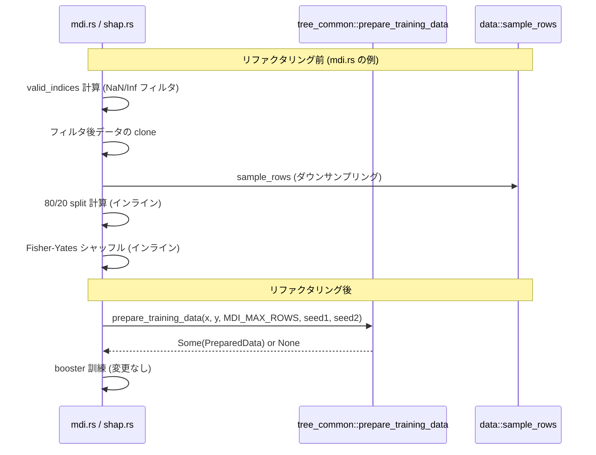
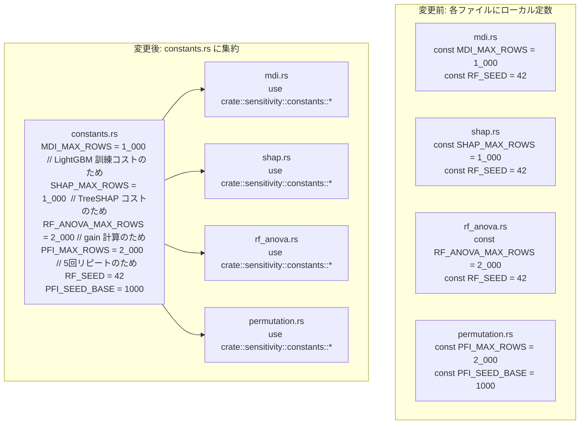
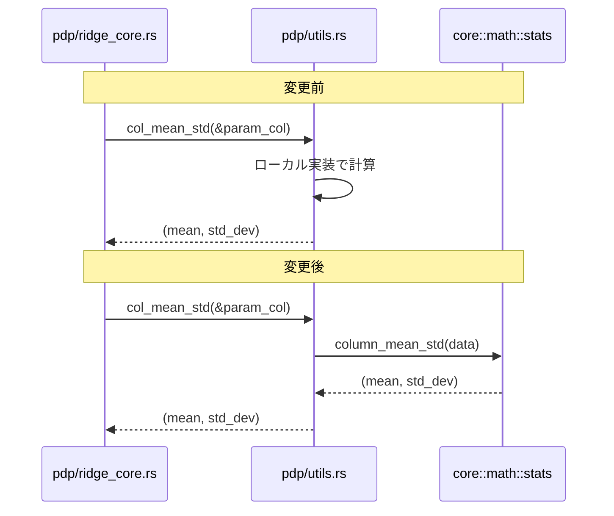

# sensitivity-refactoring データフロー図

**作成日**: 2026-05-04
**関連アーキテクチャ**: [architecture.md](architecture.md)
**関連要件定義**: [requirements.md](../../spec/sensitivity-refactoring/requirements.md)

**【信頼性レベル凡例】**:
- 🔵 **青信号**: EARS要件定義書・コード分析・ユーザヒアリングを参考にした確実なフロー
- 🟡 **黄信号**: EARS要件定義書・コード分析・ユーザヒアリングから妥当な推測によるフロー
- 🔴 **赤信号**: EARS要件定義書・コード分析・ユーザヒアリングにない推測によるフロー

---

## 変更箇所の全体マップ 🔵

**信頼性**: 🔵 *コード分析・ユーザヒアリングより*

```mermaid
graph TB
    subgraph NEW["新規作成"]
        STATS["core/math/stats.rs\ncolumn_mean_std()"]
        CONSTS["sensitivity/constants.rs\nMAX_ROWS, シード定数"]
        METRICS["sensitivity/metrics.rs\nTreeMetric trait"]
    end

    subgraph MODIFIED["既存ファイルの変更"]
        RIDGE["sensitivity/ridge.rs\ntranspose_and_standardize()"]
        COMMON["sensitivity/analysis/common.rs\nbuild_standardized_param_columns()"]
        SOBOL["sensitivity/sobol.rs\ncolumn_mean_std() 削除"]
        PDPUTILS["pdp/utils.rs\ncol_mean_std() 委譲"]
        TYPES["sensitivity/types.rs\nNewtype 変更"]
        MDI["sensitivity/mdi.rs\nprepare_training_data 使用"]
        SHAP["sensitivity/shap.rs\nprepare_training_data 使用"]
        RFANOVA["sensitivity/rf_anova.rs\nconsts をインポート"]
        PFI["sensitivity/permutation.rs\nconsts をインポート"]
        FULL["sensitivity/analysis/full.rs\nTreeMetric 静的ディスパッチ"]
        SELECTED["sensitivity/analysis/selected.rs\nTreeMetric 静的ディスパッチ"]
    end

    STATS --> RIDGE
    STATS --> COMMON
    STATS --> SOBOL
    STATS --> PDPUTILS
    CONSTS --> MDI
    CONSTS --> SHAP
    CONSTS --> RFANOVA
    CONSTS --> PFI
    METRICS --> FULL
    METRICS --> SELECTED
    TYPES --> FULL
    TYPES --> SELECTED
```



---

## 1. `column_mean_std` の統一フロー 🔵

**信頼性**: 🔵 *REQ-001/002・コード分析（4箇所の重複）より*



### `column_mean_std` の入出力仕様 🔵

**信頼性**: 🔵 *既存4実装の動作を統合・EDGE-001より*

| 入力 | 出力 | 備考 |
|------|------|------|
| `[1.0, 2.0, 3.0]` | `(2.0, 0.8165...)` | 通常ケース |
| `[5.0, 5.0, 5.0]` | `(5.0, 1.0)` | std=0 → 1.0 固定 |
| `[]` (空) | `(0.0, 1.0)` | pdp の既存動作に統一 |
| `[3.0]` (単一要素) | `(3.0, 1.0)` | std=0 → 1.0 固定 |

---

## 2. Newtypeパターン導入のデータフロー 🔵

**信頼性**: 🔵 *REQ-003・ユーザヒアリングより*



### Newtype導入後のアクセスパターン 🔵

**信頼性**: 🔵 *REQ-003-2・コード分析より*

```rust
// 旧アクセス（型エイリアスの場合）
let result: SensitivityResult = ...;
result.mdi.as_ref().map(|r| &r.importances);     // TreeImportanceResult に直接アクセス

// 新アクセス（Newtypeの場合）
result.mdi.as_ref().map(|r| &r.0.importances);   // .0 を経由してアクセス
result.mdi.as_ref().map(|r| &r.0.r_squared);
```

---

## 3. TreeMetric Trait によるメトリクス計算フロー 🔵

**信頼性**: 🔵 *REQ-004・ユーザヒアリング: 静的ディスパッチ*



### 静的ディスパッチの型パラメータフロー 🔵

**信頼性**: 🔵 *ユーザヒアリング: 静的ディスパッチ採用より*



コンパイラが各 `M` に対してモノモーフィズムでコードを生成 → vtable オーバーヘッドなし

---

## 4. mdi.rs / shap.rs の前処理統一フロー 🔵

**信頼性**: 🔵 *ユーザヒアリング: prepare_training_data に統一*



**削減されるコード量（推定）**: mdi.rs と shap.rs それぞれ約50〜60行 → `prepare_training_data` 呼び出し1行へ

---

## 5. 定数フローの変更 🔵

**信頼性**: 🔵 *REQ-005・ユーザヒアリング: constants.rs 新規作成*



---

## 6. pdp/utils.rs の変更フロー 🔵

**信頼性**: 🔵 *REQ-002-4・ユーザヒアリング: pdpも包含*



`pdp/utils.rs` の `col_mean_std` は `pub(super)` として残し中身を委譲、または `core::math::stats` を直接呼び出すように変更。`pdp/ridge_core.rs` の呼び出し箇所は変更不要。

---

## エラーハンドリングフロー 🔵

**信頼性**: 🔵 *EDGE-001〜003・既存実装の Option<T> パターンより*

```mermaid
flowchart TD
    A[TreeMetric::compute_importances 呼び出し] --> B{PreparedData が None?}
    B -->|はい: データ不足| C["(vec![0.0; p], 0.0) を返す"]
    B -->|いいえ| D{LightGBM 訓練成功?}
    D -->|いいえ: Noneを返す| E["(vec![0.0; p], 0.0) を返す"]
    D -->|はい| F[importance + R² 計算]
    F --> G{importances の sum が 0?}
    G -->|はい| H["全て 0.0 のまま返す"]
    G -->|いいえ| I[normalize: 合計が 1.0 になるよう正規化]
    I --> J["Some((importances, r_squared))"]
    C --> K[SensitivityResult の対応フィールド = None に設定]
    E --> K
    J --> L[SensitivityResult の対応フィールド = Some(XxxResult(result)) に設定]
```

---

## 信頼性レベルサマリー

- 🔵 青信号: 8件 (100%)
- 🟡 黄信号: 0件 (0%)
- 🔴 赤信号: 0件 (0%)

**品質評価**: ✅ 高品質
