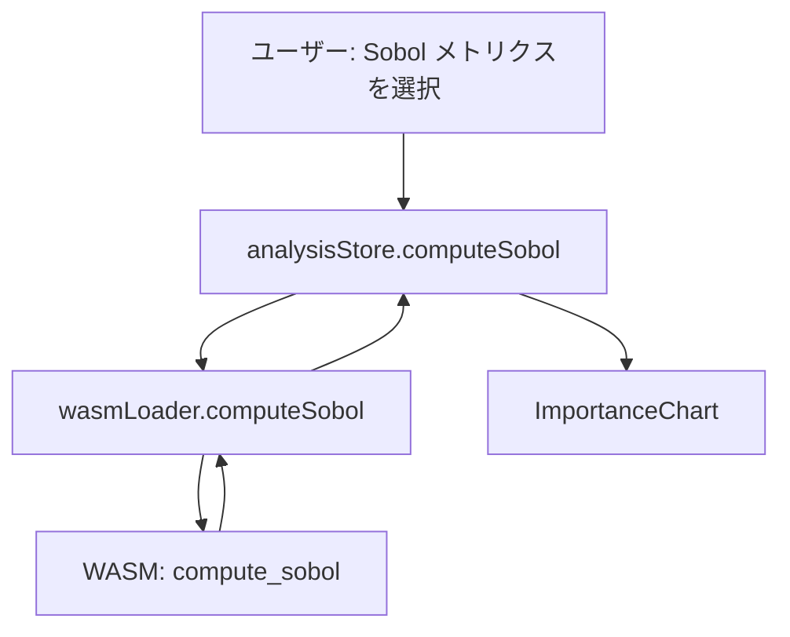
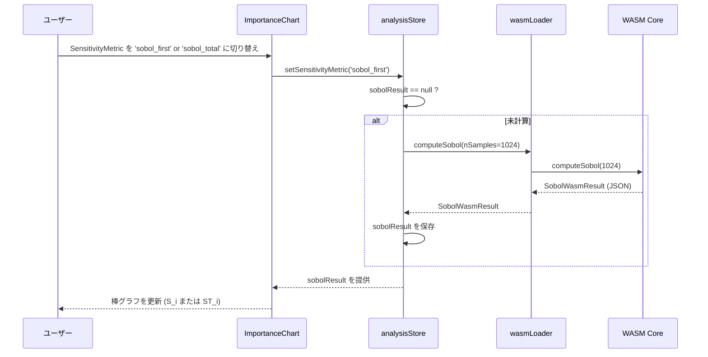
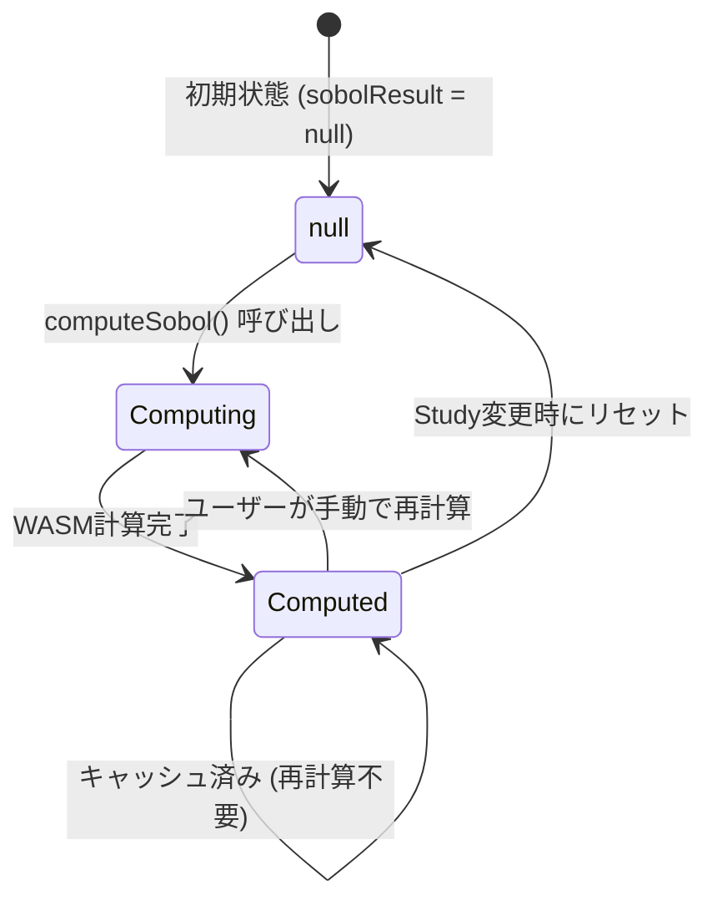
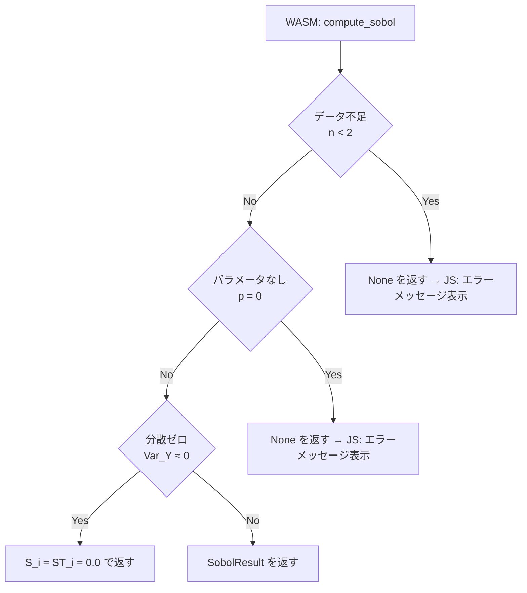
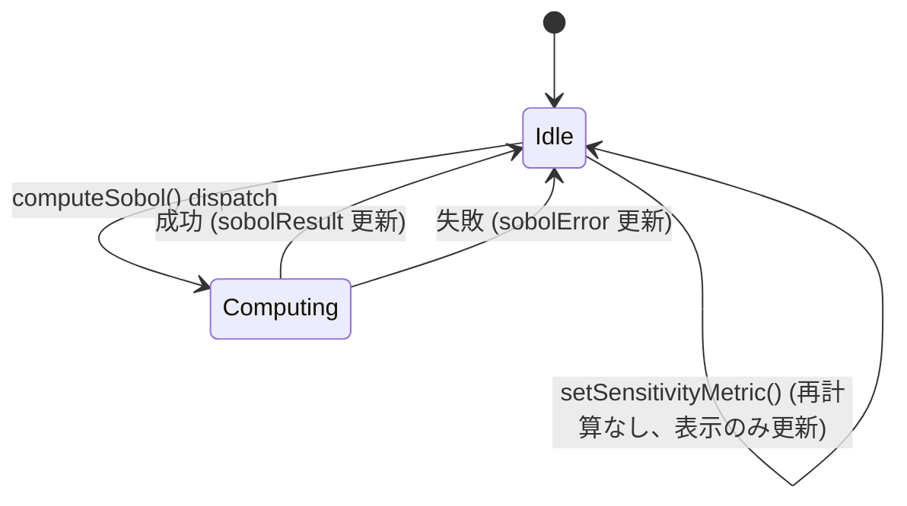

# Sobol感度指数による重要度分析 データフロー図

**作成日**: 2026-04-01
**関連アーキテクチャ**: [architecture.md](architecture.md)

**【信頼性レベル凡例】**:
- 🔵 **青信号**: EARS要件定義書・設計文書・ユーザヒアリングを参考にした確実なフロー
- 🟡 **黄信号**: EARS要件定義書・設計文書・ユーザヒアリングから妥当な推測によるフロー
- 🔴 **赤信号**: EARS要件定義書・設計文書・ユーザヒアリングにない推測によるフロー

---

## システム全体のデータフロー 🔵

**信頼性**: 🔵 *既存 dataflow.md・ユーザヒアリングより*



---

## 主要機能のデータフロー

### 機能1: Sobol 計算トリガー 🔵

**信頼性**: 🔵 *既存 analysisStore の computeSensitivity() パターン・ユーザヒアリングより*



**詳細ステップ**:
1. ユーザーが `ImportanceChart` のメトリクスセレクタで `'sobol_first'` または `'sobol_total'` を選択
2. `analysisStore.setSensitivityMetric()` が呼ばれる
3. `sobolResult` が `null` の場合は `computeSobol()` を自動実行
4. 計算済みであれば即座に表示に反映

---

### 機能2: WASM内部のSobol計算フロー 🔵

**信頼性**: 🔵 *アーキテクチャ設計・ユーザヒアリングより*

```mermaid
flowchart TD
    subgraph "WASM: compute_sobol(n_samples)"
        A[DataFrameからX行列・Y行列を取得]
        B[パラメータを Z スコア標準化\n mean_x, std_x を保存]
        C[二次特徴量を構築\nlinear + quadratic + cross-product]
        D[二次特徴量を標準化\n mean_q, std_q を保存]
        E[Ridge回帰を適合\n各目的関数に対して β を計算]
        F[SobolSurrogate を構築]
        G[Saltelli 行列 A, B を生成\nLCG64 PRNG, N×p]
        H[AB_0, AB_1, ..., AB_{p-1} を生成\nA の第 i 列を B で置換]
        I[各行列の全行でサロゲートを評価\n二次特徴量化 → 標準化 → β·x]
        J[Jansen 推定量を適用\nS_i, ST_i を各目的関数に対して計算]
        K[結果を [0,1] にクリップ]
        L[SobolResult を返す]
    end

    A --> B --> C --> D --> E --> F
    F --> G --> H --> I --> J --> K --> L
```

**各ステップの計算量** (p=30, N=1024, m=4):

| ステップ | 計算量 |
|----------|--------|
| 二次特徴量構築 (学習) | O(n × p²/2) ≈ 50,000 × 450 = 22.5M ops |
| Ridge 適合 | O(p_q² × n) ≈ 495² × 50,000 = 12.2B ops (分割済み、既存実装) |
| Saltelli 行列生成 | O(2 × N × p) = 61,440 ops |
| サロゲート評価 | O((p+2) × N × p_q) ≈ 32 × 1024 × 495 = 16.2M ops |
| Jansen 推定量 | O(p × N × m) = 30 × 1024 × 4 = 123K ops |

> **注意**: Ridge 適合は学習データ (n最大50,000) に対して行うため、既存の `compute_sensitivity()` と同等のコスト。サロゲート評価は軽量 (16M ops)。

---

### 機能3: ImportanceChart の表示フロー 🔵

**信頼性**: 🔵 *既存 ImportanceChart.tsx のパターン・ユーザヒアリングより*

```mermaid
flowchart TD
    subgraph "ImportanceChart.tsx"
        M{metric の判定}
        S1[spearman: spearman[pi] の絶対値平均]
        S2[beta: ridge[obj].beta[pi] の絶対値平均]
        S3[sobol_first: sobolResult.firstOrder[pi] の平均]
        S4[sobol_total: sobolResult.totalEffect[pi] の平均]
        SORT[importances をスコアで昇順ソート]
        CHART[ECharts 棒グラフを描画]
    end

    M -->|spearman| S1
    M -->|beta| S2
    M -->|sobol_first| S3
    M -->|sobol_total| S4
    S1 --> SORT
    S2 --> SORT
    S3 --> SORT
    S4 --> SORT
    SORT --> CHART
```

**型アノテーション追加** (TypeScript 明示的型で TS7006 を解消):

```typescript
// sobol_first の場合
const importances = sensitivityResult.paramNames.map((name: string, pi: number) => {
  let score = 0
  if (metric === 'sobol_first') {
    const firstOrder = sobolResult!.firstOrder[pi]
    score = firstOrder.reduce((sum: number, v: number) => sum + v, 0) / nObj
  } else if (metric === 'sobol_total') {
    const totalEffect = sobolResult!.totalEffect[pi]
    score = totalEffect.reduce((sum: number, v: number) => sum + v, 0) / nObj
  }
  return { name, score }
})
```

---

## データ処理パターン

### 同期処理 🔵

**信頼性**: 🔵 *既存 WASM 呼び出しパターンより*

`computeSobol()` は WASM内部で同期的に完結する。JS側では `async/await` でラップして UI をブロックしない。

### キャッシング戦略 🔵

**信頼性**: 🔵 *既存 analysisStore の pdpCache パターン・ユーザヒアリングより*



- `sobolResult` は `null` (未計算) または `SobolWasmResult` (計算済み)
- Study を切り替えた際は `null` にリセット (既存の `sensitivityResult` と同様)
- Brushing での絞り込みには対応しない (全データで計算)

### エラーハンドリングフロー 🟡

**信頼性**: 🟡 *既存 analysisStore のエラーハンドリングパターンから妥当な推測*



---

## 状態管理フロー 🔵

**信頼性**: 🔵 *既存 analysisStore.ts の状態設計・ユーザヒアリングより*



`analysisStore` に追加される状態:

```typescript
sobolResult: SobolWasmResult | null   // 計算結果
isComputingSobol: boolean              // ローディング中フラグ
sobolError: string | null              // エラーメッセージ
```

---

## 関連文書

- **アーキテクチャ**: [architecture.md](architecture.md)
- **型定義**: [interfaces.ts](interfaces.ts)
- **ヒアリング記録**: [design-interview.md](design-interview.md)
- **既存感度分析 WASM API**: [../tunny-dashboard/wasm-api.md](../tunny-dashboard/wasm-api.md)

---

## 信頼性レベルサマリー

- 🔵 青信号: 9件 (82%)
- 🟡 黄信号: 2件 (18%)
- 🔴 赤信号: 0件 (0%)

**品質評価**: ✅ 高品質
