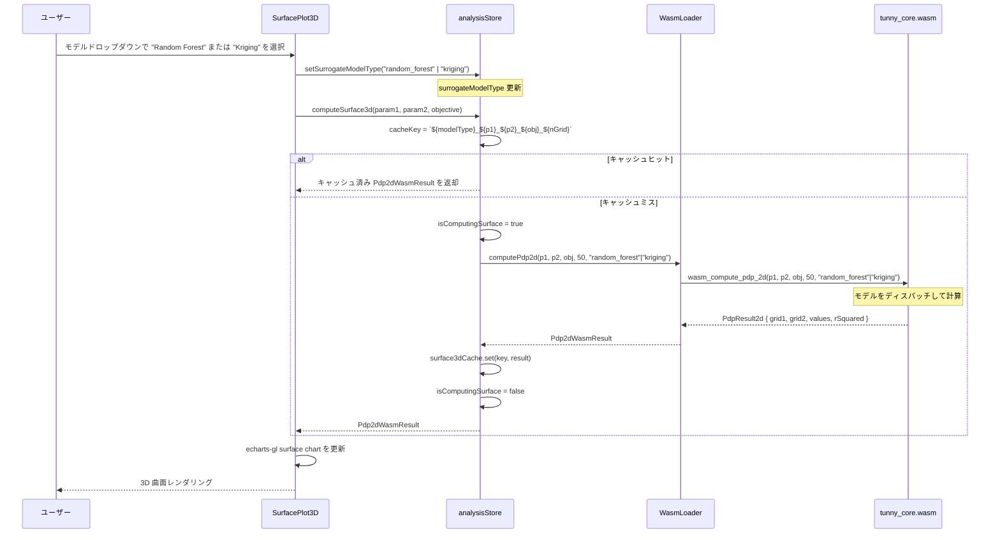
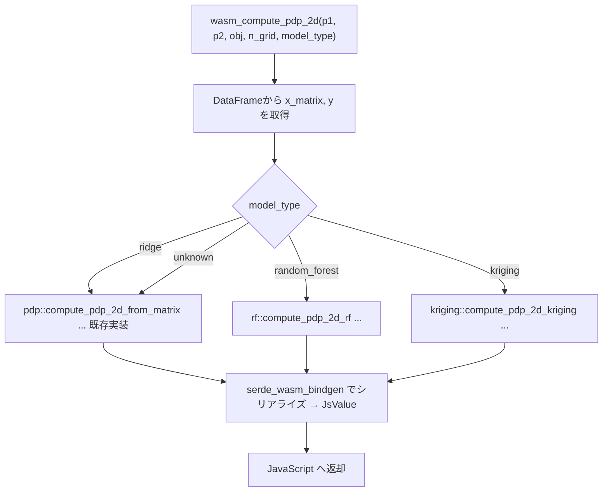
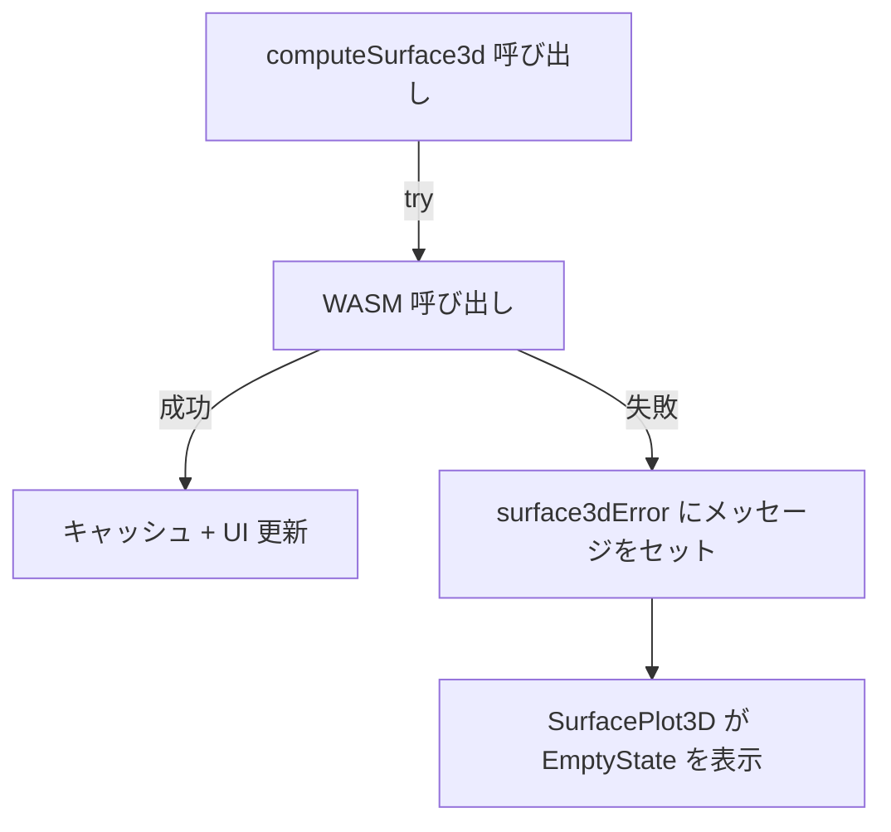
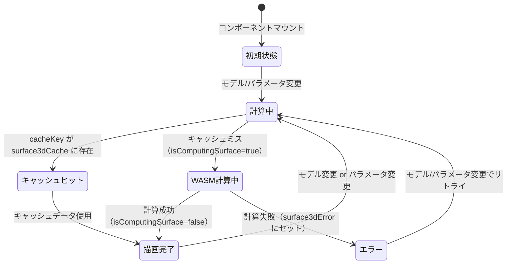

# 3D Surface Plot サロゲートモデル拡張 データフロー図

**作成日**: 2026-04-05
**関連アーキテクチャ**: [architecture.md](architecture.md)
**ヒアリング記録**: [design-interview.md](design-interview.md)

**【信頼性レベル凡例】**:

- 🔵 **青信号**: EARS要件定義書・設計文書・ユーザヒアリングを参考にした確実なフロー
- 🟡 **黄信号**: EARS要件定義書・設計文書・ユーザヒアリングから妥当な推測によるフロー
- 🔴 **赤信号**: EARS要件定義書・設計文書・ユーザヒアリングにない推測によるフロー

---

## システム全体のデータフロー 🔵

**信頼性**: 🔵 _既存 mode-frontier-features データフロー・ユーザヒアリングより_

```mermaid
flowchart TD
    U[ユーザー]
    S3D[SurfacePlot3D.tsx]
    AS[analysisStore]
    WL[WasmLoader]
    WASM[(tunny_core.wasm)]

    U -->|モデル選択: RF / Kriging| S3D
    S3D -->|computeSurface3d(p1, p2, obj)| AS
    AS -->|surrogateModelType をキャッシュキーに使用| AS
    AS -->|computePdp2d(p1, p2, obj, nGrid, modelType)| WL
    WL -->|wasm_compute_pdp_2d(...)| WASM
    WASM -->|PdpResult2d| WL
    WL -->|Pdp2dWasmResult| AS
    AS -->|surface3dCache.set(key, result)| AS
    AS -->|Pdp2dWasmResult| S3D
    S3D -->|echarts-gl surface chart| U
```

---

## モデル選択フロー 🔵

**信頼性**: 🔵 _既存 analysisStore.ts の surrogateModelType・SurfacePlot3D.tsx の MODEL_OPTIONS より_



---

## Random Forest PDP 計算フロー 🔵

**信頼性**: 🔵 _ユーザヒアリング（CART + Bagging）・design-interview.md より_

```mermaid
flowchart TD
    IN[入力: x_matrix N×p, y N, param1_idx, param2_idx, n_grid]

    IN --> EXTRACT[2 列抽出: col1 = x_matrix\[param1_idx\], col2 = x_matrix\[param2_idx\]]
    EXTRACT --> GRID[linspace でグリッド作成: grid1 N_grid点, grid2 N_grid点]
    EXTRACT --> TRAIN[RF 学習ループ × n_trees=100本]

    subgraph TRAIN [RF 学習: 各ツリー]
        B1[Bootstrap サンプリング: N点 復元抽出]
        B2[CART 決定木学習: MSE 最小化・max_depth=10]
        B3[葉ノード: サンプルの平均値を格納]
        B1 --> B2 --> B3
    end

    TRAIN --> PREDICT[グリッド予測ループ 50×50]
    GRID --> PREDICT

    subgraph PREDICT [グリッド予測]
        P1["格子点 (v1, v2) を各ツリーで予測"]
        P2[全ツリー予測の平均値 = RF 予測値]
        P1 --> P2
    end

    PREDICT --> R2[R² 計算: OOB サンプルまたは訓練データ上]
    R2 --> OUT[PdpResult2d { grid1, grid2, values 50×50, rSquared }]
```

**計算量（🟡）:**

- 学習: O(N × 100 × log(N)) ≈ 1000 × 100 × 10 = 1M ops
- 予測: O(50² × 100 × depth) ≈ 2500 × 100 × 10 = 2.5M ops
- 合計: ~3.5M ops → WASM で 50〜200ms 程度を想定

---

## Kriging（GP）PDP 計算フロー 🔵

**信頼性**: 🔵 _ユーザヒアリング（完全GP + ARD + Sparse n≤5000）・design-interview.md より_

```mermaid
flowchart TD
    IN[入力: x_matrix N×p, y N, param1_idx, param2_idx, n_grid]

    IN --> SUBSAMPLE{N > 1000?}
    SUBSAMPLE -->|Yes: ランダムサブサンプル 1000 点| X2D[2D サブセット取得: x_sub\[param1\], x_sub\[param2\]]
    SUBSAMPLE -->|No: そのまま使用| X2D

    X2D --> NORMALIZE[x1, x2 を [0,1] に正規化・y を標準化]
    NORMALIZE --> INIT[ハイパーパラメータ初期化: log_ls = [0,0], log_sf = 0, log_sn = -2]

    subgraph OPT [ハイパーパラメータ最適化: L-BFGS 最大 100 イテレーション]
        O1["K 行列構築: k_ij = ARD-Matérn5/2(x_i, x_j) + σ_n² δ_ij"]
        O2[Cholesky 分解: L = chol(K)]
        O3[alpha = L^T \ (L \ y)]
        O4[対数周辺尤度: L = −½ y^T α − Σ log L_ii − n/2 log(2π)]
        O5["解析的勾配: ∂L/∂θⱼ = ½ tr((αα^T − K⁻¹) · ∂K/∂θⱼ) — O(N²)"]
        O6[L-BFGS Two-loop recursion で探索方向を計算]
        O7[Armijo バックトラッキング線探索でステップ幅決定]
        O8["収束判定: ‖∇L‖ < 1e-5 → 完了"]
        O1 --> O2 --> O3 --> O4 --> O5 --> O6 --> O7 --> O8
        O8 -->|未収束| O1
    end

    INIT --> OPT
    OPT --> GRID[グリッド作成: grid1, grid2 各 n_grid 点（正規化空間）]

    subgraph PRED [グリッド予測 50×50 = 2500 点]
        G1["格子点 (v1*, v2*)"]
        G2["k_star = [k(x*, x_i) for i=1..N]"]
        G3["μ(x*) = k_star^T · alpha"]
        G1 --> G2 --> G3
    end

    GRID --> PRED
    OPT --> PRED

    PRED --> DENORM[y 逆標準化]
    DENORM --> R2[R² 計算: 1 − SS_res / SS_tot （訓練データ上）]
    R2 --> OUT[PdpResult2d { grid1_original, grid2_original, values 50×50, rSquared }]
```

**計算量（🔵）:**

- 学習（最適化）: O(1000³) × 100 ステップ / ステップ当たり行列再構築コスト → 実際はパラメータ更新ごとに Cholesky 再計算
- 最適化計算量: 100 × O(N³) → N=1000 のとき 10^11 ops — **遅い可能性あり**
- 軽量化策: 初期値を感度分析ベータ値から推定し最適化ステップを削減（🟡）
- 予測: O(2500 × 1000) = 2.5M ops → 高速

> ⚠️ Kriging の学習時間は Ridge/RF より大幅に長い。ローディングスピナーで待機を明示する。

---

## Rust 内部ディスパッチフロー 🔵

**信頼性**: 🔵 _ユーザヒアリング（model_type 引数追加）・architecture.md より_



---

## データ処理パターン

### キャッシュ戦略 🔵

**信頼性**: 🔵 _既存 analysisStore.ts の surface3dCache 実装より_

```typescript
// cacheKey に model_type を含めているため、モデル切り替えで自動的に再計算
cacheKey = `${surrogateModelType}_${param1}_${param2}_${objective}_${nGrid}`;
// 例:
// "ridge_x1_x2_f1_50"
// "random_forest_x1_x2_f1_50"
// "kriging_x1_x2_f1_50"
```

同一パラメータ組み合わせのモデル別結果はそれぞれキャッシュされる（Model間で無効化なし）。Study 変更時は全キャッシュをクリア（既存 `studyStore.subscribe` で処理）。

### R² の解釈差異 🟡

**信頼性**: 🟡 _モデル種別の特性から妥当な推測_

| モデル        | R² の意味                                 |
| ------------- | ----------------------------------------- |
| Ridge         | 2パラメータを使った線形モデルの訓練 R²    |
| Random Forest | OOB R²（存在しない場合は訓練 R²）         |
| Kriging       | 訓練データ上の予測 R²（過学習リスクあり） |

フロントエンドでは `R² = {result.rSquared.toFixed(3)}` と表示し、モデル種別ごとに注意書きは不要（設計スコープ外）。

---

## エラーハンドリングフロー 🔵

**信頼性**: 🔵 _既存 analysisStore の error ハンドリングパターンより_



**想定エラーケース:**

- Kriging: n=1 など極端に少ない試行数 → Cholesky 分解が失敗 → エラー返却
- RF: パラメータが 1 つ以下 → 2D サブセットが空 → エラー返却
- 未知の model_type → Ridge にフォールバック（エラーなし）

---

## 状態遷移: SurfacePlot3D 🔵

**信頼性**: 🔵 _既存 mode-frontier-features データフロー・analysisStore.isComputingSurface より_



---

## 関連文書

- **アーキテクチャ**: [architecture.md](architecture.md)
- **型定義**: [interfaces.ts](interfaces.ts)
- **ヒアリング記録**: [design-interview.md](design-interview.md)
- **前フェーズ データフロー**: [../mode-frontier-features/dataflow.md](../mode-frontier-features/dataflow.md)
- **既存 analysisStore**: `frontend/src/stores/analysisStore.ts`
- **既存 pdp.rs**: `rust_core/src/pdp.rs`

## 信頼性レベルサマリー

- 🔵 青信号: 9件 (75%)
- 🟡 黄信号: 3件 (25%)
- 🔴 赤信号: 0件 (0%)

**品質評価**: 高品質
