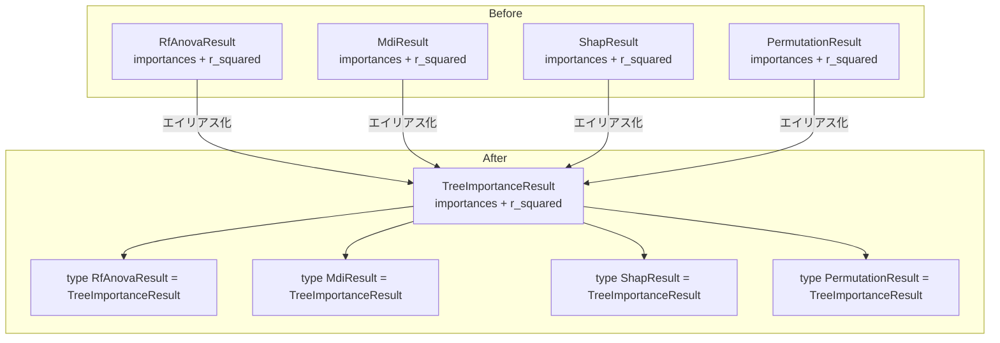
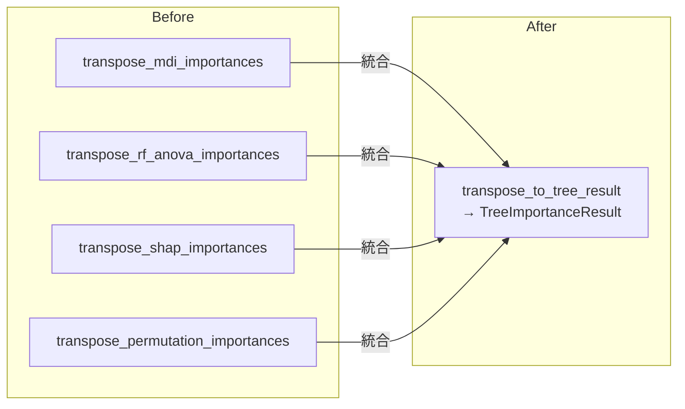
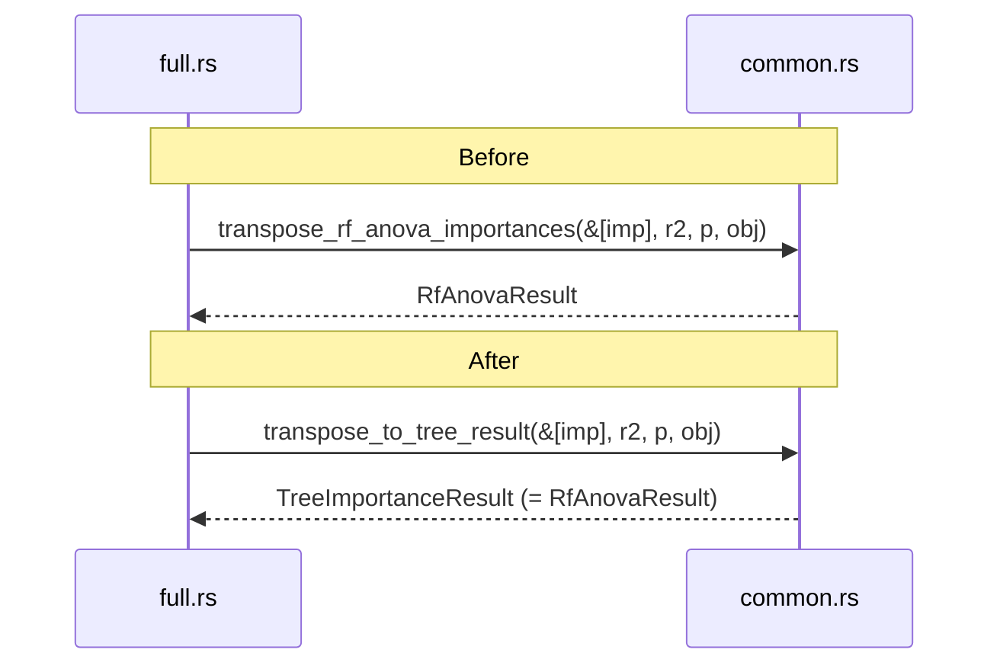
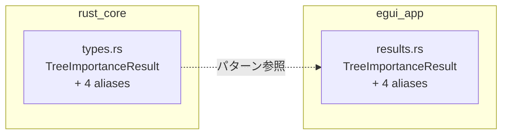
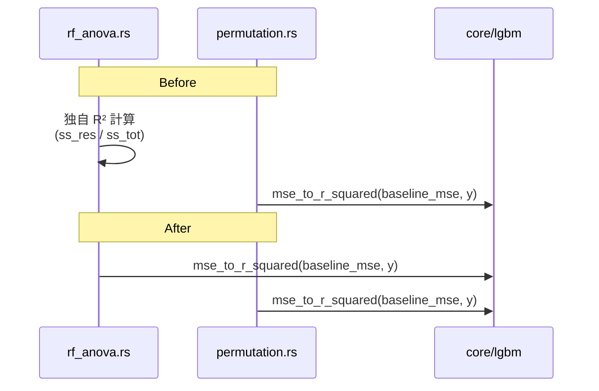
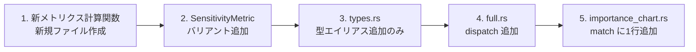

# tree-based-dedup データフロー図

**作成日**: 2026-05-02
**関連アーキテクチャ**: [architecture.md](architecture.md)
**関連要件定義**: [requirements.md](../../spec/tree-based-dedup/requirements.md)

**【信頼性レベル凡例】**:
- 🔵 **青信号**: 要件定義書・既存実装を参考にした確実なフロー
- 🟡 **黄信号**: 要件定義書・既存実装から妥当な推測によるフロー
- 🔴 **赤信号**: 要件定義書・既存実装にない推測によるフロー

---

## リファクタリング前後のモジュール依存関係 🔵

**信頼性**: 🔵 *既存 mod.rs・各ファイル use 文より*

### Before（現状）

```
                    ┌─────────────┐
                    │  mod.rs     │
                    │  (re-export)│
                    └──────┬──────┘
           ┌───────────────┼───────────────┐
           ▼               ▼               ▼
    ┌──────────────┐ ┌───────────┐ ┌──────────────┐
    │  rf_anova.rs │ │permutation│ │ types.rs     │
    │  ├ permute() │ │ ├ permute()│ │ RfAnovaResult│
    │  └ normalize │ │ └ normalize│ │ MdiResult    │
    └──────┬───────┘ └─────┬─────┘ │ ShapResult   │
           │               │        │ PermResult   │
           └───────┬───────┘        └──────────────┘
                   ▼
          ┌─────────────────┐
          │ analysis/       │
          │ common.rs       │
          │ ├ transpose_mdi │
          │ ├ transpose_rf  │
          │ ├ transpose_shap│
          │ └ transpose_perm│
          └────────┬────────┘
                   ▼
          ┌─────────────────┐
          │ analysis/full.rs│
          │ (4つの呼び出し) │
          └─────────────────┘
```

### After（リファクタリング後）

```
                    ┌─────────────────┐
                    │  mod.rs         │
                    │  + mod tree_common
                    │  + TreeImportanceResult
                    └────────┬────────┘
           ┌─────────────────┼─────────────────┐
           ▼                 ▼                 ▼
    ┌──────────────┐  ┌──────────────┐  ┌─────────────────┐
    │  rf_anova.rs │  │ permutation  │  │ types.rs        │
    │  import ←    │  │ import ←     │  │ TreeImportance  │
    │  tree_common │  │ tree_common  │  │ + 4 aliases     │
    └──────┬───────┘  └──────┬───────┘  └─────────────────┘
           │                 │
           └────────┬────────┘
                    ▼
           ┌─────────────────┐
           │ tree_common.rs  │
           │ ├ permute()     │
           │ └ normalize     │
           └─────────────────┘

          ┌─────────────────────┐
          │ analysis/common.rs  │
          │ transpose_to_tree   │
          │   _result()         │
          └────────┬────────────┘
                   ▼
          ┌─────────────────────┐
          │ analysis/full.rs    │
          │ (統一された呼び出し) │
          └─────────────────────┘
```

---

## Step 別データフロー

### Step 1: tree_common.rs 新規作成 🔵

**信頼性**: 🔵 *アーキテクチャ設計 Step 1 より*

**関連要件**: REQ-401〜406

```mermaid
flowchart LR
    subgraph Before
        A1[rf_anova.rs<br/>permute_single_column<br/>normalize]
        A2[permutation.rs<br/>permute_single_column<br/>normalize]
    end

    subgraph After
        B1[tree_common.rs<br/>permute_single_column<br/>normalize]
        B2[rf_anova.rs<br/>import from tree_common]
        B3[permutation.rs<br/>import from tree_common]
    end

    A1 -->|移動| B1
    A2 -->|移動| B1
    B1 -.->|pub(crate)| B2
    B1 -.->|pub(crate)| B3
```

### Step 2: types.rs 型エイリアス化 🔵

**信頼性**: 🔵 *アーキテクチャ設計 Step 2 より*

**関連要件**: REQ-001〜004



### Step 3: transpose 関数統合 🔵

**信頼性**: 🔵 *アーキテクチャ設計 Step 3 より*

**関連要件**: REQ-201〜203, REQ-301



full.rs の呼び出し更新フロー:



### Step 4: egui-app 型統合 🔵

**信頼性**: 🔵 *アーキテクチャ設計 Step 4 より*

**関連要件**: REQ-701, REQ-702



### Step 5: UI match arm 統合 🔵

**信頼性**: 🔵 *アーキテクチャ設計 Step 5 より*

**関連要件**: REQ-601〜603

```mermaid
flowchart TD
    subgraph Before
        M1[RfAnova arm<br/>unwrap + iter + map]
        M2[Mdi arm<br/>unwrap + iter + map]
        M3[Shap arm<br/>unwrap + iter + map]
        M4[Permutation arm<br/>unwrap + iter + map]
    end

    subgraph After
        H[extract_tree_importance<br/>match 4 variants → Vec f64]
        U[RfAnova|Mdi|Shap|Permutation<br/>→ extract_tree_importance]
    end

    M1 -->|統合| H
    M2 -->|統合| H
    M3 -->|統合| H
    M4 -->|統合| H
    H --> U
```

---

## RF-ANOVA R² 統一のデータフロー 🔵

**信頼性**: 🔵 *要件 REQ-501 より*



---

## エラー処理フロー 🔵

**信頼性**: 🔵 *要件 EDGE-001, EDGE-002 より*

```mermaid
flowchart TD
    A[permute_single_column 呼び出し] --> B{n == 0?}
    B -->|Yes| C[None を返す]
    B -->|No| D[Fisher-Yates シャッフル実行]
    D --> E[Some(permuted_matrix)]

    F[normalize 呼び出し] --> G{sum < EPSILON?}
    G -->|Yes| H[全要素を 0.0 に設定]
    G -->|No| I[各要素を sum で除算]
```

---

## 新メトリクス追加時のフロー（リファクタリング後）🟡

**信頼性**: 🟡 *NFR-101 から妥当な推測*

リファクタリング後、新しい Tree-based メトリクス追加時に必要な変更箇所:



**変更削減効果**:
- リファクタリング前: `transpose_*` 関数の新規定義が必要
- リファクタリング後: `TreeImportanceResult` + 型エイリアス1行で完了

---

## 関連文書

- **アーキテクチャ**: [architecture.md](architecture.md)
- **ヒアリング記録**: [design-interview.md](design-interview.md)
- **要件定義**: [requirements.md](../../spec/tree-based-dedup/requirements.md)

---

## 信頼性レベルサマリー

- 🔵 青信号: 9件 (90%)
- 🟡 黄信号: 1件 (10%)
- 🔴 赤信号: 0件 (0%)

**品質評価**: ✅ 高品質 — 全フローが要件定義書・既存実装に基づく
