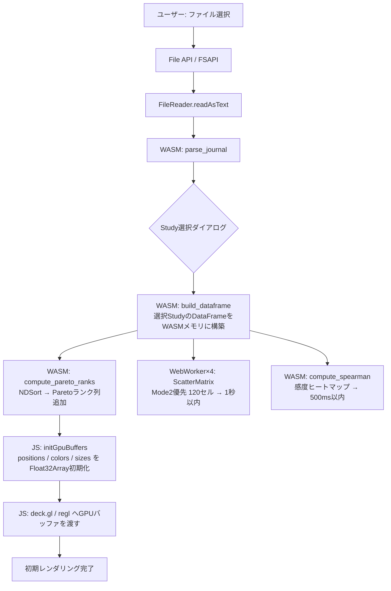
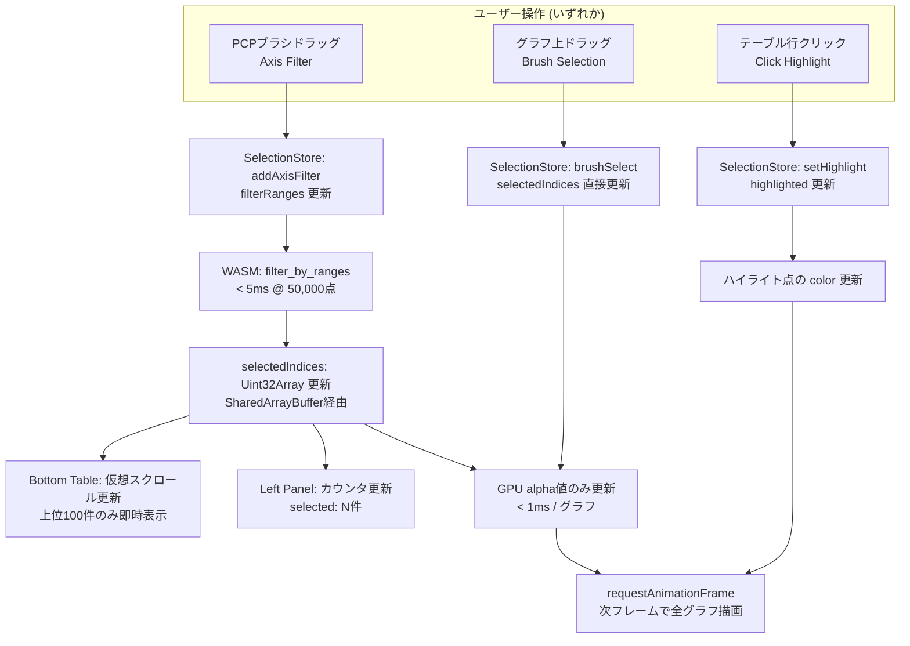
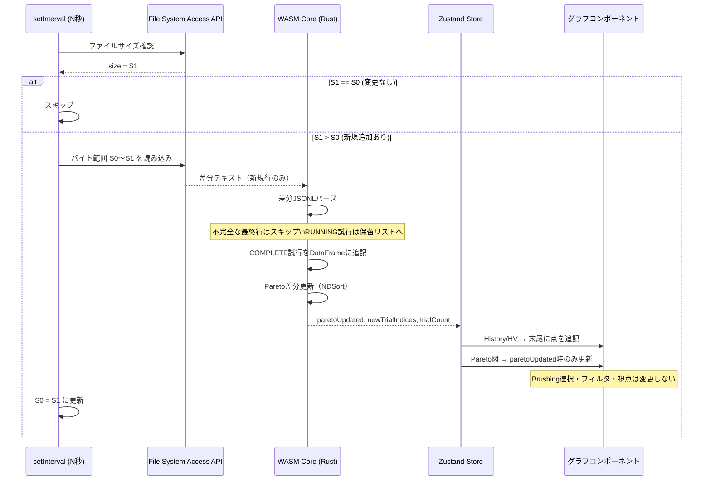
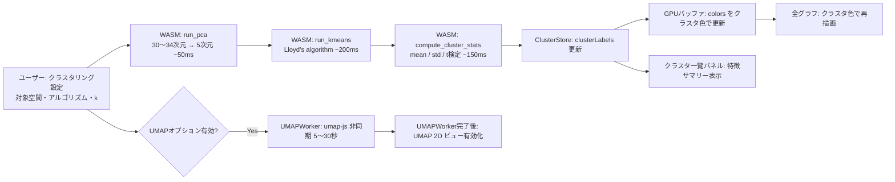
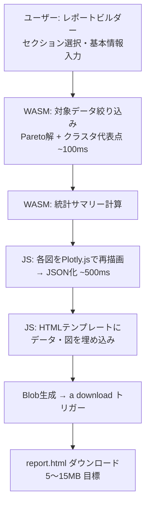
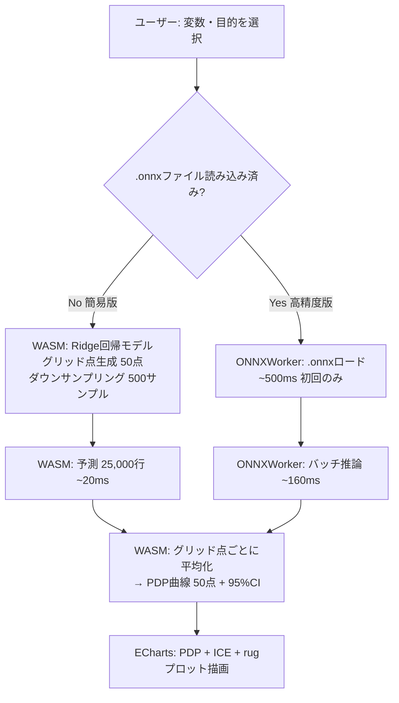
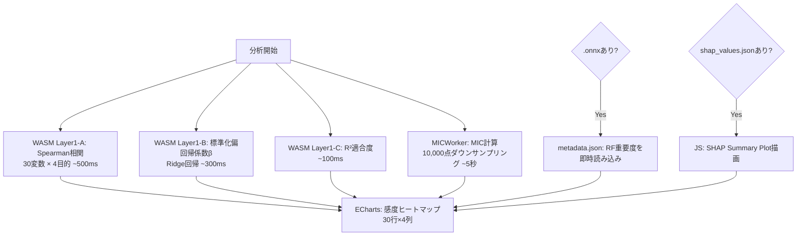

# Tunny Dashboard データフロー設計

## 1. ファイル読み込み → DataFrame構築 → GPUバッファ初期化

**時間目標:**
- Journalパース（50,000行）: 5秒以内
- GPU初期化: 100ms以内
- Scatter Matrix Mode2（120セル）: パース完了後1秒以内

---

## 2. Brushing & Linking イベント伝播（クリティカルパス）

**重要な設計原則:**
- グラフコンポーネントはReactのre-renderを経由しない（`subscribe` → GPU直接更新）
- `positions` / `sizes` は変更しない（GPUコピー不要）
- `colors[i*4+3]`（alpha値）のみ書き換える

---

## 3. ライブ更新 差分フロー（FSAPI）

**更新戦略（グラフ別）:**

| グラフ | 更新タイミング | 更新方法 |
|---|---|---|
| History / Best値推移 | 毎回 | 末尾に点を追記 |
| Hypervolume推移 | Pareto更新時のみ | 末尾に点を追記 |
| Paretoフロント | Pareto解が変化した時のみ | GPUバッファ全更新 |
| Parallel Coordinates | 毎回 | 新規点のみGPUバッファに追記 |
| Scatter Matrix | 毎回 | サムネイルのみ再生成 |
| 感度ヒートマップ | 試行数が10%増加したら | WASM再計算 + 再描画 |
| クラスタリング結果 | 自動更新しない | 手動ボタンで再実行 |

---

## 4. クラスタリング実行フロー

---

## 5. HTMLレポート生成フロー

---

## 6. PDP計算フロー（モデル別）

---

## 7. 感度分析 計算フロー（3層）

