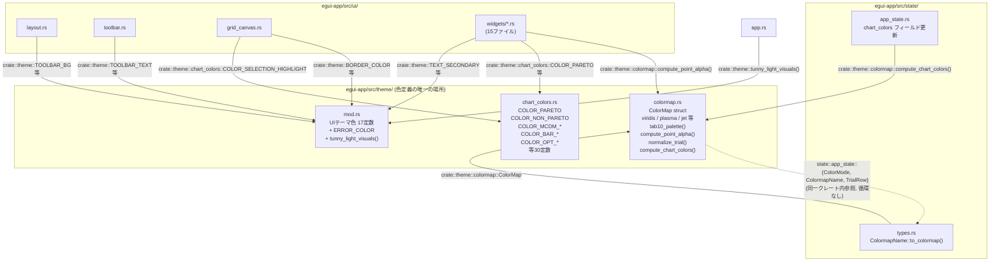
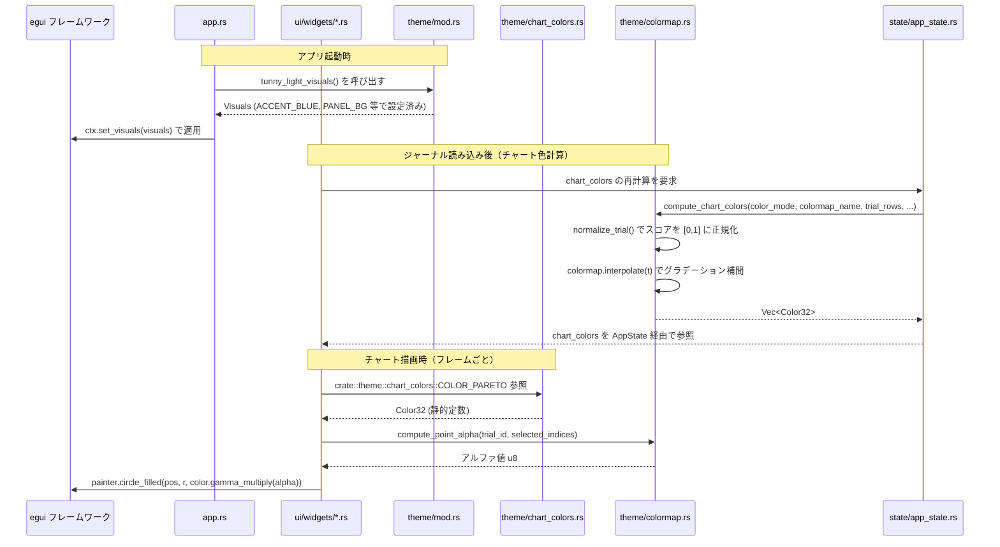
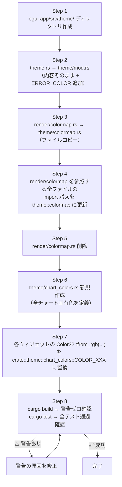

# UIカラー設定一元化 データフロー図

**作成日**: 2026-05-07
**関連アーキテクチャ**: [architecture.md](architecture.md)
**関連要件定義**: [requirements.md](../../spec/ui-color-theme/requirements.md)

**【信頼性レベル凡例】**:
- 🔵 **青信号**: EARS要件定義書・設計文書・ユーザヒアリングを参考にした確実なフロー
- 🟡 **黄信号**: EARS要件定義書・設計文書・ユーザヒアリングから妥当な推測によるフロー
- 🔴 **赤信号**: EARS要件定義書・設計文書・ユーザヒアリングにない推測によるフロー

---

## モジュール依存フロー（移行後） 🔵

**信頼性**: 🔵 *ユーザヒアリング・コードベース分析より*

---

## 色定数の利用フロー（UIレンダリング時） 🔵

**信頼性**: 🔵 *コードベース分析・既存実装より*

---

## 移行フロー（Step-by-Step） 🔵

**信頼性**: 🔵 *アーキテクチャ設計・ユーザーストーリーより*

---

## render/colormap を参照する全ファイルの更新マップ 🔵

**信頼性**: 🔵 *コードベース grep 分析より*

| ファイル | 変更前 | 変更後 |
|---------|--------|--------|
| `state/types.rs` | `crate::render::colormap::ColorMap` | `crate::theme::colormap::ColorMap` |
| `state/app_state.rs` | `crate::render::colormap::compute_chart_colors` | `crate::theme::colormap::compute_chart_colors` |
| `ui/widgets/cluster_scatter.rs` | `use crate::render::colormap::ColorMap;` | `use crate::theme::colormap::ColorMap;` |
| `ui/widgets/pareto_2d.rs` | `use crate::render::colormap::compute_point_alpha;` | `use crate::theme::colormap::compute_point_alpha;` |
| `ui/widgets/pareto_3d.rs` | `use crate::render::colormap::compute_point_alpha;` | `use crate::theme::colormap::compute_point_alpha;` |
| `ui/widgets/pdp_2d.rs` | `use crate::render::colormap::ColorMap;` | `use crate::theme::colormap::ColorMap;` |
| `ui/widgets/mcdm_chart.rs` | `crate::render::colormap::compute_chart_colors` | `crate::theme::colormap::compute_chart_colors` |
| `state/types.rs` (tests) | `use crate::render::colormap::ColorMap;` | `use crate::theme::colormap::ColorMap;` |

---

## インライン色 → theme定数 置換マップ 🔵

**信頼性**: 🔵 *コードベース grep 分析より*

### chart_colors.rs への移行（既存の const 定義）

| ファイル | 旧定数名 | 新定数名 |
|---------|---------|---------|
| `ui/widgets/pareto_2d.rs` | `COLOR_PARETO` | `crate::theme::chart_colors::COLOR_PARETO` |
| `ui/widgets/pareto_2d.rs` | `COLOR_NON_PARETO` | `crate::theme::chart_colors::COLOR_NON_PARETO` |
| `ui/widgets/pareto_2d.rs` | `COLOR_NON_PARETO_DIM` | `crate::theme::chart_colors::COLOR_NON_PARETO_DIM` |
| `ui/widgets/pareto_2d.rs` | `COLOR_PARETO_DIM` | `crate::theme::chart_colors::COLOR_PARETO_DIM` |
| `ui/widgets/slice_chart.rs` | `COLOR_PARETO` | `crate::theme::chart_colors::COLOR_PARETO` |
| `ui/widgets/slice_chart.rs` | `COLOR_NON_PARETO` | `crate::theme::chart_colors::COLOR_NON_PARETO` |
| `ui/widgets/mcdm_scatter_chart.rs` | `COLOR_RED` | `crate::theme::chart_colors::COLOR_MCDM_HIGH` |
| `ui/widgets/mcdm_scatter_chart.rs` | `COLOR_ORANGE` | `crate::theme::chart_colors::COLOR_MCDM_MID` |
| `ui/widgets/mcdm_scatter_chart.rs` | `COLOR_YELLOW` | `crate::theme::chart_colors::COLOR_MCDM_LOW` |
| `ui/widgets/mcdm_scatter_chart.rs` | `COLOR_GRAY` | `crate::theme::chart_colors::COLOR_MCDM_NONE` |

### chart_colors.rs への移行（インラインから定数化）

| ファイル | インライン値 | 新定数名 |
|---------|------------|---------|
| `ui/widgets/pareto_3d.rs` | `from_rgb(220, 80, 80)` | `COLOR_AXIS_X` |
| `ui/widgets/pareto_3d.rs` | `from_rgb(80, 220, 80)` | `COLOR_AXIS_Y` |
| `ui/widgets/pareto_3d.rs` | `from_rgb(80, 80, 220)` | `COLOR_AXIS_Z` |
| `ui/widgets/pareto_3d.rs` | `from_rgb(220, 50, 50)` | `COLOR_PARETO` |
| `ui/widgets/pareto_3d.rs` | `from_rgb(50, 150, 250)` | `COLOR_NON_PARETO` |
| `ui/widgets/optimization_history.rs` | `from_rgb(50, 150, 250)` | `COLOR_OPT_TRIAL` |
| `ui/widgets/optimization_history.rs` | `from_rgb(220, 50, 50)` | `COLOR_OPT_PRUNED` |
| `ui/widgets/optimization_history.rs` | `from_rgb(50, 200, 120)` | `COLOR_OPT_RUNNING` |
| `ui/widgets/optimization_history.rs` | `Color32::GOLD` | `COLOR_OPT_BEST` |
| `ui/widgets/hv_history.rs` | `from_rgb(50, 200, 100)` | `COLOR_HV_LINE` |
| `ui/widgets/importance_chart.rs` | `from_rgb(220, 80, 80)` | `COLOR_FIT_LOW` |
| `ui/widgets/importance_chart.rs` | `from_rgb(200, 160, 0)` | `COLOR_FIT_MID` |
| `ui/widgets/importance_chart.rs` | `from_rgb(60, 180, 60)` | `COLOR_FIT_HIGH` |
| `ui/widgets/importance_chart.rs` | `from_rgb(0x0c, 0x0c, 0x6a)` | `COLOR_BAR_PRIMARY`* |
| `ui/widgets/mcdm_chart.rs` | `from_rgb(0x0c, 0x6a, 0xc0)` | `COLOR_BAR_PRIMARY` |
| `ui/widgets/mcdm_chart.rs` | `from_rgb(0xc0, 0x20, 0x20)` | `COLOR_BAR_NEGATIVE` |
| `ui/widgets/mcdm_chart.rs` | `from_rgb(0xe0, 0x70, 0x00)` | `COLOR_BAR_ACCENT` |
| `ui/widgets/pdp_chart.rs` | `from_rgb(50, 100, 255)` | `COLOR_PDP_LINE` |
| `ui/widgets/pdp_chart.rs` | `from_rgba_unmultiplied(50, 100, 255, 50)` | `COLOR_PDP_CI`† |
| `ui/widgets/pdp_chart.rs` | `from_rgba_unmultiplied(150, 150, 150, 60)` | `COLOR_ICE_LINE`† |
| `ui/widgets/scatter_matrix.rs` | `from_rgb(70, 130, 220)` | `COLOR_SCATTER_DOT` |
| `ui/widgets/trial_table.rs` | `from_rgb(80, 120, 180)` | `COLOR_LINK` |
| `ui/bottom_panel.rs` | `from_rgb(80, 120, 180)` | `COLOR_LINK` |
| `ui/grid_canvas.rs` | `from_rgba_unmultiplied(37, 99, 235, 40)` | `COLOR_SELECTION_HIGHLIGHT`† |
| `ui/grid_canvas.rs` | `from_rgba_unmultiplied(37, 99, 235, 80)` | `COLOR_CELL_HIGHLIGHT`† |

*`importance_chart.rs` の `0x0c0c6a`（ダークネイビー）は `mcdm_chart.rs` の `0x0c6ac0`（ブルー）と異なる色のため別定数とする
†アルファ付き色は `from_rgba_premultiplied` に変換して `const` 化

### theme/mod.rs への移行（ERROR_COLOR）

| ファイル | インライン値 | 新定数名 |
|---------|------------|---------|
| `ui/toolbar.rs` | `Color32::RED` | `crate::theme::ERROR_COLOR` |
| `ui/widgets/cluster_scatter.rs` | `Color32::RED` | `crate::theme::ERROR_COLOR` |
| `ui/widgets/mcdm_scatter_chart.rs` | `Color32::RED` | `crate::theme::ERROR_COLOR` |
| `state/app_state.rs` | `Color32::RED` | `crate::theme::ERROR_COLOR` |

---

## 信頼性レベルサマリー

- 🔵 青信号: 6件 (100%)
- 🟡 黄信号: 0件 (0%)
- 🔴 赤信号: 0件 (0%)

**品質評価**: ✅ 高品質
