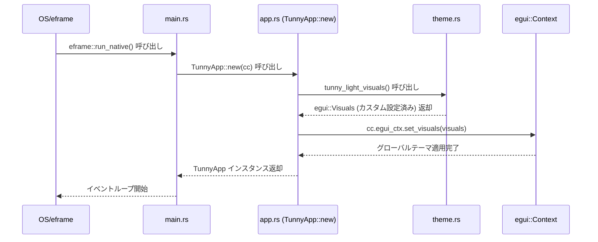
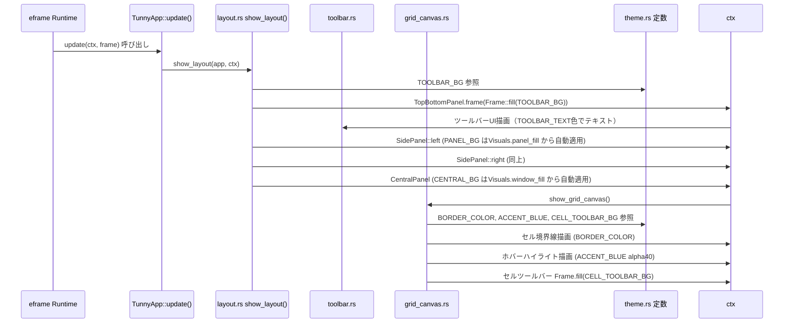
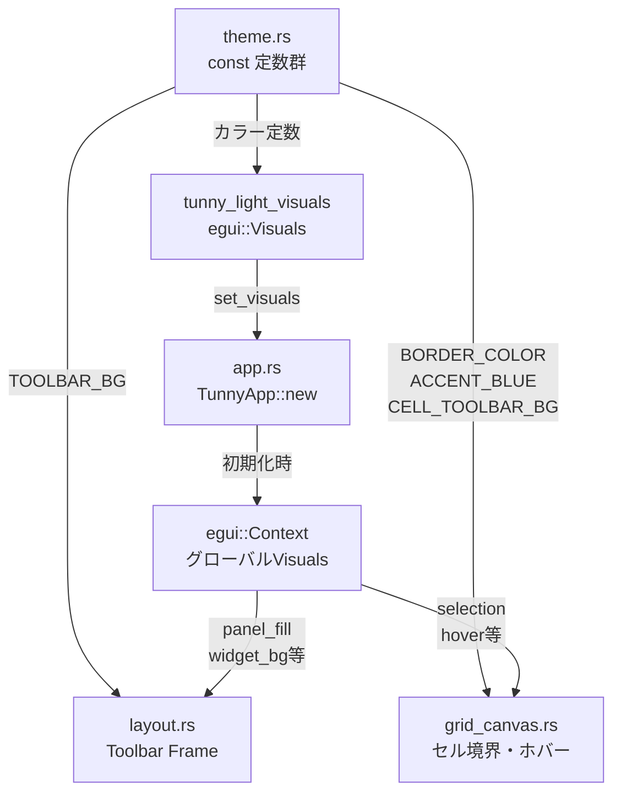
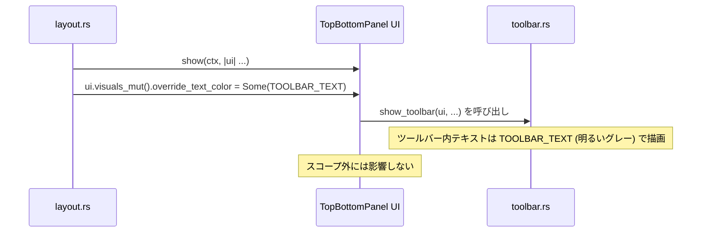

# UIカラーリング改善 データフロー図

**作成日**: 2026-04-18
**関連アーキテクチャ**: [architecture.md](architecture.md)

**【信頼性レベル凡例】**:
- 🔵 **青信号**: EARS要件定義書・設計文書・ユーザヒアリングを参考にした確実なフロー
- 🟡 **黄信号**: EARS要件定義書・設計文書・ユーザヒアリングから妥当な推測によるフロー
- 🔴 **赤信号**: EARS要件定義書・設計文書・ユーザヒアリングにない推測によるフロー

---

## テーマ適用フロー（初期化） 🔵

**信頼性**: 🔵 *eframe CreationContext API・egui Visuals API仕様より*

**詳細ステップ**:
1. `eframe::run_native()` がウィンドウを作成し、コールバックで `TunnyApp::new(cc)` を呼ぶ
2. `TunnyApp::new()` 内で `theme::tunny_light_visuals()` を呼んでカスタム `egui::Visuals` を取得
3. `cc.egui_ctx.set_visuals()` でegui Context にグローバル適用
4. 以降の全フレームでこのVisuals設定が使われる

---

## フレームごとのUI描画フロー 🔵

**信頼性**: 🔵 *egui フレームループ仕様・既存コード分析より*

---

## カラー定数の参照フロー 🔵

**信頼性**: 🔵 *Rust const 伝搬の仕組みより*

---

## Visuals フィールドマッピング 🔵

**信頼性**: 🔵 *egui 0.30 Visuals struct API仕様より*

| egui Visuals フィールド | 設定値トークン | 影響するUI要素 |
|---|---|---|
| `dark_mode` | `false` | ライトテーマベース |
| `panel_fill` | `PANEL_BG` | 左パネル・右パネル背景 |
| `window_fill` | `CENTRAL_BG` | メインキャンバス背景 |
| `window_stroke` | `BORDER_COLOR` | パネル境界線 |
| `widgets.active.bg_fill` | `ACCENT_BLUE` | クリック中ボタン背景 |
| `widgets.active.fg_stroke` | `WHITE` | クリック中ボタンテキスト |
| `widgets.hovered.bg_fill` | `WIDGET_BG_HOVER` | ホバー時ウィジェット背景 |
| `widgets.inactive.bg_fill` | `WIDGET_BG` | 非アクティブウィジェット背景 |
| `widgets.inactive.bg_stroke` | `BORDER_COLOR` | 非アクティブ枠線 |
| `selection.bg_fill` | `ACCENT_BLUE_MUTED` | selectable_label選択背景 |
| `selection.stroke` | `ACCENT_BLUE` | 選択枠線 |
| `override_text_color` | `TEXT_PRIMARY` | 全テキストのデフォルト色 |
| `extreme_bg_color` | `WHITE` | テキスト入力・ComboBox背景 |

---

## ツールバー固有のテキスト色オーバーライドフロー 🔵

**信頼性**: 🔵 *egui ui.visuals_mut() API仕様より*

グローバルの `override_text_color = TEXT_PRIMARY (dark)` はツールバー内では不適切（背景がダークネイビーのため）。
`ui.visuals_mut()` でツールバースコープ内のテキスト色を上書きする。

---

## 関連文書

- **アーキテクチャ**: [architecture.md](architecture.md)
- **型定義**: [interfaces.rs](interfaces.rs)
- **ヒアリング記録**: [design-interview.md](design-interview.md)

## 信頼性レベルサマリー

- 🔵 青信号: 6件 (100%)
- 🟡 黄信号: 0件 (0%)
- 🔴 赤信号: 0件 (0%)

**品質評価**: ✅ 高品質
