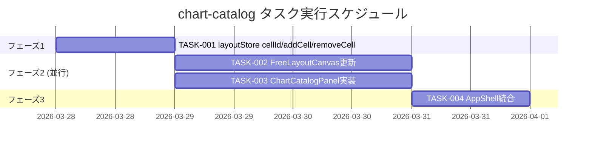

# chart-catalog 実装タスク

## 概要

全タスク数: 4
推定作業時間: 8〜10時間
クリティカルパス: TASK-001 → TASK-002 → TASK-004

---

## タスク一覧

### フェーズ1: Store 拡張

#### TASK-001: layoutStore に cellId 対応と removeCell / addCell アクション追加

- [x] **タスク完了**
- **タスクタイプ**: TDD
- **要件リンク**: REQ-109, REQ-301, REQ-302, REQ-303
- **依存タスク**: なし
- **実装詳細**:
  - `types/index.ts` の `FreeModeLayout` セル型に `cellId: string` フィールドを追加（既存セルはマイグレーション時に `crypto.randomUUID()` で自動付与）
  - `layoutStore.ts` に `removeCell(cellId: string): void` アクションを追加
    - `freeModeLayout.cells` から指定 `cellId` のエントリを除去する
  - `layoutStore.ts` に `addCell(chartId: ChartId, gridRow: [number, number], gridCol: [number, number]): void` アクションを追加
    - `cellId: crypto.randomUUID()` を生成してセルを追加
    - `freeModeLayout` が `null` のとき `DEFAULT_FREE_LAYOUT` をベースに追加
  - 既存 `updateCellPosition` のシグネチャを `updateCellPosition(cellId: string, ...)` に変更
  - `DEFAULT_FREE_LAYOUT` の各セルに `cellId` を付与
  - `layoutStore.test.ts` に対応するテストケースを追加
- **テスト要件**:
  - [ ] 単体テスト: `removeCell(cellId)` で該当セルのみ削除される
  - [ ] 単体テスト: 存在しない cellId を指定した場合に state が変化しない
  - [ ] 単体テスト: `addCell('slice', ...)` を2回呼ぶと cells に 2 エントリ（異なる cellId）が追加される
  - [ ] 単体テスト: `addCell` で追加されたセルが正しい gridRow/gridCol を持つ
- **エラーハンドリング**:
  - [ ] `freeModeLayout` が `null` のとき `addCell` は `DEFAULT_FREE_LAYOUT` をベースに安全に追加する
  - [ ] `removeCell` に存在しない `cellId` を渡しても例外を投げず state を変化させない
- **完了条件**:
  - [ ] `FreeModeLayout` 型に `cellId` が含まれている
  - [ ] `removeCell` / `addCell` が型安全に実装されている
  - [ ] 全テストが pass する

---

### フェーズ2: FreeLayoutCanvas 更新（並行実施可: TASK-002 ‖ TASK-003）

#### TASK-002: FreeLayoutCanvas のドラッグ識別と削除ボタン追加

- [x] **タスク完了**
- **タスクタイプ**: TDD
- **要件リンク**: REQ-101, REQ-102, REQ-103, REQ-301, REQ-302, REQ-403, REQ-404
- **依存タスク**: TASK-001
- **実装詳細**:
  - 既存の `onDragStart` を更新: `dataTransfer.setData('text/plain', JSON.stringify({ type: 'move-chart', cellId }))` に変更（`draggingCellId: string | null` state に移行）
  - `draggingChartId` state を `draggingCellId` state に置き換え
  - ドロップハンドラ `handleDrop` を更新: JSON の `type` で分岐
    - `type === 'add-chart'`: `layoutStore.addCell(chartId, [row, clampedRowEnd], [col, clampedColEnd])` 呼び出し。Mode D 以外のとき事前に `setLayoutMode('D')`
    - `type === 'move-chart'`: `layoutStore.updateCellPosition(cellId, ...)` 呼び出し（既存動作を cellId ベースに更新）
  - 新規追加セルのデフォルトサイズ: `gridRow: [row, row+2], gridCol: [col, col+2]`（4×4 境界クランプ適用）
  - 各チャートタイルのタイトルバーに削除ボタン（`data-testid="chart-close-btn-{cellId}"`、`×`）を追加
  - 削除ボタンクリック → `layoutStore.removeCell(cellId)` 呼び出し
  - `FreeLayoutCanvas.test.tsx` に対応テストを追加
- **テスト要件**:
  - [ ] 単体テスト: `data-testid="chart-close-btn-{cellId}"` が各タイルに存在する
  - [ ] 単体テスト: 削除ボタンクリックで `removeCell` が正しい cellId で呼ばれる
  - [ ] 単体テスト: ドロップ時 `type: 'add-chart'` で `addCell` が呼ばれる
  - [ ] 単体テスト: 同一 chartId を2回ドロップすると2つのセルが追加される（REQ-106）
  - [ ] 単体テスト: 既存の `type: 'move-chart'` ドロップが cellId ベースで正常動作する（退行なし）
- **UI/UX要件**:
  - [ ] 削除ボタン: タイトルバー右端に配置、`background: transparent, color: var(--text-muted), fontSize: 14px`
  - [ ] ドロップゾーンへのドラッグオーバー時ハイライト（既存動作を維持）
- **エラーハンドリング**:
  - [ ] `dataTransfer.getData` が空または不正 JSON の場合はサイレントに無視（EDGE-001）
- **完了条件**:
  - [ ] 既存の再配置ドラッグが退行なく動作する
  - [ ] カタログからのドロップで新規チャートが追加される
  - [ ] 削除ボタンでタイルが除去される
  - [ ] 全テストが pass する

---

#### TASK-003: ChartCatalogPanel コンポーネント実装

- [x] **タスク完了**
- **タスクタイプ**: TDD
- **要件リンク**: REQ-001, REQ-002, REQ-003, REQ-004, REQ-101, REQ-108, REQ-201, REQ-202, REQ-203, REQ-204, REQ-401
- **依存タスク**: TASK-001
- **実装詳細**:
  - `frontend/src/components/layout/ChartCatalogPanel.tsx` を新規作成
  - Props: なし（store を直接購読）
  - State: `isOpen: boolean` — `useState(false)` ローカル管理
  - `useLayoutStore` から `freeModeLayout` を購読して `chartInstanceCount: Record<ChartId, number>` を導出（各 chartId が cells に何個あるかをカウント）
  - トグルボタン（`data-testid="catalog-toggle-btn"`）: クリックで `isOpen` を反転
    - title: `isOpen ? 'パネルを閉じる' : 'チャートを追加'`
    - 表示テキスト: `isOpen ? '◀' : '▶'`
  - パネル本体（`isOpen` が true の時のみ表示）: `display: isOpen ? 'block' : 'none'`
  - CSS transition: `width` 200ms ease（wrapper div に適用）
  - カタログリスト: `CHART_CATALOG` 定数（ChartId + 表示名の配列）を定義し `map` で描画
  - 各アイテム（`data-testid="catalog-item-{chartId}"`）:
    - `draggable`
    - `onDragStart`: `dataTransfer.setData('text/plain', JSON.stringify({ type: 'add-chart', chartId }))`
    - インスタンス数: `count > 0` のとき表示名の後ろに `（${count}個）` を表示
    - `data-count={count}` 属性を付与
  - `frontend/src/components/layout/ChartCatalogPanel.test.tsx` を作成
- **テスト要件**:
  - [ ] 単体テスト: `data-testid="catalog-toggle-btn"` が DOM に存在する
  - [ ] 単体テスト: 初期状態でカタログリストが非表示
  - [ ] 単体テスト: トグルボタンクリックでカタログリストが表示される
  - [ ] 単体テスト: 14チャートアイテム全てが表示される
  - [ ] 単体テスト: `data-testid="catalog-item-{chartId}"` で各アイテムが取得できる
  - [ ] 単体テスト: cells に 'slice' が2件あるとき `data-count="2"` が付与される
  - [ ] 単体テスト: cells に 'slice' が0件のとき `data-count="0"` でインスタンス数テキストが非表示
- **UI/UX要件**:
  - [ ] パネル幅: 開 220px / 閉 28px（インラインスタイル + CSS transition）
  - [ ] 背景: `var(--bg-header)` または同等のサイドパネル色
  - [ ] ボーダー: 左辺に `1px solid var(--border)`
  - [ ] カタログアイテム: `cursor: grab`、ホバー時 `background: var(--hover)`
  - [ ] インスタンス数テキスト: `fontSize: 11px, color: var(--accent), fontWeight: 600`
- **エラーハンドリング**:
  - [ ] `freeModeLayout` が `null`（データ未ロード）のときカタログアイテムの `data-count` が全て `"0"` になる
  - [ ] `onDragStart` で `dataTransfer.setData` が失敗した場合、コンソールエラーを出さずドラッグ操作を中断する
- **完了条件**:
  - [ ] Tailwind クラスを一切使用していない
  - [ ] 全テストが pass する

---

### フェーズ3: AppShell 統合

#### TASK-004: AppShell に ChartCatalogPanel を統合・グリッド3カラム化

- [x] **タスク完了**
- **タスクタイプ**: TDD
- **要件リンク**: REQ-001, REQ-005, REQ-402
- **依存タスク**: TASK-002, TASK-003
- **実装詳細**:
  - `AppShell.tsx` に `ChartCatalogPanel` をインポート・配置（グリッド3カラム目）
  - `AppShell` の `gridTemplateColumns` を `'auto 1fr'`（2カラム）から `'auto 1fr auto'`（3カラム）に変更（3カラム目の `auto` = ChartCatalogPanel 自身が幅を管理）
  - ChartCatalogPanel の gridRow/gridColumn を適切に設定:
    - `gridColumn: 3`（ToolBar の `1 / -1` は維持）
    - `gridRow: 2`（ToolBar の下、BottomPanel の上 — ToolBar・BottomPanel はそれぞれ `1 / -1` spans）
  - ToolBar の `gridColumn: 1 / -1` を `1 / 4`（全3カラム）に更新
  - BottomPanel の `gridColumn: 1 / -1` を `1 / 4`（全3カラム）に更新
  - `AppShell.test.tsx` に対応テストを追加
- **テスト要件**:
  - [ ] 単体テスト: `data-testid="catalog-toggle-btn"` が AppShell レンダリング後に DOM に存在する
  - [ ] 単体テスト: AppShell が ChartCatalogPanel を含む状態でエラーなくレンダリングされる
  - [ ] 単体テスト: ToolBar・LeftPanel・FreeLayoutCanvas が既存と同様に存在する（退行チェック）
- **UI/UX要件**:
  - [ ] パネル開閉に伴う LeftPanel・FreeLayoutCanvas の幅変化が CSS グリッドで自動処理されること
  - [ ] BottomPanel が3カラム全幅に渡ること
- **エラーハンドリング**:
  - [ ] `ChartCatalogPanel` のレンダリングエラーが AppShell 全体をクラッシュさせないこと（既存コンポーネントが独立してレンダリングされること）
- **完了条件**:
  - [ ] ChartCatalogPanel が AppShell 右端に正しく配置されている
  - [ ] 既存レイアウト（ToolBar / LeftPanel / FreeLayoutCanvas / BottomPanel）に退行がない
  - [ ] 全テストが pass する

---

## 実行順序

---

## サブタスクテンプレート

### TDDタスクの場合

各タスクは以下のTDDプロセスで実装:

1. `tdd-requirements.md` - 詳細要件定義
2. `tdd-testcases.md` - テストケース作成
3. `tdd-red.md` - テスト実装（失敗）
4. `tdd-green.md` - 最小実装
5. `tdd-refactor.md` - リファクタリング
6. `tdd-verify-complete.md` - 品質確認
