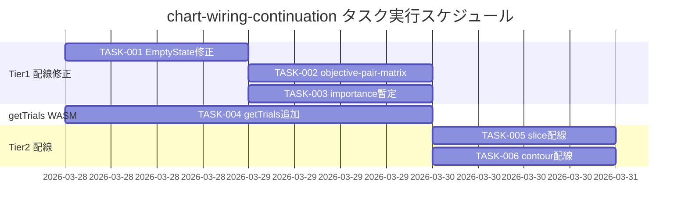

# chart-wiring-continuation 実装タスク

## 概要

全タスク数: 6
推定作業時間: 約5〜8人日（Tier 1: 1〜2日 / getTrials WASM: 2〜3日 / Tier 2 配線: 1〜2日）
クリティカルパス: TASK-001 → TASK-004 → TASK-005 / TASK-006

要件リンク: `docs/spec/chart-wiring-continuation-requirements.md`

---

## フェーズ1: Tier 1 — WASM不要の配線修正

### TASK-001: ChartContent EmptyState メッセージ修正

- [x] **タスク完了**
- **タスクタイプ**: DIRECT
- **要件リンク**: REQ-C03, REQ-C201
- **依存タスク**: なし
- **実装詳細**:
  - `frontend/src/components/layout/FreeLayoutCanvas.tsx` の `ChartContent` コンポーネントを修正
  - データ未ロード時（`!currentStudy || !gpuBuffer`）の `EmptyState` に `message="データを読み込んでください"` を渡す
  - `default` ケース（未実装チャート）の `EmptyState` を `message="このチャートは準備中です"` に変更
- **テスト要件**:
  - [ ] `currentStudy === null` のとき EmptyState に「データを読み込んでください」が表示されるテスト
  - [ ] 未知の `chartId`（例: `'unknown-chart'`）のとき EmptyState に「このチャートは準備中です」が表示されるテスト
- **エラーハンドリング要件**:
  - [ ] `gpuBuffer === null` かつ `currentStudy !== null` でもクラッシュしない
- **完了条件**:
  - [ ] `currentStudy === null` のとき EmptyState に「データを読み込んでください」が表示される
  - [ ] 未知の `chartId` のとき EmptyState に「このチャートは準備中です」が表示される
  - [ ] 既存テストが全パス

---

### TASK-002: `objective-pair-matrix` チャート配線

- [x] **タスク完了**
- **タスクタイプ**: TDD
- **要件リンク**: REQ-C01
- **依存タスク**: TASK-001
- **実装詳細**:
  - `FreeLayoutCanvas.tsx` の `ChartContent` に `case 'objective-pair-matrix':` を追加
  - `ObjectivePairMatrix` コンポーネントを `import { ObjectivePairMatrix } from '../charts/ObjectivePairMatrix'` でインポート
  - `currentStudy.objectiveNames.length <= 1` の場合は `<EmptyState message="多目的 Study でのみ利用可能です" />` を返す
  - それ以外は `<ObjectivePairMatrix gpuBuffer={gpuBuffer} currentStudy={currentStudy} />` を返す
  - **注記**: 現在の ObjectivePairMatrix は `positions[i*2]`/`positions[i*2+1]` を全ペアに使用（2目的のみ正確）。N>2 目的の正確な対応は TASK-004 後のスコープ外タスクで行う
- **UI/UX要件**:
  - [ ] ローディング状態: Study 未選択時は EmptyState（「データを読み込んでください」）を表示
  - [ ] エラー表示: 1目的 Study 時は EmptyState（「多目的 Study でのみ利用可能です」）を表示
  - [ ] アクセシビリティ: `data-testid="objective-pair-matrix"` を保持すること
- **テスト要件**:
  - [ ] `chartId='objective-pair-matrix'` かつ 2目的 Study のとき `ObjectivePairMatrix` がレンダリングされる
  - [ ] 1目的 Study のとき EmptyState（「多目的 Study でのみ利用可能です」）が表示される
  - [ ] `gpuBuffer === null` でもクラッシュしない（ObjectivePairMatrix 内で `—` プレースホルダー表示）
- **エラーハンドリング要件**:
  - [ ] `currentStudy.objectiveNames.length <= 1` のとき EmptyState を表示してクラッシュしない
  - [ ] `gpuBuffer === null` のとき ObjectivePairMatrix 内部の `—` プレースホルダーで対処（コンポーネント側に委譲）
- **完了条件**:
  - [ ] FreeLayoutCanvas の `objective-pair-matrix` カードに ObjectivePairMatrix が表示される
  - [ ] 既存テスト含む全テストがパス

---

### TASK-003: `importance` 暫定バーチャート配線

- [x] **タスク完了**
- **タスクタイプ**: TDD
- **要件リンク**: REQ-C02
- **依存タスク**: TASK-001
- **実装詳細**:
  - `FreeLayoutCanvas.tsx` の `ChartContent` に `case 'importance':` を追加
  - `currentStudy.paramNames.length === 0` の場合は `<EmptyState />` を返す
  - それ以外は `ReactECharts` でインライン実装:
    - X 軸: `currentStudy.paramNames`（カテゴリ軸）
    - Y 軸: 各バーの高さは均等値 `1.0`
    - タイトル: `"重要度（暫定・WASM未計算）"`
    - スタイル: `{ height: '100%', width: '100%' }`
  - `ReactECharts` は既に `FreeLayoutCanvas.tsx` でインポート済みのため追加インポート不要
- **UI/UX要件**:
  - [ ] ローディング状態: `paramNames.length === 0` のとき EmptyState を表示
  - [ ] エラー表示: 暫定表示であることをタイトル「重要度（暫定・WASM未計算）」で明示
  - [ ] アクセシビリティ: ECharts の `aria-label` はデフォルト動作に委譲
- **テスト要件**:
  - [ ] `chartId='importance'` かつ `paramNames` が存在するとき ECharts バーチャートがレンダリングされる
  - [ ] `paramNames.length === 0` のとき EmptyState が表示される
  - [ ] バーの数が `paramNames.length` と一致する
- **エラーハンドリング要件**:
  - [ ] `currentStudy.paramNames` が空配列のとき EmptyState を表示してクラッシュしない
- **完了条件**:
  - [ ] FreeLayoutCanvas の `importance` カードに paramNames ラベルのバーチャートが表示される
  - [ ] 既存テスト含む全テストがパス

---

## フェーズ2: getTrials WASM メソッド追加

### TASK-004: `getTrials` WASM メソッドの追加（Rust + TypeScript）

- [x] **タスク完了**
- **タスクタイプ**: TDD
- **要件リンク**: REQ-C04
- **依存タスク**: なし（TASK-001〜003 と並行実施可）
- **実装詳細**:

  #### Rust 側（`rust_core/src/lib.rs`）
  - `wasm_get_trials()` 関数を追加（`#[wasm_bindgen(js_name = "getTrials")]`）
  - `dataframe::with_active_df()` を使用してアクティブ DataFrame を取得
  - DataFrame の行を走査して `TrialData[]` を構築:
    - `trialId`: `df.get_trial_id(row)`
    - `params`: `df.param_col_names()` を走査 → `df.get_numeric_column(name)[row]` で値取得
    - `values`: `df.objective_col_names()` を走査 → `df.get_numeric_column(name)[row]` で値取得
    - `paretoRank`: 現時点では常に `null`（Pareto ランクカラムは別途追加予定）
  - アクティブ Study がない場合は空配列 `[]` を返す
  - `serde_wasm_bindgen::to_value()` でシリアライズ

  #### TypeScript 側
  - `frontend/src/wasm/pkg/tunny_core.d.ts` に `export function getTrials(): any;` を追加
  - `frontend/src/wasm/wasmLoader.ts` に以下を追加:
    - `WasmLoader` の `getTrials` フィールド宣言（`getTrials!: () => TrialData[]`）
    - `_initialize()` 内でのバインド: `loader.getTrials = () => wasmGetTrials() as TrialData[]`
    - `wasmGetTrials` を `import { ..., getTrials as wasmGetTrials } from './pkg/tunny_core'` に追加
  - `frontend/src/types/index.ts` に `TrialData` 型を追加:
    ```typescript
    export interface TrialData {
      trialId: number;
      params: Record<string, number>;
      values: number[];
      paretoRank: number | null;
    }
    ```

- **テスト要件**:
  - Rust 単体テスト（`rust_core/src/lib.rs` の `#[cfg(test)]` ブロック）:
    - [ ] `with_active_df` なし（未選択）のとき空配列を返す
    - [ ] パース済み DataFrame から正しい `trialId` / `params` / `values` が返る
    - [ ] 数値パラメータが `param_display` の値と一致する
  - TypeScript ユニットテスト（`wasmLoader.test.ts` または新規テストファイル）:
    - [ ] `getTrials()` が `TrialData[]` 型で返る
    - [ ] WASM 未初期化時に `getTrials()` が `_notImplemented` エラーをスローする

- **エラーハンドリング要件**:
  - [ ] `with_active_df` が `None` を返す場合（Study 未選択）: 空配列 `[]` を返す
  - [ ] `get_numeric_column(name)` が `None` の場合: `0.0` をデフォルト値として使用

- **性能要件**:
  - [ ] 10,000 トライアルの呼び出しが 200ms 以内

- **完了条件**:
  - [ ] `wasm-pack build` が成功する
  - [ ] Rust テストがパス
  - [ ] TypeScript テストがパス
  - [ ] `wasm.getTrials()` がブラウザコンソールで動作確認できる

---

## フェーズ3: Tier 2 — getTrials を使ったチャート配線

### TASK-005: `slice` チャート配線

- [x] **タスク完了**
- **タスクタイプ**: TDD
- **要件リンク**: REQ-C05
- **依存タスク**: TASK-004
- **実装詳細**:
  - `FreeLayoutCanvas.tsx` の `ChartContent` に `case 'slice':` を追加
  - `SlicePlot` コンポーネントを import
  - `useMemo` を使って `getTrials()` の結果をメモ化（`currentStudy?.studyId` を依存配列に）:
    ```typescript
    const trialData = useMemo(() => {
      try {
        return wasm.getTrials() as TrialData[];
      } catch {
        return [];
      }
    }, [currentStudy?.studyId]);
    ```
  - `WasmLoader.getInstance()` は非同期のため、コンポーネント外で useEffect + useState でキャッシュする、または `useStudyStore` にアクセサを追加する（実装詳細は TDD で決定）
  - `SliceTrial[]` への変換: `trialData.map(t => ({ trialId: t.trialId, params: t.params, values: t.values, paretoRank: t.paretoRank }))`
  - `trialData.length === 0` のとき `<EmptyState />` を返す
  - それ以外は `<SlicePlot trials={sliceTrials} paramNames={currentStudy.paramNames} objectiveNames={currentStudy.objectiveNames} />`
- **UI/UX要件**:
  - [ ] ローディング状態: `trialData` が空のとき EmptyState（「データを読み込んでください」）を表示
  - [ ] エラー表示: `getTrials()` 失敗時に EmptyState を表示し UI クラッシュなし
  - [ ] インタラクション: パラメータ選択ドロップダウン（`data-testid="slice-param-select"`）が機能すること
  - [ ] アクセシビリティ: `data-testid="slice-plot"` を保持すること
- **テスト要件**:
  - [ ] `chartId='slice'` かつ `trialData` が存在するとき SlicePlot がレンダリングされる
  - [ ] `trialData` が空のとき EmptyState が表示される
  - [ ] Study 切り替え時にトライアルデータが更新される
  - [ ] `getTrials()` 呼び出し失敗時に EmptyState が表示されクラッシュしない
- **エラーハンドリング要件**:
  - [ ] `getTrials()` が例外をスローした場合、catch して空配列として扱い EmptyState を表示
  - [ ] WASM 未初期化状態でも UI がクラッシュしない
- **完了条件**:
  - [ ] FreeLayoutCanvas の `slice` カードに SlicePlot が表示される（パラメータ選択ドロップダウンあり）
  - [ ] 既存テスト含む全テストがパス

---

### TASK-006: `contour` チャート配線

- [x] **タスク完了**
- **タスクタイプ**: TDD
- **要件リンク**: REQ-C06
- **依存タスク**: TASK-004
- **実装詳細**:
  - `FreeLayoutCanvas.tsx` の `ChartContent` に `case 'contour':` を追加
  - `ContourPlot` コンポーネントを import
  - TASK-005 と同様に `getTrials()` の結果をメモ化して利用（共通フックに切り出し可）
  - `ContourTrial[]` への変換: `trialData.map(t => ({ params: t.params, values: t.values }))`
  - `trialData.length === 0` のとき `<EmptyState />` を返す
  - `currentStudy.paramNames.length < 2` のとき `<EmptyState message="パラメータが2つ以上必要です" />` を返す
  - それ以外は `<ContourPlot trials={contourTrials} paramNames={currentStudy.paramNames} objectiveNames={currentStudy.objectiveNames} />`
- **UI/UX要件**:
  - [ ] ローディング状態: `trialData` が空のとき EmptyState を表示
  - [ ] エラー表示: `paramNames.length < 2` のとき「パラメータが2つ以上必要です」EmptyState を表示
  - [ ] インタラクション: X/Y 軸パラメータ選択ドロップダウン（`data-testid="contour-x-select"` / `contour-y-select"`）が機能すること
  - [ ] アクセシビリティ: `data-testid="contour-plot"` を保持すること
- **テスト要件**:
  - [ ] `chartId='contour'` かつ有効なデータがあるとき ContourPlot がレンダリングされる
  - [ ] `paramNames.length < 2` のとき EmptyState（「パラメータが2つ以上必要です」）が表示される
  - [ ] `trialData` が空のとき EmptyState が表示される
  - [ ] `getTrials()` 呼び出し失敗時に EmptyState が表示されクラッシュしない
- **エラーハンドリング要件**:
  - [ ] `getTrials()` が例外をスローした場合、catch して空配列として扱い EmptyState を表示
  - [ ] `paramNames.length < 2` のとき ContourPlot をレンダリングせず EmptyState を表示
  - [ ] WASM 未初期化状態でも UI がクラッシュしない
- **完了条件**:
  - [ ] FreeLayoutCanvas の `contour` カードに ContourPlot が表示される（X/Y 軸選択ドロップダウンあり）
  - [ ] 既存テスト含む全テストがパス

---

## 実行順序



- TASK-001・TASK-004 は相互に依存しないため並行作業可能
- TASK-002・TASK-003 は TASK-001 完了後に並行実施可能
- TASK-005・TASK-006 は TASK-004 完了後に並行実施可能

---

## 実装上の注意事項

### getTrials のWASM同期問題

`FreeLayoutCanvas` 内の `ChartContent` は同期コンポーネントだが、`WasmLoader.getInstance()` は非同期 Promise を返す。
TASK-005/006 の実装時は以下のいずれかのアプローチを TDD フェーズで選択する:

**案A（推奨）**: `studyStore` に `getTrials()` アクションを追加し、`selectStudy()` 時にトライアルデータも同時に取得して `trialRows` としてストアに保持する。`ChartContent` は `useStudyStore(s => s.trialRows)` で同期的に参照する。

**案B（最小変更）**: `ChartContent` を `useEffect` + `useState` でラップして非同期取得する。初期表示は EmptyState、取得完了後にチャートを表示する。

### wasm-pack ビルドの必要性

TASK-004 は Rust コードの変更を含むため、`npm run build:wasm`（または `wasm-pack build`）を実行して `frontend/src/wasm/pkg/` を更新する必要がある。

### Tailwind 禁止制約

すべてのスタイルはインラインスタイルまたは CSS 変数で実装すること（REQ-403 / NFR-C05）。

---

## サブタスクテンプレート

### TDDタスクの場合（TASK-002・003・004・005・006）

各タスクは以下の TDD プロセスで実装する:

1. **tdd-requirements** — 詳細要件の確認・補完
2. **tdd-testcases** — テストケースの洗い出し
3. **tdd-red** — 失敗するテストを先に実装（Red フェーズ）
4. **tdd-green** — テストが通る最小実装（Green フェーズ）
5. **tdd-refactor** — コード品質の改善（Refactor フェーズ）
6. **tdd-verify-complete** — 全テストパス・品質確認

### DIRECTタスクの場合（TASK-001）

1. **direct-setup** — 直接ファイル編集・設定変更
2. **direct-verify** — 動作確認・既存テストのパス確認
