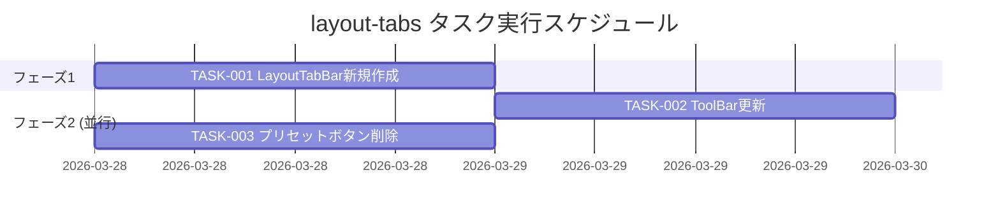

# layout-tabs 実装タスク

## 概要

全タスク数: 3
推定作業時間: 3〜4時間
クリティカルパス: TASK-001 → TASK-002

---

## タスク一覧

### フェーズ1: LayoutTabBar コンポーネント実装

#### TASK-001: LayoutTabBar コンポーネント新規作成

- [x] **タスク完了**
- **タスクタイプ**: TDD
- **要件リンク**: REQ-001, REQ-002, REQ-101, REQ-102, REQ-103, REQ-104, REQ-105, REQ-106, REQ-401, REQ-403, REQ-404, REQ-501〜506, REQ-601, REQ-602
- **依存タスク**: なし
- **実装詳細**:
  - `frontend/src/components/layout/LayoutTabBar.tsx` を新規作成
  - Props: なし（store を直接購読）
  - `useLayoutStore` から `layoutMode`, `setLayoutMode`, `setFreeModeLayout` を取得
  - タブ定義定数 `LAYOUT_TABS` を定義:
    ```ts
    const LAYOUT_TABS = [
      { mode: 'A' as const, label: '4分割' },
      { mode: 'B' as const, label: '左大' },
      { mode: 'C' as const, label: '縦並び' },
      { mode: 'D' as const, label: 'フリー' },
    ];
    ```
  - `PRESET_LAYOUTS` を LayoutTabBar 内に定義（FreeLayoutCanvas の既存定義と同じセル構造、`makePresetLayout` ヘルパーごと）:
    - A: `pareto-front [1,3][1,3]`, `parallel-coords [1,3][3,5]`, `scatter-matrix [3,5][1,3]`, `history [3,5][3,5]`
    - B: `pareto-front [1,5][1,3]`, `parallel-coords [1,3][3,5]`, `hypervolume [3,5][3,5]`
    - C: `pareto-front [1,3][1,3]`, `parallel-coords [1,3][3,5]`, `scatter-matrix [3,5][1,5]`
  - クリックハンドラ:
    - `mode === 'D'` のとき: `setLayoutMode('D')` のみ
    - それ以外: `setLayoutMode(mode)` + `setFreeModeLayout(PRESET_LAYOUTS[mode]())`
    - アクティブタブ（`layoutMode === mode`）クリック: 何もしない（べき等）
  - 各タブに `data-testid="layout-tab-{mode}"` および `aria-selected={layoutMode === mode}` を付与
  - コンテナ（`data-testid="layout-tab-bar"`）にタブを並べる
  - `frontend/src/components/layout/LayoutTabBar.test.tsx` を作成
- **テスト要件**:
  - [ ] 単体テスト: `data-testid="layout-tab-bar"` が DOM に存在する
  - [ ] 単体テスト: 4つのタブ（`layout-tab-A` 〜 `layout-tab-D`）が表示される
  - [ ] 単体テスト: 各タブのラベルが「4分割」「左大」「縦並び」「フリー」であること
  - [ ] 単体テスト: `layoutMode === 'B'` のとき `layout-tab-B` の `aria-selected` が `"true"` であること
  - [ ] 単体テスト: `layout-tab-A` クリックで `setLayoutMode('A')` と `setFreeModeLayout` が呼ばれる
  - [ ] 単体テスト: `layout-tab-D` クリックで `setLayoutMode('D')` が呼ばれ `setFreeModeLayout` は呼ばれない
  - [ ] 単体テスト: アクティブタブ（現在のモード）クリックで store アクションが呼ばれない（べき等）
- **UI/UX要件**:
  - [ ] アクティブタブ: `background: var(--accent)`, `color: #fff`, `fontWeight: 700`
  - [ ] 非アクティブタブ: `background: var(--bg)`, `color: var(--text-muted)`, `border: 1px solid var(--border)`
  - [ ] フォントサイズ: `13px`, パディング: `4px 14px`
  - [ ] タブ並び順: 4分割 → 左大 → 縦並び → フリー（左→右）
  - [ ] Tailwind クラスを使用しない
- **エラーハンドリング**:
  - [ ] `freeModeLayout` が `null` の状態でプリセットタブをクリックしても `setFreeModeLayout` が正しく呼ばれること
- **完了条件**:
  - [ ] `LayoutTabBar.tsx` が作成されている
  - [ ] `LayoutTabBar.test.tsx` が作成されている
  - [ ] 全テストが pass する

---

### フェーズ2: ToolBar 更新 と FreeLayoutCanvas プリセット削除（並行実施可: TASK-002 ‖ TASK-003）

#### TASK-002: ToolBar の layout ボタンを LayoutTabBar に置き換え

- [x] **タスク完了**
- **タスクタイプ**: TDD
- **要件リンク**: REQ-001, REQ-405
- **依存タスク**: TASK-001
- **実装詳細**:
  - `ToolBar.tsx` に `LayoutTabBar` をインポート
  - `LAYOUT_MODES` 定数と既存の `{LAYOUT_MODES.map(...)}` ボタン群を削除
  - `LayoutTabBar` を「ライブ開始/停止」ボタンの左に配置（`marginLeft: 'auto'` の div 内に `<LayoutTabBar />` を先頭に挿入）
  - `ToolBar.test.tsx` を更新:
    - `layout-btn-A` 〜 `layout-btn-D` の存在確認テストを削除
    - `data-testid="layout-tab-bar"` が ToolBar 内に存在することを確認するテストを追加
    - 既存の他テスト（ファイル入力、Study セレクタ、ライブ更新ボタン）は維持
  - `layoutStore` モック内に `setFreeModeLayout` を追加（ToolBar テストで必要になる場合）
- **テスト要件**:
  - [ ] 単体テスト: `data-testid="layout-tab-bar"` が ToolBar 内に存在する
  - [ ] 単体テスト: `data-testid="layout-btn-A"` 〜 `data-testid="layout-btn-D"` が DOM に存在しない
  - [ ] 単体テスト: ファイル入力・ライブ更新ボタンが退行なく存在する（退行チェック）
- **UI/UX要件**:
  - [ ] `LayoutTabBar` は「ライブ開始/停止」ボタンの左に配置されること
- **エラーハンドリング**:
  - [ ] `LayoutTabBar` のレンダリングエラーが ToolBar 全体をクラッシュさせないこと
- **完了条件**:
  - [ ] ToolBar に A〜D 個別ボタンが存在しない
  - [ ] ToolBar に `LayoutTabBar` が表示される
  - [ ] 全テストが pass する

---

#### TASK-003: FreeLayoutCanvas のプリセットボタン削除

- [x] **タスク完了**
- **タスクタイプ**: TDD
- **要件リンク**: REQ-003, REQ-602
- **依存タスク**: なし（TASK-001 と並行実施可）
- **実装詳細**:
  - `FreeLayoutCanvas.tsx` から以下を削除:
    - `makePresetLayout` ヘルパー関数
    - `PRESET_LAYOUTS` 定数
    - `handlePreset` イベントハンドラ
    - JSX 内のプリセットラベル `<span>プリセット:</span>` と `PRESET_LAYOUTS` の `map` ボタン群（`data-testid="free-layout-preset-{A/B/C}"`）
  - `import` から `LayoutMode` の型が不要になる場合は削除（`setLayoutMode` の型に引き続き使用されているため維持）
  - `FreeLayoutCanvas.test.tsx` から `free-layout-preset-A/B/C` および `handlePreset` 関連のテストを削除
  - レイアウト保存ボタン（`save-free-layout-btn`）とトースト（`layout-saved-toast`）は維持する
- **テスト要件**:
  - [ ] 単体テスト: `data-testid="free-layout-preset-A"` が DOM に存在しない
  - [ ] 単体テスト: `data-testid="free-layout-preset-B"` が DOM に存在しない
  - [ ] 単体テスト: `data-testid="free-layout-preset-C"` が DOM に存在しない
  - [ ] 単体テスト: `data-testid="save-free-layout-btn"` が引き続き存在する（退行なし）
  - [ ] 単体テスト: ドラッグ&ドロップ・削除ボタンが退行なく動作する（退行チェック）
- **エラーハンドリング**:
  - [ ] プリセット削除後も FreeLayoutCanvas が `freeModeLayout === null` の場合に `DEFAULT_FREE_LAYOUT` を使用すること
- **完了条件**:
  - [ ] FreeLayoutCanvas にプリセットボタンが存在しない
  - [ ] `makePresetLayout` / `PRESET_LAYOUTS` / `handlePreset` が削除されている
  - [ ] 全テストが pass する

---

## 実行順序



---

## サブタスクテンプレート

### TDDタスクの場合

各タスクは以下のTDDプロセスで実装:

1. `tdd-requirements.md` - 詳細要件定義
2. `tdd-testcases.md` - テストケース作成
3. `tdd-red.md` - テスト実装（失敗）
4. `tdd-green.md` - 最小実装
5. `tdd-refactor.md` - リファクタリング
6. `tdd-verify-complete.md` - 品質確認
