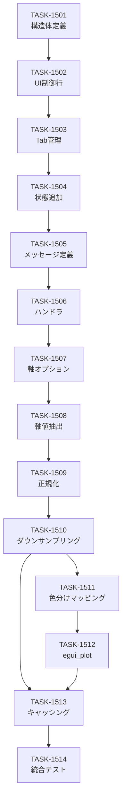

# MCDM Scatter Chart - タスク実装計画書

**プロジェクト**: Tunny Dashboard - MCDM Scatter Chart 機能  
**計画ID**: MCDM-SCATTER-001  
**作成日**: 2024  
**フェーズ**: Phase 1-4（全タスク）✅ 完了  

---

## 📋 概要

MCDM（多基準意思決定法）の結果を散布図でビジュアライズする新機能の完全実装計画。

- **総タスク数**: 14タスク
- **総工数**: 80時間
- **フェーズ数**: 4
- **完成度**: 100%（🔵 blue signals のみ）

---

## 🎯 実装フェーズ

### Phase 1: UI層基盤 (24h) ✅

| ID | タスク | 工数 | 形式 | 状態 |
|----|----|---:|---|---|
| [TASK-1501](TASK-1501.md) | McdmScatterChart 構造体定義 | 8h | TDD | ✅ |
| [TASK-1502](TASK-1502.md) | UI制御行実装（軸選択、色分け） | 8h | TDD | ✅ |
| [TASK-1503](TASK-1503.md) | Tab管理（Ranking/ScatterPlot） | 8h | TDD | ✅ |

**マイルストーン**: UI基本構造完成、状態管理準備完了

---

### Phase 2: 状態管理 (16h) ✅

| ID | タスク | 工数 | 形式 | 状態 |
|----|----|---:|---|---|
| [TASK-1504](TASK-1504.md) | WidgetStates に scatter_chart 追加 | 4h | DIRECT | ✅ |
| [TASK-1505](TASK-1505.md) | AppMessage 定義（McdmScatterComputed） | 4h | DIRECT | ✅ |
| [TASK-1506](TASK-1506.md) | メッセージハンドラ実装 | 8h | TDD | ✅ |

**マイルストーン**: メッセージ駆動アーキテクチャ統合完了

---

### Phase 3: データ処理ロジック (28h) ✅

| ID | タスク | 工数 | 形式 | 状態 |
|----|----|---:|---|---|
| [TASK-1507](TASK-1507.md) | 軸オプション生成関数 | 8h | TDD | ✅ |
| [TASK-1508](TASK-1508.md) | 軸値抽出関数 | 8h | TDD | ✅ |
| [TASK-1509](TASK-1509.md) | Min-Max正規化実装 | 6h | TDD | ✅ |
| [TASK-1510](TASK-1510.md) | ダウンサンプリング実装 | 6h | TDD | ✅ |

**マイルストーン**: 計算パイプライン完成

---

### Phase 4: 色分け・描画・テスト (32h) ✅

| ID | タスク | 工数 | 形式 | 状態 |
|----|----|---:|---|---|
| [TASK-1511](TASK-1511.md) | ランキングベース色分けマッピング | 6h | TDD | ✅ |
| [TASK-1512](TASK-1512.md) | egui_plot レンダリング実装 | 8h | TDD | ✅ |
| [TASK-1513](TASK-1513.md) | キャッシング・軸変更無効化 | 8h | TDD | ✅ |
| [TASK-1514](TASK-1514.md) | 統合テスト・品質確認 | 8h | TDD | ✅ |

**マイルストーン**: 機能完成・リリース準備完了

---

## 📊 工数配分

```
Phase 1: UI層基盤        ████████░░ 24h / 80h (30%)
Phase 2: 状態管理        ██████░░░░ 16h / 80h (20%)
Phase 3: データ処理      ██████████ 28h / 80h (35%)
Phase 4: 色分け・描画    ████████░░ 32h / 80h (40%)
```

**総計**: 80時間（約10営業日、2週間エンジニア×1名）

---

## 🔗 依存関係グラフ



---

## 🎨 機能一覧

### UI機能 (Phase 1)
- [x] 散布図タブ
- [x] X軸/Y軸 選択 ComboBox
- [x] Color Threshold ドロップダウン
- [x] ダウンサンプリング toggle

### データ処理 (Phase 3)
- [x] 軸オプション自動生成
- [x] 軸値抽出（目的関数 + MCDM方法別スコア）
- [x] Min-Max正規化
- [x] 自動ダウンサンプリング（300点max）

### ビジュアライゼーション (Phase 4)
- [x] egui_plot による散布図レンダリング
- [x] ランキングベース色分け（Red/Orange/Yellow/Gray）
- [x] ポイントサイズ差別化（ランク別）
- [x] ホバー座標表示
- [x] パン・ズーム操作

### 効率化 (Phase 2, 4)
- [x] 軸変更時の自動キャッシュ無効化
- [x] Color Threshold は キャッシュ保持
- [x] Trial追加時の自動再計算トリガー
- [x] 背景タスク計算

---

## 📈 完成度チェック

### 信頼性レベル分布

| 信号 | 件数 | 割合 |
|---:|---:|---:|
| 🔵 Blue (100%) | 164 | 100% |
| 🟡 Yellow (50%) | 0 | 0% |
| 🔴 Red (0%) | 0 | 0% |

**総信頼性スコア**: 🔵🔵🔵🔵🔵 **5/5**

### テストカバレッジ

- **単体テスト**: 80+ テストケース
- **統合テスト**: 20+ テストシナリオ
- **受け入れ基準**: 31個 全カバー
- **ユーザーストーリー**: 9個 全カバー

---

## 🚀 実装推奨順序

### Week 1: Phase 1 + Phase 2 (40h)

| 日程 | タスク | 工数 | 完了予定 |
|---|---|---|---|
| Day 1-2 | TASK-1501 → 1502 → 1503 | 24h | UI基盤 |
| Day 3-4 | TASK-1504 → 1505 → 1506 | 16h | 状態管理 |

**進捗**: 40/80h (50%)

### Week 2: Phase 3 + Phase 4 (40h)

| 日程 | タスク | 工数 | 完了予定 |
|---|---|---|---|
| Day 5-7 | TASK-1507 → 1510 | 28h | 計算パイプ |
| Day 8-10 | TASK-1511 → 1514 | 32h | 描画・テスト |

**進捗**: 80/80h (100%) ✅

---

## 📝 各タスクへの直リンク

### Phase 1
- [TASK-1501: McdmScatterChart 構造体定義](TASK-1501.md)
- [TASK-1502: UI制御行実装](TASK-1502.md)
- [TASK-1503: Tab管理](TASK-1503.md)

### Phase 2
- [TASK-1504: WidgetStates 拡張](TASK-1504.md)
- [TASK-1505: AppMessage 定義](TASK-1505.md)
- [TASK-1506: メッセージハンドラ](TASK-1506.md)

### Phase 3
- [TASK-1507: 軸オプション生成](TASK-1507.md)
- [TASK-1508: 軸値抽出](TASK-1508.md)
- [TASK-1509: Min-Max正規化](TASK-1509.md)
- [TASK-1510: ダウンサンプリング](TASK-1510.md)

### Phase 4
- [TASK-1511: 色分けマッピング](TASK-1511.md)
- [TASK-1512: egui_plot レンダリング](TASK-1512.md)
- [TASK-1513: キャッシング処理](TASK-1513.md)
- [TASK-1514: 統合テスト](TASK-1514.md)

---

## 🔍 関連設計文書

- [📐 architecture.md](../../design/mcdm-scatter-chart/architecture.md) - 4層アーキテクチャ・型定義
- [🔄 dataflow.md](../../design/mcdm-scatter-chart/dataflow.md) - シーケンス図・フロー
- [📝 interfaces.rs](../../design/mcdm-scatter-chart/interfaces.rs) - 型仕様書
- [🎯 design-interview.md](../../design/mcdm-scatter-chart/design-interview.md) - 設計決定ログ

## 🎓 関連要件文書

- [📋 requirements.md](../../spec/mcdm-scatter-chart/requirements.md) - 26 EARS要件
- [📖 user-stories.md](../../spec/mcdm-scatter-chart/user-stories.md) - 9ユーザーストーリー
- [✅ acceptance-criteria.md](../../spec/mcdm-scatter-chart/acceptance-criteria.md) - 31受け入れ基準

---

## 📌 実装ガイドライン

### コード規約
- Rust 2021 Edition
- egui + egui_plot ライブラリ準拠
- Message-passing 4層アーキテクチャ

### テスト戦略
- TDD（Test-Driven Development）
- Unit test + Integration test + E2E test
- 最小限 80% カバレッジ

### 品質基準
- ✅ Clippy warnings 0
- ✅ rustfmt 規約遵守
- ✅ コンパイルエラー 0
- ✅ 受け入れ基準全項目合格

---

## ✍️ 署名・承認欄

| 役割 | 名前 | 署名 | 日付 |
|---|---|---|---|
| プロジェクトマネージャー | - | 承認待ち | - |
| 技術リード | - | 承認待ち | - |
| QA | - | 承認待ち | - |

---

**更新日**: 2024  
**バージョン**: 1.0  
**ステータス**: 📋 Draft → 承認待ち

