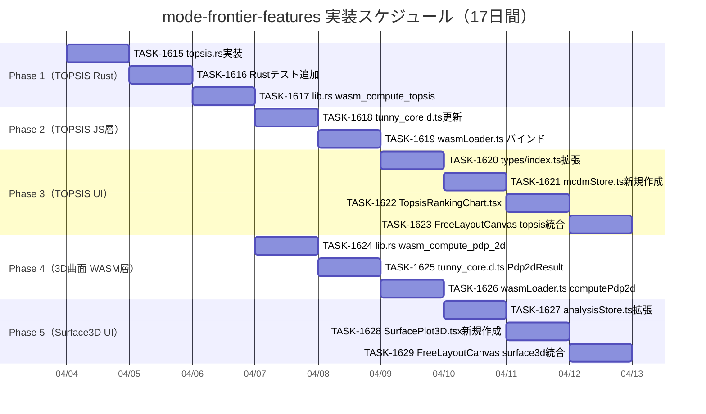

# mode-frontier-features タスク概要

**作成日**: 2026-04-04
**プロジェクト期間**: 2026-04-04 - 2026-05-01（20日）
**推定工数**: 58時間
**総タスク数**: 15件

## 関連文書

- **設計文書**: [📐 architecture.md](../../design/mode-frontier-features/architecture.md)
- **データフロー**: [🔄 dataflow.md](../../design/mode-frontier-features/dataflow.md)
- **ヒアリング記録**: [📋 design-interview.md](../../design/mode-frontier-features/design-interview.md)
- **インターフェース定義**: [📝 interfaces.ts](../../design/mode-frontier-features/interfaces.ts)
- **既存アーキテクチャ**: [📐 tunny-dashboard/architecture.md](../../design/tunny-dashboard/architecture.md)
- **WASM API仕様**: [📐 wasm-api.md](../../design/tunny-dashboard/wasm-api.md)

## フェーズ構成

| フェーズ | 期間 | 成果物 | タスク数 | 工数 | ファイル |
|---------|------|--------|----------|------|----------|
| Phase 1 | Day 1-4 | TOPSISアルゴリズム（Rust/WASM） | 3 | 12h | [TASK-1615〜1617](#phase-1-topsis-rustwasm実装) |
| Phase 2 | Day 5-6 | TOPSIS JS層・型定義 | 2 | 6h | [TASK-1618〜1619](#phase-2-topsis-js層型定義) |
| Phase 3 | Day 7-10 | TOPSISランキングUI | 4 | 16h | [TASK-1620〜1623](#phase-3-topsisランキングui) |
| Phase 4 | Day 11-13 | 3D曲面WASM層 | 3 | 10h | [TASK-1624〜1626](#phase-4-3d曲面プロットwasm層) |
| Phase 5 | Day 14-17 | AnalysisStore拡張・SurfacePlot3D | 3 | 12h | [TASK-1627〜1629](#phase-5-analysisstore拡張surfaceplot3d) |

## タスク番号管理

**使用済みタスク番号**: TASK-1615 〜 TASK-1629
**次回開始番号**: TASK-1630

## 全体進捗

- [x] Phase 1: TOPSISアルゴリズム（Rust/WASM） ✅
- [x] Phase 2: TOPSIS JS層・型定義 ✅
- [x] Phase 3: TOPSISランキングUI ✅
- [x] Phase 4: 3D曲面プロット WASM層 ✅
- [x] Phase 5: AnalysisStore拡張・SurfacePlot3D ✅

## マイルストーン

- **M1: TOPSIS Rust実装完了** (Day 6): WASM関数 `wasm_compute_topsis` 公開・JS呼び出し確認
- **M2: TOPSISランキングUI完成** (Day 10): `TopsisRankingChart` 動作確認・ChartCatalog統合
- **M3: 3D曲面WASM層完成** (Day 13): `computePdp2d` JS公開・`wasmLoader.ts` バインド確認
- **M4: SurfacePlot3D完成・全機能リリース準備** (Day 17): 全テスト通過・`npm run build` 成功

## 実行順序（ガントチャート）



> **並行実施可能**: Phase 3（Day 7〜10）と Phase 4（Day 11〜13）は前者がTOPSIS UI、後者が3D曲面WASM層で独立しており、Phase 3完了後に Phase 4・5 を並行実施すると工期短縮できる。

---

## Phase 1: TOPSISアルゴリズム（Rust/WASM）

**期間**: Day 1〜4
**目標**: `rust_core/src/topsis.rs` にTOPSISアルゴリズムを実装し、`lib.rs` からwasm_bindgenでエクスポートする
**成果物**: `rust_core/src/topsis.rs`, `lib.rs` wasm_compute_topsis追加

### タスク一覧

- [x] [TASK-1615: `topsis.rs` TOPSISアルゴリズム実装](TASK-1615.md) - 4h (TDD) 🔵 ✅完了
- [x] [TASK-1616: `topsis.rs` Rustテスト追加](TASK-1616.md) - 4h (TDD) 🔵 ✅完了
- [x] [TASK-1617: `lib.rs` wasm_compute_topsis wasm_bindgenエクスポート追加](TASK-1617.md) - 4h (DIRECT) 🔵 ✅完了

### 依存関係

```
TASK-1615 → TASK-1616
TASK-1615 → TASK-1617
TASK-1616 → TASK-1617
```

---

## Phase 2: TOPSIS JS層・型定義

**期間**: Day 5〜6
**目標**: `tunny_core.d.ts` に型宣言を追加し、`wasmLoader.ts` から `computeTopsis` を呼び出せる状態にする
**成果物**: `tunny_core.d.ts` 更新, `wasmLoader.ts` computeTopsisバインド

### タスク一覧

- [x] [TASK-1618: `tunny_core.d.ts` TopsisWasmResult・computeTopsis追加](TASK-1618.md) - 2h (DIRECT) 🔵 ✅完了
- [x] [TASK-1619: `wasmLoader.ts` computeTopsisバインド追加・テスト](TASK-1619.md) - 4h (TDD) 🔵 ✅完了

### 依存関係

```
TASK-1617 → TASK-1618
TASK-1618 → TASK-1619
```

---

## Phase 3: TOPSISランキングUI

**期間**: Day 7〜10
**目標**: `TopsisRankingChart` コンポーネントを作成し、ChartCatalogに統合する
**成果物**: `types/index.ts` 拡張, `mcdmStore.ts` 新規, `TopsisRankingChart.tsx` 新規, FreeLayoutCanvas統合

### タスク一覧

- [x] [TASK-1620: `types/index.ts` ChartId拡張・TopsisRankingResult・McdmStore型追加](TASK-1620.md) - 4h (DIRECT) 🔵 ✅完了
- [x] [TASK-1621: `mcdmStore.ts` 新規作成・テスト](TASK-1621.md) - 4h (TDD) 🔵 ✅完了
- [x] [TASK-1622: `TopsisRankingChart.tsx` 新規作成・テスト](TASK-1622.md) - 4h (TDD) 🔵 ✅完了
- [x] [TASK-1623: `FreeLayoutCanvas.tsx` case 'topsis-ranking'追加・ChartCatalog登録](TASK-1623.md) - 4h (TDD) 🔵 ✅完了

### 依存関係

```
TASK-1619 → TASK-1620
TASK-1620 → TASK-1621
TASK-1621 → TASK-1622
TASK-1622 → TASK-1623
```

---

## Phase 4: 3D曲面プロット WASM層

**期間**: Day 11〜13
**目標**: 既存の `compute_pdp_2d()` をwasm_bindgenでエクスポートし、JS層（wasmLoader）から呼び出せる状態にする
**成果物**: `lib.rs` wasm_compute_pdp_2d追加, `tunny_core.d.ts` Pdp2dResult追加, `wasmLoader.ts` computePdp2dバインド

### タスク一覧

- [x] [TASK-1624: `lib.rs` wasm_compute_pdp_2d wasm_bindgenエクスポート追加](TASK-1624.md) - 4h (DIRECT) 🔵 ✅完了
- [x] [TASK-1625: `tunny_core.d.ts` Pdp2dResult・computePdp2d追加](TASK-1625.md) - 2h (DIRECT) 🔵 ✅完了
- [x] [TASK-1626: `wasmLoader.ts` computePdp2dバインド追加・テスト](TASK-1626.md) - 4h (TDD) 🔵 ✅完了

### 依存関係

```
TASK-1617 → TASK-1624
TASK-1624 → TASK-1625
TASK-1625 → TASK-1626
```

---

## Phase 5: AnalysisStore拡張・SurfacePlot3D

**期間**: Day 14〜17
**目標**: `analysisStore.ts` を拡張し、`SurfacePlot3D` コンポーネントを作成・統合する
**成果物**: `analysisStore.ts` 拡張, `SurfacePlot3D.tsx` 新規, FreeLayoutCanvas surface3d統合

### タスク一覧

- [x] [TASK-1627: `analysisStore.ts` 拡張（surrogateModelType・surface3dCache・computeSurface3d）](TASK-1627.md) - 4h (TDD) 🔵 ✅完了
- [x] [TASK-1628: `SurfacePlot3D.tsx` 新規作成（deck.gl GridLayer・軸選択UI）](TASK-1628.md) - 4h (TDD) 🔵 ✅完了
- [x] [TASK-1629: `FreeLayoutCanvas.tsx` case 'surface3d'追加・ChartCatalog登録](TASK-1629.md) - 4h (TDD) 🔵 ✅完了

### 依存関係

```
TASK-1620 → TASK-1627
TASK-1626 → TASK-1627
TASK-1627 → TASK-1628
TASK-1628 → TASK-1629
TASK-1623 → TASK-1629
```

---

## 信頼性レベルサマリー

### 全タスク統計

- **総タスク数**: 15件
- 🔵 **青信号**: 15件 (100%)
- 🟡 **黄信号**: 0件 (0%)
- 🔴 **赤信号**: 0件 (0%)

### フェーズ別信頼性

| フェーズ | 🔵 青 | 🟡 黄 | 🔴 赤 | 合計 |
|---------|-------|-------|-------|------|
| Phase 1 | 3 | 0 | 0 | 3 |
| Phase 2 | 2 | 0 | 0 | 2 |
| Phase 3 | 4 | 0 | 0 | 4 |
| Phase 4 | 3 | 0 | 0 | 3 |
| Phase 5 | 3 | 0 | 0 | 3 |

**品質評価**: 高品質

## クリティカルパス

```
TASK-1615 → TASK-1616 → TASK-1617 → TASK-1618 → TASK-1619
→ TASK-1620 → TASK-1621 → TASK-1622 → TASK-1623

TASK-1617 → TASK-1624 → TASK-1625 → TASK-1626
→ TASK-1627 → TASK-1628 → TASK-1629
```

**クリティカルパス工数**: 46時間
**並行作業可能工数**: 12時間（Phase 3とPhase 4の並行実施可能範囲）

## 次のステップ

タスクを実装するには:
- 全タスク順番に実装: `/tsumiki:kairo-implement`
- 特定タスクを実装: `/tsumiki:kairo-implement TASK-1615`
