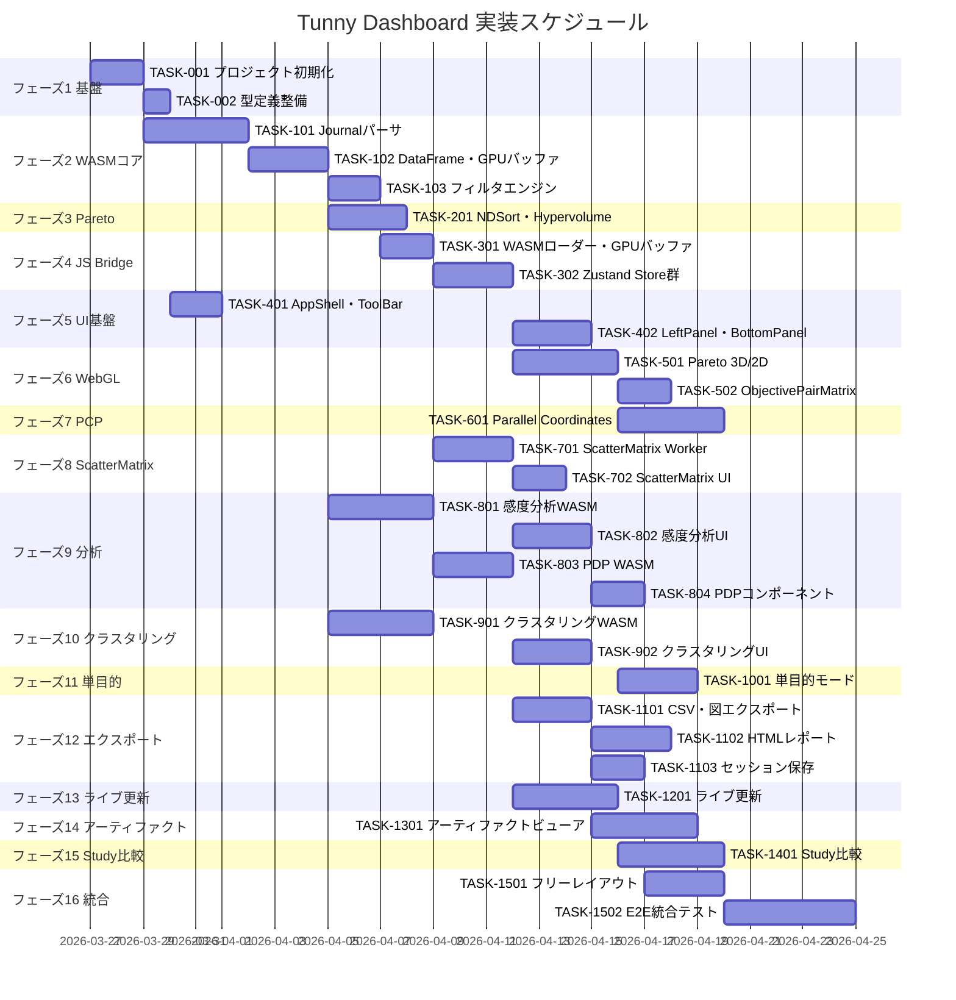

# Tunny Dashboard 実装タスク

## 概要

全タスク数: 42
推定作業時間: 約85〜100人日（WASM実装: 30日 / JS Bridge・Store: 15日 / UIコンポーネント: 30日 / テスト・統合: 15日）
クリティカルパス: TASK-001 → TASK-101 → TASK-102 → TASK-103 → TASK-301 → TASK-302 → TASK-501 → TASK-601

---

## フェーズ1: プロジェクト基盤構築

### TASK-001: プロジェクト初期化・ビルド環境構築

- [x] **タスク完了**
- **タスクタイプ**: DIRECT
- **要件リンク**: NFR-010, NFR-011
- **依存タスク**: なし
- **実装詳細**:
  - `wasm-pack` + `Vite` + React/TypeScript のモノレポ構成を作成
  - `rust_core/` ディレクトリに Rust クレートを初期化（`crate-type = ["cdylib", "rlib"]`）
  - `package.json`・`vite.config.ts`・`tsconfig.json` を設定
  - `wasm-pack build --target web` の npm スクリプトを設定
  - ESLint / Prettier 設定
  - `Cross-Origin-Opener-Policy: same-origin` / `Cross-Origin-Embedder-Policy: require-corp` ヘッダー設定（SharedArrayBuffer使用のため）
  - `vite-plugin-singlefile` 導入: JS/CSS/WASMを全て `dist/index.html` にインライン化
- **完了条件**:
  - [x] `npm run build` で `dist/index.html` が単一ファイルとして生成される
  - [x] `wasm-pack build` が成功する
  - [x] 開発サーバー（`npm run dev`）でWASMが読み込まれる

---

### TASK-002: TypeScript型定義・共通インターフェース整備

- [x] **タスク完了**
- **タスクタイプ**: DIRECT
- **要件リンク**: 全要件
- **依存タスク**: TASK-001
- **実装詳細**:
  - `docs/design/tunny-dashboard/interfaces.ts` の内容を `src/types/index.ts` として配置
  - WASM境界型・Store型・エンティティ型を `src/types/` 配下に整理
- **完了条件**:
  - [x] TypeScriptコンパイルエラーなし
  - [x] 全型が `src/types/index.ts` からエクスポートされている

---

## フェーズ2: WASM Core — Journalパーサ・DataFrame

### TASK-101: Journalパーサ（WASM）

- [x] **タスク完了**
- **タスクタイプ**: TDD
- **要件リンク**: REQ-001〜REQ-005, REQ-010〜REQ-013
- **依存タスク**: TASK-001
- **実装詳細**:
  - `rust_core/src/journal_parser.rs`: op_codeベースのステートマシン実装
  - 処理対象: `create_study` / `create_trial` / `set_trial_param` / `set_trial_value` / `set_trial_state` / `set_trial_user_attr` / `set_trial_system_attr`
  - `FloatDistribution`・`IntDistribution`・`CategoricalDistribution`・`UniformDistribution` の逆変換ロジック
  - `RUNNING`・`PRUNED`・`FAIL` トライアルを保留リストで管理
  - `set_trial_user_attr` → 数値型をf64列・文字列型をカテゴリ列へ変換
  - `constraints` → `c1, c2, c3...` 個別列展開 + `is_feasible` + `constraint_sum` 派生列
  - 分散最適化時の同一trial_idへの複数書き込み対応
- **テスト要件**:
  - [ ] 各op_codeが正しく処理される単体テスト
  - [ ] 各分布型の逆変換テスト（境界値・log=True等）
  - [ ] 不完全JSON行（書き込み途中）のスキップテスト
  - [ ] 50,000行パースが5秒以内の性能テスト
- **エラーハンドリング要件**:
  - [ ] JSONLでない行（バイナリ混入等）はスキップしてパース続行
  - [ ] 未知の `op_code` は無視してログ出力
  - [ ] 同一 `trial_id` への複数書き込み（分散最適化）は最後の値で上書き
  - [ ] 全行がパースできない場合はエラーをJSにthrow
- **完了条件**:
  - [ ] `parse_journal(data: Uint8Array) -> JsValue` が公開される
  - [ ] 50,000行で5,000ms以内

---

### TASK-102: WASMメモリ内DataFrame・GPUバッファ初期化

- [x] **タスク完了**
- **タスクタイプ**: TDD
- **要件リンク**: REQ-005, REQ-014, REQ-015
- **依存タスク**: TASK-101
- **実装詳細**:
  - `rust_core/src/dataframe.rs`: 列指向DataFrame（Vec<f32>列 + カテゴリ列）をWASMメモリに常駐
  - `select_study()`: DataFrameをアクティブにしてGPUバッファ初期データを返す
  - GPUバッファ: `positions(N×2)` / `positions3d(N×3)` / `colors(N×4)` / `sizes(N×1)` を Float32Array として返す
  - `get_column(name)` / `row_count()` / `column_names()` の公開
- **テスト要件**:
  - [ ] 列データの正確性テスト（パース後の値と一致）
  - [ ] GPUバッファサイズの正確性テスト（N×4 = colors等）
  - [ ] `select_study()` 切り替え後のデータ整合性テスト
- **エラーハンドリング要件**:
  - [ ] 存在しない `study_id` を指定した場合はエラーをJSにthrow
  - [ ] 全トライアルがCOMPLETE以外の場合は空のDataFrameを返す
- **完了条件**:
  - [ ] `select_study(study_id)` がGPUバッファを返す
  - [ ] JSが `Float32Array` を受け取ってdeck.glに渡せる

---

### TASK-103: WASMフィルタエンジン

- [x] **タスク完了**
- **タスクタイプ**: TDD
- **要件リンク**: REQ-040〜REQ-042
- **依存タスク**: TASK-102
- **実装詳細**:
  - `rust_core/src/filter.rs`: `filter_by_ranges(ranges_json: &str) -> Uint32Array`
  - 入力: `{"x1": {"min": 2.0, "max": 8.0}, "obj1": {"min": null, "max": 0.5}}`
  - 出力: 条件を満たすtrialインデックスの `Uint32Array`
  - `get_trial(index)` / `get_trials_batch(indices)` も実装
- **テスト要件**:
  - [ ] 単変数フィルタの正確性テスト
  - [ ] 複合条件（AND）フィルタテスト
  - [ ] null範囲（上限なし・下限なし）テスト
  - [ ] 50,000件で5ms以内の性能テスト
- **エラーハンドリング要件**:
  - [ ] 存在しない列名を指定した場合は空の `Uint32Array` を返す（エラーにしない）
  - [ ] `min > max` の範囲指定は空結果を返す
- **完了条件**:
  - [ ] `filter_by_ranges()` が5ms以内で実行される
  - [ ] 空結果・全件一致の境界値テストがパス

---

## フェーズ3: WASM Core — Pareto計算

### TASK-201: NDSort・Hypervolume計算（WASM）

- [x] **タスク完了**
- **タスクタイプ**: TDD
- **要件リンク**: REQ-070, REQ-072, REQ-074
- **依存タスク**: TASK-102
- **実装詳細**:
  - `rust_core/src/pareto.rs`: NDSort実装（多目的非支配ソート）
  - `compute_pareto_ranks()` → ranks（Uint32Array）+ paretoIndices + hypervolume
  - `compute_hypervolume_history()` → 試行番号順HV推移
  - `score_tradeoff_navigator(weights: Float64Array)` → 重み付きチェビシェフスカラー化
- **テスト要件**:
  - [ ] 2目的でのNDSort正確性テスト（既知の結果と照合）
  - [ ] 4目的での正確性テスト
  - [ ] 50,000点で100ms以内の性能テスト（NDSort）
  - [ ] Trade-off Navigatorが50,000点で1ms以内
  - [ ] Hypervolume計算の精度テスト
- **エラーハンドリング要件**:
  - [ ] 1目的の場合 `compute_pareto_ranks()` は全点をRank1として返す
  - [ ] hypervolume は2目的以上でのみ計算し、1目的の場合は `null` を返す
  - [ ] 重みベクトルの合計が0の場合はランダム選択にフォールバック
- **完了条件**:
  - [ ] `compute_pareto_ranks()` が100ms以内で実行される
  - [ ] `score_tradeoff_navigator()` が1ms以内で実行される

---

## フェーズ4: JS Bridge・状態管理基盤

### TASK-301: WASMローダー・GPUバッファ管理（JS Bridge）

- [x] **タスク完了**
- **タスクタイプ**: TDD
- **要件リンク**: NFR-012, REQ-014, REQ-015
- **依存タスク**: TASK-103, TASK-201
- **実装詳細**:
  - `src/wasm/wasmLoader.ts`: WASMモジュールのシングルトン初期化
  - `src/wasm/gpuBuffer.ts`: Float32Array（positions/colors/sizes）の管理クラス
  - alpha値のみ更新するメソッド `updateAlphas(selectedIndices: Uint32Array)` を実装
  - `positions` / `sizes` は変更しない設計を強制
- **テスト要件**:
  - [ ] WASMが正常に初期化されるテスト
  - [ ] `updateAlphas()` がpositions/sizesを変更しないことの検証
  - [ ] alpha更新が1ms以内の性能テスト（N=50,000）
- **エラーハンドリング要件**:
  - [ ] WASMロード失敗時はアプリ全体をエラー画面に切り替え
  - [ ] SharedArrayBuffer非サポート環境ではフォールバックメッセージを表示
- **完了条件**:
  - [ ] `useWasm()` フックでWASMへのアクセスが可能
  - [ ] `updateAlphas()` がdeck.glに反映される

---

### TASK-302: Zustand Store群の実装

- [x] **タスク完了**
- **タスクタイプ**: TDD
- **要件リンク**: REQ-040, REQ-044, REQ-045
- **依存タスク**: TASK-301
- **実装詳細**:
  - `src/stores/selectionStore.ts`: `SelectionStore` インターフェース完全実装
    - `brushSelect` / `addAxisFilter` / `removeAxisFilter` / `clearSelection` / `setHighlight` / `setColorMode`
  - `src/stores/studyStore.ts`: `StudyStore` 実装（`loadJournal` → WASM呼び出し）
  - `src/stores/layoutStore.ts`: `LayoutStore` 実装
  - 残りのStore（`ClusterStore`・`AnalysisStore`・`ExportStore`・`LiveUpdateStore`）はスタブ実装
- **テスト要件**:
  - [ ] `addAxisFilter()` がWASMを呼び出してselectedIndicesを更新するテスト
  - [ ] `clearSelection()` でselectedIndicesが全件に戻るテスト
  - [ ] Store間の購読連鎖テスト（selectionStoreの変更がgpuBufferに反映）
- **エラーハンドリング要件**:
  - [ ] WASM未初期化状態で `addAxisFilter()` を呼んだ場合はキューに積み、初期化完了後に実行
- **完了条件**:
  - [ ] `selectionStore.subscribe()` でGPUバッファが自動更新される
  - [ ] Reactの再レンダリングなしにalpha更新が動作する

---

## フェーズ5: 基本UIレイアウト

### TASK-401: アプリケーションシェル・ToolBar

- [x] **タスク完了**
- **タスクタイプ**: TDD
- **要件リンク**: REQ-030, REQ-032
- **依存タスク**: TASK-002
- **実装詳細**:
  - `src/components/layout/AppShell.tsx`: ToolBar / LeftPanel / MainCanvas / BottomPanel の4エリア CSS Grid レイアウト
  - `src/components/layout/ToolBar.tsx`: ファイル読込・Study選択・フィルタ保存/読込・カラーモード・エクスポートボタン
  - レイアウトモードA〜D の切り替えUI
  - Journalファイルドラッグ&ドロップ受け取り → `studyStore.loadJournal()` 呼び出し
- **UI/UX要件**:
  - [ ] ローディング状態: プログレスバー（パース進捗）
  - [ ] エラー表示: トースト通知
- **テスト要件**:
  - [ ] ファイルドロップでloadJournalが呼ばれるテスト
  - [ ] レイアウトモード切り替えでMainCanvasレイアウトが変わるテスト
- **完了条件**:
  - [ ] ファイル選択→Study選択ダイアログが表示される
  - [ ] 4エリアレイアウトが正しく描画される

---

### TASK-402: Left Panel・Bottom Panel

- [x] **タスク完了**
- **タスクタイプ**: TDD
- **要件リンク**: REQ-031, REQ-033, REQ-034
- **依存タスク**: TASK-401, TASK-302
- **実装詳細**:
  - `src/components/panels/LeftPanel.tsx`:
    - Study情報カウンタ（trials / selected / pareto）
    - 目的関数リスト（最小化/最大化アイコン付き）
    - 変数フィルタスライダー（全変数分、`addAxisFilter` を呼ぶ）
    - カラーリング選択（4モード）
    - 表示図選択チェックボックス
  - `src/components/panels/BottomPanel.tsx`:
    - 仮想スクロールテーブル（trial_id・変数・目的値・Paretoランク表示）
    - 行クリック → `selectionStore.setHighlight()` 呼び出し
    - CSV出力ボタン
- **UI/UX要件**:
  - [ ] Left PanelのカウンタはselectedIndices変更時にリアルタイム更新
  - [ ] 30変数のスライダーが快適にスクロールできる（仮想化）
- **テスト要件**:
  - [ ] スライダー操作でfilterRangesが更新されるテスト
  - [ ] テーブル行クリックでhighlightedが設定されるテスト
  - [ ] 50,000件の仮想スクロールパフォーマンステスト
- **完了条件**:
  - [ ] スライダー操作後、selectedカウンタがリアルタイム更新される
  - [ ] テーブル行クリックで全グラフがハイライト連動する

---

## フェーズ6: WebGL描画 — Pareto・Scatter

### TASK-501: Pareto 3D / 2D Scatter（deck.gl）

- [x] **タスク完了**
- **タスクタイプ**: TDD
- **要件リンク**: REQ-050, REQ-070〜REQ-075
- **依存タスク**: TASK-301, TASK-302
- **実装詳細**:
  - `src/components/charts/ParetoScatter3D.tsx`: deck.gl `PointCloudLayer` 実装
    - X/Y/Z軸・色軸をドロップダウンで割り当て
    - Pareto点: 大きく・不透明 / 非Pareto点: 小さく・半透明
    - 選択点に輪郭線ハイライト
    - 軌道回転（マウスドラッグ）・ズーム（スクロール）・等軸/透視投影切替
  - `src/components/charts/ParetoScatter2D.tsx`: `ScatterplotLayer` 実装
  - **Brushingの切り離し**: `selectionStore.subscribe()` で直接GPUバッファ更新（Reactサイクル外）
  - `src/components/charts/HypervolumeHistory.tsx`: ECharts折れ線グラフ
  - Trade-off Navigator UI: スライダー → `score_tradeoff_navigator()` → ハイライト
- **UI/UX要件**:
  - [ ] ローディング状態: WebGLコンテキスト初期化中はスピナー表示
  - [ ] 軸割り当てドロップダウン: 変数名・目的名をグループ分けして表示
  - [ ] 点ホバー: trial_id・各値のツールチップを表示
  - [ ] アクセシビリティ: キーボードによる軸切り替えが可能
- **エラーハンドリング要件**:
  - [ ] WebGLコンテキスト取得失敗時は「WebGL非対応」メッセージを表示
  - [ ] データが0件の場合は空状態UI（「データがありません」）を表示
- **テスト要件**:
  - [ ] deck.glコンポーネントが正しく初期化されるテスト
  - [ ] selectionStore変更でReact再レンダリングなしにalpha更新されるテスト
  - [ ] 50,000点で60fps維持の性能テスト
- **完了条件**:
  - [ ] 5万点の3D Scatter Plotが快適にインタラクション可能
  - [ ] Trade-off Navigatorのスライダー操作に1ms以内で応答

---

### TASK-502: Objective Pair Matrix（4×4）

- [x] **タスク完了**
- **タスクタイプ**: TDD
- **要件リンク**: REQ-070, REQ-075
- **依存タスク**: TASK-501
- **実装詳細**:
  - `src/components/charts/ObjectivePairMatrix.tsx`
  - 4×4セル（対角: 1D分布ヒストグラム、下三角: 2D散布図）
  - Pareto点を★でハイライト
  - セルクリック → 3Dビューの軸を設定
  - deck.gl ScatterplotLayer 使用
- **UI/UX要件**:
  - [ ] 1目的の場合はObjectivePairMatrixを非表示にする
  - [ ] 2目的の場合は2×2行列として表示
  - [ ] セルホバー時にセル内容のツールチップを表示
- **エラーハンドリング要件**:
  - [ ] Pareto点が0件の場合はセルに「Pareto解なし」テキストを表示
- **テスト要件**:
  - [ ] セルクリックで3Dビューの軸が変更されるテスト
  - [ ] 4目的・2目的・1目的での表示切り替えテスト
- **完了条件**:
  - [ ] 4×4行列が正しく表示される
  - [ ] セルクリックが3Dビューに連動する

---

## フェーズ7: Parallel Coordinates

### TASK-601: Parallel Coordinates 30軸（WebGL）

- [x] **タスク完了**
- **タスクタイプ**: TDD
- **要件リンク**: REQ-051, REQ-041
- **依存タスク**: TASK-501
- **実装詳細**:
  - `src/components/charts/ParallelCoordinates.tsx`: ECharts WebGLモード（または regl 自前実装）
  - 全変数（最大30軸）＋全目的（最大4軸）を軸として表示
  - **Axis Filter**: 軸上ブラシドラッグ → `selectionStore.addAxisFilter()` 呼び出し
  - 軸の並び替え（ドラッグ&ドロップ）
  - 感度分析結果に基づく軸の自動並び替えオプション
  - カテゴリ変数の対応（均等配置）
- **UI/UX要件**:
  - [ ] ローディング状態: 軸の初期配置中はスケルトン表示
  - [ ] 軸ラベル: 長い変数名は省略（末尾...）してホバーで全文表示
  - [ ] ブラシ範囲: 現在のフィルタ範囲を軸上に数値ラベルで表示
  - [ ] モバイル対応: タッチでのブラシ操作をサポート
- **エラーハンドリング要件**:
  - [ ] 変数が0件の場合は「データが読み込まれていません」を表示
  - [ ] 全サンプルがフィルタで除外された場合は「絞り込み結果: 0件」を表示
- **テスト要件**:
  - [ ] 軸ブラシがfilterRangesを正しく更新するテスト
  - [ ] 30軸での快適な操作性テスト
  - [ ] カテゴリ変数の表示テスト
- **完了条件**:
  - [ ] 30軸でブラシ操作が5ms以内でフィルタ反映される
  - [ ] 軸ブラシ後にBottom Tableが連動更新される

---

## フェーズ8: Scatter Matrix

### TASK-701: ScatterMatrix WebWorker・OffscreenCanvas基盤

- [x] **タスク完了**
- **タスクタイプ**: TDD
- **要件リンク**: REQ-052, REQ-060〜REQ-066
- **依存タスク**: TASK-301
- **実装詳細**:
  - `src/wasm/workers/scatterMatrixWorker.ts`: OffscreenCanvas + WebWorker 実装
  - Worker 4並列分割（行グループ: 0〜9 / 10〜19 / 20〜29 / 30〜33）
  - `downsample_for_thumbnail()` を呼び出し各セルのサムネイル（80×80px）を描画
  - セルホバー時の拡大プレビュー（300×300px）
  - セルクリック時のフルサイズ展開（600×600px、Brushing完全有効）
- **テスト要件**:
  - [ ] Mode 2（120セル）が1秒以内にレンダリングされる性能テスト
  - [ ] ダウンサンプリングにPareto点が含まれることの検証
  - [ ] Brushing後のサムネイルが選択状態を反映するテスト
- **完了条件**:
  - [ ] 変数×目的（Mode 2）120セルが1秒以内に表示される
  - [ ] サムネイルホバーで300×300pxプレビューが表示される

---

### TASK-702: ScatterMatrix UIコンポーネント・表示モード

- [x] **タスク完了**
- **タスクタイプ**: TDD
- **要件リンク**: REQ-060〜REQ-066
- **依存タスク**: TASK-701
- **実装詳細**:
  - `src/components/charts/ScatterMatrix.tsx`: UIシェル
  - Mode 1（変数×変数）/ Mode 2（変数×目的）/ Mode 3（カスタム）切り替え
  - 上三角: 相関係数ヒートマップ（数値のみ）
  - 対角: ヒストグラム
  - 軸ソート（相関順・重要度順・アルファベット順）
  - Intersection Observer で表示範囲外セルの遅延レンダリング
- **UI/UX要件**:
  - [ ] ローディング状態: 各セルにローディングプレースホルダー（グレー矩形）表示
  - [ ] 軸ラベル: 縦書きテキストで変数名を表示、長い場合は省略
  - [ ] セルホバー: 「クリックで展開」のツールチップ
- **エラーハンドリング要件**:
  - [ ] Worker失敗時は当該セルに「❌」を表示し他セルへの影響を防ぐ
- **テスト要件**:
  - [ ] 3表示モードの切り替えテスト
  - [ ] 軸ソートオプションの動作テスト
- **完了条件**:
  - [ ] 全34×34セルが遅延レンダリングで表示される

---

## フェーズ9: 感度分析・PDP

### TASK-801: 感度分析WASM実装（Spearman / Ridge / R²）

- [x] **タスク完了**
- **タスクタイプ**: TDD
- **要件リンク**: REQ-090〜REQ-093, REQ-095〜REQ-098
- **依存タスク**: TASK-102
- **実装詳細**:
  - `rust_core/src/sensitivity.rs`:
    - `compute_spearman()`: Spearman順位相関係数（O(n log n) × 30 × 4）
    - `compute_ridge()`: Ridge回帰 → 標準化偏回帰係数β・R²（O(np²)）
    - `compute_sensitivity_selected(indices)`: 絞り込みサブセットへの再計算
  - MIC計算は `src/wasm/workers/micWorker.ts`（JS、WebWorker非同期）
- **テスト要件**:
  - [ ] Spearman相関が既知の数値例と一致するテスト
  - [ ] Ridge回帰のβ係数の正確性テスト
  - [ ] 500ms以内（Spearman）・300ms以内（Ridge）の性能テスト
  - [ ] `compute_sensitivity_selected()` が50ms以内のテスト
- **完了条件**:
  - [ ] `compute_spearman()` が500ms以内で完了する
  - [ ] `compute_ridge()` が300ms以内で完了する

---

### TASK-802: 感度分析UIコンポーネント

- [x] **タスク完了**
- **タスクタイプ**: TDD
- **要件リンク**: REQ-096〜REQ-098
- **依存タスク**: TASK-801, TASK-302
- **実装詳細**:
  - `src/components/charts/SensitivityHeatmap.tsx`: ECharts HeatMap
    - 30行×4列（変数×目的）
    - 色: 青=負の相関・赤=正の相関・白=無相関
    - しきい値フィルタスライダー
    - セルクリック → Pareto図のカラーモードを当該変数の値に切り替え
  - 指標切り替え（Spearman / β / MIC / RF / SHAP）
  - 目的間トレードオフマップ（散布図）
  - SHAP Summary Plot（shap_values.json読み込み時）
- **UI/UX要件**:
  - [ ] ローディング状態: Spearman/Ridge計算中はプログレスバー（WASM計算中）
  - [ ] MIC計算中: 「MIC計算中...（数秒かかります）」のインジケーター
  - [ ] .onnxなし: RF重要度セルをグレーアウトし「.onnx読み込みで有効化」を表示
  - [ ] Brushing後: 全体感度とサブセット感度を2列で比較表示
- **エラーハンドリング要件**:
  - [ ] shap_values.json の形式が不正な場合はSHAP列を非表示にしエラートースト
  - [ ] metadata.json が読み込めない場合はRF重要度を無効化
- **テスト要件**:
  - [ ] しきい値変更で表示変数が絞り込まれるテスト
  - [ ] MIC計算中のロード状態表示テスト
- **完了条件**:
  - [ ] Spearman/βヒートマップが表示される
  - [ ] Brushing後の選択サブセット感度が再計算・比較表示される

---

### TASK-803: PDP WASM実装（Ridge簡易版）

- [x] **タスク完了**
- **タスクタイプ**: TDD
- **要件リンク**: REQ-100〜REQ-106
- **依存タスク**: TASK-801
- **実装詳細**:
  - `rust_core/src/pdp.rs`:
    - `compute_pdp(param, objective, n_grid, n_samples)`: Ridge回帰によるPDP
    - `compute_pdp_2d(param1, param2, objective, n_grid)`: 2変数交互作用
  - `src/wasm/workers/onnxWorker.ts`: ONNX Runtime Web（高精度PDP）WebWorker実装
- **テスト要件**:
  - [ ] 1変数PDP（Ridge）が20ms以内のテスト
  - [ ] 2変数PDPが100ms以内のテスト
  - [ ] PDPカーブの単調性テスト（既知の線形データで検証）
  - [ ] ONNXモデル読み込み・推論のテスト
- **完了条件**:
  - [ ] `compute_pdp()` が20ms以内で完了する
  - [ ] .onnxなし時は線形PDPが表示され、案内メッセージが出る

---

### TASK-804: PDPコンポーネント

- [x] **タスク完了**
- **タスクタイプ**: TDD
- **要件リンク**: REQ-103〜REQ-106
- **依存タスク**: TASK-803, TASK-802
- **実装詳細**:
  - `src/components/charts/PDPChart.tsx`: ECharts実装
    - PDP曲線（太線）・ICE（グレー半透明）・95%信頼区間（バンド）・rugプロット
    - 全変数PDPサマリー（重要度順小型グラフ一覧）
    - モデル品質パネル（R²・RMSE・評価）
    - 2変数PDP（交互作用ヒートマップ）
  - Brushing連動: 選択サンプルのICEラインをハイライト
- **UI/UX要件**:
  - [ ] ローディング状態: PDP計算中はスピナー（即時に20ms以内なので短時間表示）
  - [ ] .onnxなし時: 警告バナー「線形近似で表示中 / より精度の高いPDPには...」を表示
  - [ ] R² < 0.8 時: 「PDPの解釈に注意が必要です」の警告バッジを表示
  - [ ] モデル品質パネル: R²・RMSE・評価（✓良好 / △要注意 / ✕推奨外）のテーブル
- **エラーハンドリング要件**:
  - [ ] .onnxファイルの形式エラー時はリッジフォールバックに切り替えてエラートースト
  - [ ] ONNX Workerがクラッシュした場合はリッジフォールバックに自動切り替え
- **テスト要件**:
  - [ ] R² < 0.8時に警告が表示されるテスト
  - [ ] ICEラインのハイライト連動テスト
- **完了条件**:
  - [ ] PDPチャートが表示される
  - [ ] .onnx読み込み後に高精度PDPに切り替わる

---

## フェーズ10: クラスタリング

### TASK-901: クラスタリングWASM実装（PCA + k-means）

- [x] **タスク完了**
- **タスクタイプ**: TDD
- **要件リンク**: REQ-080〜REQ-087
- **依存タスク**: TASK-102
- **実装詳細**:
  - `rust_core/src/clustering.rs`:
    - `run_pca(n_components, space)`: 固有値分解
    - `run_kmeans(k, data, n_cols)`: Lloyd's algorithm
    - `estimate_k_elbow(data, n_cols, max_k)`: k=2〜15を実行してElbow推定
    - `compute_cluster_stats(labels)`: centroid / std / t検定（有意差マーク）
- **テスト要件**:
  - [ ] PCAが既知のデータで正しい主成分を返すテスト
  - [ ] k-meansの収束テスト
  - [ ] PCA(50ms) + k-means(200ms) + stats(150ms) = 合計400ms以内の性能テスト
  - [ ] Elbow法の推薦kの妥当性テスト
- **完了条件**:
  - [ ] 50,000点でクラスタリング合計400ms以内
  - [ ] `run_pca()` が50ms以内で完了する

---

### TASK-902: クラスタリングUIコンポーネント

- [x] **タスク完了**
- **タスクタイプ**: TDD
- **要件リンク**: REQ-083〜REQ-087
- **依存タスク**: TASK-901, TASK-302
- **実装詳細**:
  - `src/components/panels/ClusterPanel.tsx`: 設定パネル（対象空間・アルゴリズム・k設定・実行ボタン・プログレス）
  - `src/components/panels/ClusterList.tsx`: クラスタ一覧（件数・特徴サマリー・行クリック選択）
  - クラスタ間比較テーブル（平均±std、有意差★）
  - クラスタ選択 → `selectionStore.brushSelect()` 呼び出し
  - UMAP Worker完了後にUMAP 2Dビューを有効化
- **UI/UX要件**:
  - [ ] ローディング状態: クラスタリング実行中はプログレスバー（0〜100%）と「計算中...68%」テキスト
  - [ ] Elbow法: kとWCSSの折れ線グラフを表示し「k=4を推奨します」を強調
  - [ ] クラスタ一覧: 各クラスタを識別色のバッジで表示、Ctrl+クリックで複数選択
  - [ ] UMAP完了後: 「UMAP 2D ビューを有効化しました」のトースト通知
- **エラーハンドリング要件**:
  - [ ] k=1指定時は「k=2以上を指定してください」の警告を表示してキャンセル
  - [ ] UMAPワーカーのクラッシュ時はエラートーストを表示しPCAフォールバックに切り替え
- **テスト要件**:
  - [ ] クラスタ行クリックでselectedIndicesが更新されるテスト
  - [ ] Brushing後の再クラスタリングが選択サブセットで実行されるテスト
  - [ ] 計算中プログレス表示テスト
- **完了条件**:
  - [ ] k=4クラスタリング実行後、全グラフがクラスタ色で更新される
  - [ ] クラスタ一覧の特徴サマリーが表示される

---

## フェーズ11: 単目的モード

### TASK-1001: 単目的モード専用コンポーネント

- [x] **タスク完了**
- **タスクタイプ**: TDD
- **要件リンク**: REQ-110〜REQ-113, REQ-022
- **依存タスク**: TASK-401, TASK-501
- **実装詳細**:
  - `src/components/charts/OptimizationHistory.tsx`:
    - Best値推移・全試行値・移動平均・改善率推移の4表示モード
    - 改善点マーク（★）・収束判定ライン
    - 探索フェーズ自動分割（背景色区分）
  - `src/components/panels/ConvergenceDiagnosis.tsx`: 収束診断パネル
  - `src/components/panels/BestTrialHistory.tsx`: Best解遷移トラッキングテーブル
  - Study選択時に目的数=1なら単目的レイアウトに自動切り替え
- **UI/UX要件**:
  - [ ] 表示切替ラジオボタン: Best値推移 / 全試行値 / 移動平均 / 改善率推移
  - [ ] 探索フェーズ: 背景色（探索期:青 / 精緻化期:黄 / 収束期:灰）で区分表示
  - [ ] Best解遷移テーブル: 行クリックで全グラフハイライト連動
  - [ ] 収束診断: 収束済み（緑）/ 収束中（黄）/ 未収束（赤）のバッジ表示
- **エラーハンドリング要件**:
  - [ ] 試行数が少なすぎて収束判定できない場合は「判定不可（試行数不足）」を表示
- **テスト要件**:
  - [ ] 目的数=1のStudy選択でPareto関連UIが非表示になるテスト
  - [ ] 収束判定ロジックの正確性テスト
  - [ ] フェーズ自動検出の境界値テスト
- **完了条件**:
  - [ ] 単目的StudyでHistory中心レイアウトが表示される
  - [ ] 収束診断パネルが最良値・達成試行を正確に表示する

---

## フェーズ12: エクスポート

### TASK-1101: CSVエクスポート・図エクスポート

- [x] **タスク完了**
- **タスクタイプ**: TDD
- **要件リンク**: REQ-150〜REQ-153, REQ-156
- **依存タスク**: TASK-102, TASK-302
- **実装詳細**:
  - `rust_core/src/export.rs`: `serialize_csv(indices, columns_json)` 実装
  - `src/stores/exportStore.ts`: `ExportStore` 完全実装
  - `exportCsv()`: 対象選択（全件/選択/Pareto/クラスタ指定）+ 列選択
  - 各図右上メニュー（PNG: `Canvas.toBlob()` / SVG: 5,000点上限 + 警告 / HTML: Plotly.js再描画）
  - ピン留め機能（最大20件・メモ付き）
- **UI/UX要件**:
  - [ ] CSVエクスポートUI: 対象選択ラジオ + 列選択チェックボックス + ダウンロードボタン
  - [ ] SVGエクスポート: 「5,000点に絞り込みます。よろしいですか？」確認ダイアログ
  - [ ] ピン留めリスト: trial_id・概要・メモ欄（入力可）のテーブル表示
  - [ ] エクスポート中: ボタンを無効化してスピナー表示
- **エラーハンドリング要件**:
  - [ ] 選択サンプルが0件でCSVエクスポートした場合は「対象データがありません」を表示
  - [ ] File System Access API非対応時は `<a download>` フォールバック
  - [ ] ピン留め20件超過時は「上限20件です。古いピン留めを削除してください」を表示
- **テスト要件**:
  - [ ] CSV出力の列内容・文字コード（UTF-8）テスト
  - [ ] SVGエクスポート時に5,000点以上は自動絞り込み+警告のテスト
  - [ ] ピン留め上限（20件）超過時の処理テスト
- **完了条件**:
  - [ ] CSVが正しいフォーマットでダウンロードされる
  - [ ] PNGエクスポートが全点・高解像度で出力される

---

### TASK-1102: スタンドアロンHTMLレポート生成

- [x] **タスク完了**
- **タスクタイプ**: TDD
- **要件リンク**: REQ-154〜REQ-155, REQ-158
- **依存タスク**: TASK-1101, TASK-901
- **実装詳細**:
  - `rust_core/src/export.rs`: `compute_report_stats()` 実装
  - `src/components/export/ReportBuilder.tsx`: セクション選択・ドラッグ並び替えUI
  - HTMLテンプレート: CSS/Plotly.jsインライン + Pareto解・クラスタ代表点・統計サマリーをJSONで埋め込み
  - 全50,000件の生データは埋め込まない（目標: 5〜15MB）
  - PDFエクスポート: `@media print` CSS + `window.print()`
- **UI/UX要件**:
  - [ ] レポートビルダー: セクションリストをドラッグ&ドロップで並び替え可能
  - [ ] プレビューボタン: 生成前にHTMLをiframe内でプレビュー表示
  - [ ] 生成中: プログレスバー（データ収集→図生成→HTML組み立て→ダウンロード）
- **エラーハンドリング要件**:
  - [ ] Plotly.js再描画に失敗した図はスキップして他セクションのレポートを継続生成
  - [ ] ファイルサイズが20MB超の場合は警告を表示（ダウンロードは続行）
- **テスト要件**:
  - [ ] HTMLレポート生成が1秒以内のテスト
  - [ ] 生成HTMLファイルサイズが15MB以下のテスト
  - [ ] 外部リソースなし（オフライン動作）の検証
  - [ ] ピン留め試行が「注目解」セクションに含まれることのテスト
- **完了条件**:
  - [ ] HTMLレポートがブラウザのみで閲覧できる
  - [ ] 1秒以内にダウンロードが開始される

---

### TASK-1103: 分析セッション保存・復元

- [x] **タスク完了**
- **タスクタイプ**: TDD
- **要件リンク**: REQ-157
- **依存タスク**: TASK-302, TASK-1101
- **実装詳細**:
  - `SessionState` インターフェースに基づくJSONシリアライズ/デシリアライズ
  - `exportStore.saveSession()` / `loadSession()` 実装
  - 保存内容: filterRanges・selectedIndices・colorMode・clusterConfig・layoutMode・pinnedTrials・freeModeLayout
  - File System Access API でファイル保存・読み込み
- **UI/UX要件**:
  - [ ] 保存成功時: 「セッションを保存しました: session_YYYYMMDD.json」のトースト通知
  - [ ] 読み込み時: セッション情報プレビュー（保存日時・Study名・フィルタ数）の確認ダイアログ
- **エラーハンドリング要件**:
  - [ ] 不正なJSONファイル読み込み時は「セッションファイルの形式が正しくありません」のエラー
  - [ ] バージョン不一致時は「古いバージョンのセッションです。一部の設定が復元できない場合があります」の警告を表示して続行
- **テスト要件**:
  - [ ] セッション保存→復元で全ストアが正確に復元されるテスト
  - [ ] 古いバージョンのセッションファイルの互換性テスト
- **完了条件**:
  - [ ] セッションファイルを読み込むと保存時の分析状態が再現される

---

## フェーズ13: ライブ更新

### TASK-1201: ライブ更新（FSAPI差分ポーリング）

- [x] **タスク完了**
- **タスクタイプ**: TDD
- **要件リンク**: REQ-130〜REQ-135
- **依存タスク**: TASK-101, TASK-302
- **実装詳細**:
  - `rust_core/src/live_update.rs`: `append_journal_diff(data, byte_offset)` 実装
    - 不完全JSON行スキップ
    - RUNNING保留リスト管理
    - COMPLETE確定後DataFrame追記 + Pareto差分更新
  - `src/wasm/fsapiPoller.ts`: File System Access API ポーリング
    - ファイルサイズ確認 → 差分のみ読み込み → WASMに渡す
    - ポーリング間隔: 1〜30秒設定可（デフォルト5秒）
  - `src/stores/liveUpdateStore.ts`: 完全実装
  - 更新中: Brushing/フィルタ/視点を変更しない（既存selectionStoreへの不干渉設計）
  - 非対応ブラウザ（Firefox等）: 手動更新ボタンにフォールバック
- **UI/UX要件**:
  - [ ] ToolBarに「● LIVE」の赤点滅インジケーターと「最終更新: N秒前」を表示
  - [ ] Left Panelに直近3回分の更新履歴（+N試行 / N秒前）を表示
  - [ ] 非対応ブラウザ（Firefox等）: ライブ更新ボタンをグレーアウトし「Chrome/Edgeのみ対応」のツールチップ
  - [ ] ポーリング間隔設定: ドロップダウン（1秒 / 5秒 / 10秒 / 30秒）
- **エラーハンドリング要件**:
  - [ ] ファイルが削除・移動された場合はライブ更新を自動停止してエラートースト
  - [ ] 連続3回読み込み失敗でライブ更新を自動停止し「更新に失敗しました」の警告
- **テスト要件**:
  - [ ] 差分1,000行の処理が100ms以内のテスト
  - [ ] 書き込み途中行がスキップされ、次回正常処理されるテスト
  - [ ] ライブ更新中にBrushing状態が変化しないことのテスト
  - [ ] FSAPI非対応環境でフォールバックするテスト
- **完了条件**:
  - [ ] ライブ更新ON時に新試行がリアルタイムでグラフに追加される
  - [ ] 既存のBrushing選択が更新によって変化しない

---

## フェーズ14: アーティファクト連携

### TASK-1301: アーティファクトビューア

- [x] **タスク完了**
- **タスクタイプ**: TDD
- **要件リンク**: REQ-140〜REQ-144
- **依存タスク**: TASK-402, TASK-902
- **実装詳細**:
  - アーティファクトディレクトリ選択UI（Directory Picker API）
  - `src/components/panels/ArtifactViewer.tsx`: 詳細パネル（trial_idクリック時）
    - 画像: サムネイル + 拡大表示
    - CSV: テーブル表示（先頭20行）
    - その他: ダウンロードリンク
  - Paretoフロント点ホバー時の画像サムネイルポップアップ
  - `src/components/panels/ArtifactGallery.tsx`:
    - Bottom Panelのタブ切り替え（テーブルビュー / ギャラリービュー）
    - グループ別ギャラリー（クラスタ / Brushing選択 / Pareto解）
    - 最大4列の並列比較表示
    - ソート・絞り込み（Paretoのみ・アーティファクトありのみ）
- **UI/UX要件**:
  - [ ] ローディング状態: サムネイル読み込み中はグレーのプレースホルダー
  - [ ] 画像の拡大: クリックでライトボックス表示
  - [ ] ギャラリーカード: サイズ切替（小/中/大）ボタン
  - [ ] 無限スクロール: 「さらに読み込む」ボタンで48件ずつ追加
- **エラーハンドリング要件**:
  - [ ] アーティファクトファイルが存在しない場合はカードに「ファイルが見つかりません」を表示
  - [ ] ディレクトリが指定されていない場合はアーティファクト関連UIを完全に非表示
  - [ ] MIMEタイプが未対応の場合はダウンロードリンクのみ表示
- **テスト要件**:
  - [ ] 画像アーティファクトがサムネイルで表示されるテスト
  - [ ] ギャラリー並列比較（4列）のレイアウトテスト
  - [ ] アーティファクトなし時のUI非表示テスト
- **完了条件**:
  - [ ] Pareto点ホバーで画像サムネイルがポップアップする
  - [ ] クラスタ選択後にギャラリービューでグループ比較できる

---

## フェーズ15: 複数Study比較

### TASK-1401: 複数Study比較機能

- [x] **タスク完了**
- **タスクタイプ**: TDD
- **要件リンク**: REQ-120〜REQ-124
- **依存タスク**: TASK-501, TASK-201
- **実装詳細**:
  - `rust_core/src/pareto.rs` に Study間Pareto支配関係計算を追加
  - `src/components/panels/StudyComparisonPanel.tsx`: Study管理パネル
    - 比較対象Study選択（目的数違いの場合は警告表示）
    - 重畳（Overlay）/ 並列（Side-by-side）/ 差分（Diff）モード切り替え
  - 多目的比較: Pareto重畳表示・HV推移重畳・Study間支配率テーブル
  - 単目的比較: Best値推移重畳・統計サマリーテーブル
  - 変数分布KDE比較（ECharts）
- **UI/UX要件**:
  - [ ] Study管理パネル: 各Studyに色バッジ（●赤/●緑/●紫）を割り当て
  - [ ] 目的数不一致の場合: ⚠ アイコン + 「History・変数分布のみ比較可能」の説明テキスト
  - [ ] 比較モードの切り替え: ラジオボタン（重畳 / 並列 / 差分）
  - [ ] 統計サマリーテーブル: 各Study列のヘッダーに割り当て色バッジ
- **エラーハンドリング要件**:
  - [ ] 5Study以上選択時は「初期ロードに時間がかかります（〜3秒×Study数）」の確認ダイアログ
  - [ ] Study切り替えで変数名が一致する場合のみフィルタ引き継ぎオプションを表示
- **テスト要件**:
  - [ ] 目的数不一致Study比較時にPareto比較が無効化されるテスト
  - [ ] 3Study重畳表示のテスト
  - [ ] Study切り替え時のフィルタリセットテスト
- **完了条件**:
  - [ ] 同一Journal内の2つのStudyを並べて比較できる
  - [ ] 目的数が異なるStudyに適切な警告が表示される

---

## フェーズ16: フリーレイアウト・最終統合

### TASK-1501: フリーレイアウト（Mode D）

- [x] **タスク完了**
- **タスクタイプ**: TDD
- **要件リンク**: REQ-032, NFR-031, NFR-032
- **依存タスク**: TASK-401, TASK-1103
- **実装詳細**:
  - 4×4グリッドスナップ方式のドラッグ&ドロップレイアウト
  - `layoutStore.saveLayout()` / `loadLayout()` でJSON永続化
  - グリッドライブラリ（例: react-grid-layout）の採用
- **UI/UX要件**:
  - [ ] ドラッグ中: グリッドスナップのガイドライン表示
  - [ ] チャートカード: タイトルバーをドラッグハンドルとして使用
  - [ ] 「レイアウト保存」ボタン: 保存成功時にトースト通知
  - [ ] プリセット選択: Mode A / B / C のプリセットボタンでフリーレイアウト上書き確認
- **エラーハンドリング要件**:
  - [ ] チャートが重なった場合は自動的に隣接セルにスナップ
  - [ ] レイアウトJSONの形式エラー時は「レイアウトを読み込めませんでした」を表示しデフォルトに戻す
- **テスト要件**:
  - [ ] ドラッグ&ドロップでチャートが移動するテスト
  - [ ] レイアウトJSON保存・復元テスト
- **完了条件**:
  - [ ] チャートを自由配置してJSONで保存・復元できる

---

### TASK-1502: E2E統合テスト・性能検証

- [x] **タスク完了**
- **タスクタイプ**: TDD
- **要件リンク**: 全受け入れ基準
- **依存タスク**: TASK-1401, TASK-1201, TASK-1301
- **実装詳細**:
  - Playwright E2Eテストセットアップ
  - 主要ユーザーフロー（ファイル読込→Brushing→エクスポート）のE2Eテスト
  - 50,000件のJournalファイルを使った性能ベンチマーク（CI自動計測）
  - `Cross-Origin-Opener-Policy` ヘッダー + SharedArrayBuffer動作確認
- **テスト要件**:
  - [x] ファイル読込 → Brushing → CSV出力のE2Eフロー
  - [x] 5万件読込が5秒以内のCI性能テスト
  - [x] フィルタ操作が100ms以内のCI性能テスト
  - [x] 単一HTMLファイルがPython環境なしで動作するテスト
- **完了条件**:
  - [x] 全E2Eテストがパスする
  - [x] 性能目標が全て達成されている

---

## 実行順序

---

## 並行実行可能なタスクグループ

以下のタスクは依存関係なく並行実装可能（TASK-001・002完了後）:

| グループ | タスク |
|---|---|
| **WASMコア並行** | TASK-101 / TASK-102 → TASK-103, TASK-201, TASK-801, TASK-901（直列） |
| **UI基盤並行** | TASK-401 → TASK-402（UI）と TASK-301 → TASK-302（Store）は並行可 |
| **分析並行** | TASK-801・TASK-803・TASK-901 は TASK-102 完了後に並行実装可 |

---

## サブタスクテンプレート

各タスクは以下のプロセスで実装する。タスクタイプに応じてプロセスを選択すること。

### TDDタスクの場合（コード実装タスク）

各タスクは以下のTDDプロセスで実装:

1. **`tdd-requirements`** — タスクの詳細要件定義・受け入れ基準の明確化
2. **`tdd-testcases`** — 単体テストケース作成（エッジケース含む）
3. **`tdd-red`** — 失敗するテストを実装・テストが失敗することを確認
4. **`tdd-green`** — テストが通る最小限の実装
5. **`tdd-refactor`** — コードの品質向上・保守性の改善
6. **`tdd-verify-complete`** — 実装の完成度確認（不足があれば3〜5を繰り返す）

**適用対象**: TASK-101〜TASK-103, TASK-201, TASK-301〜TASK-302, TASK-401〜TASK-402, TASK-501〜TASK-502, TASK-601, TASK-701〜TASK-702, TASK-801〜TASK-804, TASK-901〜TASK-902, TASK-1001, TASK-1101〜TASK-1103, TASK-1201, TASK-1301, TASK-1401, TASK-1501〜TASK-1502

### DIRECTタスクの場合（準備・環境構築タスク）

各タスクは以下のDIRECTプロセスで実装:

1. **`direct-setup`** — 直接実装・設定（ディレクトリ作成・設定ファイル作成・依存関係インストール）
2. **`direct-verify`** — 動作確認・品質確認・次タスクへの準備状況確認

**適用対象**: TASK-001, TASK-002