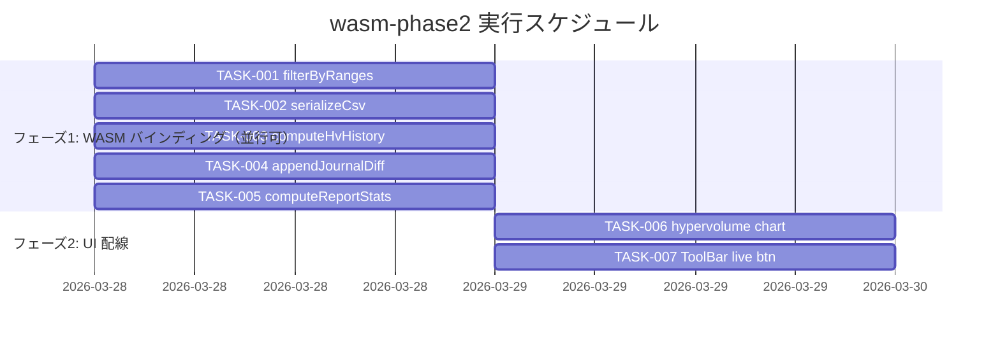

# wasm-phase2 実装タスク

## 概要

全タスク数: 7
推定作業時間: 約3〜5人日（WASM bindgen 5タスク: 2〜3日 / フロントエンド UI 2タスク: 1〜2日）
クリティカルパス: TASK-003 → TASK-006 / TASK-004 → TASK-007

要件リンク: `docs/spec/wasm-phase2-requirements.md`

**前提**: Rust 側の実装（`filter_by_ranges`・`serialize_csv`・`compute_hypervolume_history`・`append_journal_diff`・`compute_report_stats`）はすべて `rust_core/src/` に実装済み。本タスク群はバインディング層の追加のみ。

---

## フェーズ1: WASM バインディング層（TASK-001〜005 は並行実行可能）

### TASK-001: `filterByRanges` WASM バインディング

- [x] **タスク完了**
- **タスクタイプ**: TDD
- **要件リンク**: REQ-101-A〜G
- **依存タスク**: なし
- **実装詳細**:
  - `rust_core/src/lib.rs` に `#[wasm_bindgen(js_name = "filterByRanges")]` 関数を追加
    - 引数: `ranges_json: &str`
    - 戻り値: `Vec<u32>` → `js_sys::Uint32Array` → `.buffer()` で `ArrayBuffer` → `JsValue`
    - エラー時: `Err(JsValue::from_str(&e))`
  - `frontend/src/wasm/pkg/tunny_core.d.ts` に `export function filterByRanges(ranges_json: string): Uint32Array;` を追加（wasm-pack 再ビルドまたは手動追記）
  - `frontend/src/wasm/wasmLoader.ts` の `_initialize()` で `loader.filterByRanges` を `(rangesJson: string) => wasmFilterByRanges(rangesJson) as Uint32Array` にバインド（`_notImplemented` 削除）
  - `wasmFilterByRanges` を `tunny_core` パッケージからインポート
- **テスト要件**:
  - [ ] 単体テスト: `wasm_filter_by_ranges` の Rust テスト（非 WASM ターゲット）は `filter.rs` 内のテストで既にカバー済み
  - [ ] 統合テスト: `selectionStore.addAxisFilter()` のモックテストで `wasm.filterByRanges` が呼ばれること（selectionStore.test.ts）
  - [ ] Edge ケース: `{}` (空条件) で全インデックス返却、全除外で空 `Uint32Array` 返却
- **エラーハンドリング要件**:
  - [ ] `filter_by_ranges` がエラーを返した場合 `Err(JsValue)` を返し、JS 側は `catch` で対処
  - [ ] 軸名不一致の場合は該当軸を無視して他条件のみ適用
- **完了条件**:
  - [ ] `rust_core/src/lib.rs` に `wasm_filter_by_ranges` 関数が追加されている
  - [ ] `wasm-pack build` 実行後（または `tunny_core.d.ts` 手動更新後）`filterByRanges` がエクスポートされている
  - [ ] `wasmLoader.ts` の `filterByRanges` が `_notImplemented` でなく実バインディングになっている
  - [ ] TypeScript コンパイルエラーなし

---

### TASK-002: `serializeCsv` WASM バインディング

- [x] **タスク完了**
- **タスクタイプ**: TDD
- **要件リンク**: REQ-102-A〜G
- **依存タスク**: なし
- **実装詳細**:
  - `rust_core/src/lib.rs` に `#[wasm_bindgen(js_name = "serializeCsv")]` 関数を追加
    - 引数: `indices_js: js_sys::Array, columns_json: &str`
    - `indices_js.iter()` で `Vec<u32>` に変換してから `export::serialize_csv(&indices, columns_json)` を呼び出す
    - 戻り値: `String` → `JsValue::from_str(&csv)` → `Ok()`
    - エラー時: `Err(JsValue::from_str(&e))`
  - `frontend/src/wasm/pkg/tunny_core.d.ts` に `export function serializeCsv(indices: number[], columns_json: string): string;` を追加
  - `frontend/src/wasm/wasmLoader.ts` の `_initialize()` で `loader.serializeCsv` をバインド（`_notImplemented` 削除）
  - `wasmSerializeCsv` を `tunny_core` パッケージからインポート
- **テスト要件**:
  - [ ] 単体テスト: `serialize_csv` の Rust テストは `export.rs` で既にカバー済み（10+ テスト）
  - [ ] 統合テスト: `exportStore.exportCsv()` モックテストで `wasm.serializeCsv` が呼ばれること
  - [ ] Edge ケース: `indices = []` でヘッダーのみ CSV、`columns_json = "[]"` で全列出力
- **エラーハンドリング要件**:
  - [ ] RFC 4180 エスケープ（カンマ・ダブルクォート含む値）は Rust 側で保証済み
  - [ ] JS 側は `catch` でエラーを `exportStore.error` に設定
- **完了条件**:
  - [ ] `rust_core/src/lib.rs` に `wasm_serialize_csv` 関数が追加されている
  - [ ] `wasm-pack build` 実行後（または `tunny_core.d.ts` 手動更新後）`serializeCsv` がエクスポートされている
  - [ ] `wasmLoader.ts` の `serializeCsv` が `_notImplemented` でなく実バインディングになっている
  - [ ] TypeScript コンパイルエラーなし

---

### TASK-003: `computeHvHistory` WASM バインディング

- [x] **タスク完了**
- **タスクタイプ**: TDD
- **要件リンク**: REQ-103-A〜F
- **依存タスク**: なし
- **実装詳細**:
  - `rust_core/src/lib.rs` に `#[wasm_bindgen(js_name = "computeHvHistory")]` 関数を追加
    - 引数: `is_minimize_js: js_sys::Array`
    - `is_minimize_js.iter()` で `Vec<bool>` に変換してから `pareto::compute_hypervolume_history(&is_minimize)` を呼び出す
    - `HvHistoryResult { trial_ids, hv_values }` を JS オブジェクトに変換:
      - `js_sys::Uint32Array` + `.buffer()` で `trialIds`
      - `js_sys::Float64Array` + `.buffer()` で `hvValues`
    - `js_sys::Reflect::set` で `{ trialIds, hvValues }` オブジェクトを構築して返す
    - エラー時: `Err(JsValue::from_str(&e))`
  - `frontend/src/wasm/pkg/tunny_core.d.ts` に以下を追加:
    ```ts
    export interface HvHistoryResult { trialIds: Uint32Array; hvValues: Float64Array; }
    export function computeHvHistory(is_minimize: boolean[]): HvHistoryResult;
    ```
  - `frontend/src/wasm/wasmLoader.ts` の `_initialize()` で `loader.computeHvHistory` をバインド（`_notImplemented` 削除）
  - `wasmComputeHvHistory` を `tunny_core` パッケージからインポート
- **テスト要件**:
  - [ ] 単体テスト: Rust の `compute_hypervolume_history` テストは `pareto.rs` に存在することを確認
  - [ ] 統合テスト: `HvHistoryResult.trialIds.length === HvHistoryResult.hvValues.length` が常に成立すること
  - [ ] Edge ケース: `is_minimize = [true]` (1目的) でもパニックしない
- **エラーハンドリング要件**:
  - [ ] `is_minimize` の長さが 0 のとき `Err` を返す
- **完了条件**:
  - [ ] `rust_core/src/lib.rs` に `wasm_compute_hv_history` 関数が追加されている
  - [ ] `wasm-pack build` 実行後（または `tunny_core.d.ts` 手動更新後）`computeHvHistory` がエクスポートされている
  - [ ] `wasmLoader.ts` の `computeHvHistory` が `_notImplemented` でなく実バインディングになっている
  - [ ] TypeScript コンパイルエラーなし

---

### TASK-004: `appendJournalDiff` WASM バインディング

- [x] **タスク完了**
- **タスクタイプ**: TDD
- **要件リンク**: REQ-104-A〜F
- **依存タスク**: なし
- **実装詳細**:
  - `rust_core/src/lib.rs` に `#[wasm_bindgen(js_name = "appendJournalDiff")]` 関数を追加
    - 引数: `data: &[u8]`
    - `live_update::append_journal_diff(data)` を呼び出す
    - `AppendDiffResult { new_completed, consumed_bytes, .. }` を JS オブジェクトに変換:
      - `newCompleted: JsValue::from(result.new_completed as u32)`
      - `consumedBytes: JsValue::from(result.consumed_bytes as u32)`
    - エラー時: `Err(JsValue::from_str(&e))`
  - `frontend/src/wasm/pkg/tunny_core.d.ts` に `export function appendJournalDiff(data: Uint8Array): { newCompleted: number; consumedBytes: number };` を追加
  - `frontend/src/wasm/wasmLoader.ts` の `_initialize()` で `loader.appendJournalDiff` をバインド（`_notImplemented` 削除）
    - **注意**: `lib.rs` で `js_sys::Reflect::set` を使う場合、プロパティ名は手動指定（camelCase: `newCompleted`/`consumedBytes`）。`wasmLoader.ts` の型定義 `{ new_completed: number; consumed_bytes: number }` は `newCompleted`/`consumedBytes` に統一すること
  - `wasmAppendJournalDiff` を `tunny_core` パッケージからインポート
- **テスト要件**:
  - [ ] 単体テスト: `append_journal_diff` の Rust テストは `live_update.rs` で既にカバー済み（7 テスト）
  - [ ] 統合テスト: `FsapiPoller` のモックテストで `wasm.appendJournalDiff` が呼ばれ、`newCompleted` が正しく伝播すること
  - [ ] Edge ケース: 空バイト列 `Uint8Array(0)` でパニックしない
- **エラーハンドリング要件**:
  - [ ] `append_journal_diff` エラー時 `Err(JsValue)` を返し、`FsapiPoller` の `errorCount` が増加する
  - [ ] 3 連続エラーで `FsapiPoller` が `stop()` する（既存 `MAX_ERROR_COUNT` ロジック）
- **完了条件**:
  - [ ] `rust_core/src/lib.rs` に `wasm_append_journal_diff` 関数が追加されている
  - [ ] `wasm-pack build` 実行後（または `tunny_core.d.ts` 手動更新後）`appendJournalDiff` がエクスポートされている
  - [ ] `wasmLoader.ts` の `appendJournalDiff` が `_notImplemented` でなく実バインディングになっている
  - [ ] `wasmLoader.ts` の型定義のプロパティ名が `newCompleted`/`consumedBytes` に統一されている
  - [ ] TypeScript コンパイルエラーなし

---

### TASK-005: `computeReportStats` WASM バインディング

- [x] **タスク完了**
- **タスクタイプ**: TDD
- **要件リンク**: REQ-105-A〜G
- **依存タスク**: なし
- **実装詳細**:
  - `rust_core/src/lib.rs` に `#[wasm_bindgen(js_name = "computeReportStats")]` 関数を追加
    - 引数: なし
    - `export::compute_report_stats()` を呼び出す
    - 戻り値: JSON 文字列 → `JsValue::from_str(&json)` → `Ok()`
    - エラー時: `Err(JsValue::from_str(&e))`
  - `frontend/src/wasm/pkg/tunny_core.d.ts` に `export function computeReportStats(): string;` を追加
  - `frontend/src/wasm/wasmLoader.ts` の `_initialize()` で `loader.computeReportStats` をバインド（`_notImplemented` 削除）
  - `wasmComputeReportStats` を `tunny_core` パッケージからインポート
- **テスト要件**:
  - [ ] 単体テスト: `compute_report_stats` の Rust テストは `export.rs` で既にカバー済み
  - [ ] 統合テスト: `exportStore.generateHtmlReport()` モックテストで `wasm.computeReportStats` が呼ばれること
  - [ ] Edge ケース: アクティブ Study 未選択時に `{}` を返す（Rust 側は `with_active_df` が `None` → 空 JSON）
- **エラーハンドリング要件**:
  - [ ] JS 側は `catch` でエラーを `exportStore.error` に設定
- **完了条件**:
  - [ ] `rust_core/src/lib.rs` に `wasm_compute_report_stats` 関数が追加されている
  - [ ] `wasm-pack build` 実行後（または `tunny_core.d.ts` 手動更新後）`computeReportStats` がエクスポートされている
  - [ ] `wasmLoader.ts` の `computeReportStats` が `_notImplemented` でなく実バインディングになっている
  - [ ] TypeScript コンパイルエラーなし

---

## フェーズ2: フロントエンド UI 配線

### TASK-006: `hypervolume` チャート配線

- [x] **タスク完了**
- **タスクタイプ**: TDD
- **要件リンク**: REQ-103-G〜J
- **依存タスク**: TASK-003
- **実装詳細**:
  - `frontend/src/components/layout/FreeLayoutCanvas.tsx` の `ChartContent` switch 文に `case 'hypervolume':` を追加
  - `HypervolumeHistory` コンポーネントを `import { HypervolumeHistory } from '../charts/HypervolumeHistory'` でインポート
  - `currentStudy.directions` から `isMinimize: boolean[]` を導出:
    ```ts
    const isMinimize = currentStudy.directions.map(d => d === 'minimize');
    ```
  - `useState` + `useEffect` で `wasm.computeHvHistory(isMinimize)` を非同期呼び出し
  - 結果を `HypervolumeDataPoint[]` に変換して `HypervolumeHistory` に渡す:
    ```ts
    const data = result.trialIds.map((id, i) => ({ trial: id, hypervolume: result.hvValues[i] }));
    ```
  - `currentStudy.directions.length < 2` の場合は `<EmptyState message="多目的 Study でのみ利用可能です" />` を返す
  - WASM 呼び出し中はローディング状態（`data-testid="loading"` など）を表示
  - エラー時は `<EmptyState message="HV 計算エラー" />`
- **UI/UX要件**:
  - [ ] ローディング状態: `useEffect` 実行中はローディングインジケータ（または空チャート）を表示
  - [ ] エラー表示: WASM 呼び出し失敗時は EmptyState「HV 計算エラー」を表示
  - [ ] 単目的 Study 時は EmptyState「多目的 Study でのみ利用可能です」を表示
  - [ ] スタイリングに Tailwind CSS を使用しない
- **テスト要件**:
  - [ ] `chartId='hypervolume'` かつ 2目的 Study のとき `HypervolumeHistory` がレンダリングされる（`data-testid="hypervolume-chart"`）
  - [ ] 1目的 Study のとき EmptyState「多目的 Study でのみ利用可能です」が表示される
  - [ ] `wasm.computeHvHistory` が reject したとき EmptyState「HV 計算エラー」が表示される
- **エラーハンドリング要件**:
  - [ ] `computeHvHistory` 呼び出し失敗時に `console.error` + EmptyState 表示でクラッシュしない
- **完了条件**:
  - [ ] レイアウトモード B（`hypervolume` を含む preset）で HV チャートが表示される
  - [ ] 既存の `FreeLayoutCanvas.chart-content.test.tsx` テストが全パス

---

### TASK-007: ToolBar ライブ更新ボタン

- [x] **タスク完了**
- **タスクタイプ**: TDD
- **要件リンク**: REQ-104-G〜L
- **依存タスク**: TASK-004
- **実装詳細**:
  - `frontend/src/components/layout/ToolBar.tsx` に `useLiveUpdateStore` をインポート
    ```ts
    import { useLiveUpdateStore } from '../../stores/liveUpdateStore';
    ```
  - `isLive`・`isSupported`・`startLive`・`stopLive` をストアから取得
  - ToolBar コンポーネント内に「ライブ更新」ボタンを追加（既存ボタン群の右端）:
    - `disabled={!isSupported}`
    - `title={isSupported ? undefined : "このブラウザは対応していません（Chrome/Edge 推奨）"}`
    - `onClick={isLive ? stopLive : startLive}`
    - ボタンラベル: `isLive ? "ライブ停止" : "ライブ開始"`
    - スタイル: `isLive ? { background: '#c0392b', color: '#fff' } : { background: '#27ae60', color: '#fff' }`
    - インラインスタイルのみ使用（Tailwind CSS 禁止）
- **UI/UX要件**:
  - [ ] `isLive=true` 時: ボタン背景赤系（`#c0392b`）・ラベル「ライブ停止」
  - [ ] `isLive=false` 時: ボタン背景緑系（`#27ae60`）・ラベル「ライブ開始」
  - [ ] `isSupported=false` 時: ボタン `disabled` + `title` ツールチップ
  - [ ] Tailwind CSS クラスを使用しない（インラインスタイルのみ）
  - [ ] アクセシビリティ: `data-testid="live-update-btn"` を付与
- **テスト要件**:
  - [ ] ボタンが DOM に存在する（`data-testid="live-update-btn"`）
  - [ ] `isLive=false` 時にボタンをクリックすると `startLive` が呼ばれる
  - [ ] `isLive=true` 時にボタンをクリックすると `stopLive` が呼ばれる
  - [ ] `isSupported=false` 時にボタンが `disabled` になる
- **エラーハンドリング要件**:
  - [ ] `isSupported=false` 時はクリックイベントが発火しない（`disabled` 属性で保証）
  - [ ] `startLive()` が失敗した場合、`liveUpdateStore.error` にメッセージが格納される（Store 側で保証済み）
- **完了条件**:
  - [ ] ToolBar にライブ更新ボタンが表示される
  - [ ] ボタンのクリックで `liveUpdateStore` のアクションが呼ばれる
  - [ ] 新規テストが全パス
  - [ ] 既存 ToolBar テスト（存在する場合）が全パス

---

## 実行順序



## サブタスクテンプレート

### TDD タスクの場合

各タスクは以下の TDD プロセスで実装:

1. `tdd-requirements.md` - 詳細要件定義
2. `tdd-testcases.md` - テストケース作成
3. `tdd-red.md` - テスト実装（失敗）
4. `tdd-green.md` - 最小実装
5. `tdd-refactor.md` - リファクタリング
6. `tdd-verify-complete.md` - 品質確認

### DIRECT タスクの場合

各タスクは以下の DIRECT プロセスで実装:

1. `direct-setup.md` - 直接実装・設定
2. `direct-verify.md` - 動作確認・品質確認
